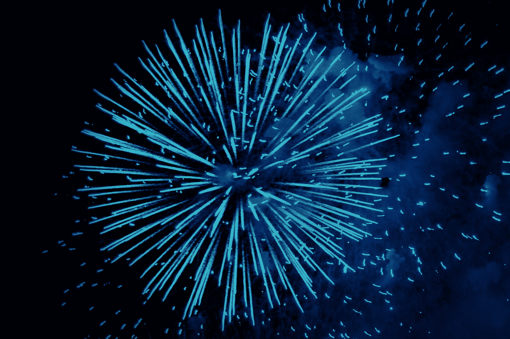

# 从你所在的地方开始，你拥有你需要的一切

> 原文：<https://betterprogramming.pub/begin-where-you-are-you-have-everything-you-need-905262bfe520>

## 给我自己的 2021 年的信息

丹尼尔·麦金尼斯在 [Unsplash](https://unsplash.com?utm_source=medium&utm_medium=referral) 上的照片

有些事情是逐渐发生的，然后突然发生。接受信息和建议是其中之一。你可以达到一个饱和点，然后继续前进。

研究变成了阅读最佳实践和绝对的应该或不应该……这变成了更多的研究，永远不画草图，永远不做原型，永远不建造，永远不*发货*。

不会了。

> 偏爱行动。
> 
> 对工作产品有偏见。
> 
> 在它被完善和准备好之前，就偏向于获取用户。
> 
> 我倾向于“如果我*现在不做那件事会怎么样？”*
> 
> 偏爱航运。
> 
> 不出货就不算。

2021 年，让我们都多出货。

新年快乐

照片由[丹妮拉·图尔卡努](https://unsplash.com/@protopopica?utm_source=medium&utm_medium=referral)在 [Unsplash](https://unsplash.com?utm_source=medium&utm_medium=referral) 上拍摄