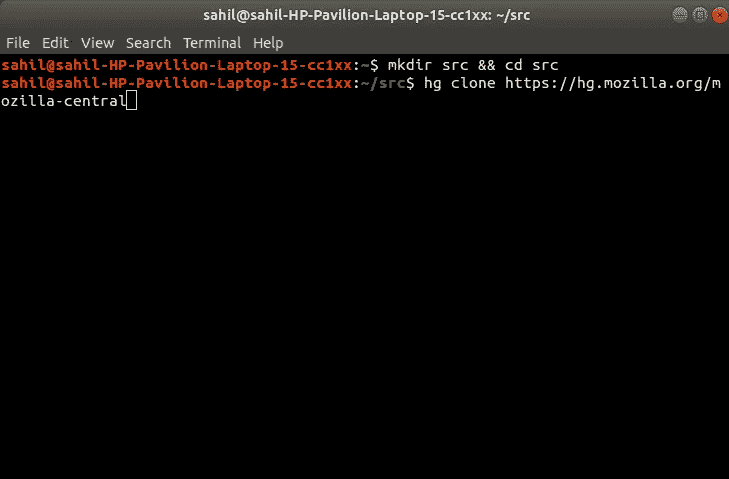
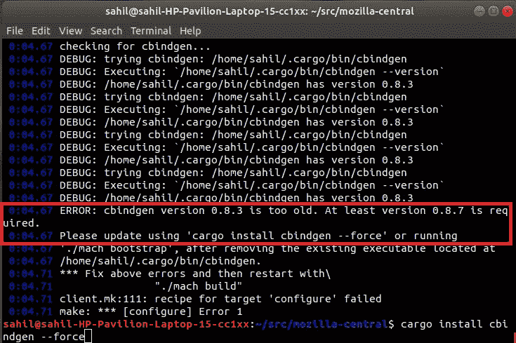
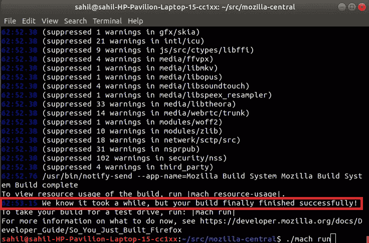
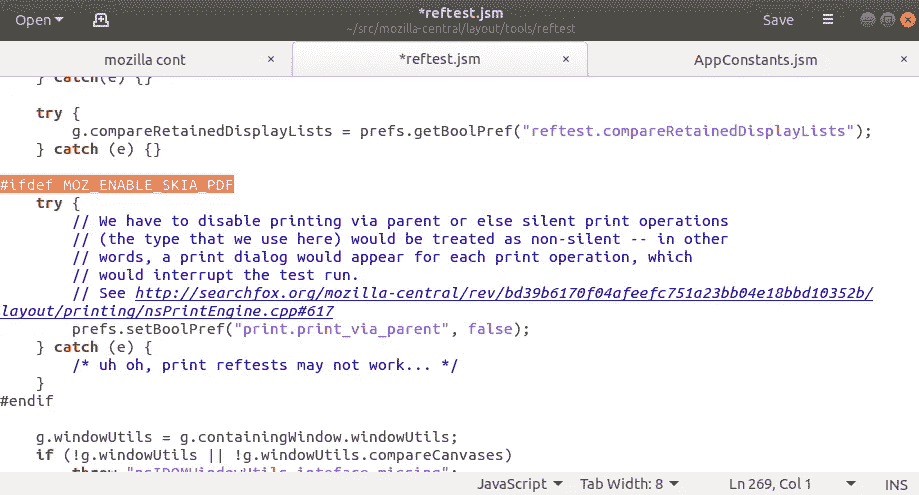
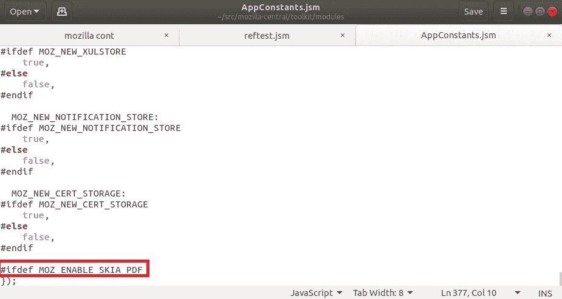
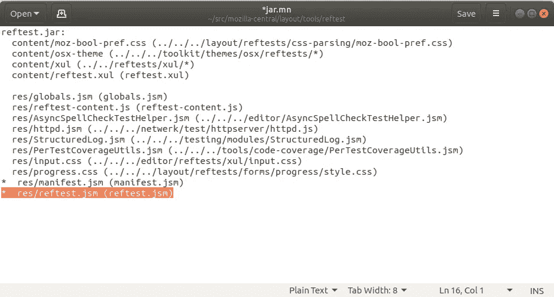
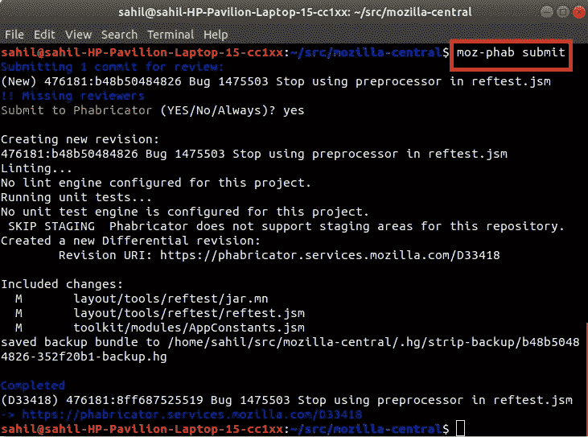

# 贡献 Mozilla Firefox 代码库的初学者指南

> 原文：<https://betterprogramming.pub/beginners-guide-contributing-to-mozilla-firefox-codebase-lionguest-studios-8e9b42140c38>

## 如何为网络上最好、最受欢迎的浏览器之一做出贡献


[众所周知，Mozilla Firefox](https://www.mozilla.org/en-US/firefox/) 是一款开源浏览器，被数百万用户、开发者和网络安全专家广泛使用。该软件可以免费使用，其源代码向公众开放。世界各地的任何人都可以修改软件并修复错误。你想过自己为 Mozilla Firefox 浏览器做贡献吗，不管是通过代码还是通过编写文档？如果是这样，这是你需要做出第一份贡献的每一步。

总共有四个步骤:

*   获取 Mozilla Firefox 源代码。
*   创建一个 [Bugzilla](https://www.bugzilla.org/) 账户。
*   对源代码进行更改并创建补丁。
*   使用 [Phabricator](https://www.phacility.com/phabricator/) 提交补丁进行审查。

# 如何获得 Mozilla Firefox 源代码

这篇文章讨论在 Linux 系统上构建 Firefox(任何发行版都可以)。要了解更多关于在另一个平台上构建 Firefox 的信息，你可以点击[这里](https://developer.mozilla.org/en-US/docs/Mozilla/Developer_guide/Build_Instructions/Simple_Firefox_build)。

要下载源代码，你必须使用 [Mercurial](https://www.mercurial-scm.org/) (也称为 hg)，这是一个用于 Firefox 开发的分布式版本控制系统。

首先，打开一个新的终端窗口，按照下面的命令下载源代码:

```
//Create a folder named src and go inside it 
mkdir src && cd src //Get the source code 
hg clone [https://hg.mozilla.org/mozilla-central](https://hg.mozilla.org/mozilla-central)
```



你必须先编译代码，然后才能运行它。编译过程可能需要几个小时才能完成，请耐心等待。此外，在编译源代码时，您可能会遇到各种错误。下面列出了这些错误以及解决这些错误所需的相应命令。

要编译源代码:

```
//Change directory to mozilla-central 
cd mozilla-central //Compile the source 
./mach build
```

## **代码编译过程中可能出现的错误**

您可能得到的错误之一是`rust compiler`版本错误。当您安装了旧版本的`rust compiler`时，会出现此错误。要解决这个问题，请运行以下命令:

```
//To update the rust compiler 
rustup update
```

另一个错误与`cbindgen`有关:使用以下命令解决它:

```
// Install the latest version of cbindgen 
cargo install cbindgen --force
```



根据您在系统上安装的软件包以及它们是否是最新的，您可能会得到更多的错误。按照终端窗口中显示的步骤可以解决这些错误。

现在您已经成功编译了它，您已经准备好运行源代码了:



```
//Running the code 
./mach run
```

# 创建补丁

首先，你需要一个 Bugzilla 账户。使用您的电子邮件地址或 GitHub 帐户创建一个。

## 选择您的问题

创建 Bugzilla 帐户后，寻找“好的第一个 bug”这些 bug 很容易解决，重点是让初学者熟悉 Firefox 的源代码。在您熟悉流程和源代码之后，您将能够解决高优先级的错误。可以在[这里](https://codetribute.mozilla.org/)找到可以解决的 bug 列表。你可以根据你的专业知识和你精通的编程语言来过滤 bug。

## 例子

对于本教程，我们将使用[*Bug 1475503*](https://bugzilla.mozilla.org/show_bug.cgi?id=1475503)*:**停止使用* `*reftest.jsm*`中的预处理器，这是最容易开始的。

从阅读错误报告者提供的信息开始，以便理解问题。如果你还需要更多的信息，或者你被卡住了，你可以向与那个 bug 相关的指导者(报告者)寻求帮助。

每当你解决一个新的 bug 时，你首先要确保你系统上的 Firefox 源代码是最新的。您可以通过运行以下命令来更新您的 Firefox 代码库:

```
//To update the Mozilla Firefox code base 
hg pull -u
```

让我们来看看 Bug 1475503 的记者对此是怎么说的:

> 在位置`mozilla-central/layout/tools/reftest/reftest.jsm`的同一文件中有两个预处理程序。第一个预处理器，`#ifdef MOZ_ENABLE_SKIA_PDF`可以从该文件中删除，并添加到位于`mozilla-central/toolkit/modules/AppConstants.jsm`的文件中。第二个预处理器可以完全删除。最后，`mozilla-central/layout/tools/reftest/jar.mn`文件中`reftest.jsm`之前的`*`必须删除。

## 如何解决 Bug 1475503

首先，我们把`reftest.jsm`中的`#ifdef MOZ_ENABLE_SKIA_PDF`去掉。



现在在`AppConstants.jsm`文件末尾添加第一个预处理器。



其次，从`reftest.jsm`文件中完全删除第二个预处理器，如下所示。

```
#ifdef XP_MACOSX 
try { 
var dock = Cc["@mozilla.org/widget/macdocksupport;1"].getService(Ci.nsIMacDockSupport); dock.activateApplication(true); 
} 
catch(ex) { } 
#endif
```

最后，去掉`mozilla-central/layout/tools/reftest/jar.mn`文件中`reftest.jsm`前的`*`。



我们已经完成了所需的更改；接下来，我们可以构建源代码来检查一切是否正常。

```
//Compiling the source code 
./mach build
```

## 提交更改

到目前为止，我们所做的更改已经被表示为一个补丁。现在，我们必须用提交消息来提交这些更改。提交消息必须包含错误号和该错误的简短描述。


```
//Adding a commit message 
hg commit -m "Bug 1475503 Stop using preprocessor in reftest.jsm"
```

# 提交您的修补程序以供审查

首先，按照中的[步骤创建一个 Phabricator 账户。](https://moz-conduit.readthedocs.io/en/latest/phabricator-user.html)

安装`[moz-phab](https://github.com/mozilla-conduit/review)`和 [Arcanist](https://secure.phabricator.com/book/phabricator/article/arcanist/) ，通过这个[链接](https://moz-conduit.readthedocs.io/en/latest/arcanist-linux.html)提交补丁。

在使用`moz-phab`提交补丁进行审查之前，请确保在完成以上两个步骤之后运行以下命令。否则，它会给你一个错误(`moz-phab: command not found`)。

```
source ~/.profile
```

现在，您需要使用以下命令安装一个证书(这是一个一次性的过程)。您需要从您的 Phabricator 帐户输入 API 令牌。

```
moz-phab install-certificate
```

现在，您已经准备好提交您的补丁进行审查。



```
moz-phab submit
```

# 了解更多关于开源的资源

1.  [商业开放(源代码):开源软件许可实用指南——第二版](https://amzn.to/33UdUta)
2.  [管理第三方软件许可证:掌控您的许可证组合](https://amzn.to/2Xg61Ma)
3.  [生产开源软件:如何运行一个成功的自由软件项目](https://amzn.to/2Qo62fU)
4.  [社区的艺术:构建参与的新时代](https://amzn.to/378geyX)

更多这样的博客请访问 [LionGuest 工作室](https://liongueststudios.com/blogs/)。

感谢阅读！