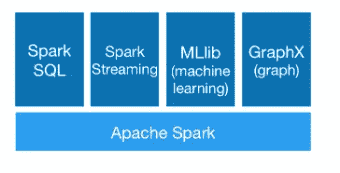
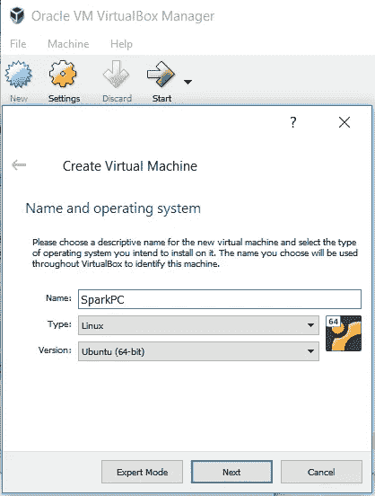
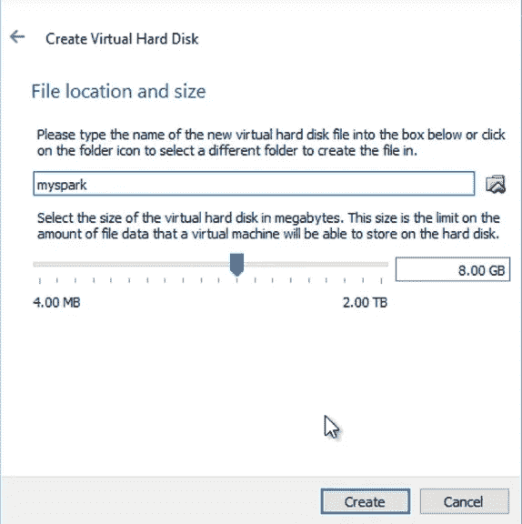
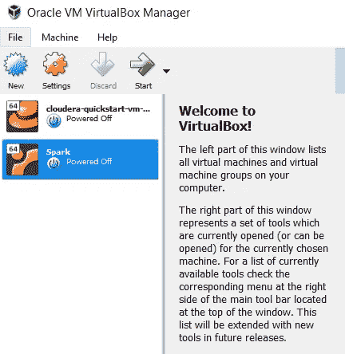
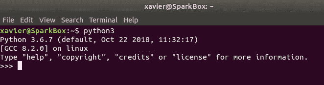
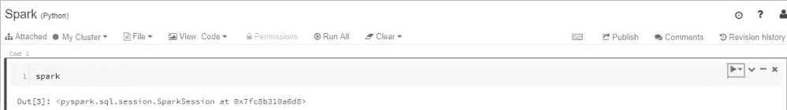
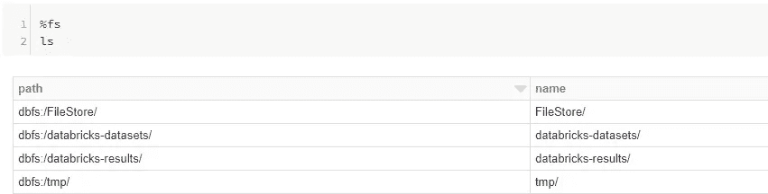
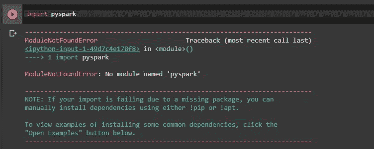
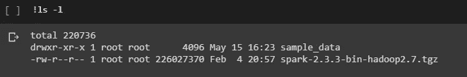
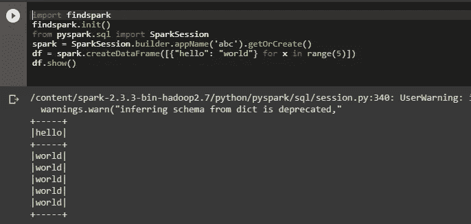

# Apache Spark 和 Python 初学者指南

> 原文：<https://betterprogramming.pub/beginners-guide-to-apache-spark-and-python-dcdbf5bef64>

## 安装和设置 Apache Spark 的综合指南


[http://www.zoom-comics.com](http://www.zoom-comics.com/)

# 什么是阿帕奇火花？

[Apache Spark](https://spark.apache.org/) 是一个开源框架，自 2009 年在加州大学伯克利分校的 AMPLab 问世以来一直在兴风作浪；其核心是**一个*大数据分布式处理引擎*** ，可以随意扩展。

简而言之，随着数据的增长，处理大型流数据并能够处理和执行机器学习等其他操作变得至关重要，而 Apache Spark 正是这样做的。一些专家说，在不久的将来，它将成为流计算的首选平台。

人们经常误以为它是 Hadoop[的替代品，但它只是 Hadoop](https://www.bernardmarr.com/default.asp?contentID=1080)[map-reduce 框架](https://medium.com/sarccom/hadoop-fundamental-5179099f5b21)的竞争对手。这是理所当然的，因为它速度快得多，对开发人员来说是最短的学习曲线之一，再加上它被市场上的顶级公司所使用，这使得它成为一种简单有效的简历补充技能。

正如您在下面看到的，分布式处理是关键特性之一，但不是唯一的。



[https://spark.apache.org/](https://spark.apache.org/)

由于 Spark 非常受欢迎，您可以预期许多供应商以许多不同的方式提供 Spark 服务。有时选择太多或太多，所以学习新事物的兴奋和渴望只是在尝试探索正确的选择中丢失了。

## ***剧透预警！***

***在本文中，我们不会详细讨论 Spark 的细节以及如何使用它来处理流数据。相反，它将作为一个可能的选项列表的汇编来开始使用它。那么我把选择权交给你——你可以选择自己的冒险！***

我建议您在尝试给出的选项之前通读这篇文章。这个想法是了解可用的选项，然后选择最适合你的一个，然后动手去做。如果您对学习 Spark 特别感兴趣，请查看参考资料。

# 1.去当地

第一个选项是全能的本地设置。如果你对在线服务不感兴趣，那就试试这个吧。它是本地的，你可以控制它，但是要知道这很费时间。

如果时间不在你这边，或者你不喜欢安装的麻烦，我会帮你省去麻烦，直接跳到选项 2 和 3。

**本地设置需要的东西:虚拟盒子；Ubuntu 时间和耐心！**

Virtual Box 是一个允许你在个人电脑上运行虚拟计算机的应用程序，你将在那里安装基于 Linux 的操作系统 Ubuntu 和 Spark。如果你已经安装了 Ubuntu，你可以跳过这一步。

[](https://www.virtualbox.org/wiki/Downloads) [## 下载- Oracle VM VirtualBox

### 关于屏幕截图下载文档最终用户文档技术文档贡献社区

www.virtualbox.org](https://www.virtualbox.org/wiki/Downloads) 

导航至以上链接，根据您的电脑选择 Windows 主机或 OS X 主机，并下载安装程序。下载完成后，只需双击并按照默认设置进行操作，就可以开始了。虚拟箱现已安装。

跳到下面的下一个链接，下载 Ubuntu。Ubuntu 桌面优先。经过这一步，你现在应该有一个**。iso** 文件已下载。

 [## 获取 Ubuntu |下载|

### Ubuntu 是一个开源软件操作系统，可以运行在桌面、云、互联网上

www.ubuntu.com](https://www.ubuntu.com/download) 

一旦完成，您就可以跳转到虚拟盒子应用程序。这一点基本上是空的。您可以通过单击“New”按钮来添加新的虚拟机。给机器起一个好听的名字，选择 Linux，然后点击 next。



完成此步骤后，您将经历一系列可为机器设置的选项。**首先是**，内存大小。您可以保留推荐的大小，但是根据您的规格，您可以分配合理的 RAM 大小。

**其次**，硬盘。您可以将其保留在建议的 8.00 GB，并设置一个选项来立即创建虚拟硬盘，然后在硬盘文件类型窗口中选择 VDI (VirtualBox 磁盘映像)并单击下一步。

**第三**，存储。您可以选择动态分配或固定大小。建议使用固定大小来提高输入/输出速度。20Gb 应该是个不错的量。点击创建。



一旦你点击创建，这将需要一段时间。当它准备好的时候，你将被带回到 Virtual box 应用程序的主屏幕，但是这一次是用创建的机器。



默认情况下，它是关闭的，但您可以双击来打开它。在第一次启动时，你会被要求选择一个启动盘。这很重要，你可以在这里将它指向你之前下载的 **Ubuntu.iso** 镜像。选择 **Ubuntu.iso** ，点击开始。这将把 Ubuntu 安装到你的虚拟机上。在这个过程中，您将看到许多安装选项，您可以选择自定义它或保留默认值。无论哪种方式都应该没问题，最终你应该有一个工作的操作系统——一个虚拟的操作系统。

在虚拟机中，您首先要做的是确认 Python 是否已经安装。要做到这一点，进入 Ubuntu 的终端应用程序，输入 python3 并按 enter 键。这应该会产生类似如下的输出。



Python 的版本可能不同，但只要是 3 以上就没问题。

接下来，我们将进行一系列安装，这对于 Spark 在我们的虚拟机上运行是必不可少的。

## Jupyter 笔记本

安装 [Jupyter Notebook](https://jupyter.org/) 是与 Python 交互和构建优秀代码的最简单方式之一。为此，在同一终端或新终端上，键入以下命令:

```
pip3 install jupyter
```

这应该安装 Jupyter 笔记本系统。完成后，您可以通过在终端上输入以下命令来测试它:

```
jupyter notebook
```

这将打开一个带有 Jupyter 笔记本界面的浏览器(可能是默认的)。这表明我们的笔记本设置正在工作。

## **Java**

现在让我们安装 Java，这是 Spark 运行所必需的。在另一个终端窗口中，依次键入以下命令:

```
sudo apt-get update*sudo apt-get install default-jre*
```

第一个命令将更新我们的 apt-get 机制，之后我们使用第二个命令安装 Java。

## 斯卡拉

同样，让我们安装 [Scala](https://www.scala-lang.org/) :

```
sudo apt-get install scala
```

要测试安装是否成功，您可以输入下面的命令，它应该会打印出所安装的 Scala 版本。

```
scala -version
```

## 安装 Py4j

现在我们将安装一个 Python 库，用 Python 连接 Java 和 Scala。

```
pip3 install py4j
```

## Spark 和 Hadoop

现在，当我们移动到最后，我们只需要安装 Spark 和 Hadoop 本身。导航到以下链接并直接下载 Spark 版本。**确保在您的虚拟机上执行此步骤**，以便直接下载到虚拟机上。

[](https://spark.apache.org/downloads.html) [## 下载| Apache Spark

### 注意，Spark 是用 Scala 2.11 预构建的，除了版本 2.4.2，它是用 Scala 2.12 预构建的。

spark.apache.org](https://spark.apache.org/downloads.html) 

打开一个新的终端，并确保您位于下载文件的同一位置。您可以将 cd 放入正确的文件夹并运行下面的命令(注意，根据当时的 Spark 版本，文件名可能会有所不同):

```
sudo tar -zxvf spark-2.1.0-bin-hadoop2.7.tgz
```

基本上，这将解压软件包并创建我们需要的文件夹。

接下来，我们需要告诉 Python 在哪里可以找到 Spark。这可能看起来像纯粹的魔法，但只是跟着做！在终端上这样做，并在每行之后按 Enter 键。注意 SPARK_HOME 的路径，它应该是你解压文件夹的位置。

```
export SPARK_HOME=’home/ubuntu/spark-2.1.0-bin-hadoop2.7'export PATH=@SPARK_HOME:$PATHexport PYTHONPATH=$SPARK_HOME/python:$PYTHONPATHexport PYSPARK_DRIVER_PYTHON=”jupyter”export PYSPARK_DRIVER_PYTHON_OPTS=”notebook”export PYSPARK_PYTHON=python3
```

唷，太多了！如果你还和我在一起，我们就都准备好了。锦上添花的只能是奔跑火花的甜味。

打开终端，将 cd 放入以下路径(安装 Spark 的路径):

```
cd /spark-2.1.0-bin-hadoop2.7/python
```

进入正确的目录后，打开 Jupyter 笔记本:

```
jupyter notebook
```

现在你应该可以打开 Jupyter 笔记本系统的浏览器了。创建一个新的 Python 笔记本，在空白单元格中键入下面的命令，然后按 CTRL+Enter。

```
import pyspark
```


[https://www.uhdpaper.com](https://www.uhdpaper.com/)

瞧啊。我们自己的虚拟机，安装了 Spark，并且运行良好。闪闪发光！

## 2.数据砖

[Databricks](https://databricks.com/) 是由 Apache Spark 的原始创建者创建的平台，这是一个仅通过浏览器就能利用 Spark 强大功能的好方法。Databricks 消除了烦人的安装负担，并将计算能力直接带到您的浏览器上。如果你正在寻找一个快速的火花之旅，这是最好的方法。

如果本地设置是一个家常菜，考虑 Databricks 美食。

**你需要的:网络浏览器和强大的互联网连接。**

虽然 Databricks 的目标是向大数据和分布式计算过渡的公司，但他们确实提供了一个社区版本，应该可以满足我们的目的。

为了开始，导航到下面的链接并注册社区版。

[](https://databricks.com/try-databricks) [## 尝试数据块

### 无限集群，可扩展至任何规模的作业调度程序，为生产管道执行作业完全交互式…

databricks.com](https://databricks.com/try-databricks) 

首次登录时，您需要验证您的电子邮件地址。一旦进入，您将有可能使用预安装的 Python 笔记本设置。


登录后，单击“创建空白笔记本”开始。您将看到一个 Jupyter 笔记本，您可以在其中的每个单元格中键入 Python 代码并单独运行它们。

Databricks 专为 Spark 打造，因此您无需担心额外的设置。您可以立即在第一个单元格中键入`spark`，然后按下 **Ctrl+Enter** 或单元格右侧的小播放按钮。



第一次运行时，会要求您启动并运行一个集群。继续做，之后你应该会看到类似上面的图片。现在，您可以创建更多的单元并继续评估 Spark，无论是摄取数据集还是执行机器学习，都由您决定。

额外收获: Databricks 之所以酷，是因为它提供了一个巨大的数据库，可以在所有马力下进行实验。

要浏览一下提供的内容，您需要使用一个神奇的命令进入 Databricks 的“文件系统”。在新的单元格中，键入`%fs`后接`ls` 并运行单元格。您应该会看到列出的 dbfs 路径。



接下来，点击`ls /databricks-datasets/`查看所有可用的数据集。如果你喜欢其中的任何一个，你可以很容易地在你的代码中使用它。例如，我碰巧喜欢简单的`/people/people.json` 数据，并希望在我的代码中使用它。我可以简单地这样做:

```
data = spark.read.json(“/databricks-datasets/samples/people/people/.json”)
```

深入其中，尝试一些数据集，你不会失望的！也许这是最容易擦出火花的方式。

## 3.Google Colab

[Google Colaboratory](https://colab.research.google.com/) 是一个免费的 Jupyter 笔记本环境，就像 Databricks 一样，完全在云上运行，但所有的讨论都不是关于免费的笔记本系统，而是免费的 GPU 。是啊！你没听错，Colab 提供免费 GPU！这对所有深度学习的传播者来说都是一件大事。那是另一个季节的故事——我们今天的焦点是火花。

你需要什么:一个网络浏览器；强大的互联网连接；一个谷歌账户。

[](https://colab.research.google.com/notebooks/welcome.ipynb#recent=true) [## 谷歌联合实验室

### 编辑描述

colab.research.google.com](https://colab.research.google.com/notebooks/welcome.ipynb#recent=true) 

导航到上面的链接。你应该通过你的谷歌账户登录，然后出现一个屏幕来创建一个*“新的 Python 3 笔记本”*继续创造吧。

这一步将把我们带入熟悉的领域:一个带有空单元格的 Python 笔记本。与 Databricks 不同，Google Colab 不是现成的 Spark，所以我们需要稍微调整一下才能开始。

如果你试图在空单元格中运行`pyspark`，你会得到一个错误。



大家一起修吧！Google Colab 既像虚拟机又像笔记本。让我们将下面的命令输入到一个空的单元格中，然后点击 **CTRL+Enter** 来安装 **Java** :

```
!apt install openjdk-8-jdk-headless -qq > /dev/null
```

使用“！”在命令开始时会简单地在一个 shell 中运行它，表明它不是 Python 代码。

现在让我们下载 Spark 和 Hadoop。

```
!wget -q [http://www-eu.apache.org/dist/spark/spark-2.3.3/spark-2.3.3-bin-hadoop2.7.tgz](http://www-eu.apache.org/dist/spark/spark-2.3.3/spark-2.3.3-bin-hadoop2.7.tgz)
```

一旦完成，您就可以像在 Linux shell 上一样，通过运行`!ls -l`来查看文件是否被下载。



如您所见，下载的文件是一个 zip 文件，所以让我们解压缩它:

```
!tar xf spark-2.3.3-bin-hadoop2.7.tgz
```

现在我们只需要在被激发之前做几件事情:如下设置 Java 和 Spark 变量。

```
import os
os.environ[“JAVA_HOME”] = “/usr/lib/jvm/java-8-openjdk-amd64”
os.environ[“SPARK_HOME”] = “/content/spark-2.3.3-bin-hadoop2.7”
```

这就是要设置的全部内容！

现在看看这个示例代码:



上面的代码通过创建一个新的 SparkSession 来初始化 Spark，然后使用 P [ython list comprehension](https://www.datacamp.com/community/tutorials/python-list-comprehension?utm_source=adwords_ppc&utm_campaignid=1455363063&utm_adgroupid=65083631748&utm_device=c&utm_keyword=&utm_matchtype=b&utm_network=g&utm_adpostion=1t1&utm_creative=332602034358&utm_targetid=aud-392016246653:dsa-486527602543&utm_loc_interest_ms=&utm_loc_physical_ms=9067548&gclid=EAIaIQobChMIwsvLmYSw4gIVyasYCh0uEQ8eEAAYASAAEgIERPD_BwE) 动态创建一个新的 Spark 数据帧，最后打印出数据帧。在新的牢房区试试。

我们完了——就这样！我希望通过这份安装信息的汇编，我已经让你对整个过程更加清楚了，所以希望你能停止担心信息过载，只关注刚刚开始！

## 参考

1.  https://spark.apache.org/docs/latest/quick-start.html
2.  【https://www.dezyre.com/apache-spark-tutorial/spark-tutorial 
3.  *何塞·波尔蒂利亚的伟大课程，学习完整的 Spark，包括所有不同的安装选项:*[https://www . udemy . com/course/Spark-and-python-for-big-data-with-py Spark/](https://www.udemy.com/course/spark-and-python-for-big-data-with-pyspark/)