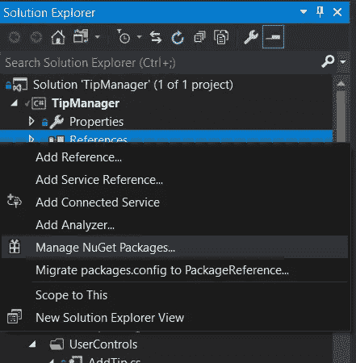
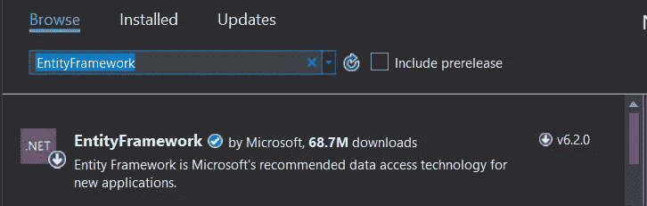
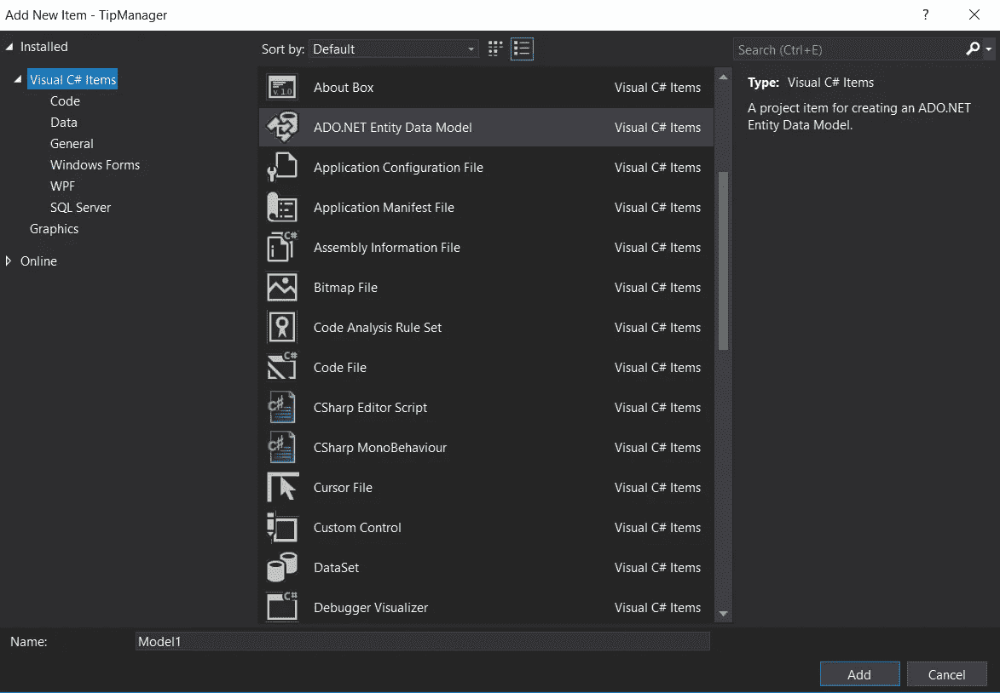
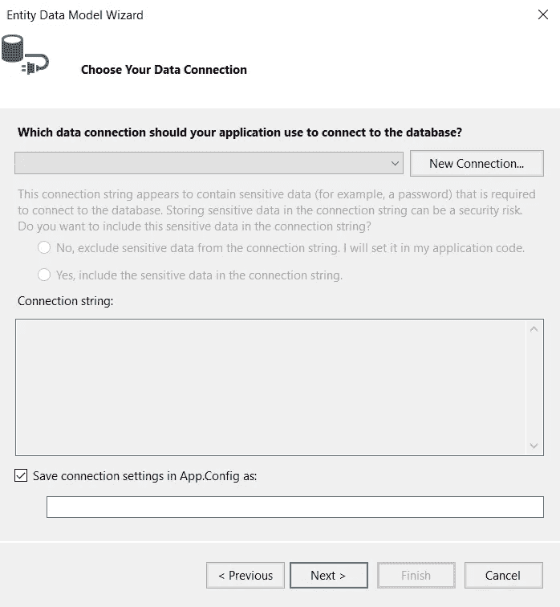
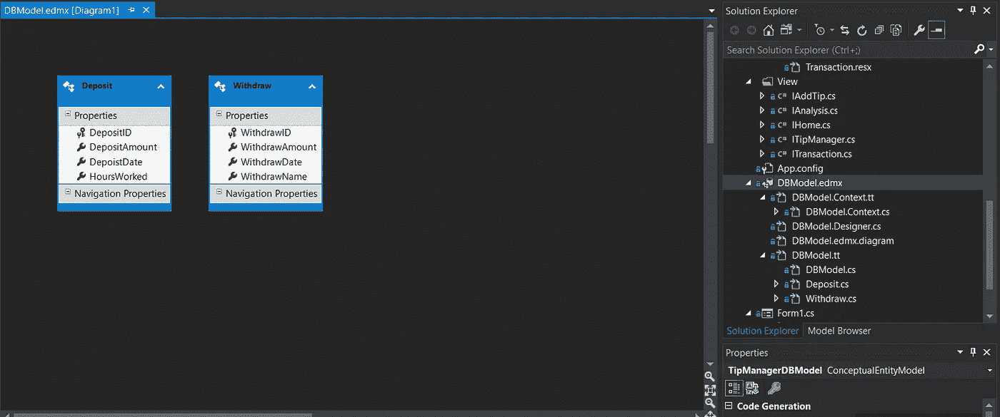
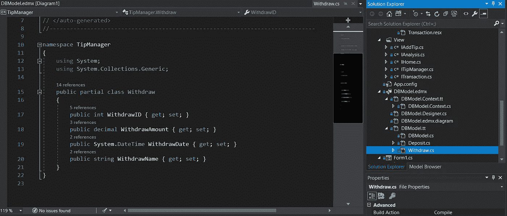

# 实体框架初学者指南

> 原文：<https://betterprogramming.pub/beginners-guide-to-entity-framework-d862c9aaec4>

## 如何将 C#应用程序连接到数据库并执行基本的 CRUD 操作


照片由 [imgix](https://unsplash.com/@imgix?utm_source=medium&utm_medium=referral) 在 [Unsplash](https://unsplash.com?utm_source=medium&utm_medium=referral) 上拍摄

有了一些 C#知识，你可能会想:“我如何扩展我所知道的？”

也许，您有一个让您的应用程序受益于数据库的想法。[实体框架](https://docs.microsoft.com/en-us/ef/)是一个供您使用的优秀工具。您将能够通过您的应用程序执行 [CRUD 操作](https://en.wikipedia.org/wiki/Create,_read,_update_and_delete)。

这不仅会扩展您的应用程序的功能，还会扩展您自己的功能。

我将向您介绍什么是实体框架，如何在 Winforms 应用程序中设置它，并为您继续学习打下坚实的基础。

# 什么是实体框架？

[实体框架](https://docs.microsoft.com/en-us/ef/)是微软支持的开源 ORM(对象关系映射器)，用于。NET 应用程序。

基本上，这是一个工具，它可以使代码中的对象与关系数据库中的信息之间的连接变得更加容易。

实体框架将负责创建与数据库的连接，创建可用于操作数据库的对象，并为您提供处理数据的方法。

您将能够在代码中操作表示数据库中数据的对象，并允许您将这些更改保存到数据库中。可以把它想象成数据库的一个接口或窗口，您可以向其中添加简单的功能，供任何人通过您的应用程序使用。

# 代码优先，数据库优先

有两种不同的方法在你的应用程序中使用实体框架。这些不同的方法各有其优点，由您来决定哪种方法最适合您的需求。

## **代码优先**

代码首先关注于创建一个数据库，这个数据库在你的类设计中还不存在。这样，如果您的类发生变化，您的数据库中的配置也有可能发生变化。

这是一种流行的方法，因为它允许通过代码进行更多的控制，而不是受数据库的限制。

## **数据库第一**

数据库首先关注使用现有的数据库。首先创建数据库并设计表/关系。

这种方法将为您生成与您在数据库中创建的结构一致的类。这允许您手动修改数据库，然后更新自动关联的类。

# 入门指南

对于这个例子，我将在 C# Winforms 中使用 EF6(实体框架 6 ),结合数据库优先的方法。

我还将使用由[SSMS](https://docs.microsoft.com/en-us/sql/ssms/download-sql-server-management-studio-ssms?view=sql-server-2017)(SQL Server Management Studio)和微软 [SQL Server 2017](https://www.dnnsoftware.com/docs/developers/setup/set-up-sql.html) 创建的数据库。

关于这些话题的更多信息，你可以阅读[这本指南](https://academy.vertabelo.com/blog/how-to-install-sql-server-2017-windows/)。本视频， [*创建包含表和关系的数据库(MS SQL)*](https://www.youtube.com/watch?v=H7uGGg1BQ2Y) *，*可以帮助您设置数据库，如果您需要复习一下的话。我不打算深究这些信息，但我想提供一下，以防万一。

创建好数据库后，进入 Winforms 应用程序，按照以下步骤操作:

*   在*解决方案浏览器*中右键单击*引用*并选择*管理 NuGet 包…*



*   搜索微软 *EntityFramework* ，点击，点击*安装*。



*   现在，您应该已经安装了实体框架，您可以通过单击*引用中的下拉图标来验证它，您应该会看到列出了*实体框架*。*

# 创建实体数据模型

既然您已经设置好了数据库，并且在项目中安装了 EF6，那么您需要设置项目到数据库的连接，并让 Entity Framework 创建与数据库相关的实体数据模型(类)。

*   在*解决方案浏览器*中右键单击您的项目，并选择 *Add → New Item* 。然后，你会想要找到并选择*ADO.NET 实体数据模型。*



*   从数据库中选择 *EF 设计师。*
*   点击*新建连接…*



*   在*属性*弹出窗口中，提供服务器名称(可以在 SSMS 找到)并输入您的数据库名称。按下*确定*。
*   确保选中复选框*保存应用程序中的连接设置。Config as:* 并给它一个合适的名字，比如 *MyProjectDBEntities* ，然后按 *Next。*
*   现在显示的将是表、视图、存储过程和函数。选择您想要的一切，保持默认复选框选中，然后单击*完成。*

现在，您已经成功地将数据库链接到项目，并创建了与数据库相关的实体数据模型。

在您的解决方案资源管理器中，您将看到一个`.edmx`文件。如果您单击该文件，您将打开 EDM(实体数据模型)设计器。

这将显示数据库中所选表的所有实体及其关系。(注意:以下示例中的表之间没有关系。)



同样，如果您展开`.edmx`文件，您会看到一个类似于`Model.tt`的文件。

展开`.tt`文件，它将显示从您导入的表中创建的类。这些类是您在操作数据库时将用作模型的。



# 数据库上下文

您已经为项目设置了数据库，并且创建了实体数据模型，现在是时候学习如何使用模型和实体框架了。

要执行基本的 CRUD 操作(创建、读取、更新和删除)，您需要使用`DBContext`类。

与您的模型相关联的`DBContext`类将允许您编写和运行查询，跟踪对这些对象所做的任何更改，保存对这些对象所做的更改，并在数据库中反映这些更改，以及将对象绑定到 UI 控件。

`DBContext`是为您生成的，可以在解决方案资源管理器的`DBModel.Context.tt`下找到。您会注意到类似如下的代码:

```
public virtual DbSet<Deposit> Deposits { get; set; }public virtual DbSet<Withdraw> Withdraws { get; set; }
```

`DBSet`类源自`DBContext`，代表用于 CRUD 操作的实体集。它们作为属性添加到`DBContext`中，并映射到您的数据库表。

# CRUD 操作

现在，您应该对实体框架有了一个工作上的理解。

现在是时候学习如何使用`DBContext`和你创建的模块来执行基本的 CRUD 操作了。使用`using`创建一个新的上下文实例是很常见的做法，如下所示。

这确保了上下文控制的所有资源都将在块的末尾被释放。

下面的例子来自我自己的个人项目。它们绝不是完美的，仍然需要重构，但我相信展示一些真实世界的例子会很好，而不是仅仅为了这个目的而随机制作的例子。

## **创建**

这是在数据库中创建新存款的简单方法。这些方法接受一个从实体数据模型创建的`Deposit`对象作为参数。

在这个方法中，在一个`using`块中创建了一个新的`DBContext`。

然后，调用方法`context.Deposits.Add()`并将`Deposit`对象传递给参数。最后，为了使更改生效，必须调用`context.SaveChanges()`。

## **改为**

此方法返回所有存款的总和。

再次，在`using`块中创建新的`DBContext`。在程序块内部，创建一个保存总和的变量，调用方法`context.Deposits.Sum()`并保存在该变量中。

在方法参数内部，lambda 用于遍历每个`DepositAmount`并将它们添加到`sum`。最后，该方法为客户端返回`sum`。

## **更新**

该方法接受一个已知已经存在于数据库中的`Deposit`对象。

通过将`EntityState.Modified`设置为`context.Entry(deposit).State`，您实际上是将存款附加到上下文并将其状态设置为已修改。

然后，您调用`context.SaveChanges()`来完成更改。

## **删除**

该方法接受一个`Deposit`对象，然后将其从数据库中删除。在`using`块内部，它将提供实体跟踪细节和操作的对象条目保存到变量条目中。

然后，它首先检查以确保状态是附加的。如果没有，它将附加实体。然后调用`context.Deposits.Remove()` ，同时将对象传入参数。最后，保存更改。

如果您想查看使用`DBContext`时可用的方法列表，您可以在[微软文档](https://docs.microsoft.com/en-us/dotnet/api/system.data.entity.dbcontext?view=entity-framework-6.2.0)中查看它们。

# 结论

现在，您已经准备好将实体框架整合到您的下一个项目中了。

虽然这是一本初学者指南，但是您现在已经知道如何安装框架、连接到本地数据库、使用基本的 CRUD 操作，并且已经了解了与实体框架相关的核心概念。

关于这个主题还有很多需要学习，但是至少，你已经熟悉了基础知识，可以投入到这个非常有用的工具中了。