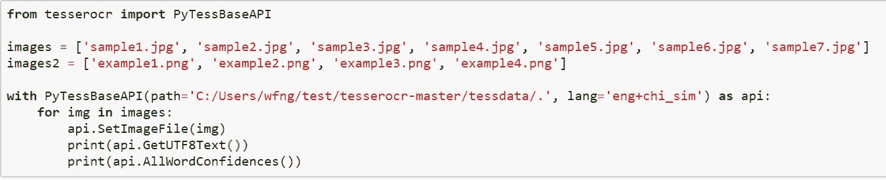
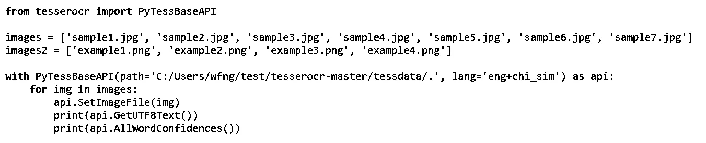
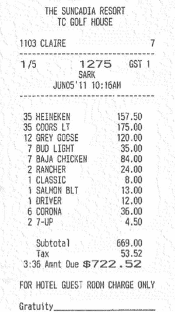
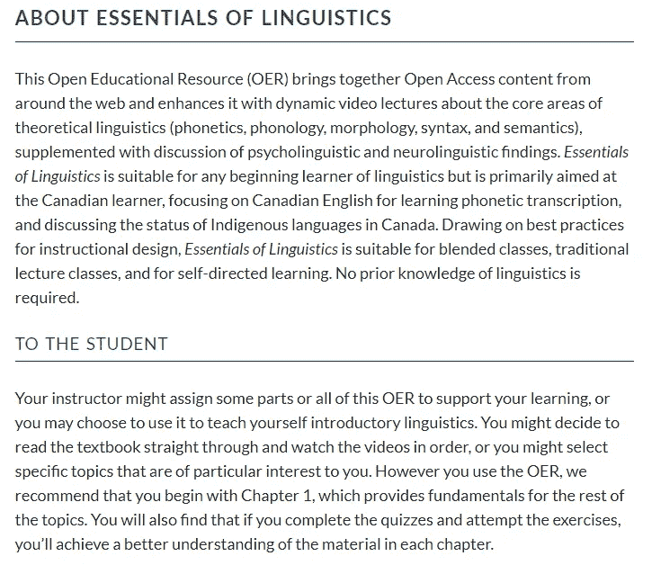
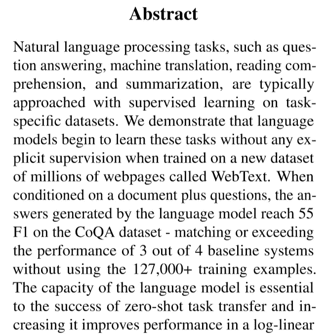

# 宇宙魔方 OCR 初学者指南

> 原文：<https://betterprogramming.pub/beginners-guide-to-tesseract-ocr-using-python-10ecbb426c3d>

## 基于 Tesseract 和 Python 的光学字符识别


Joshua Hoehne 在 [Unsplash](https://unsplash.com/s/photos/dictionary?utm_source=unsplash&utm_medium=referral&utm_content=creditCopyText) 上拍摄的照片

本文是使用 Python 使用 Tesseract OCR 从图像中识别字符的分步教程。由于 Tesseract 训练数据集的性质，数字字符识别是首选，尽管 Tesseract OCR 也可用于手写识别。Tesseract OCR 是一个开源项目，由惠普公司发起。后来谷歌接手开发。截至 2018 年 10 月 29 日，最新稳定版 4.0.0 基于 LSTM(长短期记忆)。请访问 [Github](https://github.com/tesseract-ocr/tesseract) 了解更多信息。

Tesseract OCR 的正式版本允许开发人员使用 C 或 C++ API 构建自己的应用程序。随着时间的推移，社区创建了他们自己版本的外部工具、包装器，甚至培训项目。在本文中，我将使用名为 [tesserocr](https://github.com/sirfz/tesserocr) 的 Python 包装器，因为:

1.  它简单易用
2.  它支持版本 4.0.0(在撰写本文时)
3.  文件中的注释和解释非常详细

如果您正在寻找其他包装器或工具，请检查 put this [Github](https://github.com/tesseract-ocr/tesseract/wiki/AddOns#tesseract-wrappers) 链接。

本教程由以下几部分组成:

1.  设置和安装
2.  准备测试图像
3.  用法和 API 调用
4.  微调
5.  结果
6.  结论

# 1.设置和安装

有多种方法可以安装 tesserocr。本节所述的要求和步骤将基于在 Windows 操作系统上通过 **pip** 进行的安装。如果你想通过其他方法安装，你可以通过官方的 [Github](https://github.com/sirfz/tesserocr) 查看需要的步骤。

## 康达

如果您使用的是 Conda，可以通过 conda-forge 安装:

```
conda install -c conda-forge tesserocr
```

## 计算机编程语言

您应该在 3.6 或 3.7 版中安装 python。在本教程中，我将使用安装在虚拟环境中的 Python 3.7.1。

## 通过 pip 的 Python 模块

根据 python 版本和操作系统下载所需的[文件](https://github.com/simonflueckiger/tesserocr-windows_build/releases)。我下载了[tesse rocr v 2 . 4 . 0—Python 3.7–64 bit](https://github.com/simonflueckiger/tesserocr-windows_build/releases/download/tesserocr-v2.4.0-tesseract-4.0.0/tesserocr-2.4.0-cp37-cp37m-win_amd64.whl)并保存到 **tesserocr-master** 文件夹中(你可以随意保存)。从目录中打开命令提示符(如果从其他目录打开命令提示符，只需将其指向保存 *whl* 文件的目录)。通过 pip 的安装是通过以下代码完成的:

```
pip install <package_name>.whl
```

**Package_name** 是指您下载的 **whl** 文件的名称。我的情况是已经下载了*tesse rocr-2 . 4 . 0-cp37-cp37m-win _ amd64 . whl*。因此，我将使用以下代码进行安装:

```
pip install tesserocr-2.4.0-cp37-cp37m-win_amd64.whl
```

下一步是安装 **Pillow，**Python 中用于图像处理的模块。键入以下命令:

```
pip install Pillow
```

## 语言数据文件

API 调用初始化期间需要语言数据文件。有三种类型的数据文件:

1.  **tessdata** :仅适用于 Tesseract 4.0.0 的标准模型。包含传统引擎(- oem 0)和基于 LSTM 神经网络的引擎(- oem 1)。 **oem** 指初始化时可以指定的参数之一。比 tessdata_best 快很多，但精度较低。链接到标准 [tessdata](https://github.com/tesseract-ocr/tessdata) 。
2.  **tessdata_best** :仅适用于 Tesseract 4.0.0 的最佳训练模型。它有最高的精度，但与其他相比要慢得多。链接到 [tessdata_best](https://github.com/tesseract-ocr/tessdata_best) 。
3.  tessdata_fast :这个模型提供了一组替代的集成 LSTM 模型，这些模型是用一个较小的网络构建的。链接到 [tessdata_fast](https://github.com/tesseract-ocr/tessdata_fast) 。

在本教程中，我将使用标准的 **tessdata** 。通过上面的链接下载它，并将其放在项目的根目录下。在我的情况下，它将位于 **tesserocr-master** 文件夹下。我采取了额外的步骤，将数据文件重命名为 **tessdata** 。这意味着我有以下文件夹结构:

```
.../tesserocr-master/tessdata
```

# 2.准备测试图像

## 保存图像

获取测试图像的最有效方法如下:

1.  使用“路标”、“餐馆”、“菜单”、“扫描的”、“收据”等关键词在线搜索图片。
2.  使用截图工具保存在线文章、小说、电子书等的图片。
3.  使用相机拍摄贴在家用产品上的标签或说明的截图。

获取测试图像的效率最低的方法如下:

1.  找一本书，把任何文字处理文档的前几段打出来。然后，将其打印在一张 A4 纸上，并扫描为 pdf 或任何其他图像格式。
2.  练习书写，就像正在输入单词一样。赚足够的钱购买一台高端 DSLR 或一部带高质量摄像头的手机。截图传到电脑里。
3.  在像素的基础上学习，用字符块填充 128x128 的画布。如果你觉得这太费时间，可以考虑学习一些编程和算法课程，编写一些自动完成像素填充过程的代码。

我将以下图像保存为测试图像:

*   收据
*   发表论文的摘要
*   来自一本书的介绍
*   代码片段
*   小说中的几段(中文和日文)
*   几个中文表情符号

## 预处理

大多数图像需要某种形式或预处理来提高准确性。查看以下[链接](https://github.com/tesseract-ocr/tesseract/wiki/ImproveQuality)，了解如何提高图像质量的更多信息。为了获得最佳精度，需要考虑几个重要注意事项:

*   白色背景上的深色文本
*   黑白图像
*   移除 alpha 通道(将图像保存为 jpeg/jpg 而不是 png)
*   通过 **psm** 参数进行微调(页面分段模式)

页面分段模式将在下一节中讨论。我们将从将图像转换成黑白图像开始。给定下面的图像:



我笔记本中的示例代码片段

如果您使用的是 Jupyter Notebook，可以键入以下代码，然后按 Shift+Enter 执行它:

```
from PIL import Imagecolumn = Image.open('code.jpg')
gray = column.convert('L')
blackwhite = gray.point(lambda x: 0 if x < **200** else 255, '1')
blackwhite.save("code_bw.jpg")
```

*   【code.jpg】image . open(' code . jpg '):**image . open**是文件名。根据输入文件的名称对此进行修改。
*   **PIL** :指旧版枕头。你只需要安装枕头，你将能够导入图像模块。不要同时安装枕头和 PIL。
*   **column . convert(' L ')**:**L**指灰度模式。其他可用选项包括 **RGB** 和 **CMYK**
*   **x < 200 else 255** :将 200 微调为 0-255 之间的任意值。检查输出文件以确定适当的值。

如果使用命令行调用 Python 文件。记得更改输入文件并导入 sys:



黑白版本的代码片段

请随意尝试其他图像处理方法来提高图像质量。完成后，让我们进入下一部分。

# 3.用法和 API 调用

## 对单个图像使用 with 语句

可以用 with-statement 初始化对象，用`GetUTF8Text()`得到结果。这种方法被称为上下文管理器。如果没有使用 with-statement，那么应该在不再需要时显式调用`api.End()`。请参考以下示例，了解单个图像的手动处理。

```
from tesserocr import PyTessBaseAPIwith PyTessBaseAPI() as api:
    api.SetImageFile('sample.jpg')
    print(**api.GetUTF8Text()**)
```

如果在调用过程中遇到以下错误，说明程序找不到语言数据文件( **tessdata** 文件夹)。

```
RuntimeError: Failed to init API, possibly an invalid tessdata path:
```

您可以通过在初始化期间提供 path 作为参数来解决这个问题。您甚至可以指定所使用的语言，正如您在本例中看到的那样(检查粗体突出显示的部分):

```
from tesserocr import PyTessBaseAPIwith PyTessBaseAPI(**path='C:/path/to/tessdata/.', lang='eng'**) as api:
    api.SetImageFile('sample.jpg')
    print(api.GetUTF8Text())
```

## 单张图像的手动处理

尽管推荐的方法是通过上下文管理器，但您仍可以手动将其初始化为对象:

```
from tesserocr import PyTessBaseAPIapi = PyTessBaseAPI(**path='C:/path/to/tessdata/.', lang='eng'**)
try:
    api.SetImageFile('sample.jpg')
    print(api.GetUTF8Text())
finally:
    api.End()
```

## 获取每个单词的置信度值

PyTessBaseAPI 还有其他几个可以调用的 tesseract 方法。这包括获得每个单词的宇宙魔方版本甚至置信度值。更多信息请参考 [*tesserorc.pyx*](https://github.com/sirfz/tesserocr/blob/master/tesserocr.pyx) 文件。要获得信心这个词，你可以简单地使用`**AllWordConfidences(**` **)** 函数:

```
from tesserocr import PyTessBaseAPIwith PyTessBaseAPI(**path='C:/path/to/tessdata/.', lang='eng'**) as api:
    print(api.GetUTF8Text())
    print(**api.AllWordConfidences()**)
```

您应该得到一个从 0(最差)到 100(最好)的整数列表，如下所示(每个分数代表一个单词):

```
[87, 55, 55, 39, 88, 70, 31, 60, 18, 18, 71]
```

## 获取可用语言

还有一个获取所有可用语言的功能:`**GetAvailableLanguages()**`。您可以使用输出作为 **lang** 参数的参考。

```
from tesserocr import PyTessBaseAPIwith PyTessBaseAPI(**path='C:/path/to/tessdata/.', lang='eng'**) as api:
    print(api.GetAvailableLanguages())
```

随后的输出取决于您在 **tessdata** 文件夹中的语言数据文件的数量:

```
['afr', 'amh', 'ara', 'asm', 'aze', 'aze_cyrl', 'bel', 'ben', 'bod', 'bos', 'bre', 'bul', 'cat', 'ceb', 'ces', 'chi_sim', 'chi_sim_vert', 'chi_tra', 'chi_tra_vert', 'chr', 'cos', 'cym', 'dan', 'dan_frak', 'deu', 'deu_frak', 'div', 'dzo', 'ell', 'eng', 'enm', 'epo', 'equ', 'est', 'eus', 'fao', 'fas', 'fil', 'fin', 'fra', 'frk', 'frm', 'fry', 'gla', 'gle', 'glg', 'grc', 'guj', 'hat', 'heb', 'hin', 'hrv', 'hun', 'hye', 'iku', 'ind', 'isl', 'ita', 'ita_old', 'jav', 'jpn', 'jpn_vert', 'kan', 'kat', 'kat_old', 'kaz', 'khm', 'kir', 'kmr', 'kor', 'kor_vert', 'lao', 'lat', 'lav', 'lit', 'ltz', 'mal', 'mar', 'mkd', 'mlt', 'mon', 'mri', 'msa', 'mya', 'nep', 'nld', 'nor', 'oci', 'ori', 'osd', 'pan', 'pol', 'por', 'pus', 'que', 'ron', 'rus', 'san', 'script/Arabic', 'script/Armenian', 'script/Bengali', 'script/Canadian_Aboriginal', 'script/Cherokee', 'script/Cyrillic', 'script/Devanagari', 'script/Ethiopic', 'script/Fraktur', 'script/Georgian', 'script/Greek', 'script/Gujarati', 'script/Gurmukhi', 'script/HanS', 'script/HanS_vert', 'script/HanT', 'script/HanT_vert', 'script/Hangul', 'script/Hangul_vert', 'script/Hebrew', 'script/Japanese', 'script/Japanese_vert', 'script/Kannada', 'script/Khmer', 'script/Lao', 'script/Latin', 'script/Malayalam', 'script/Myanmar', 'script/Oriya', 'script/Sinhala', 'script/Syriac', 'script/Tamil', 'script/Telugu', 'script/Thaana', 'script/Thai', 'script/Tibetan', 'script/Vietnamese', 'sin', 'slk', 'slk_frak', 'slv', 'snd', 'spa', 'spa_old', 'sqi', 'srp', 'srp_latn', 'sun', 'swa', 'swe', 'syr', 'tam', 'tat', 'tel', 'tgk', 'tgl', 'tha', 'tir', 'ton', 'tur', 'uig', 'ukr', 'urd', 'uzb', 'uzb_cyrl', 'vie', 'yid', 'yor']
```

## 对多个图像使用 with-statement

您可以使用一个列表来存储每个图像的路径，并调用一个 for 循环来循环每个图像。

tesserocr 为我们提供了许多助手函数，可以与线程一起使用，并发处理多个图像。这种方法效率很高，应该尽可能使用。为了处理单个图像，我们可以使用 helper 函数，而不需要初始化 PyTessBaseAPI。

其他可用的助手功能包括:

如果您想了解更多关于其他可用 API 调用的信息，请查看[*tesse rocr . pyx*](https://github.com/sirfz/tesserocr/blob/master/tesserocr.pyx)文件。让我们继续下一部分。

# 4.微调

在本节中，我们将探讨如何微调 tesserocr 来检测不同的语言并设置不同的 PSM(页面分段模式)。

## 设置其他语言

您可以通过在初始化期间指定 **lang** 参数来更改语言。例如，要将语言从英语更改为简体中文，只需将 eng 修改为 chi_sim，如下所示:

```
lang='eng'
lang='chi_sim'
```

事实上，您可以指定多种语言。简单地用一个+号来表示它。请注意，顺序很重要，因为它会影响结果的准确性:

```
lang='eng+chi_sim'
lang='jpn+chi_tra'
```

某些语言(如日语和中文)有另一个单独的类别来识别竖排文本:

```
lang='chi_sim_vert'
lang='jpn_vert'
```

关于如何在初始化期间更改语言，请参考以下代码:

## 设置页面分段模式

在初始化期间，您可以设置另一个名为 **psm、**的参数，该参数表示模型将如何处理图像。这将对精确度产生影响，取决于您如何设置它。它接受 PSM 枚举。该列表如下:

*   0 : `OSD_ONLY` 仅定向和脚本检测。
*   1 : `AUTO_OSD` 带定位和文字检测的自动页面分割。(OSD)
*   2 : `AUTO_ONLY` 自动页面分割，但是没有 OSD，或者 OCR。
*   3 : `AUTO` 全自动页面分割，但无 OSD。(tesserocr 的默认模式)
*   4:`SINGLE_COLUMN`——假设一个可变大小的单列文本。
*   5:`SINGLE_BLOCK_VERT_TEXT`-假设一个单一的垂直对齐的文本块。
*   6:`SINGLE_BLOCK`-假设一个单一的统一文本块。
*   7:`SINGLE_LINE`-将图像视为一个单独的文本行。
*   8:`SINGLE_WORD`——把图像当成一个单词。
*   9:`CIRCLE_WORD`——把图像当成一个圆圈里的一个单词。
*   10:`SINGLE_CHAR`-将图像视为单个字符。
*   11:`SPARSE_TEXT`-不分先后，尽可能多地查找文本。
*   12:`SPARSE_TEXT_OSD`-带有方向和脚本检测的稀疏文本
*   13:`RAW_LINE`-将图像视为一个单独的文本行，绕过特定于 Tesseract 的 hacks。

您可以在代码中指定它，如下所示:

```
with PyTessBaseAPI(path='C:path/to/tessdata/.', psm=PSM.OSD_ONLY) as api:
```

如果检测文本有问题，请尝试改善图像或调整 PSM 值。

接下来，我将分享我得到的一些有趣的结果。

# 5.结果

这是我运行 tesserocr 的实验结果。

## Chinese emoticons (表情包)

图像是使用的输入文件，而标题是结果。


是 的 没 错


你 巳 经 超 过 1 尘
没 理 你 的 小 宝 宝 了


后 退 , 我 要 开 始 装 逼 了

当文本在一行中时，结果相当好。还要注意，表情符号在白色背景上有黑色文本。我尝试了将白色文本覆盖在一个动画场景上(一个彩色场景，没有任何图像预处理)。结果相当糟糕。

## 英语数字文本

图像是输入文件，标题是类别。结果显示在图像之后。



收据

```
THE SUNCADIA RESORT
TC GOLF HOUSE

1103 CLAIRE 7

1/5 1275 1 68E.1
SARK
JUNOS' 11 10: 16AH

35 HEINEKEN 157.50
35 COORS LT 175.00
12 GREY GOCSE 120.00
7 BUD LIGHT 35.00
7 BAJA CHICKEN 84.00
2 RANCHER 24.00
1 CLASSIC 8.00
1 SALMON BLT 13.00
Y DRIVER 12,00
6 CORONA 36.00
2 7-UP 4.50

Subtotal 669.00

Tax 53.52

3:36 Asnt Due $722 .52
FOR HOTEL GUEST ROOM CHARGE ONLY
Gratuity
```



电子书

```
ABOUT ESSENTIALS OF LINGUISTICS

This Open Educational Resource (OER) brings together Open Access content from
around the web and enhances it with dynamic video lectures about the core areas of
theoretical linguistics (phonetics, phonology, morphology, syntax, and semantics),
supplemented with discussion of psycholinguistic and neurolinguistic findings. Essentials
of Linguisticsis suitable for any beginning learner of linguistics but is primarily aimed at
the Canadian learner, focusing on Canadian English for learning phonetic transcription,
and discussing the status of Indigenous languages in Canada. Drawing on best practices
for instructional design, Essentials of Linguistics is suitable for blended classes, traditional
lecture classes, and for self-directed learning. No prior knowledge of linguistics is
required.

TO THE STUDENT

Your instructor might assign some parts or all of this OER to support your learning, or
youmay choose to use it to teach yourself introductory linguistics. You might decide to
read the textbook straight through and watch the videos in order, or you might select
specific topics that are of particular interest to you. However you use the OER, we
recommend that you begin with Chapter 1, which provides fundamentals for the rest of
the topics. You will also find that if you complete the quizzes and attempt the exercises,
you'll achieve a better understanding of the material in each chapter.
```



科学论文的摘要

```
Abstract

Natural language processing tasks, such as ques-
tion answering, machine translation, reading com-
prehension, and summarization, are typically
approached with supervised learning on task-
specific datasets. We demonstrate that language
models begin to learn these tasks without any ex-
plicit supervision when trained on a new dataset
of millions of webpages called WebText. When
conditioned on a document plus questions, the an-
swers generated by the language model reach 55
F1 on the CoQA dataset - matching or exceeding
the performance of 3 out of 4 baseline systems
without using the 127,000+ training examples.
The capacity of the language model is essential
to the success of zero-shot task transfer and in-
creasing it improves performance in a log-linear
```


代码片段

总的来说，结果非常好，除了一些格式、空格和换行符的问题。

# 6.结论

关于使用 tesserocr 识别图像中的数字单词的教程到此结束。虽然结果很有希望，但是为实际用例创建管道需要做大量的工作。这包括图像预处理，以及文本后处理。

例如，为了自动填写用于注册的身份证或用于补偿填写的收据纸，有一个简单的应用程序或 web 服务接受图像输入。首先，应用程序需要裁剪图像，并将其转换为黑白图像。然后，它将通过 tesserocr 传递修改后的图像进行字符识别。输出文本将被进一步处理以识别必要的数据并保存到数据库。一个简单的反馈将被转发给用户，表明该过程已成功完成。

不管现在涉及的工作是什么，这项技术将会一直存在。谁愿意花时间和资源部署它，谁就会从中受益。有志者事竟成！

# 参考

1.  [https://github.com/tesseract-ocr/tesseract](https://github.com/tesseract-ocr/tesseract)
2.  [https://github . com/simonflueckiger/tesse rocr-windows _ build/releases](https://github.com/simonflueckiger/tesserocr-windows_build/releases)
3.  【https://github.com/tesseract-ocr/tessdata 
4.  [https://github . com/tessera CT-ocr/tessera CT/wiki/improve quality](https://github.com/tesseract-ocr/tesseract/wiki/ImproveQuality)