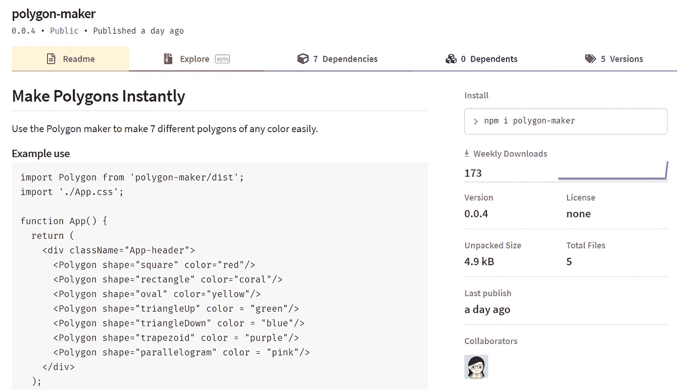
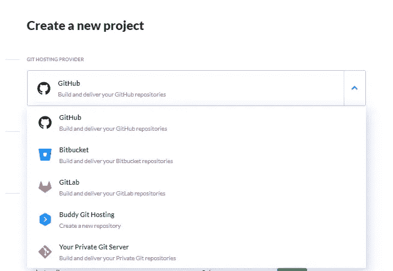
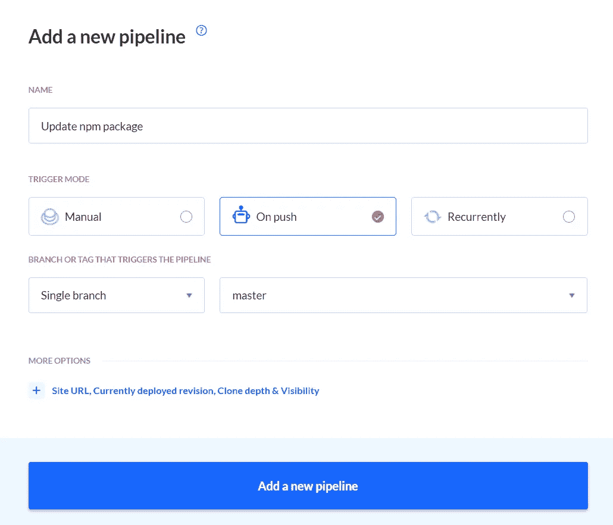
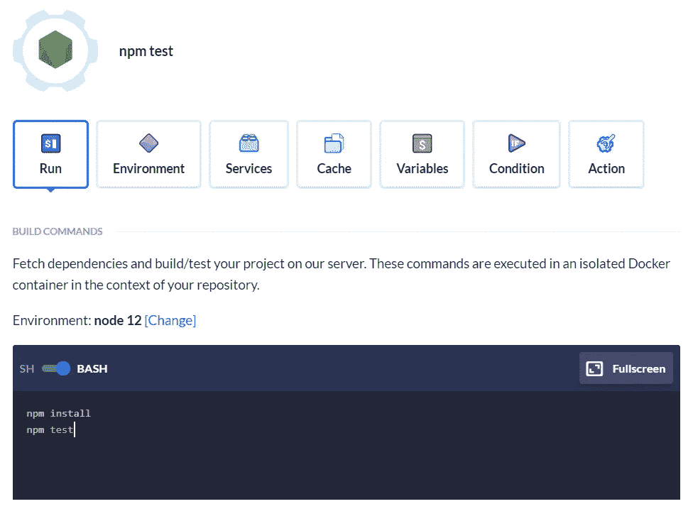
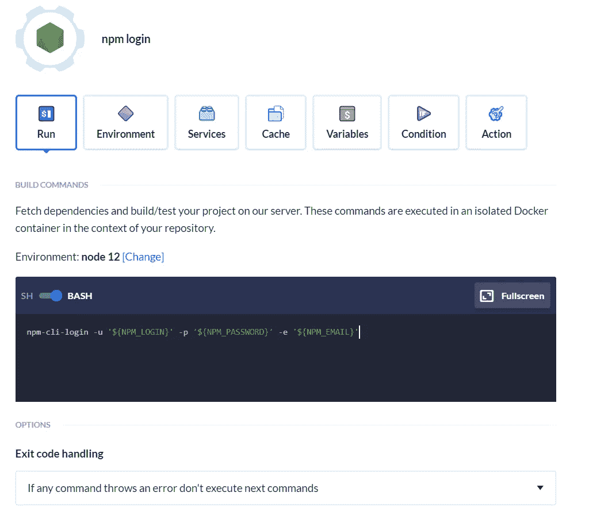
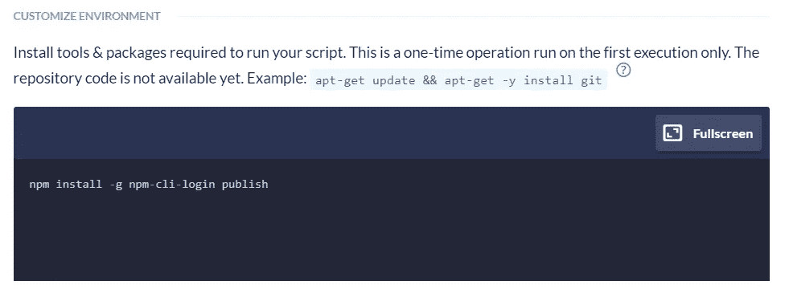
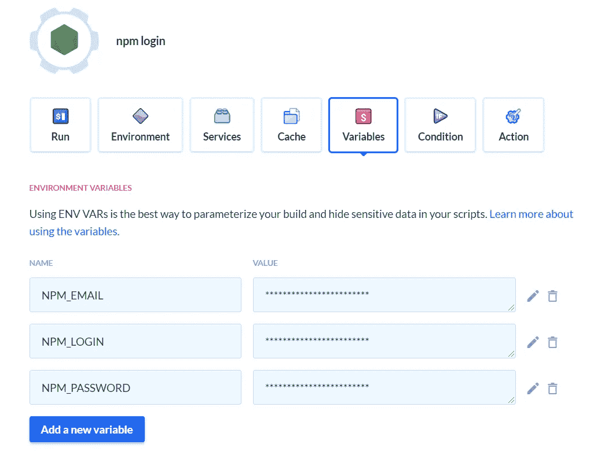
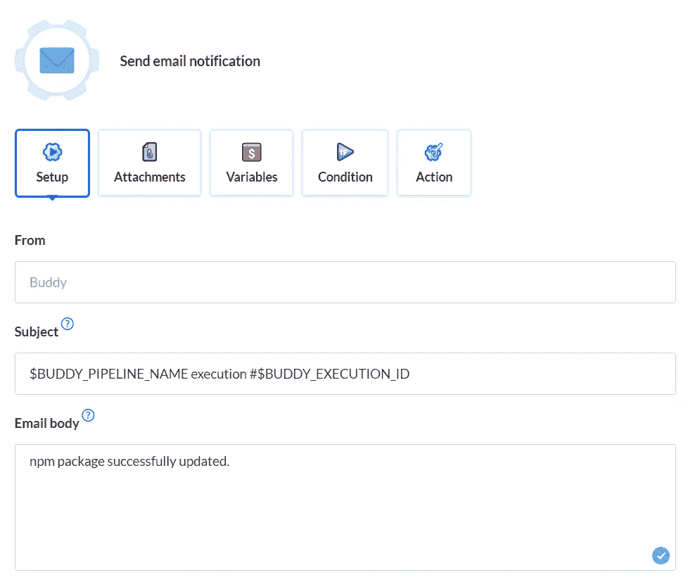
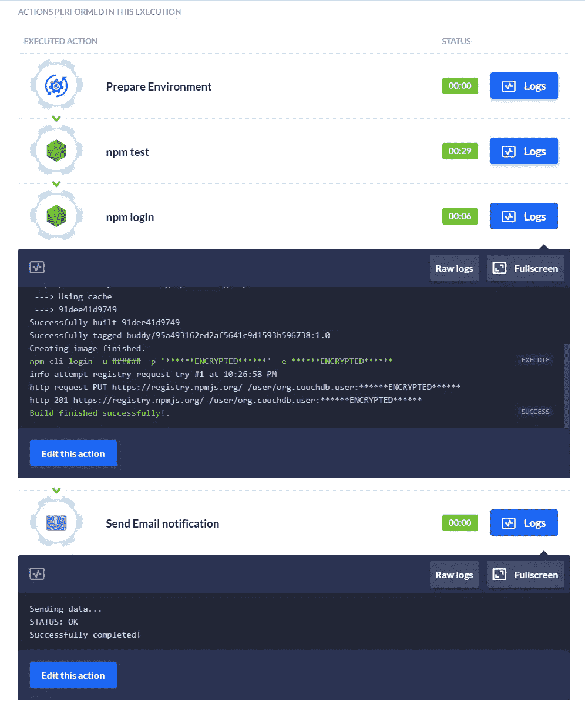

# 编写和发布 React NPM 软件包的初学者指南

> 原文：<https://betterprogramming.pub/beginners-guide-to-write-and-publish-react-npm-package-e04dd8dda79d>

## 将自己的 React 组件作为包发布到 npm 的分步指南


照片由 [Aron 视觉效果](https://unsplash.com/@aronvisuals?utm_source=medium&utm_medium=referral)在 [Unsplash](https://unsplash.com?utm_source=medium&utm_medium=referral) 上拍摄。

在本文中，我们将学习如何将一个 React 组件发布为一个 npm 包，然后建立一个管道来自动化测试和将来的发布。

# 开始之前

1.  确保您有一个 npm 帐户。如果没有，[创造一个](https://www.npmjs.com/)。
2.  确保您的计算机上安装了 Node 和 npm。如果没有，[得到](https://nodejs.org/en/download/)。
3.  需要对 React 有基本的了解。

# 我们简单的包装

对于本教程，我们正在制作一个简单的 React 组件，它可以立即用任何指定的颜色绘制指定的多边形。

然后，我们会将该组件发布为 npm 包，供任何人安装和使用。我们开始吧！

# 步骤 1:创建 React 应用程序

首先，让我们使用以下命令创建一个新的 React 应用程序:

```
npx create-react-app polygon-maker
```

# 第二步:Polygon.js

接下来，创建一个`Polygon.js`文件，它将是我们作为包发布的组件。

该组件将接受带有诸如`color`和`shape`等属性的`props`，以确定多边形的类型及其颜色。

在这个例子中，我创建了一个简单的`square`，如果`props.shape`是方形的，它将是返回的`<div>`样式属性:

# 第三步:App.js

在`App.js`中，我们可以像这样在顶部导入`Polygon`:

```
import Polygon from "./Polygon";
```

而在返回函数中，只需添加`Polygon`组件即可。传入`shape`和`color`作为道具:

```
<div style={{display:"flex", backgroundColor:"black"}}>
      <Polygon shape="square" color="red"/>
<div>
```

并且在浏览器上渲染了正方形！


# 步骤 4:添加更多的形状

您可以在`Polygon.js`中添加更多形状，这样您就可以使用该组件轻松绘制这些形状。我做了更多，比如长方形，三角形，梯形等等。现在我可以在`App.js`的多边形组件中把它们作为`shape`传递。

在`App.js`中:

在浏览器中:


# 步骤 5:准备发布

我们已经完成了这个简单的组件。让我们现在把它发布到 npm！

1.安装 babel 帮助 transpile ES6 JavaScript:

```
npm install --save-dev @babel/cli @babel/preset-react
```

2.删除`public`文件夹。

3.转到`package.json`文件。在脚本下，添加这一行:

```
"publish": "rm -rf dist && mkdir dist && babel src/Polygon.js -d dist --copy-files"
```

这个脚本将创建一个名为`dist`的目录，并将编译好的多边形文件复制到其中。

4.仍然在`package.json`中，将私有属性设置为`false`，并添加以下内容:

```
"babel": { "presets": [ "@babel/preset-react" ] }
```

太好了！现在我们准备将它作为 npm 包发布。

# 步骤 6:发布到国家预防机制

在命令提示符/终端中，使用以下命令登录 npm 帐户:

```
npm login
```

然后，运行我们的`publish`脚本:

```
npm run publish
```

您应该会看到一个`dist`目录出现在您的根文件夹中，里面有`Polygon.js`。将该文件重命名为`index.js`。

最后，运行:

```
npm publish
```

而且我们的[多边形生成器](https://www.npmjs.com/package/polygon-maker)包应该在 npm 上直播！



# 下一步:自动化测试和更新

发布 npm 包后，建立一个管道来自动化未来的测试和版本更新是一个好主意。 [Buddy CI/CD](https://buddy.works/?utm_source=medium&utm_medium=referral&utm_campaign=content_victoria_lo&utm_content=react_npm) 是一个直观的工具，我们可以使用它轻松实现这一目标。

## 添加管道

要开始，只需创建一个 [Buddy](https://buddy.works/) 帐户，并通过选择您使用的 Git 提供者来添加您的项目。



将您的项目添加到 Buddy 后，您可以点击“添加新管道”来设置管道。将`Trigger mode`设置为“On push ”,并将分支设置为“master ”,以确保当我们对项目进行更改时，管道会自动运行。



## 构建并运行测试

接下来，在管道中添加一个节点操作。在终端中，以下命令将构建并运行测试，以确保您的 npm 包没有错误。



## 认证并发布

在我们测试我们的包之后，我们可以将它发布到 npm。为此，我们需要登录我们的 npm 帐户。

在终端中使用以下命令添加一个节点操作:



该命令将允许我们使用`npm-cli-login`包和环境变量(如`NPM_USER`、`NPM_PASSWORD`和`NPM_EMAIL`)来验证自己。

要安装`npm-cli-login`然后运行`npm publish`，点击环境选项卡并在终端中添加此行，如下图所示:



现在我们需要指定我们的环境变量，方法是转到 variables 选项卡并适当地添加三个变量。



## 添加电子邮件通知

最后但同样重要的是，我们在管道中添加了一个电子邮件操作，在包成功测试并发布到 npm 时通知我们。



## 跑管道！

让我们试一试。如下图所示，执行是成功的，我们已经创建了一个自动化管道来测试和发布 npm 包的任何更新。



# 结论

这就是如何构建一个简单的 React 组件并将其发布到 npm 的方法。之后，您可以简单地使用类似于 [Buddy](https://buddy.works/?utm_source=hashnode&utm_medium=referral&utm_campaign=content_victoria_lo&utm_content=react_npm) 的 CI/CD 工具来自动化测试和未来的更新。您甚至可以配置一个管道来[部署零停机反应](https://buddy.works/guides/reactjs-zero-downtime-deployment?utm_source=hashnode&utm_medium=referral&utm_campaign=content_victoria_lo&utm_content=react_npm)！

感谢阅读。希望这篇文章有所帮助。欢迎在下面的评论中分享你的想法。干杯！