# 如何从文本数据执行特征工程

> 原文：<https://betterprogramming.pub/beginners-to-advanced-feature-engineering-from-text-data-c228047a4813>

## 初学者到高级


特征工程是机器学习中最重要的步骤之一。它是使用数据的领域知识来创建使机器学习算法工作的特征的过程。这有助于我们创建更好的数据，帮助模型更好地理解数据并提供合理的结果。

NLP 是人工智能的一个子领域，我们在其中理解人类与使用自然语言的机器的交互。要理解一种自然语言，你需要理解我们如何写一个句子，我们如何使用不同的单词、符号、特殊字符等来表达我们的思想。基本上我们应该理解句子的上下文来解释它的意思。

文本本身不能被机器学习模型使用。他们希望输入的是数字。因此，我们需要某种方法，以一种有意义的方式将输入文本转换成数字特征。这有几种方法，我们将从初学者到文本数据的高级特征工程技术。

# 正在加载样本数据集进行处理

我们将从加载一个样本数据集开始这个过程。

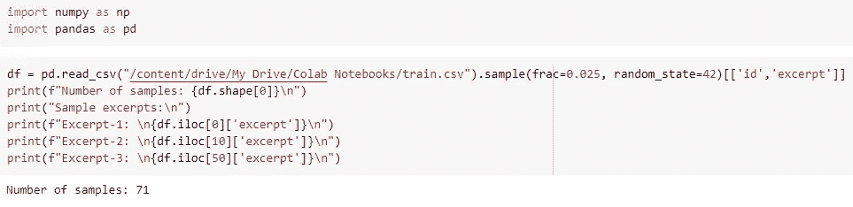

以下是数据集中的一些样本摘录。

> 爱丽丝看了看陪审席，发现在匆忙中，她把蜥蜴的头朝下放了进去，可怜的小东西正忧郁地摇着尾巴，完全不能动弹。她很快又把它拿出来，并把它放好；“这并不意味着什么，”她对自己说；我认为在审判中，这两种方法都一样有用。一旦陪审团从不安的震惊中恢复了一点，他们的石板和铅笔被发现并交还给他们，他们开始非常勤奋地写下事故的历史，除了蜥蜴，他似乎太克服做任何事情，但坐在那里张着嘴，凝视着法庭的屋顶。“你对这个行业了解多少，”国王对爱丽丝说。“没什么，”爱丽丝说。“什么都没有吗，”国王坚持道。“没什么，”爱丽丝说。
> 
> 九月的一个早晨，早饭前，奈德和哈利去猎土拨鼠。他们带走了迪克和吉普，迪克是一只又大又胖、有斑点的教练狗，吉普是一只黑褐色、短耳朵、怕老鼠的小家伙，他们俩都是“出色的猎手”，哈利说。吉普三条腿跑在前面；迪克安静地走在后面。奈德带着弓，哈利带着三支箭:这足以让任何一个聪明的土拨鼠看到它们都会发抖。他们首先穿过一片土豆地，然后穿过一片草地，那里有一条小溪，他们经常在沼泽中失去吉普，最后哈利背着他，以便知道他在哪里。迪克跑过小溪，在奈德的新水手服前晃了晃；但这无关紧要。然后他们来到一堵摇摇晃晃的旧石墙前，迪克吠叫起来。“它一定是墙里的一只旱獭。我们抓到他了！”奈德喊道。“墙倒了！”然后石头落下；吉普兴奋地跳上跳下，而迪克发出低沉而可怕的咆哮。“他一定在这里，”奈德道。
> 
> 很久以前，野兔和鬣狗是好朋友。他们一起做了很多事情。他们一起跳舞唱歌。一天，野兔说:“我的朋友鬣狗，让我们一起种田吧，我们会很富有的。”“哦，是的，我们可以种植很多食物，收获，然后卖给别人，”鬣狗说。“但是我们该种什么呢？”野兔问。鬣狗建议种植玉米。野兔同意了。野兔还告诉鬣狗，在农场分担责任对它们有好处。“我的工作是保护玉米不受鸟的伤害，”兔子说。然后野兔告诉鬣狗去耕地、种植和除草。鬣狗抱怨说他被分配了更多的工作。但是黑尔说，追鸟的工作是最困难也是最重要的。“我的工作不容易。我会不分昼夜地爬树，驱赶鸟儿。而且你不会爬树，”兔子解释道。鬣狗被野兔的话说服了。他同意独自耕种土地。工作量很大。野兔一点也没帮上忙。耕地后，土狼独自在整块地里种玉米。

# 文本特征工程(级别:简单)

## 文本中的字数

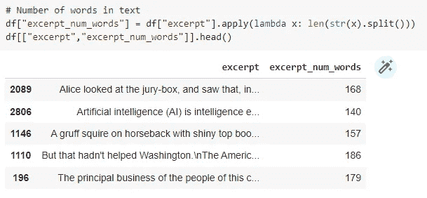

## 文本中唯一单词的数量

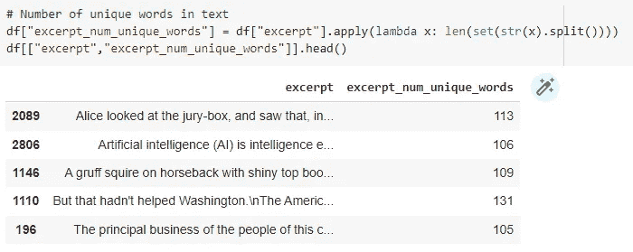

## 文本中的字符数(包括空格)

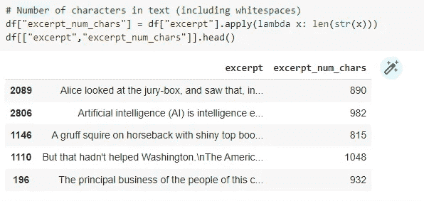

## 文本中停用词的数量

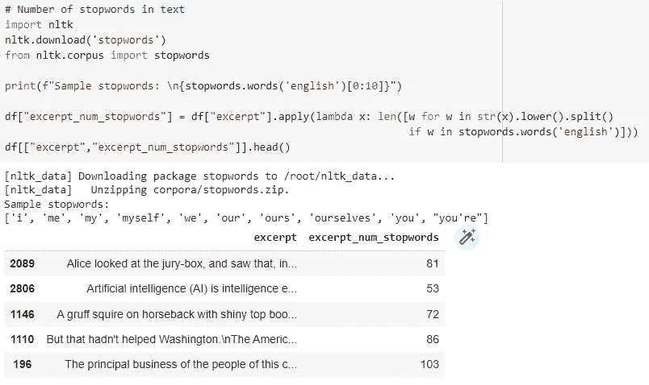

## 文本中标点符号的数量

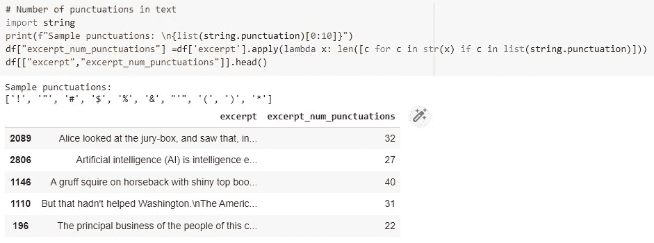

## 文本中大写单词的数量


## 文本中标题格的字数

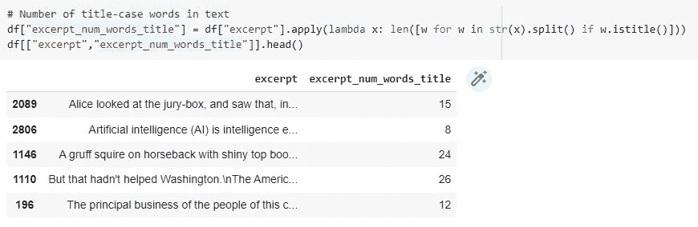

## 文本中的平均单词长度


# 文本特征工程(级别:中等)

## 文本中的段落数

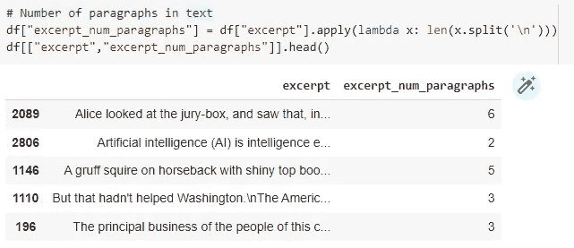

## 文本中的句子数量

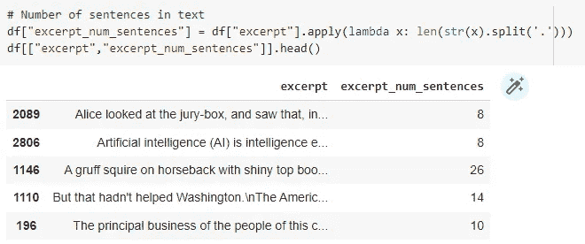

## 宫缩次数(不能、不会、不要、还没等。)在文本中

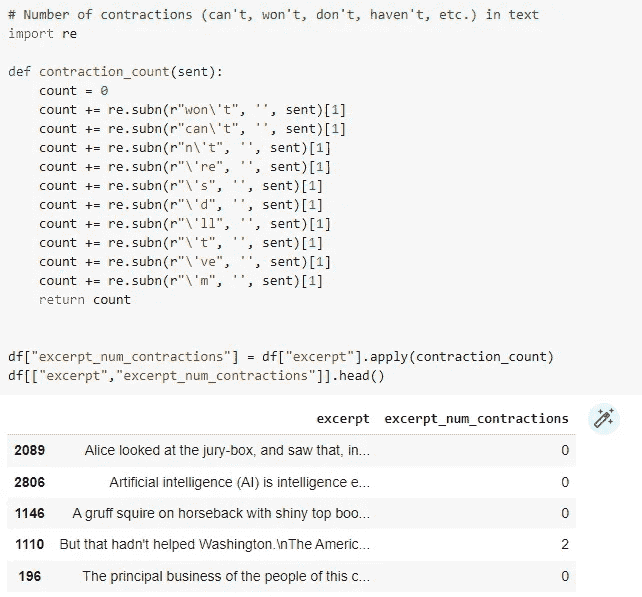

## 文本极性


## 文本主体性

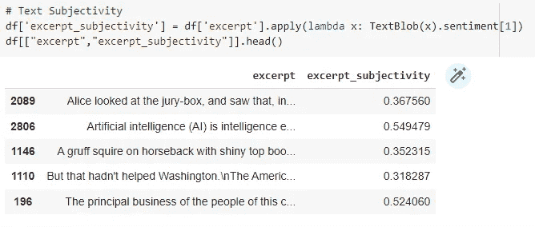

# 文本特征工程(级别:高级)

在开始使用文本数据的高级特征工程技术之前，我们需要先设置 2 个辅助函数。

```
def dialog_parser(text):

    tokenized = nltk.word_tokenize(text)

    # let's set up some lists to hold our pieces of narrative and dialog
    parsed_dialog = []
    parsed_narrative = []

    # and this list will be a bucket for the text we're currently exploring
    current = []# now let's set up values that will help us loop through the text
    length = len(tokenized)
    found_q = False
    counter = 0
    quote_open, quote_close = '``', "''"# now we'll start our loop saying that as long as our sentence is...
    while counter < length:
        word = tokenized[counter]# until we find a quotation mark, we're working with narrative
        if quote_open not in word and quote_close not in word:
            current.append(word)# here's what we do when we find a closed quote
        else:
            # we append the narrative we've collected & clear our our
            # current variable
            parsed_narrative.append(current)
            current = []

            # now current is ready to hold dialog and we're working on
            # a piece of dialog
            current.append(word)
            found_q = True# while we're in the quote, we're going to increment the counter
            # and append to current in this while loop
            while found_q and counter < length-1:
                counter += 1
                if quote_close not in tokenized[counter]:
                    current.append(tokenized[counter])
                else:
                    # if we find a closing quote, we add our dialog to the
                    # appropriate list, clear current and flip our found_q
                    # variable to False
                    current.append(tokenized[counter])
                    parsed_dialog.append(current)
                    current = []
                    found_q = False# increment the counter to move us through the text
        counter += 1

    if len(parsed_narrative) == 0:
        parsed_narrative.append(current)

    mean_dialog_word_len = 0

    if len(parsed_dialog) > 0:
        for text in parsed_dialog:
            join_text = " ".join(text)
            join_text = join_text.replace('"','')
            join_text = join_text.replace("''","")
            mean_dialog_word_len += len(join_text.split())

        mean_dialog_word_len /= float(len(parsed_dialog))

    mean_narrative_word_len = 0

    if len(parsed_narrative) > 0:
        for text in parsed_narrative:
            join_text = " ".join(text)
            join_text = join_text.replace('"','')
            join_text = join_text.replace("''","")
            mean_narrative_word_len += len(join_text.split())

        mean_narrative_word_len /= float(len(parsed_narrative))return len(parsed_dialog), len(parsed_narrative), mean_dialog_word_len, mean_narrative_word_lendef pos_count(sent):
    nn_count = 0   #Noun
    pr_count = 0   #Pronoun
    vb_count = 0   #Verb
    jj_count = 0   #Adjective
    uh_count = 0   #Interjection
    cd_count = 0   #Numerics

    sent = nltk.word_tokenize(sent)
    sent = nltk.pos_tag(sent)for token in sent:
        if token[1] in ['NN','NNP','NNS']:
            nn_count += 1if token[1] in ['PRP','PRP$']:
            pr_count += 1if token[1] in ['VB','VBD','VBG','VBN','VBP','VBZ']:
            vb_count += 1if token[1] in ['JJ','JJR','JJS']:
            jj_count += 1if token[1] in ['UH']:
            uh_count += 1if token[1] in ['CD']:
            cd_count += 1

    return pd.Series([nn_count, pr_count, vb_count, jj_count, uh_count, cd_count])
```

## 对话和叙述的数量

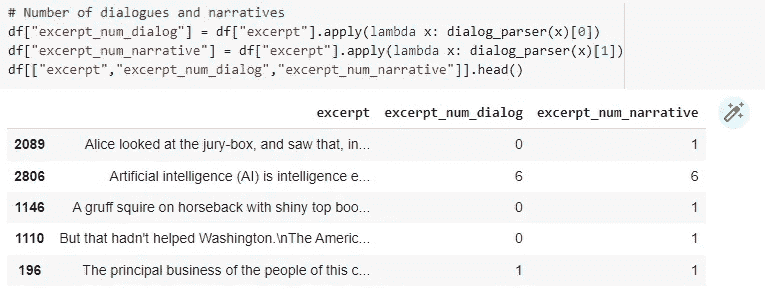

## 对话和叙述的平均单词长度

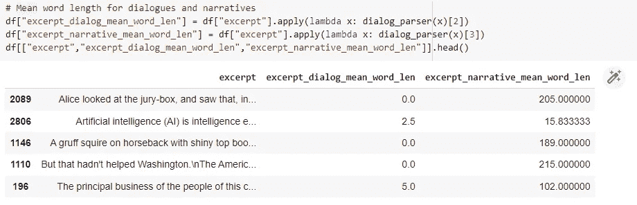

## 文本中词性标注的计数

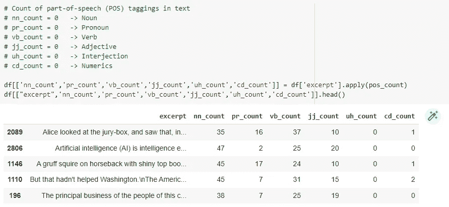

# 摘要

恭喜你！您刚刚学习了如何对文本数据执行特征工程(初级到高级水平)。我希望这个博客可以让你毫不费力地创建新的功能，并训练更好、更健壮的机器学习模型。