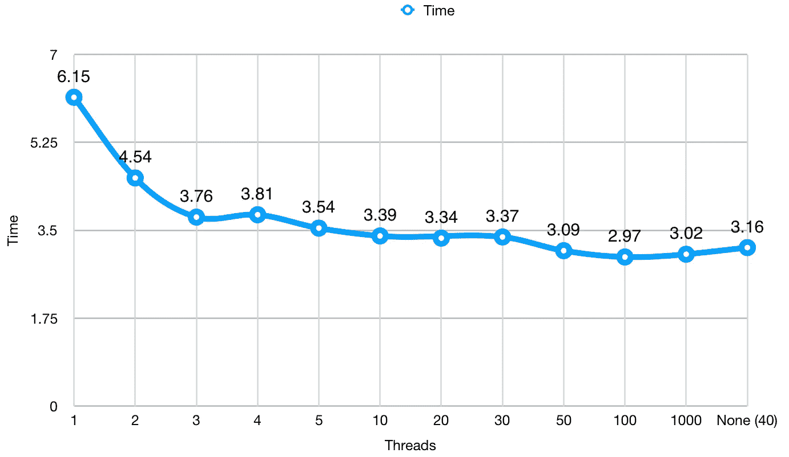

# Python 编程入门—第 14 部分

> 原文：<https://betterprogramming.pub/beginning-python-programming-part-14-208b9fa2f0a1>

## 多线程简介

照片由 [Franck V.](https://unsplash.com/@franckinjapan?utm_source=medium&utm_medium=referral) 在 [Unsplash](https://unsplash.com?utm_source=medium&utm_medium=referral) 上拍摄

在上一篇文章中，我们讨论了`asyncio`，只是触及了异步代码的表面。

 [## Python 编程入门—第 13 部分

### 深入研究异步代码

medium.com](https://medium.com/better-programming/beginning-python-programming-part-13-6147ce4cd88d) 

今天，我们将继续向异步方向发展，看看另一种叫做多线程的方法。如果你还没有读过上一篇，我强烈建议你把引言作为入门读物来读。

让我们先缩小一下，再考虑一下大局。

*   进程—为执行工作而运行的单个程序。(例如，谷歌浏览器、火狐浏览器)
*   线程——程序向其发送任务的工作队列*。*
*   线程队列——处理器将以先进先出(FIFO)方式处理的指令列表。(想象一条工厂生产线)
*   堆栈—您调用的所有将向线程队列发送指令的表达式。这些是以后进先出(LIFO)的方式创建的。(想想你会如何一个接一个地拆除一座积木塔，而不把它们推倒)
*   内存空间—内存中单个进程使用的空间，存储在内存空间中的所有数据都可以由一个进程以及该进程拥有的所有线程访问。

让我们开始吧。

# 穿线

虽然`asyncio`可能适用于 web 服务器，但有时它并不是这项工作的最佳工具。如果你参考上一篇文章，当你有很多到多个资源的连接(也就是 web 服务器路由)时，`asyncio`是很有用的。但是，当您需要与单个资源建立一些连接时，比如同时操作硬盘上的文件，会发生什么情况呢？

线程可以共享内存和资源，因为它们属于同一个进程。

进程不能共享内存或资源，因为它们属于自己的内存空间。如果您确实需要在两个进程之间共享数据，那么您需要将这些数据存储在数据库或缓存中。

这就是`threading`库发挥作用的地方。

`threading`在不同的线程上产生进程。我们不仅可以使用`threading`来执行同步文件操作，还可以使用它来执行多个下载请求或大量 API 调用。

在我们进入一个例子之前，还有一件事需要说明，那就是所谓的*竞争条件*。竞争条件是指两个独立的进程或线程试图同时操作相同的数据。发生这种情况时，一个进程可能会得到意外的数据。如果您阅读了我以前的文章并运行了最后一个示例，您会在控制台输出中看到一个竞争条件。一些线条似乎被合并了。虽然它没有使我们的程序崩溃，但是在很多情况下你的程序会崩溃。当使用`threading`库时，跟踪什么被修改以及何时被修改是很重要的。如果有帮助，把它写在一张纸上。

让我们看一个简单的例子:

这里我们在文件的顶部导入`threading`来使用这个库。然后我们创建一个函数，它返回一个列表，该列表包含我们传入的参数`min`和`max`之间的所有值。为了更好地形象化，我们还包含了一个`thread`参数，我们将在其中传递当前正在运行的线程的名称。

在我们的 count 函数中，我们首先打印出线程已经启动。我们创建一个`this_list`变量来保存我们的值，并将`index`变量初始化为 0。

然后，我们使用范围的`min`和`max`值遍历所有值，并在递增索引的同时将它们插入数组。然后，我们打印出线程在添加外部变量`result`之前已经完成，以便稍后打印。

接下来，我们创建两个线程，并为每个线程提供一个目标`count`。目标是我们想在这个线程上做的事情。由于`count`有三个参数，我们也将三个参数作为元组传递给`args`关键字。

这就是两个线程的不同之处。一个从零数到*一千万*，另一个从零数到*一百万*。在我的测试中，这些是证明这两个线程同时运行而不需要太长时间的理想数字。如果速度太快或在你的计算机上花费太长时间，你可以随意添加或删除一个零。

我们创建线程并不意味着它们会启动，我们必须在每个线程上调用`start()`来让它运行。这有助于比赛条件。有时，您可能希望在一次启动所有线程之前枚举所有需要使用的线程(例如，将线程存储在它们自己的列表中，然后遍历列表，对每个线程调用 start)。

最后，我们使用`thread.join()`来阻塞主队列，以确保得到我们的结果。然后我们打印出第一个列表的长度。

请注意，如果您尝试在单核 CPU 上使用多线程，您将不会看到性能提升。相反，您可能会看到由于单个处理器试图处理异步代码的同步而导致的性能下降。

由[raphal Biscaldi](https://unsplash.com/@les_photos_de_raph?utm_source=medium&utm_medium=referral)在 [Unsplash](https://unsplash.com?utm_source=medium&utm_medium=referral) 上拍摄的照片

# ThreadPoolExecutor

有时您需要定制一个任务应该使用多少个线程，例如限制一系列任务应该使用的并发线程的数量。

为了说明这一点，请看下面的例子，它只是上面例子的重构:

在这里，我们最终创建了四个不同的线程来处理相同的数据。我只是决定使用循环来管理反复重写相同代码的复杂性(DRY 原则)。

假设我们有多个任务需要在后台线程上运行。这些任务中的每一项都需要一些在各自任务开始之前必须完成的初步信息。一个基本的网络爬虫就是一个很好的例子。

在小型网站上，我们也许能够应付`threading`，但是在大型网站上，我们肯定需要限制我们使用的线程数量，这样我们就不会遇到性能问题。你只能走这么快。

下面是一个使用`ThreadPoolExecutor`的重构，基于在找到的[示例:](https://tutorialedge.net/python/concurrency/python-threadpoolexecutor-tutorial/#example)

我们在顶部还有一些进口货。我们包含了`threading`,因为我们需要在程序启动时得到线程的`active_count()`,并且我们需要能够计算出我们的任务当前使用的是哪个线程。我们包含了`time`,因为当我们调整使用多少线程时，我们想要计算应用程序的运行时间。最后，我们使用`from concurrent.futures import ThreadPoolExecutor`,这允许我们专门导入`ThreadPoolExecutor`,而不是整个`concurrent`库。稍后我们将调用它来设置一个执行程序来运行我们所有的任务。

我首先创建一个`numbers`列表，它包含 100，000 到 1，000，000 之间的值，增量为 10，000。我们将使用它在两次运行之间向每个任务传递一致的值。我最初开始使用来自`random`库的`randint`，但是意识到一次运行可能只得到低值，而另一次运行可能只得到高值。这会扭曲我们的结果。

然后我们创建我们的`task`。这类似于上面的 count 函数，除了我们传入想要用作最大值的数字。我们让每个人都知道我们在一个新线程上开始了一个任务，并提供了名称。由于名字是`ThreadPoolExecutor-x-y`，其中`x`是当前线程池，`y`是当前线程，所以我只使用字符串的后三个值。

我们将`result`初始化为 0，并开始循环对所有数字求和。我们在打印完`current_thread()`之前打印`result`。

接下来是我们的主要功能。在其中，我们首先从`ThreadPoolExecutor`创建一个`executor`对象，传递我们希望使用的最大数量的工人。我们也可以通过使用命名参数`max_workers=10`来做到这一点。如果您将此字段留空，那么机器上的处理器数量将会乘以 5。在我的计算机上，我有 8 个逻辑处理器* 5 个线程= 40 个线程。

通常，我们会为每个任务调用`executor.submit(task)`,但是在这个场景中，我们将一个变量传递给函数，在这个例子中，我们使用`executor.map(task, numbers)`为我们完成所有这些工作。所发生的是解释器首先检查以获得`numbers`的长度，然后对于`numbers`中的每个数字，它将该值传递给`task`的`number`参数。一旦完成，它将使用`executor`提交任务。

然后我们有了我们的`if __name__ == "__main__”`语句，它检查这个文件是否被调用。当我最初创建这个程序时，我没有包含下一行，它获取当前活动线程的数量，我的程序从未完成。当我打印活动线程的数量时，我发现我已经为这个程序使用了三个线程。

因此，我需要获取活动线程的数量，这样我就可以防止程序立即运行底部的运行时间行。可以把它想象成一个基本的[信号量](https://en.wikipedia.org/wiki/Semaphore_(programming))，用于确保多线程的同步。Python 有这些内置的特性，但是这个例子更容易理解。

向下移动，我得到了当前时间，这样我们就有东西可以计算以后经过的时间。然后我调用`main()`，这启动了我们应用程序的业务逻辑。一旦所有的工作都完成了，我们以秒为单位确定运行时间，并将其打印到屏幕上。

在对各种数字进行了一些测试之后，我对这些数字进行了一些数据科学分析，以显示所使用的线程数量和运行所花费的时间之间的相关性。

使用的线程总数的运行时间(秒)。

在上图中，你可以看到我们如何从 6 秒钟开始用一个线程运行上面的例子。随着线程数量的增加，我们很快就会发现我们的运行时间缩短了。在四个线程时，我们看到一个更糟糕的时间，我运行这个例子几次以确保没有异常，并且我一直得到一致的结果。随着我们继续增加线程数量，我们看到在 10 到 30 个线程之间达到平衡之前，在毫秒内有稳定的提升。

跳到 50，我们看到另一个提升，在 100 个线程时，我们看到最佳运行时间。使用 100 个线程并不理想，所以我们应该后退，考虑 30 到 50 个线程。

有趣的是，当我们通过 1000 个线程时，我们的时间变得更糟。最可能的原因是旋转所有 1000 个线程所花费的时间。在这种情况下，越多越好。

最后，我使用默认的工作线程数，不向`ThreadPoolExecutor()`传递任何数字，我们看到 3.16 秒。这比 50 个线程更糟糕，但是在我们的例子中，它似乎工作得很好。

根据我想要创建的线程池的数量，我可能会使用 40–50 作为划分工作线程数量的基线。我还会参考这个图来确定每个池使用的最佳线程数。如果我需要三个池，我可能会给每个池十个工作线程。如果我使用 12 个线程池，我可能会选择每个线程池三个线程，而不是四个，因为三个线程池的运行时间更长。

从另一个角度来看，我可以为需要完成更多工作的线程池提供更多线程，而为完成基本任务的线程池提供更少线程。我还可以通过优先级来分配线程，将更多的优先级分配给用户必须等待的任务，同时将任务作为守护进程运行，或者将后台任务与一个或两个线程一起运行。参考上面的图表，我可以使用三个线程来完成所有的后台任务，而我可以使用 5 个或 10 个线程来完成用户发起的所有任务。我需要确保我将它保持在一个更全局的限制之下，可能是 50 或 100。

# 摘要

我们使用`threading`模块和`concurrent`模块介绍了 Python 中的多线程。我们简要地看了如何创建和管理线程，以及如何在继续执行程序之前等待线程完成。

还有很多关于线程和线程池的细节我没有在这里介绍。我只是想让您尝试一下线程，这样您在浏览文档时就不会感到迷茫。

## 推荐阅读

Python 文档中的线程。

 [## 线程化—基于线程的并行性— Python 3.7.4rc1 文档

### 返回当前线程的“线程标识符”。这是非零整数。它的值没有直接意义；这是…

docs.python.org](https://docs.python.org/3.7/library/threading.html) 

来自 Python 文档的并发期货。现在还不要担心多重处理。

 [## concurrent.futures —启动并行任务— Python 3.7.4rc1 文档

### 使用时，该方法将可重复项分割成许多块，作为单独的任务提交给池。的…

docs.python.org](https://docs.python.org/3/library/concurrent.futures.html#module-concurrent.futures) 

# 下一步是什么？

接下来是多重处理。除了我们使用多个内核来执行工作之外，多处理类似于多线程。最后，我们还将介绍 asyncio、线程和多处理之间的区别。理解每个任务使用哪一个是至关重要的。在那之前，继续练习。

 [## Python 编程入门—第 15 部分

### 多重处理简介

medium.com](https://medium.com/better-programming/beginning-python-programming-part-15-ae96dd8b9c95)