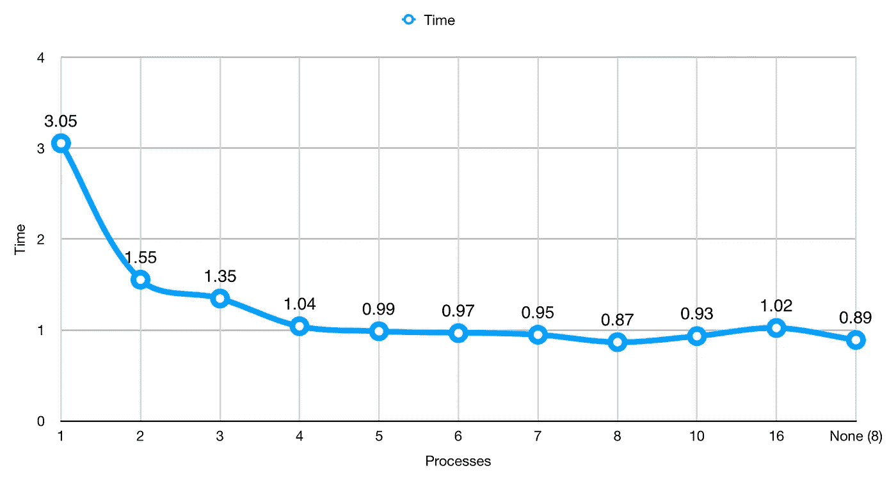

# Python 编程入门—第 15 部分

> 原文：<https://betterprogramming.pub/beginning-python-programming-part-15-ae96dd8b9c95>

## 多重处理简介

由 [Brian Kostiuk 拍摄— @BriKost](https://unsplash.com/@briankost?utm_source=medium&utm_medium=referral) 在 [Unsplash](https://unsplash.com?utm_source=medium&utm_medium=referral)

在上一篇文章中，我们讨论了多线程。

 [## Python 编程入门—第 14 部分

### 多线程简介

medium.com](https://medium.com/better-programming/beginning-python-programming-part-14-208b9fa2f0a1) 

这里我们将介绍 Python 提供的另一个名为`multiprocessing`的库。像`threading`，`multiprocessing`允许我们并发运行代码；然而，这段代码运行在多个处理器上。先说一个定义。

*   全局解释器锁(GIL)——用于确保当*锁定*时，Python 字节码每次只在一个线程上运行。如果*释放*，则允许使用多个内核进行处理。

到目前为止，我们已经能够避开这种复杂性，因为我们只处理单核计算。GIL 对于确保并发访问的安全性至关重要；通俗地说，多个任务同时运行不会出问题。

在前面的例子中，我们最终同时在控制台上打印了两行。通过确保一次只有一个进程可以写入控制台，GIL 可以用来清理这种情况。

虽然 GIL 可以保护我们，但它限制了我们使用多个内核进行并行处理，从而导致性能问题。这并不意味着“永远不要使用多重处理”，它只是意味着当我们确切地知道我们希望我们的代码如何执行时，我们应该只使用多重处理。

# 多重处理

`multiprocessing`最适合在我们执行基于 CPU 的计算时使用。CPU 计算可能是比特币挖掘(缓慢的方式)或为一些极端的例子创建彩虹表。一些更实际的例子是照片和视频编辑、音乐创作或创建哈希表(数据挖掘的东西)。

这里有一个例子，你会从上一篇文章中认出来，只是稍微做了些修改，以适应多处理。

不用导入`threading`和`concurrent.futures`，我们只需要导入`multiprocessing`。接下来改变的是我用了`multiprocessing.current_process().pid`而不是`threading.active_count().name[-3:]`。这将获得从我们的主进程派生出来的进程的进程 ID，并将其报告回控制台，这样，如果我们以后需要终止它，我们就知道在哪里可以找到我们的进程。我们的`task`函数中的其他内容都是一样的。

在`main`中，我们改变了我们的执行程序，它曾经是`ThreadPoolExecutor`的一个实例，但是我们把它改成了`multiprocessing.Pool()`。这里，我们指定只使用一个进程。如果我将它留空，它将使用`os.cpu_count()`返回我的机器中可用的 CPU 总数。

像线程一样，我使用`map`将每个`number`映射到它自己的`task`。如果我的任务多于进程，它们会排队等待前一个任务完成。最后我加了`executor.close()`，因为我有一个失控的进程。`close()`清理池并确保其正确停止。

在`if __name__ == “__main__"`中，我们删除了线`current_threads = threading.active_count()`。我们没有用多处理的等价行来替换它，这将是`current_children = multiprocessing.active_children()`，因为我们的执行器将阻塞主线程，直到它完成。我们可以使用一个更真实的`apply_async`调用(类似于`start`)来运行它，但是出于我们的目的，我们在这里不需要它。

我还继续使用`time`来检查我们的执行运行时间，就像我们之前做的那样。

以下是测试多个流程的结果:

所用进程总数的运行时间(秒)。

我们在这里获得了比线程更好的运行时间。情况并不总是这样，所以在决定之前一定要进行自己的测试。我们的时间是 3.05 秒。之前，我们用 50 个线程达到了 3.09。这意味着多重处理知道如何利用多线程。

像线程一样，当我们使用两个进程时，我们看到了最显著的跳跃。我们还看到其他明显的下降，直到我们达到 4 核。在 4 个和 7 个过程之间，我们看不到太大的区别；然而，在 8 个进程中，我们看到了另一个明显的下降。这种差异的缺乏可能是因为我的电脑在做其他事情(咳咳，写这篇文章)，这些事情已经通过 Chrome、Safari、PyCharm(为了代码质量)和 Mail 耗尽了 CPU 时间，更不用说所有在后台运行的东西了。

我添加了 10 个和 16 个进程来展示当您使用的进程多于 CPU 时会发生什么。我们看到这个数字回升，而不是改善。

您可能希望添加一些类似这样的代码，以防止在您可能不知道有多少 CPU 的系统上放置代码。

我知道还有其他方法可以做到这一点，使用`elif`或三元运算符，但这很简单，而且很有效。`os.cpu_count()`可能很贵，这就是我把它存储在变量中的原因。这样，我就不会在每次需要进行比较或赋值时要求 Python 查找 CPU 计数。

# 锁

因为我们有机会让两个不同的进程同时打印到控制台，所以我们可能希望在程序中包含锁。

我将使用上面的同一个例子来展示锁是如何工作的。

`Lock`做的是*获得*一个控制台进程的锁。当锁处于活动状态时，任何其他进程都不能使用它。A `Lock`是在编辑文件时使用的，我相信你已经看到警告，*某用户*打开了*某文件*，请让他们关闭或稍后再试。这和我们在这里讨论的锁是一样的。Lock 防止其他任何人访问控制台，直到进程*释放*控制台上的锁。

锁确实会增加我们的运行时间，但不会增加太多。在这个例子中，我的运行时间从 0.87 秒增加到了 1.01 秒。为了数据输出更加安全，我将花费大约 0.2 秒。

照片由 [Herson Rodriguez](https://unsplash.com/@hero?utm_source=medium&utm_medium=referral) 在 [Unsplash](https://unsplash.com?utm_source=medium&utm_medium=referral) 拍摄

# 共享

有时我们需要在进程间共享数据。有几种方法可以做到这一点，但并不那么简单。当我第一次开始使用多处理时，我看到了许多新的错误消息，它们看起来很神秘，因为我不熟悉套接字编程。虽然这超出了本教程的范围，但我会尽量保持简单，以便您可以在进程之间共享数据。这取决于你自己去学习先进的东西。

这里我们有一个来自上一篇线程文章的修改过的例子。我们从几个直接导入开始:`Process`、`Queue`和`current_process`。

我稍微修改了一下我们的`count`函数。在进入细节之前，我想介绍一下多处理队列。队列也存在于[线程](https://docs.python.org/3/library/threading.html)库中；然而，没有一种简单的方法来共享值，因为进程运行在不同的内存空间中。这就是队列发挥作用的地方。您可以将队列附加到流程，以便将值从一个流程传输到另一个流程。

为了将值插入到队列中，我们使用了`queue.put(item)`。为了检索值，我们使用`queue.get()`。队列的工作方式是先进先出，也就是 FIFO，这意味着你进入队列的第一个项目就是你第一次调用 T7 时得到的。

回到我们的例子。`count`先前要求的四个参数。因为`current_process().name`返回“进程-1”、“进程-2”等。，我们可以忽略传递当前进程计数。其他一切都是一样的，直到我们在队列中得到这个结果。

我们程序的第一步是创建一个`queue`，我们可以用它在进程间共享数据。接下来，我们创建空列表来保存我们的`results`和`processes`。最后，我们创建一个变量来保存我们希望在使用`process_count`进行计算时使用的进程数量。我们这样做是为了，如果我们需要升级或删除一些流程，我们可以在一个地方完成所有这些工作，以便将来轻松地进行更新。

我们更新了如何通过传递`queue`而不是`results`列表来创建新流程。在第二个循环中启动每个进程仍然和以前一样。在第三个循环中，我们做了一些改变。在使用`process.join()`之前，我们需要从`queue`中获取每个值，并将其存储在`results`列表中。

最后，我们使用`queue.close()`来确保我们自己清理干净，然后我们通过打印出`results`列表中第一个元素的长度来结束。

克里斯·巴巴利斯在 [Unsplash](https://unsplash.com?utm_source=medium&utm_medium=referral) 上的照片

# 异步方法的差异

既然我们已经介绍了可用的不同异步选项，让我们看看最重要的方面:何时使用它们。

## 穿线

*   数据可以很容易地在线程之间共享。
*   当您受到 I/O(例如，磁盘读/写)的限制但有许多连接时，最好使用它。
*   仅使用一个 CPU 内核。

## 多重处理

*   使用多个 CPU 内核。
*   能够一次写入许多磁盘。
*   当您需要非常快速地执行许多计算时，这是最佳选择。
*   除非特别说明，否则在附加内核中只使用一个线程。(如果你没有一个好的设计计划，代码会很快变得混乱)
*   在进程之间共享数据是困难的。

## 阿辛西奥

*   依赖于线程，但是线程将任务委托给系统来执行工作，并从委托的任务中获得结果。
*   当与多处理搭配使用时，您可以通过将多线程委托给系统来有效地使用所有内核。
*   最适合 I/O 较慢但需要多个连接的情况(例如，web 服务器或 web crawler)。
*   不适合基于 CPU 的任务，因为它依赖于线程。

# 摘要

今天我们学习了多重处理，以及如何用它来快速执行计算。我们做了更多的数据科学研究，发现当我们在示例中从线程切换到多处理时，处理时间大大减少，这是一项基于 CPU 的任务。

我们还研究了如何在进程间共享数据。虽然这看起来很简单，因为例子就在那里，但我第一次尝试使用多处理时，花了一段时间才弄清楚。随着您编写更多的多处理代码，这将变得更加容易。所以继续练习。

最后，我们总结了编写异步代码的所有不同方法，并查看了一些提示来帮助我们记住哪种工具适合这项工作。

## 建议阅读和查看

Python 文档中的多重处理。

 [## 多处理—基于进程的并行性— Python 3.7.4rc1 文档

### 该模块还引入了在模块中没有类似物的 API。这方面的一个主要例子是…

docs.python.org](https://docs.python.org/3.7/library/multiprocessing.html) 

来自 Python wiki 的全局解释器锁。

 [## global interpreter lock-Python Wiki

### 在 CPython 中，全局解释器锁或 GIL 是一个互斥体，它保护对 Python 对象的访问，防止多个…

wiki.python.org](https://wiki.python.org/moin/GlobalInterpreterLock) 

Raymond Hettinger，并发主题演讲— PyBay 2017

# 下一步是什么？

在那之后，我们的话题越来越少了。我们已经讨论了 Python 教程中的大部分内容和一些没有包括的内容。我已经决定我不想涉及标准库。当你写代码的时候，这是很自然的事情，如果我写了，会让你超负荷。

我们确实需要涵盖所有编程语言的一个关键方面。测试！

是的，你可以不写测试就写一个程序，它会工作的(看这里前面的例子)。到目前为止，测试是您为应用程序所做的最重要的事情。

但是让我们面对现实吧，即使你的应用被设计成做一些*惊人的* *事情*，如果它不能做*任何事情*，那它就完全没用了。所以现在还不要发布你的应用。测试一下。

 [## Python 编程入门—第 16 部分

### 让我们来谈谈测试驱动开发

medium.com](https://medium.com/better-programming/beginning-python-programming-part-16-5703d8f0fad3)