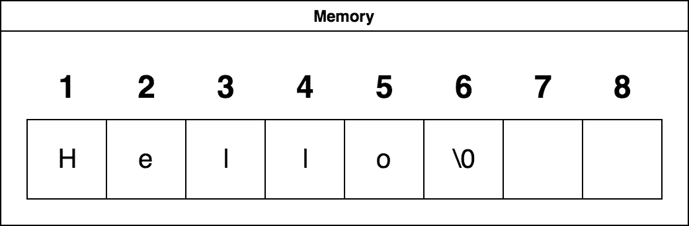
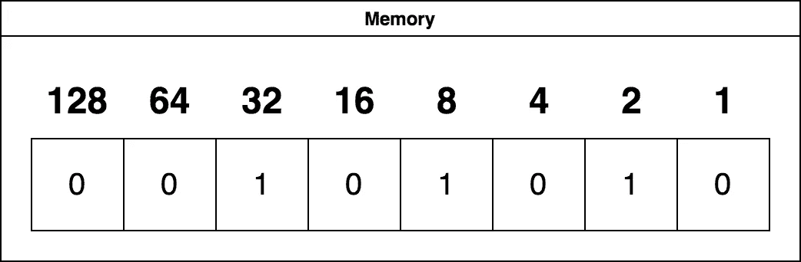
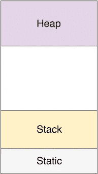

# Python 编程入门—第 2 部分

> 原文：<https://betterprogramming.pub/beginning-python-programming-part-2-reference-types-pointers-and-collection-types-a806ef6b92cf>

## 引用类型、指针和集合类型

克里斯·劳顿在 Unsplash[拍摄的照片](https://unsplash.com?utm_source=medium&utm_medium=referral)

在 Python 系列的第一部分[中，我们介绍了变量、常量和类型。今天，我们将讨论引用类型、指针和集合类型！](https://medium.com/@broebling/beginning-python-programming-part-1-variables-constants-and-types-1199da1572c8)

在其他编程语言中，你会有值类型的概念。在 Python 中，这个概念是不存在的。相反，我们只有引用类型。尽管我很想深入研究，但有一个先决条件是所有面向对象语言共有的，但也是最难理解的概念之一，叫做指针。

# 初步材料

上次我们谈到了内存，以及它是如何以块、字节和位的形式排列的。我想在这里详述一下，给你们一些记忆是如何工作的视觉表现。

让我们创建一个保存值 **Hello** 的字符串。没什么特别的，我们以前做过。

我在上一篇文章中告诉过你，内存保存值。如果我们可以看看这段记忆，它会是这样的:

我打赌你在问字符串末尾的`\0`是什么！这被称为空终止符。斜线告诉程序为一个命令做好准备，零代表什么。这就是字符串值的存储方式，让程序知道字符串何时结束，同时仍然允许使用空格。

数字有点不同。

数字以二进制数的形式存储。二进制很容易理解，从内存块最右边的 1 开始，一直向左，每次将当前值乘以 2。如果你熟悉显卡或记忆棒，这就是为什么我们看到 8 位(雅达利，NES)，16 位(世嘉创世纪，SNES)，32 位(PlayStation)，64 位(任天堂 64)，等等。

在二进制中，如果一个位置是 0，它是 off，它是 false。如果一个位置是 1，它是 on，或 true。
基于这个逻辑，我们只需要计算其中有 1 的位置。你能算出上图中的数字吗？

现在，这是一组 8 位的内存，没错，是一个完整字节的内存。之前我说过字符串中的每个字符是 2 个字节，这意味着我们用 16 位来存储一个字符。二进制的 16 位给了我们 128 的最大值。然而，当我们谈论职位时，我们总是从 0 开始。所以 16 位给你一个全范围的`0-127`。如果您想知道如何获取超出该范围的字符，我将为您介绍 [ASCII 表](http://www.asciitable.com)，您可以在其中看到自己的值。你甚至会看到隐藏的字符，比如上面显示的空终止符`/0`。

内存将值存储在三个地方:*静态*内存、*堆栈*和*堆。*

静态内存和堆栈内存的访问速度很快，但是从堆中访问东西的速度很慢(在计算机时间内)。虽然对您来说可能不慢，但是从堆栈中加载可能需要一毫秒或更短的时间，从堆中加载可能需要 10 ms。在大多数语言中，您可以根据变量的类型选择在哪里实例化变量。在 Python 中，解释器(底层引擎)会查看您的代码，并根据变量的*作用域假设变量应该存储在内存中的什么位置。现在谈论范围还为时过早，但是我保证我们会在以后的文章中讨论它。*

事不宜迟，我们开始吧。

# 引用类型和指针

引用类型使用指针在内存中存储值。在我们深入讨论如何使用它们之前，我们真的需要了解一下指针。

如果你看一个典型的 C 程序，你会发现到处都在使用指针。

当我们使用`char *name = “Bob";`时，我们通过使用`*`来制作指针。这告诉系统，给我一个*地址*，我可以在内存中存储这个值。然后系统会说“好的，你可以用第 3 块来表示你的价值。”然后在第 3 块中保存`"Bob"`(当然没有引号)。

如果您使用`printf("%x", name);`请求 name 的值，您将只看到地址，它可能看起来类似于`0x03`只是更长一些。这是该内存块的十六进制表示。如果你想要值`Bob`，那么你必须使用`printf(*name);`(两个打印语句都在 C 中)。

在 C 语言中，如果你想从任何地方改变这个值，你可以使用`&name` ，它告诉你获取这个值的地址并对它做一些事情。当值改变时，您可以通过引用`*name`立即使用新值。

在引擎盖下，Python 查看您的变量并为您完成所有这些`*`魔法。它让每一个程序员的工作都因此变得更加轻松。因为它为您处理了所有这些，所以您不必担心会产生内存泄漏，但是，您仍然需要担心一些称为竞争条件的问题，我们将在后面讨论。

我提出引用类型的原因是因为我们将在本系列的下一部分讨论更高级的类型。我只是想让你在我们开始之前熟悉一下引用类型是如何工作的。

我记住引用类型的方法是想象一个宝箱。它不属于任何人，但是我一找到它，我就记下它在哪里，这样我就可以随时回来找它。如果我想看地图看它在哪里或者告诉别人，我用`&`。如果我想打开它，看看里面的宝藏，我用`*`。如果我想把东西放进去或者拿出来，还是要先用`*`才能拿到。

当你在 C 指针中存储一个像`Bob`这样的值时，你实际上是把每个字母放在一个单独的内存块中。你真正知道的只是`B`在哪里；空终止符`/0`告诉计算机什么时候停止*在内存中的迭代*并返回它所拥有的任何值。就当是街霸里的一键连击吧。当我们谈到集合类型的时候，我会详细讨论这个问题，如果你根据我将要介绍的类型，把字符串在 C 语言中的工作方式(也称为 C-Strings)联系起来，那么你是正确的。

随着我们的继续，你会有一些想法。如果你想学习 C、C++或 Objective-C，这些都是非常重要的信息，然而，使用 Python，它们很好地隐藏了所有这些复杂性，所以你几乎不必担心`&`或`*` *运算符*。

引用类型可以存储在堆栈中，也可以存储在堆中。如果程序员使用`malloc`为引用类型手动分配内存，您将知道引用类型是否存储在堆中。*

**任何用 malloc 创建的变量在程序结束时都不会自行消失，您必须根据您的语言调用* `*dealloc*` *或* `*free*` *来从内存中删除该值，否则，它会一直留在内存中，直到计算机重新启动。这就是所谓的“内存泄漏”。*

Python 为您处理所有这些，因此您不必担心`malloc`、`dealloc`或`free`。有一个例外，你可以使用`del`来清空存储变量的内存，但是你通常不需要使用这个。

由[凯利·西克玛](https://unsplash.com/@kellysikkema?utm_source=medium&utm_medium=referral)在 [Unsplash](https://unsplash.com?utm_source=medium&utm_medium=referral) 上拍摄的照片

# 集合类型

集合类型是包含项集合的类型。主要有两种:*列表*和*词典。*一些语言将列表称为*数组。*如果你需要在另一种语言的例子和 Python 之间翻译代码，要知道它们指的是同一类型的集合。

1.  **列表** —列表包含有序的相似元素，这些元素通过其索引*可寻址*。索引由从列表开始的项目数定义。如果我们这样定义一个列表:
    `my_list = ["eggs", "milk", "butter", "cheese"]`
    我们能够通过使用`‘my_list[0]’`来检索这些值中的每一个，这将给我们值`eggs`，因为它是从列表开始的 0 个位置。使用这个逻辑，如果我们想要`butter`，我们将使用`my_list[2]`，因为它距离`eggs`有`2`个位置。如果我们想改变存储在列表中的值，我们可以使用
    `my_list[2] = "Sugar"`。令人惊讶的是，在 C 弦中，这更有意义。当我们在 C-string 中存储`Bob`时，我们实际上创建了一个字符的*数组*(因此是 char 类型)。如果我们说`name[0]`,它会返回`B`,因为它从数组开始就是 0 块内存。如果你在数组之外，你会遇到问题。大多数时候，电脑会帮你避免说“索引超出范围”或类似的话。如果你在程序运行时遇到这个问题，程序就会崩溃。
    更具体到 Python，您可以使用下面的语法使用列表片段:
    `my_list[1:3]`这将返回列表中的第 2 和第 3 项。
    您也可以使用开放式范围，例如:
    `my_list[:2]`返回列表中从第一个元素到第二个元素的所有内容，`my_list[1:]`从第二个元素开始，一直到最后。
    这样理解的方式是:
    `my_list[<start position>:<stop position — 1>]` 也可以用负数来排除末尾的值。
    `my_list[:-2]`返回列表中除最后两个元素之外的所有内容。
    列表可以包含任何类型的变量，所以`[True', 'three', 3]`，即一个布尔值、一个字符串和一个数字，仍然是一个有效的列表。感谢[格雷格](https://medium.com/u/66a601633f9c?source=post_page-----a806ef6b92cf--------------------------------)。
2.  字典**——我让你猜猜为什么它会这样命名。字典和数组的相似之处在于它们都包含相同类型的值，但是它们是不同的，因为它们是无序的。它们确实包含索引，但索引通常是一个字符串值。考虑到这一点，你可能会想到字典中的一个词，然后是它的定义。大概就是这么回事吧！您可以使用以下代码定义一个字典:
    `my_dictionary = {"Kevin": "Lead Minion", "Bob", "Determined Minion", "Stewart": "Rocker Minion"}`
    `:`将键和值分开。
    我们可以通过使用`my_dictionary["Kevin"]`
    来获得其中任何一个的值。你可以使用与列表相同的语法在字典中设置值，只需使用*键*来设置*值。* Python 不关心确保值是同一类型，例如:
    `my_dictionary["Bob"] = "King Bob"`是允许的。
    T4 也是允许的。使用
    `my_dictionary = {}`可以声明和实例化字典。**

**Python 中广泛使用字典和列表。您需要小心处理列表，使其不超出元素的范围。如果您试图访问一个字典中不存在的值，您将收到一个`KeyValue`错误。**

# **摘要**

**今天我们学习了引用类型，集合类型，以及一些关于内存的知识。**

# **下一步是什么**

**在下一篇文章中，我们将讨论操作符和`None`。大部分初步的背景信息已经结束，很快我们就可以享受编程的乐趣了。**

** [## Python 编程入门第 3 部分—运算符和无

### 在上一篇文章中，我们讨论了引用类型、指针和集合类型。

medium.com](https://medium.com/@broebling/beginning-python-programming-part-3-operators-and-none-3a80de041411)**