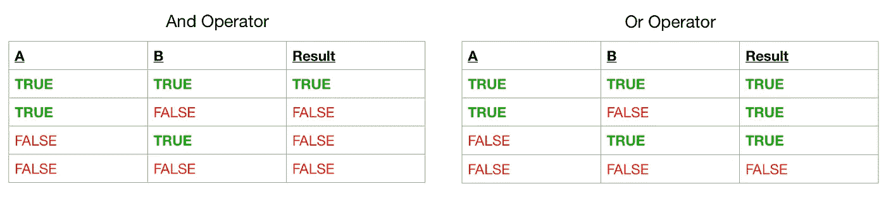

# Python 编程入门—第 4 部分

> 原文：<https://betterprogramming.pub/beginning-python-programming-part-4-716a40d5636b>

## if 语句、for 循环和 while 循环如何帮助您做出更好的决策并简化重复的任务。


巴勃罗·加西亚·萨尔达尼亚在 [Unsplash](https://unsplash.com?utm_source=medium&utm_medium=referral) 上拍摄的照片

在上一篇文章中，我们学习了运算符和`None`。

[](https://medium.com/better-programming/beginning-python-programming-part-3-operators-and-none-3a80de041411) [## Python 编程入门—第 3 部分

### 熟悉使用运算符和 none

medium.com](https://medium.com/better-programming/beginning-python-programming-part-3-operators-and-none-3a80de041411) 

今天，我们将利用这些知识开始让我们的程序变得更加智能。

# 决策

每天我们都在做决定。当我们早上起床时，我们可能会喝一杯咖啡，但对我来说，喝一杯咖啡需要决定我是否要冲一杯。首先，我需要检查我是否有咖啡，其次，我需要检查我是否有糖，接下来我检查以确保我有牛奶，最后我检查我是否有一个干净的咖啡杯。

如果任何一个问题的答案是否定的，要么我什么都不做，要么我做我需要做的去喝杯咖啡。

编程也是如此，我们可以使用`if` 语句做出这些决定。

`If`语句看起来是这样的:

我们在顶部有两个布尔变量:`has_coffee`和`made_cup`。我们使用语法`if has_coffee`来检查`has_coffee`的值。如果 coffee 的值为 true，那么我们执行下面的代码**缩进 4 个空格**。如果`has_coffee`为假，我们将跳过下面缩进的所有内容，而`made_cup`的值仍然为假。

因为 Python 允许我们使用强类型变量，所以我可以用`has_coffee: bool = True`来代替，表示`has_coffee`应该是一个布尔值。这并不意味着我们不能稍后用`int`、`float`、`list`或`dict`来覆盖它，它只是帮助我们跟踪应该使用什么值。

我还在变量名中使用了一个连接动词来帮助我记住这是一个布尔值。这是我在学习 Swift 时从苹果公司学到的一个好东西。

每当我使用布尔值时，我总是试图使用像`is_sunny`、`did_rain`或`user_is_at_least_thirteen`这样的东西。不管我用什么，它应该说明变量的用途，这样别人看你的代码时就不会怀疑如何使用它。有时像这样的上下文线索可以帮助你记住程序中之前设置的其他变量。

现在我要给你多一点权力，让你有能力做出更好的决定，因为如果最初的`if`评估结果为假，那么`if`语句还有另一部分可以让你做一些事情。

如果最初的评估结果为假，子句允许您做一些事情。在这种情况下，`has_coffee`被设置为`False`，而`made_cup`还没有被创建。

当我们遍历`if`语句时，我们首先检查`if has_coffee`。因为我们没有咖啡，所以我们跳到`else`子句，并将`made_cup`设置为`False`。一些开发人员会在`elif`中添加 *else if* 的缩写，以及其他情况的中间语句。这是它的样子:

在上面的例子中，我们首先将`age`设置为`16`。`if`语句首先检查查看`if age < 13`。因为我们的年龄是`16`，这不是真的，所以我们移到下一个陈述`elif age <= 18`。这一次评估结果为真，所以我们设置了`age_description = "You are a teenager."`。因为我们找到了我们正在寻找的分支，所以我们停止检查年龄变量，并且*从`if`语句返回*。换句话说，`else`语句甚至从未出现过。

从另一个角度来看，它仍然是有效的语法，只是比上面的例子更难理解:

这被称为*嵌套*语句。这里你可以看到我们首先检查
`age < 13`，我们知道它是假的，接下来我们检查`age <= 18`，它也是假的，所以我们继续到设置
`age_description = "You are an adult."`的 else 语句。

我要扔给你一个循环，看看你能不能算出`made_cup`的值应该是多少。这将测试您在上一篇文章中关于操作符和操作顺序的知识。

这个语法是正确的。它是用一个叫做[黑](https://hexbyteinc.com/ambv-black/)的工具格式化的。虽然它不遵循严格的 PEP 8 指南，但只要语法正确，它很容易使用并自动格式化你的代码。

如果我们遵循这一点，我们做一个检查，看看一个人是否喜欢有配料的咖啡，如果我们有那种配料，我们确保我们有咖啡。如果没有主要的配料，试着做一杯咖啡是不行的。

给你一个提示:

*   括号优先于(在`not`之前计算)。
*   `not`优先于`and`
*   `and`优先于`or`

用这个逻辑，试着猜一杯咖啡是否会被泡出来。

`If`语句也有所谓的三元运算符。我在上一篇文章中没有提到这一点，因为我想让你先理解`if`语句。

我将给出一个`if`语句的例子，然后向您展示将同样的`if`语句作为三元运算符的简化方法:

在示例中,`is_sun_shining`是我们正在检查的内容。如果`is_sun_shining`设置为`description`到`"Yay!"`则可以读取，否则将值设置为`"Aww..."`。

等等，什么？为什么我只需要写一行代码就可以在`description`中放入一个值？

三元运算符非常简洁，可读性很强，这对您的代码有很大的好处；然而，它们不能很好地与`elif`一起工作。

所以我要向你们展示:

因此，您可以看到仅仅有一个`if` / `elif` / `else`语句比三元运算符更好的情况，但是您也可以想象三元运算符可以使您作为程序员的生活变得容易得多。

我们使用一个叫做*真值表*的工具。它的目的是显示在一个场景中可能发生的结果。



从上面的真值表中，我们可以看到 AND 运算符和 or 运算符。并用于检查所有变量中的`TRUE`。如果我们要添加名为`C`的第三列，我们将扩展该表以包括`A`、`B`和`C`之间的所有变化。如果一个值是`FALSE`，那么结果将是`FALSE`。即使我们有 100 列，如果其中一列是`FALSE`，那么结果将是`FALSE`。

对于 or 运算符，只有一个值需要是`TRUE`，在相同的 100 列场景中，如果我们有 99 个`FALSE`和一个`TRUE`列，那么结果将是`TRUE`。

这不是民主或加权平均。如果我们想这样做，我们可以，但是我们需要通过获取`TRUE`值的计数、`FALSE`值的计数并比较哪个计数更大来实现我们自己的逻辑。我们将在后面讨论这个问题，但是现在，我们用更多的逻辑操作符以及如何在`if`语句中使用它们来包装`if`语句。


奥利弗·黑尔在 [Unsplash](https://unsplash.com?utm_source=medium&utm_medium=referral) 上拍摄的照片

# **循环**

在本帖中，我们将讨论两种不同类型的循环。第一个是*边为*的循环，第二个是*边为*的循环。

## While 循环

让我们把这个想成一个场景，*“当我遛狗的时候，我要……”*，或者*“当我在午休的时候，我需要……”*。这就是 while 循环的工作方式。当某事是真的，做这个。

而循环很容易被发现。您从`while`开始，检查一些条件，在 while 语句的主体中，您有自己的代码。如果我把`count += 1`漏掉了，你觉得会发生什么？

没错，代码会无限期地运行下去。这很糟糕。糟糕的是，这是在就业市场上找回自我的最快方法之一。没有人喜欢*无限循环*。

您可以在自己的计算机上尝试一下——只需使用`CTRL` + `C`来打破循环。像 web 服务器这样的东西依靠无限循环来处理请求。是的，我知道我刚刚告诉过你不要使用它们，但是在像 web 服务器这样的事件驱动的应用程序中，你一次处理一个请求，并且需要重置来处理下一个请求。(把它想象成自动扶梯。)

我说它们不好的原因是，当你的 while 循环不是事件驱动的时候，它只是不停地运行，运行，运行…这会消耗 CPU，会减慢或停止计算机执行其他工作。

这是另一个场景。也许你可以告诉我出了什么问题，但如果你不能，也不要担心。我以后会指出来的。

如果你看到了，很好，如果没有也没关系，有时这很棘手，你必须用值替换变量名。让我们现在做那件事。

-100 减 3 = -103，-103 还是小于 25，只要我们每次都在减 3，就永远小于 25。

这是另一个例子。

这永远不会停止计数。

有一种方法可以摆脱循环，我们可以使用`if`语句来实现。我们可以使用`break`来做到这一点。

`break`关键字告诉程序*将*跳出循环。所以在上面的例子中，只要`count == 100`，我们就执行`if`语句中的逻辑，告诉程序`break`退出循环，并且我们被设置为运行 while 循环的右括号之后的内容。

想按 2s 数？有一个关键字允许我们跳过一次循环迭代。就是`continue`关键词。使用上面的例子，我们将把它改为只计数一个数的倍数。

看你能不能按照这个逻辑。我相信现在您已经开始明白为什么描述性变量名有助于代码的可读性了。

逐行分解:

`while True`表示无限期运行。`*True*` *是* `*1*` *的常数。* `*False*` *是*的常数`*0*`。

`if current_number % number_to_count_by != 0`。如果`11 / 4`的余数不是`0`，将`1`加到`current_number`，这样我们就不会陷入无限循环，并使用`continue`跳过这个迭代。如果我们没有完成这一轮的逻辑。

将`current_number`加到`sum_of_all_numbers`上。我们知道，当它执行时，根据之前的逻辑，它必须是一个能被`number_to_count_by`整除的数。

`current_number += 1`。我知道看起来我们已经这样做了，但我们真的没有。如果我们的`current_number`不能被`number_to_count_by`整除，那么我们将`1`加到`current_number`上，并跳过所有其他的部分。如果`if`语句的计算结果为假，我们不会为`current_number`做任何事情。

最后，为了避免无限循环，即使`current_number`不能被`number_to_count_by`、
整除，如果`current_number >= 100`不能被`break`整除。

## 对于循环

while 循环的同级是循环的*。For 循环主要用于列表和词典，但也可以用于一定范围的字符或数字。以下是 for 循环的外观:*

好了，这里有一些新的东西。首先说一下 for 循环。

for 循环需要一些东西来开始。首先，你需要给它一个你计划在循环体中使用的变量，你应该给它一个有意义的名字。在第一个例子中，我们使用`for name in names`。这表示当前的`name`是我们正在迭代的`in`列表`names`。

接下来，我们添加如何处理名称的逻辑。在我们的例子中，我们使用字符串连接创建了一个包含所有名字的长字符串。

当我们遍历完所有的名字后，for 循环就退出了。

字典略有不同，但都是基于相同的理念。在上面的例子中，我们前面有一些奇怪的语法，`for (name, type)`。这实际上引入了另一种我们还没有谈到的类型，叫做元组。

元组是用括号括起来的逗号分隔的变量列表，可以包含列表中每个变量的值。它们作为单个变量传递。我们将在未来更多地介绍它们，但现在，这就是你需要知道的全部。

这是因为词典包含的每个条目都有两个部分。一个*键*和一个*值*。键是字典的第一部分，值是第二部分。键用于访问值。如果您使用的是真正的字典，那么您要查找的单词将是您的键，您找到的定义将是值。

当我们使用`for (name, type)`时，它可以直接翻译成`for (key, value) in dictionary`。因此，让我们继续前进。我们遍历字典中的每个*键-值对*，对于每个键或`name`，我们将其附加到`pet_names`。对于每个值，或者说`type`，我们检查是否有`type`的键。在这种情况下`pet_type_counts`键会是“狗”、“猫”、“老鼠”或“蟋蟀”因为字典键可能存在，也可能不存在，所以我们需要小心。首先，我们检查`if pet_type_counts[name] is None`。如果是，我们需要将初始值设置为`1`，因为我们当前的迭代持有该类型。否则，我们在`pet_type_counts[name]`中有一个值，我们只需要更新这个值。如果您试图从字典中取出一个不存在键的值，您会得到一个 KeyValue 错误，并且您的程序会崩溃。我保证会在以后的文章中讨论错误以及如何处理它们。

在最后一个例子中，我向您展示了如何使用带有范围的 for-in 循环。首先，我们给它变量`value`以在循环中使用，然后我们给它`range`以使它知道从哪个数字开始，最后，我们给它一个在`count`和`0`和`10`之间的范围。该循环遍历所有数字，并将它们相加。

现在我可以要求你写一个程序，你给我 57 到 398 之间所有能被 3 整除的数，你就能做到。我可以在脑子里想出来，但需要一段时间。编程的好处是你花很少的时间写出来，而计算机在不到一秒钟的时间内为你完成计算。

# 摘要

咻，那是很多，但是我们正在学习一些真正酷的东西。在这篇文章中，您了解了如何在程序中做出决策，以及如何遍历数据集和数字。想想你已经走了多远。

尽管我们还有很多东西要学习，所以我强烈建议您继续阅读 Python 文档以获取更多信息。如果您看到一些您还不太理解的内容，请不要担心，我可能会在下一部分中介绍这些内容。

推荐阅读:

如果你还没有，你应该看看 Python 教程，并浏览第 1 章到第 4.4 章…

 [## Python 教程- Python 3.7.3 文档

### Python 是一种简单易学、功能强大的编程语言。它有高效的高级数据结构和简单但…

docs.python.org](https://docs.python.org/3/tutorial/) 

…直接跳到第 5 章，阅读全文。

 [## 5.数据结构- Python 3.7.3 文档

### 移除列表中给定位置的项目，并将其返回。如果未指定索引，则移除并返回…

docs.python.org](https://docs.python.org/3/tutorial/datastructures.html) 

我明白这不合顺序，但我先解释最常见的东西。我们将涵盖这些教程中的所有主题。如果你因为饿了想多读书，我不拦你。

我们将很快跳回到 4.6 来讨论函数。

# 下一步是什么

接下来是函数和范围。这里有一点先睹为快。

函数允许你获取一段相关的代码，并把它分成一个独立的部分，你可以多次重复使用。

范围有助于我们保持事物的有序性和低内存使用量，但也有可能导致许多错误。

像往常一样，继续探索，并尝试让自己的程序做一些整洁的事情。没有任何想法？此时，您可以做出决策并遍历数组。为什么不试试不使用`sort`就能把这个由 15 个数字组成的数组从最小到最大或者从最大到最小排序呢？不作弊。

```
**[21, 46, 32, 38, 30, 35, 82, 94, 40, 28, 16, 51, 90, 86, 46]**
```

祝你好运！

[](https://medium.com/better-programming/beginning-python-programming-part-5-3c7cfa3cd701) [## Python 编程入门—第 5 部分

### 理解代码层次结构，以及如何使代码可重用

medium.com](https://medium.com/better-programming/beginning-python-programming-part-5-3c7cfa3cd701)