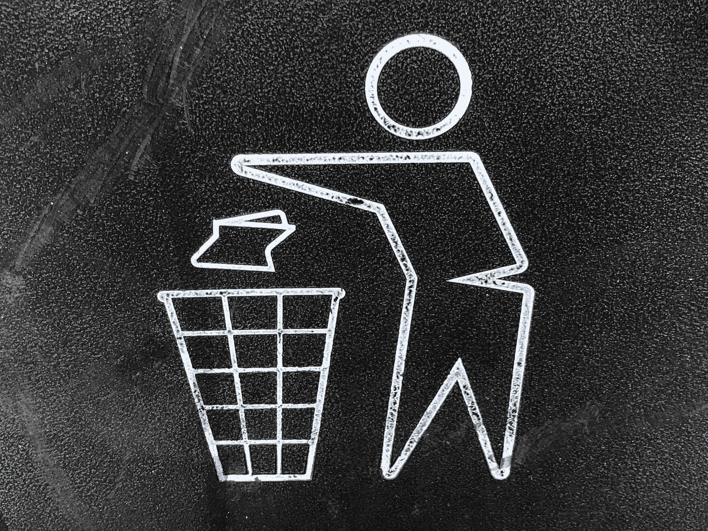
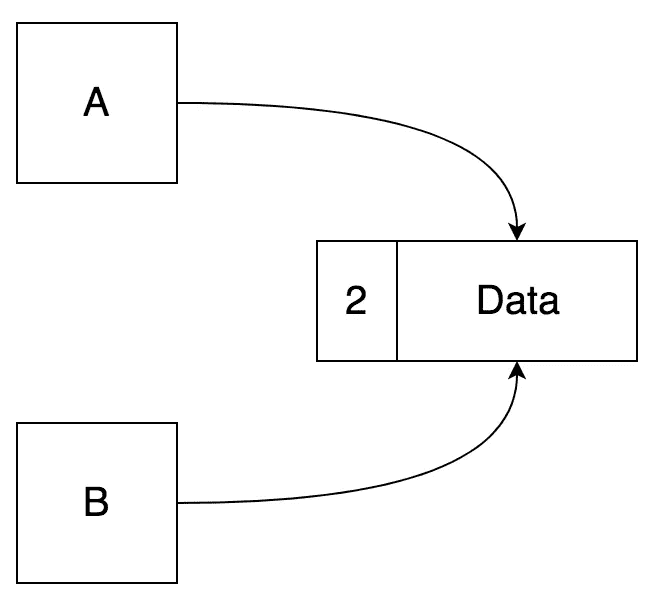

# Python 编程入门—第 7 部分

> 原文：<https://betterprogramming.pub/beginning-python-programming-part-7-2f7df98b7c68>

## 类是如何创建的，它们来自哪里等等


照片由[nguyễn](https://unsplash.com/@hungnp92?utm_source=medium&utm_medium=referral)在 [Unsplash](https://unsplash.com?utm_source=medium&utm_medium=referral) 上拍摄

在上一篇文章中，我们讨论了类、方法和属性。

[](https://medium.com/better-programming/beginning-python-programming-part-6-f128360f44ab) [## Python 编程入门—第 6 部分

### 为您的代码创建可重用的蓝图

medium.com](https://medium.com/better-programming/beginning-python-programming-part-6-f128360f44ab) 

这些是在我们的代码中创建新的、可重用的对象的基本构件，也是保持代码整洁的另一个工具。我们经常在 Python 中使用类，所以你需要很好地理解这个工具才能有效。在这篇文章中，我们将看看类是如何创建的。

# 初始化

从最基本的意义上来说，一个类的初始化就是为它提供一个值。有时我们希望一个类在创建时有默认值，有时我们希望告诉这个类它的默认值是什么。

类有一个默认的初始化器，当你没有包含自己的初始化器时，这个初始化器就会被调用。所有的类都是如此，因为它们都是从对象类型派生的。

之前我说`class MyClass(object)`和`class MyClass()`是一样的。当你创建一个类时，它从一个基类派生或者被子类化*。*当您对一个对象进行子类化时，您的子类继承了它所派生的类的所有功能。

所有这些都很重要的原因是，当你不创建自己的初始化器时，初始化依赖于超类*、*也称为父类、*、*。

为了说明这一点，我们需要简要介绍一下 *builtins.py* 中的基本`object`类。

> 注意:这不是`object`类的所有方法，只是最常见的方法。我已经减肥了，这样你就不会感到不知所措了。

按顺序:

*   `__eq__`提供了执行比较的功能。这个类等于另一个类吗？使用`==`操作器时执行。你也有其他的，像`__ne__`、`__lt__`、`__le__`、`__gt__`和`__ge__,`为其他的比较操作符工作。
*   提供初始化代码，每当你创建一个类的新实例时运行。当实例化对象时，它根据需要设置属性的值并调用类的方法。在大多数语言中，这被认为是一个构造函数方法，但是 Python 确实没有构造函数方法。然而，它有一些接近…
*   `__new__`是 Python 中最接近构造函数的方法。`__new__`负责如何创建新对象。虽然简单的例子不能展示这种功能，但是当您有多个子类化级别，并且需要引导一个特定的对象从特定的对象子类化时，这变得更加常见。`__new__`总是在`__init__`之前被调用，并且不应该包含实例的默认值。
*   `__repr__`提供了对类的明确的“官方”字符串引用，默认情况下是`<__main__.MyClass object at 0x100915278>`。`__main__`是这个类所在的文件，`MyClass`是这个对象派生的类，`object at 0x100915278`是这个对象在内存中的位置，数字是这个对象以十六进制格式开始的块的地址。如果您想在数据库中使用对象的主键，或者甚至使用一个 *guid* ，全局唯一标识符，来惟一地描述这个对象，那么这可以被覆盖。
*   `__sizeof__`很简洁，因为它向我们展示了这个对象的字节大小。默认情况下，它是 32 字节，但根据该对象保存的数据，它可能会变得很大。用`my_object.__sizeof__()`找到一个对象的大小，但是要记住——任何带有`__`的对象都不应该被直接调用，所以用代码顶部的`import sys`来代替，用`sys.getsizeof(my_object)`来代替。这实际上为您调用了`__sizeof__()`，但这是推荐的方法。
*   `__str__`提供对此类的“非正式”字符串引用。如果您不覆盖该实现，它将提供与`__repr__`相同的信息。如果你需要一个友好的类名——当你使用`str(my_object)`时在字符串中使用——这里就是你需要的地方。如果您不覆盖`__str__`，它将提供来自`__repr__`的字符串描述。

如果其中任何一个对您来说还没有意义，请不要担心——我们将很快介绍它。

有了这些知识，我们现在就可以理解类是如何被创建的，以及所有这些默认的功能。


马修·汉密尔顿在 [Unsplash](https://unsplash.com?utm_source=medium&utm_medium=referral) 上的照片

# 子类化和覆盖

当您更改类的默认实现时，会发生重写。

基于上面的人员类别，如果我们做一些稍微不同的事情会怎么样…

这会产生以下输出…

```
daniel jackson
daniel jackson
daniel jackson
--------------
jack
jack
jack o'neill
```

这里我们使用`Person2(Person1)`子类化`Person1`。细节对于`Person1`是一样的，但是在`Person2`中我们不需要调用初始化器。请记住，`Person1`会覆盖`__repr__`方法，而`Person2`只会覆盖`__str__`方法。

当我们打印`daniel`时，我们可以看到，无论我们调用哪个字符串表示，我们总是得到*丹尼尔杰克逊*。这里没什么新鲜的。

但是当我们调用`jack`时，我们得到了不同的结果和关于`print()`如何工作的线索。让我们先看看实现，然后跳回到结果。

我们的`__init__`方法缺失。通过忽略它，Python 自动在下一个父类中寻找一个`__init__`方法。由于`Person1`包含一个`__init__`方法，我们使用它并提供`first_name`和`last_name`参数来创建我们的`Person2`类。如果我们有一个没有初始化器的`Person3(Person2)`类，它会一直回到`Person1`寻找默认的初始化器。

接下来，我们定义了`__str__(self)`，但是它只返回了`self.first_name`，而不是这个人的全名。因为这个小小的变化，我们可以看看我们的结果来比较差异。

`print(jack)`和`print(str(jack)`都在终端显示*插孔*。这意味着如果我们在打印语句中不包含`str`，函数`print`会自动调用我们类的这个函数。

但是这里有一些有趣的事情，当我们使用`print(repr(jack))`时，我们得到的是全名，而不是像以前一样在内存中的地址。这意味着当我们调用`__repr__`上的`print`函数时，我们调用了`Person1`类的实现。

重写只在一个方向起作用，如果你改变了一个子类的实现，它只影响那个子类和那个子类的其他子类。

如果我把`Person1`中的`__repr__`换成`__str__`会怎么样？

`Person1`将不再显示该类的每个实例的友好名称，取而代之的是，您将看到该实例驻留在内存中的地址。然而，打印`str(daniel)`会打印*丹尼尔·杰克森。*

`Person2`会受到什么影响？

在打印`repr(jack)`时`Person2`也会打印内存中的地址，但是，我们现在从`Person1`而不是`object`中覆盖`__str__`，所以我们会看到*杰克*在屏幕上打印出来，而不是*杰克奥尼尔。*



照片由 [Gary Chan](https://unsplash.com/@gary_at_unsplash?utm_source=medium&utm_medium=referral) 在 [Unsplash](https://unsplash.com?utm_source=medium&utm_medium=referral) 上拍摄

# 去初始化

在大多数情况下，取消初始化是自动发生的。稍后会有更多内容。取消初始化是销毁对象的过程，与初始化相反。

从表面上看，这是一个简单的过程。我们所做的就是`del charlie`或`del daniel`，调用从`object`继承的类的`__del__`方法。这将移除指向内存中对象位置的指针。随后，一个名为*垃圾收集*的进程出现，就像迪士尼 *Wall-E 上的清理机器人一样。*垃圾收集总是在后台运行，并在内存中寻找缺少引用的对象，然后将这些块设置为*空闲*状态，这意味着其他程序可以使用该内存块来满足自己的需求。

有时这需要更多的思考，所以当我们深入了解去初始化时，我们需要了解一些其他的东西…

# 引用计数

每当在 Python 中创建一个类时，都会创建一个对对象的引用。当创建这个引用时，系统会创建一个计数器，这个计数器直接引用指向它的对象(包括变量)的数量。



这里我们有两个引用，A 和 B 都指向数据，所以我们更新计数器说有两个引用。如果 A 被去初始化，那么我们只有一个对数据的引用。

如果 A 和 B 都不再引用数据会怎么样？根据记忆法则，数据会无限期地留在那里，或者至少会一直留到电脑关机。

多亏了操作系统，我们不必对这种情况过于恐慌。在 Python 中，我们有一个称为垃圾收集的工具，它可以检测 Python 对象之间的循环，并对我们创建的对象的引用进行计数。如果它遇到内存中引用计数器设置为 0 的块，它会为我们释放这个内存。

示例:

这里我们称之为循环引用。`book`知道它属于一个图书馆，而`city_library`知道它拥有一本`books`的字典

虽然像这样的例子在编程中并不常见，但它们可能会发生，您需要小心如何编码。

假设`my_book`是第一版，第二版刚刚出来。第一版已经不相关了，图书馆想折腾一下。

如果`city_library`试图删除`my_book`，他们也做不到，因为我们手中仍有它，并且有对它的引用。如果我们试图丢弃`my_book`，我们将不能这样做，因为库仍然会为了另一个引用计数而跟踪它。我们陷入了僵局。

因为`my_book`也知道它属于`city_library`，`my_book`持有对库的引用。所以我们有两个关于`my_book`的引用，一个来自我们，一个来自图书馆，还有一个关于`city_library`的引用，这是因为书里面有`city_library`的印记。

如果我们扔掉这本书，图书馆永远不会知道，并认为它还在我们手中。如果图书馆将它从收藏中删除，我们仍然拥有它，其他人可能会认为我们偷了它，因为这本书仍然引用了图书馆。

我们如何澄清这一点？

我们需要一次删除一个引用。首先，我们需要和图书馆谈一谈，制定一个计划。只要这本书还在我们手里，图书馆愿意和我们一起在柜台工作。

图书管理员首先删除这本书属于图书馆的参考文献或有效参考文献`del my_book.library`，留下 2 个参考文献。

接下来，我们需要删除对这本书的引用，我们使用`del my_book`将这本书上交，留下 1 个引用

最后，图书馆使用`del city_library["my_book"]`从他们的图书字典中删除该条目，删除最后的引用。

垃圾收集开始了，图书管理员把书扔进了垃圾桶。

现在，我们也可以在书上使用一种叫做弱引用的东西，用`weakref`来定义，表示这个标记没有任何意义，然而，这个标记仍然可以用来追溯到一个特定的库。

这是它的样子:

现在，当我们调用`del my_book`时，对库的引用被自动删除，对于`Book`的这个实例，`city_library`和`my_book`引用也被删除。所有`city_library`要做的就是从他们的收藏中移除这本书。

使用弱引用有助于确保您不会费力找到像这样令人讨厌的错误，即所谓的*内存泄漏*。当您从未从内存中释放对象，并且您的内存被填满时，就会发生内存泄漏。

如今，计算机配备了大量内存，内存泄漏已经不那么常见了，但仍然会发生。

当我开始混音时，我使用了一个程序来扫描歌曲，找到歌曲的关键字，然后将关键字放在音轨的元数据中。这对于小型收藏来说效果很好，但是我有超过 50，000 首歌曲——大约 40 GB 的音乐，远远超过了我电脑的内存容量。该程序将通过大约 15000 首歌曲，然后它会变得缓慢或崩溃。这是因为它打开了音乐文件并拥有对它们的强引用。

该程序内置了一个故障保险，当内存不足时，会触发一个功能，清除对一些先前扫描的文件的引用——足以在再次触发前处理 100 多首歌曲。不用说，花了大约两天半的时间来扫描所有的歌曲，而这本来可以在大约 8 个小时内完成。

如果你想要更多的例子和对强引用周期更好的解释，请查看 Artyer 发布的这个堆栈溢出。

# 摘要

今天，我们学习了更多关于类是如何创建的，它们来自哪里，我们如何覆盖它们的功能，我们如何摆脱它们，引用周期和内存泄漏。那是一些学问——坚持下去干得好！

## 推荐阅读

Python 教程 9.5 - 9.8(迭代器并不难，只是另一个类方法)

 [## 9.类- Python 3.7.3 文档

### 与其他编程语言相比，Python 的类机制用最少的新语法和…

docs.python.org](https://docs.python.org/3/tutorial/classes.html#inheritance) 

另外，阅读 11.6 章中的弱引用。

 [## 11.标准库简介——第二部分——Python 3 . 7 . 3 文档

### 编辑描述

docs.python.org](https://docs.python.org/3/tutorial/stdlib2.html#weak-references) 

# 下一步是什么

接下来是格式化、lambdas 和列表理解。格式化可能很久以前就出现了，但是我认为它很容易掌握。列表理解稍微难一点，但只是在语法和使用它们的不同方式上。

兰姆达斯将是主要的焦点，因为他们可能是最令人困惑的。

总的来说，我们将学习制作一行程序的新方法。

[](https://medium.com/@broebling/beginning-python-programming-part-8-966f1189c1fe) [## Python 编程入门—第 8 部分

### 在上一篇文章中，我们深入挖掘了类，发现了它们是如何被创建和销毁的。我们还看了我们如何…

medium.com](https://medium.com/@broebling/beginning-python-programming-part-8-966f1189c1fe)