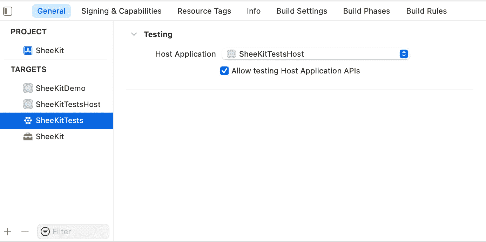
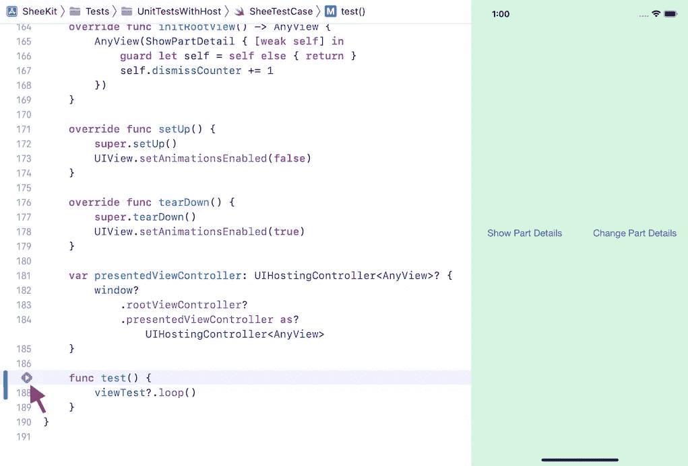

# 如何测试多个 SwiftUI 底层回调

> 原文：<https://betterprogramming.pub/behavioural-testing-of-swiftui-views-with-host-app-and-viewtest-f1343a281c5f>

## 并了解如何使用 SwiftUI 和 _ViewTest 协议以编程方式点击按钮


由[奥斯汀·迪斯特尔](https://unsplash.com/@austindistel?utm_source=medium&utm_medium=referral)在 [Unsplash](https://unsplash.com?utm_source=medium&utm_medium=referral) 上拍摄的照片

之前我写了一个[故事](/easter-egg-swiftuis-viewtest-61b86f1e90d)，关于 SwiftUI 公共接口和隐藏测试套件中`_ViewTest`协议的发现。

在这个故事中，我将介绍隐藏的 SwiftUI 测试套件与`XCTest`的集成。

出于演示的目的，我将使用 SwiftUI 中的测试场景，通过这个 API 使用 [SheeKit](https://medium.com/@eugenedudnyk/customise-and-resize-sheets-in-swiftui-df9fae7c369b) 一个接一个地呈现多个工作表:

SheeKit API

我将测试每一个提交的表单的`onDismiss`回调是否真的在表单的每一次撤销时被调用。

首先，让我们设置测试套件。

1.  创建测试主机应用程序目标和单元测试目标

注意:在 Xcode 12 中，在创建测试主机应用程序目标时，必须选择 SwiftUI 生命周期:


`SheeKitTestsHost`在 Xcode 13 中测试目标

2.选择`SheeKitTestsHost`作为`SheeKitTests`的主机应用:



为 SheeKitTests 选择宿主应用程序

3.从`SheeKitTestsHost`文件夹中删除 Xcode 创建的`ContentView.swift`文件——我们不再需要它。

4.在`SheeKitTestsHostApp.swift`中，我们将运行隐藏的 SwiftUI 测试主机应用程序(`_TestApp`):

5.在`SheeKitTests` target 中，我们需要一些助手来测试视图。我们将用这些内容创建`ViewTestCase.swift`文件:

`ViewTestCase`将是我们所有 SwiftUI 行为测试用例的超类。

它期望子类覆盖`initRootView()`并提供测试用例主题的具体视图。

此外，它在`setUp()`方法中将根视图安装到测试主机应用程序屏幕中，并在`tearDown()`方法中移除该视图。

所有这些都是通过使用 SwiftUI 接口中隐藏的公共方法来完成的。

现在一切都准备好了，可以编写实际的测试用例了。

# 测试案例示例

我们将使用一个`ShowPartDetail`视图作为显示工作表的视图:

我们还将创建空的测试用例实现(但没有实际的测试):

在这个测试案例中，我:

*   在`setUp`方法中禁用动画，然后在`tearDown`中将它们恢复到启用状态，这样在测试过程中，工作表会立即显示。
*   覆盖`initRootView()`并返回实际的`ShowPartDetail`视图，该视图封装在`AnyView`中。此外，我在视图`ShowPartDetail`中安装了一个关于表单解散的回调函数，以便在每次回调时增加`dismissCounter`。
*   调用`super.setUp()`以便`ViewTestCase`可以在测试开始时将视图安装到主机应用程序中
*   调用`super.tearDown()`以便`ViewTestCase`可以在测试中断时从主机应用程序中移除视图

如果我们通过按下其声明附近的▶️按钮来运行`test()`方法，我们将能够在屏幕上看到我们的`ShowPartDetail`视图，甚至与它交互来手动测试是否一切都设置正确。



初始试运行

## 第一个案例

> 对于用`item`显示的两个后续页，确保`onDismiss`被调用两次。

为了测试这个场景，我们必须:

1.  以编程方式点击`Show Part Details`按钮，这将分配一个`InventoryItem.first`给`sheetDetail`并触发第一个要显示的表单。
2.  点击`Change Part Details`按钮，会将`InventoryItem.second`分配给`sheetDetail`并触发第一张纸的退纸和第二张纸的呈现。
3.  再次点击`Change Part Details`按钮，将`nil`分配给`sheetDetail`并触发第二张纸的退纸。

但是我们如何用 SwiftUI 编程点击按钮呢？

SwiftUI 在`_ViewTest`协议中有一个方法:

此外，为了让 SwiftUI 和 UIKit 转换它们的齿轮并做它们的事情，我们需要在第一次点击和第二次点击之间等待一段时间，以便第一个表实际上被显示。为此，我们将在`_ViewTest`中使用隐藏的公共运行循环控制 API:

```
public func turnRunloop(times: Swift.Int = 1)
```

第一个测试用例`Item Changed Thrice / Dismissed Twice`的完整实现是这样的:

## 第二种情况

对于第二种情况，让我们想想第一种情况可能会出什么问题。当第一种情况中的步骤 2 和 3 发生得太快以至于第二张纸没有时间被呈现时，潜在的问题可能发生。在这种情况下，它根本不应该出现，因此`onDismiss`应该只被调用一次。

> 为`item = first`呈现一个表，对于`*item*`到`second`然后到`nil`的接下来两个快速变化，确保`*onDismiss*`仅被调用一次(仅针对第一个表)，并且第二个表不被呈现。

我们可以通过向`Change Part Details`按钮发送两次触摸来模拟这样的场景，而不需要在两次触摸之间循环运行。

下面是`Item Changed Thrice / Dismissed Once`测试用例的完整实现:

现在，当两种情况都准备好了，我们只需要注释初始预览`test()`方法，这样我们的测试套件就不会在所有测试用例运行时陷入死循环。

# 结论

`_ViewTest`允许我们对 SwiftUI 的运行循环进行精确控制，这对于复杂场景的行为测试来说是一个至关重要的特性，这些复杂场景很难或不可能用 UI 测试来模拟。

此外，它允许直接控制哪些视图被安装用于测试，并且可以直接访问主机应用程序来检查 UIKit 视图/视图控制器层次结构的状态。

感谢阅读！我希望你从这个故事中学到了一些关于 SwiftUI 的新东西。