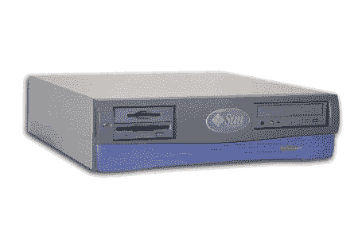
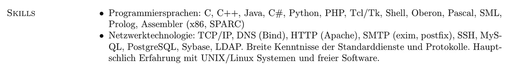
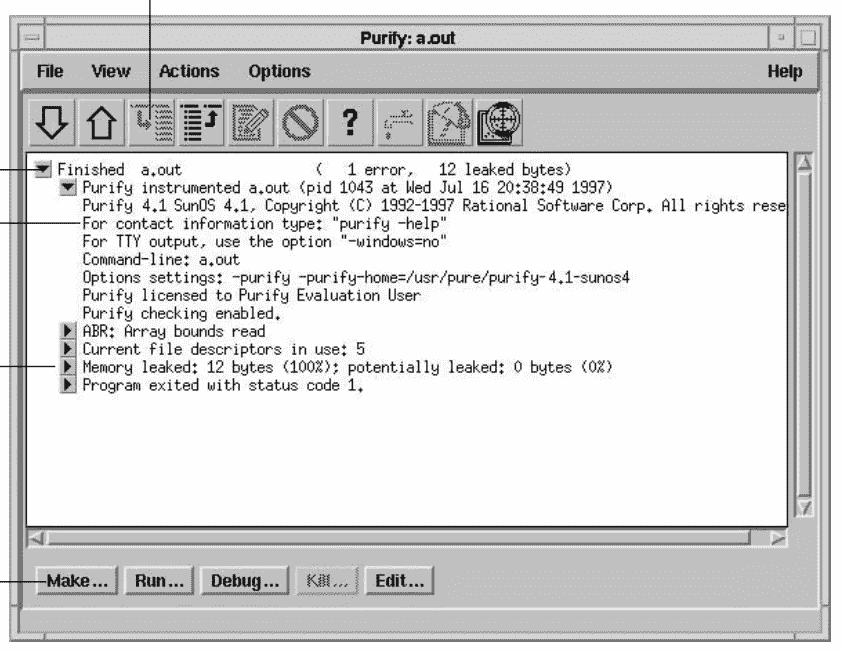
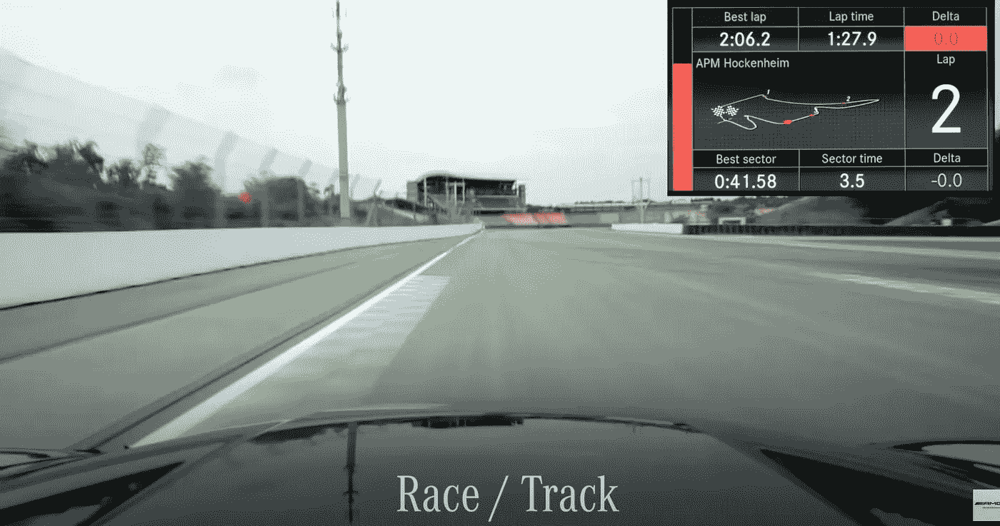
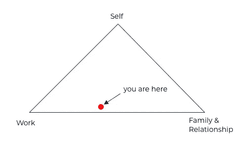
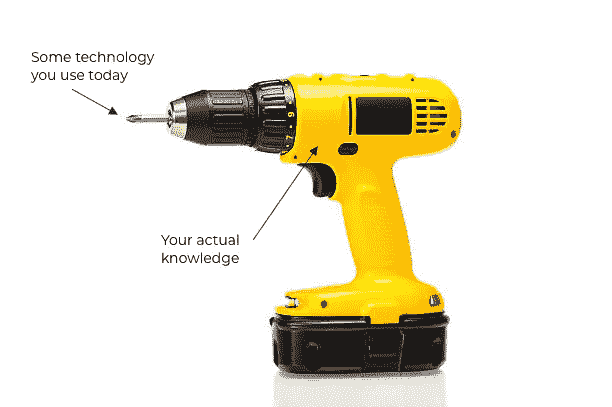

# 40 岁时成为一名独立的软件企业家

> 原文：<https://betterprogramming.pub/being-a-solo-software-entrepreneur-at-40-f2b397e6ba7f>

## 一个关于成长、责任和局限的故事。

男人，大概是迷路了(来自“十字路口”的静止图像，CC)

我是 1981 年出生的，所以去年我 40 岁了。根据维基百科，这是最后一个仍被视为千禧年的出生年份。

千禧一代通常与权利联系在一起——我完全可以理解！我的父母无数次告诉我，为了让我接受良好的教育，他们必须“努力工作”和“做出牺牲”。

所以我最好努力学习和工作，我做到了(谢谢✝爸爸妈妈的建议)！以下是我学到的。

# 在 21 世纪初学习计算机科学

15 年前，我从瑞士联邦理工学院毕业，获得了计算机科学硕士学位。这是一个在 CompSci 的好时光——互联网正在起飞，人们正在建造东西，谷歌的创始人甚至拜访了我们，听了一场关于信息系统的讲座。这个领域基本上不受隐私、安全和可用性问题的困扰——基本上是蛮荒的西部。

有一次，我参加了一个编程竞赛，在那里我编写了一个 JIT 编译器，为一个基于堆栈的虚拟机发出 Sparc 汇编。在一次无聊的圣诞节家庭聚会上，我随身带着一份 SPARC 指令集，在那里我试图找出如何通过使用更智能的指令来让我的代码运行得更快。我喜欢深入研究软件，剥离层次。我是个书呆子。

Sun Blade 100，一个给了我很多启发的有趣的机器(来源:未知，没人关心)

我在规定的时间内完成了学业，因为我没有任何兼职收入，我立即出去找工作。我自豪地把我在学习期间获得的疯狂的知识填入我的简历。我在为我的小公寓支付租金的兼职工作中获得的 Python 2.x 技能实际上比奥伯龙和 SPARC 组装更有价值(这是一个大惊喜！).简历是用乳胶写的。

看着我，SPARC 大会之神！(2006)

即使在当时，在 it 行业找工作也并不困难。网络泡沫破裂时的伤痛仍挥之不去，但它已经逐渐消失在记忆中。2008 年的金融危机还没有发生。

# 行业中的第一份工作——欢迎来到现实世界

我或多或少立刻被聘为“中间件软件工程师”,并学会了诀窍。这是一个有趣的职位，涉及低级别的 web 安全工程(C/C++，Apache，OpenSSL，…)，追踪内存泄漏，通常在高风险的环境中与有才华的人一起工作。

在 Solaris (2007)上调试内存泄漏

在那里，我了解到软件工程不仅仅是编码——该公司是构建和部署自动化(手写，这是在 Jenkins 存在之前，当时被称为 Hudson)的早期采用者，并且拥有强大的工程文化。

总的来说，这是一个很好的起点，可以学习编写生产级软件的方方面面。但是，我内心的千禧一代开始厌倦了。

# 转向手机

2009 年，我的老板(时任 CTO)犯了一个致命的错误。他鼓励我学习 iOS 编程，并将其应用到他正在做售前工作的项目中。这是 iOS 还叫 iPhone OS 的时候。

因此，我从 O'Reilly 那里拿了一本书，启动了一台现在已经过时的 MacBook Pro，并为一家瑞士汽车租赁公司编写了一个小型定位应用程序。它使用 GPS 告诉用户最近的租赁点在哪里，有多远，以及那里有什么样的汽车。这个应用程序没有后端——我有一个脚本，将 Excel 文件转换成 Objective-C 模块，显示所有位置的数组。但它完成了工作，并最终在应用商店中发布。

让我着迷的是，我可以编写正常人会有意识地与之交互，甚至触摸的软件！运行在一个连我母亲最终都会熟悉的设备上——消费智能手机。

不幸的是，对于我的雇主来说，智能手机应用程序在技术生命周期中仍然有点太早，无法认真追求，它被视为一种“时尚”。不愿意更深入地参与其中，再加上对我产生负面影响的组织变革，让我不得不再次寻找工作。

# 下一份工作——身体上的东西也很有趣

幸运的是，2009 年我参加了在苏黎世举行的第一届 iPhone 开发者日大会，会上有人发表了一个关于 Android 的演讲，引起了我的兴趣。这是一家相对较小的公司，但却为谷歌合作编写了核心的 Android 库。这对我来说听起来很酷，所以我寄出了我的申请，几个星期后我有了一份新工作。

接下来的几个月，我进入了一个完全不同的领域，手机 app 开发，嵌入式 Android 开发。有一次，我写了一个在 AMG SLS(一辆功率过大的超级跑车)的车载电脑上运行的应用程序。它允许司机记录赛道(当然，严格地说是为了越野使用)，然后进行比赛。而且是在 Android 上运行的！它有漂亮的图形，像航位推算这样的算法，最棒的是:你必须坐进一辆真正的汽车去测试它。

AMG 绩效媒体跟踪应用程序(2010 年)

这是我参与过的最具挑战性和最有趣的项目之一，我在那里遇到了很多非常酷的人。当然，并不是每个项目都是这样，但这是一个与前一家公司完全不同的文化，是一个完全值得工作的地方。

# 个体经营

又是组织上的变动，也许还有一点点个人的精神错乱导致我两年后再次跳槽。我刚满 30 岁，我决定是时候做出重大改变了。

在一家规模较小的公司工作，员工必须承担更多责任，并直接与客户互动，这让我意识到我拥有一种相对不寻常的技能组合:我精通技术，但我也能与客户交谈，了解他们的需求，并设计解决他们问题的解决方案。

所以我想——为什么不完全由我自己来做，省去中间人呢？把自己从就业的枷锁中解放出来，自己当老板？我内心的千禧年欢欣鼓舞。

对自雇软件工程师工作条件的不切实际的描述

我独自经营了五年，成功地扩大了我的网络、客户群和收入。我不会用另一个成就清单来烦你，但那是一段有趣的时光，充满了学习。这些成就也让我觉得更有意义，因为作为一个独唱歌手，我真的可以把它们归功于自己。

后来，我和一个朋友合作，以便能够吸引更大的项目(我们也这样做了)，甚至雇佣了一些员工。

接下来是一段充满与技术无关的重大事件的时期。我遇到了我未来的妻子，我们结婚了，有了两个孩子，还买了房子。

# 增长的极限

当我接近 40 岁时，我逐渐承担起越来越多的责任——对我的家庭、我的人际关系、我的事业……我开始质疑一些事情，慢慢地但肯定地，我没有时间留给自己了。

我试图同时成为所有人——一个称职的父母、一个慈爱的丈夫和一个成功的企业主。冒着听起来像有资格的千禧一代的风险，我忘记了如何做自己和享受乐趣。

我慢慢意识到，我有一个根深蒂固的期望，即**成长和个人发展是一系列永无止境的向上运动**，总有下一步要走，而且必须在某些方面比以前“更多”。

现实是，最终，有些东西必须放弃。

无处不在，真不容易。

# 棘手的问题

在疫情期间，我经历了一段反思期，我只是半开玩笑地称之为我的中年危机。我开始问自己一些棘手的问题，比如:

*   你能真诚地说你对你正在做的事情感到快乐吗？
*   你做你正在做的事情主要是因为人们期望你做吗？
*   你有时感到疲惫吗？睡眠有问题吗？

我得出的结论是，我的工作环境是我生活中压力的主要来源。我的公司带来的所有责任开始压在我身上，我想摆脱它们。

# 分频

我做了一个艰难的选择——这是我做过的最艰难的选择之一:毁掉自己的公司。我花了一段时间才达到这一点，但一旦我到了那里，我就下定了决心，道路也很清晰。不幸的是，我的商业伙伴不想在没有我的情况下继续经营公司，所以是时候关闭公司了。

创业指南有一百万种，但没人告诉你如何结束一种。接下来的一年是艰难的一年，充满了不安全感、失败感和尴尬的对话。更不用说缩减业务规模所涉及的管理上的麻烦了。

# 严酷的事实

一年多后的今天，这一转变已接近完成。我觉得这么多年来我第一次有时间去思考我的下一步。但是一些严酷的事实依然存在:

40 岁时，我不再像自己希望的那样敏捷。我仍然有很多责任:要养活孩子，要偿还抵押贷款，等等。
我确实认为这段经历让我在识别机会和抛弃死角方面变得更好。

我的头脑不再是一块海绵了。我仍然热爱学习，但现在不像以前那么容易了。以编程语言为例。在写了近二十年的代码之后，我已经开始接受这个事实，我并不是任何一个领域的专家。我获得的知识在退化，而且退化的速度比以前更快。相反，我现在喜欢把编程语言想象成钻头。有些是你比其他人更经常使用的，有些是你很少使用的非常专业的，也许你甚至有一些在实际工作中从来没有使用过的。但是如果你知道如何操作电钻，钻头就没那么重要了。这个概念超越了编程语言。

图片来源:作者

今天比过去更难建造一些东西。这和我本人无关，更多的是和科技领域的大环境有关。拥有近乎无限资源的大公司吸收人才，他们疯狂的薪酬让他们很难与之竞争。如果你没有坐拥大量数据和现金，人工智能或人工智能等“前沿技术”就很难进入。终端用户已经习惯了一切免费或便宜的东西，这是由十年来基于广告的商业模式支撑的。

**年龄歧视是个事儿**。*什么？！为什么还在编*？这个问题是真实的，它就在那里。很多时候，人们甚至没有恶意。它有点旧了。；-)

所以，就认输吧，还是怎样？

# 我为什么乐观

在经历了所有的厄运和沮丧之后，我有时需要提醒自己，40 岁之后并没有失去一切。

**我喜欢学习新事物** —有人曾经告诉我，在计算机科学领域，你永远不会停止学习。这是真的，我喜欢它。也看了很多与此无关的书。

我知道我擅长什么——我不需要向任何人证明什么。我知道如何推销自己和我能提供的价值。而且，我知道我不擅长什么。

我很有效率——随着年龄的增长，经验也越来越多。对我来说，经验是一门艺术，它让我走最少的弯路。

**我仍然充满激情**——当我做某事时，我想把它做好。我对工作的态度没有改变。我只是想更聪明地工作。

除了将我的想法集中到这篇文章中，我还在忙着建立一家名为 [Pixelverse](https://pixelverse.ch) 的新公司，探索 IT 和艺术空间的交集，并编写一款名为 [STRICH](https://strich.io) 的计算机视觉产品，我打算很快推出。

如果你喜欢这篇文章，或者有类似的故事要分享，请告诉我。