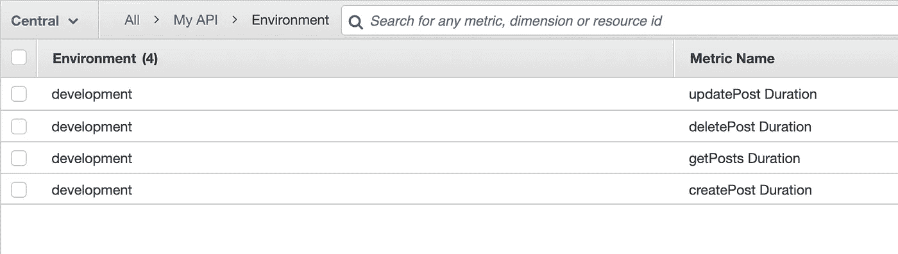
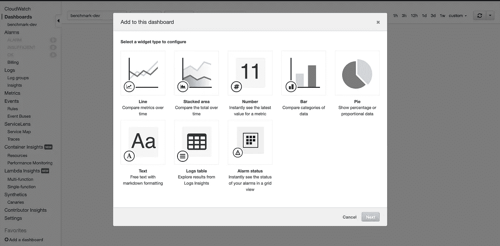
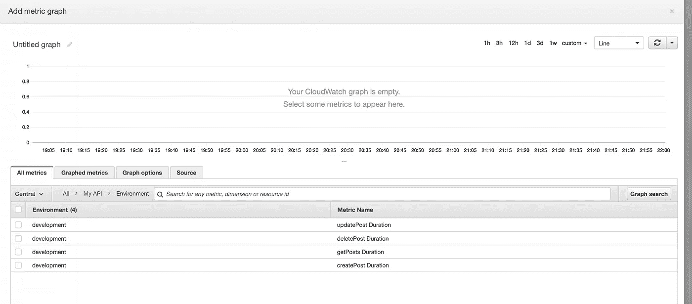
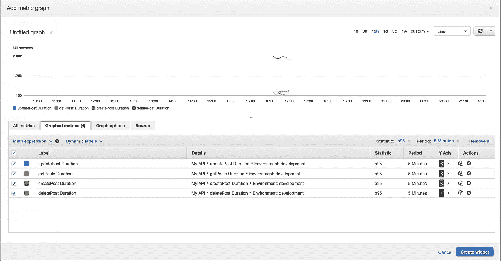
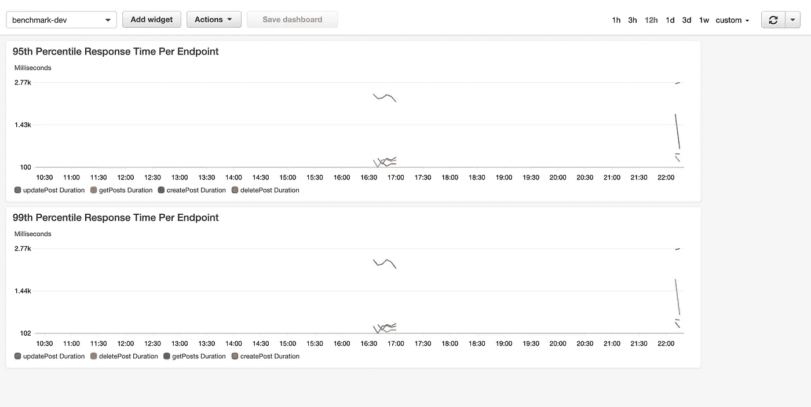

# 用 TypeScript Decorators 对 API 端点进行基准测试

> 原文：<https://betterprogramming.pub/benchmarking-api-endpoints-with-typescript-decorators-27cd462be488>

## 在 AWS CloudWatch 中可视化指标


由 [Carlos Muza](https://unsplash.com/@kmuza?utm_source=medium&utm_medium=referral) 在 [Unsplash](https://unsplash.com?utm_source=medium&utm_medium=referral) 上拍摄的照片

最近在工作中，我的任务是找到一种方法来深入了解我们的 TypeScript API 性能。所以很自然地，我想到了在 CloudWatch 中创建一个仪表盘来监控 CPU 和内存的利用率。

但是为什么不更进一步，同时监控每个端点的响应时间呢？然后，我们可以使用 CloudWatch 来聚合一些有用的见解，比如百分点数据，这将让我们更好地了解服务的执行情况。

这就是我所做的，现在我们有了一个有用的仪表板，它可以监控我们的 API，并为我们提供关于每个端点如何执行的数据，以便我们可以战略性地优化服务。

在这篇文章中，我想分享我是如何处理这个问题的。我将向您展示如何使用 TypeScript decorators 生成和发布 CloudWatch 指标，并且我将逐步介绍使用这些指标在 AWS 控制台中创建 CloudWatch 仪表板的步骤。

# 设置

我用 TypeScript 创建了一个基本的 Express API 来模拟我不得不使用`[express-generator-typescript](https://www.npmjs.com/package/express-generator-typescript)`处理的东西。完整的源代码在我的 [GitHub 库](https://github.com/mchigit/benchmark-api)上。

如果您以前尝试过创建 Express 服务器，您的文件夹结构可能如下所示:

```
.
├── routes                  # Application Routes
│   ├── index.ts         
├── controllers             # Controllers
    ├── postsController.ts
├── models                  # Model for interacting with DB   
│   ├── posts.ts         
├── util                    # Helper Functions
│   ├── postHelper.ts         
├── package.json           
├── README.md         
└── app.js                  # App starting point
```

一种常见的模式是将端点应该做什么的逻辑分离到一个不同于定义路由的控制器文件中。我们希望对控制器功能的持续时间进行基准测试，包括参数检查和通常与数据库的交互。通过这一指标，我们可以检测端点是否表现不佳。

所以我创建了一个像这样的基本控制器类:

通常，这些异步函数要复杂得多。这是您调用其他 API 来增强数据或与数据库交互的地方。为了简单起见，我只让我的控制器方法调用 [JSONPlaceholder](https://jsonplaceholder.typicode.com/) 。对于`createPost`，我模拟了一个睡眠两秒的参数检查。

下面是使用控制器的简单路由器代码。它只调用控制器函数:

这种东西没什么令人兴奋的，你可能已经看过几百遍了。现在让我们开始一些更有趣的事情。

# **发布 CloudWatch 指标**

设置好 API 后，我希望它将指标发送到 CloudWatch，这样我们以后就可以使用它了。但是首先，如果您以前从未使用过 CloudWatch，我将快速介绍一些基本概念。如果你想更深入地了解它，我找到了马修·肯尼·托马斯的这篇文章，它更详细地解释了每个概念。

[CloudWatch](https://aws.amazon.com/cloudwatch/) 是 AWS 提供的监控服务。CloudWatch 中的[名称空间](https://docs.aws.amazon.com/AmazonCloudWatch/latest/monitoring/cloudwatch_concepts.html#Namespace)充当我们发布的[指标](https://docs.aws.amazon.com/AmazonCloudWatch/latest/monitoring/cloudwatch_concepts.html#Metric)的容器。通常，每个应用程序在组织内发布具有唯一名称空间的指标。

您可以将这些指标视为代表一个变量随时间变化的值的数据集。例如，这个变量可以是 EC2 实例的 CPU 使用率，数据点代表一段时间内 CPU 使用率的百分比。

您还可以定义自己的定制指标并将它们发布到 CloudWatch，然后您可以通过创建一个仪表板来检索关于它们的统计信息。

这就是我们在这里要做的。我为它创建了一个实用程序类:

CloudWatch 中的指标有[维度](https://docs.aws.amazon.com/AmazonCloudWatch/latest/monitoring/cloudwatch_concepts.html#Dimension)，它们是名称/值对，是指标标识的一部分。我们最多可以将十个维度与一个指标相关联。在第 34 行，我添加了一个维度来表示 API 的环境，以区分测试度量和生产。

此外，指标具有指标名称、值和数据点单位等属性。该类型由第 3 行的`MetricData`类型定义。

`_metricsQueue`用于批量处理指标，以减少 AWS 请求调用。使用`putMetricData`的每个 API 调用都要花钱，如果我们一次发送多个指标，就可以避免这笔开销。幸运的是，这个方法允许我们这样做。`putMetricData`的参数如下:

```
**MetricData.member.N** The data for the metric. The array can include no more than 20 
     metrics per call.
```

这意味着我们传递给`putMetricData` 的`MetricData`参数可以是一个度量数组，每一项都有类型`MetricData`。因此，我们的类维护一个最多存储 10 个指标的队列。当队列满的时候，我们在第 57 行用名称空间`My API`一次发布所有的消息。我们返回 sdk 调用的[承诺，并让控制器处理结果。](https://docs.aws.amazon.com/sdk-for-javascript/v2/developer-guide/using-promises.html)

这是一个非常简单的批处理实现，但是如果您希望节省一些 AWS 成本，有一个更强大的库来处理这个问题。Mixmax 发布了一篇博文，展示了他们如何通过批量化指标节省了可观的运营成本:“[批量化 CloudWatch 指标](https://engineering.mixmax.com/blog/batching-cloudwatch-metrics)”

现在我们有了一个向 CloudWatch 发布指标的实用程序，让我们看看如何在 TypeScript 装饰器中使用它。

# 定时装饰器

你可以把 decorators 想象成一个附属于某个东西的函数——通常是一个类、方法或属性——它将包装被装饰的对象并拥有关于它的信息。如果你想了解更多，这里有一个非常好的详细解释和修饰器的用例。

对于我们的用例，我们将编写一个[装饰工厂](https://www.typescriptlang.org/docs/handbook/decorators.html#decorator-factories)来包装每个控制器功能，计时持续时间，并向 CloudWatch 发布指标。下面是装饰函数:

`timing()`是一个装饰器工厂，它返回一个装饰器，因此我们可以根据它的参数定制行为。如您所见，装饰器接受三个参数:`_target`、`propertyKey`和`descriptor`。原始方法(修饰的控制器方法)存储在`descriptor.value`中。

然后`descriptor.value`被另一个函数代替。运行时将调用这个函数而不是修饰方法。它启动一个计时器，并在第 20 行调用原始方法。该函数然后使用我们之前创建的`cloudwatch`实用程序来发布原始方法的持续时间。

在`cw.publish(`${propertyKey} Duration`, duration, 'Milliseconds')`中，如果你记得我们在`cloudwatch.ts`中定义的参数，度量名是`${propertyKey} Duration`。`propertyKey`变量是被修饰方法的名称。因此，将以这些名称发布四个指标:

*   `getPostsDuration`
*   `createPost Duration`
*   `updatePost Duration`
*   `deletePost Duration`

每个指标的值是相应控制器方法的持续时间，单位是毫秒。

我们不需要等待发布度量操作，所以我只是附加了一个`.catch`来捕捉任何错误。

最后，在第 37 行，**decorator 返回原始方法的结果，因此它可以被后续代码使用。**

**现在，随着服务器的运行，如果有人向端点发出请求，CloudWatch 中应该会发布和提供新的指标。我测试了它，现在度量标准在 CloudWatch 中:**

****

**云观察指标**

**如您所见，这些指标位于名称空间`My API`下，维度为`Environment: development`。每个端点对应四个指标。**

# **创建 CloudWatch 仪表板**

**现在指标已经准备好了，下一步是创建一个仪表板来可视化它们并使这些数据有用。**

**在 AWS 控制台中，在服务中搜索“CloudWatch”，然后单击仪表板。在这里，您可以单击“创建仪表板”按钮开始创建一个。填写名称，现在您可以添加小部件了:**

****

**AWS 创建 CloudWatch 仪表板**

**我们将通过单击第一个图块来创建一个线图小部件，并选择 Metrics 作为数据源，因为我们希望使用 API 发布的定制指标。单击 configure，我们可以看到`My API`名称空间中的指标。**

**如果您点击它，您会看到我们刚刚从服务器发布的所有四个指标:**

****

**选择要绘制图表的度量**

**您可以通过选中复选框来添加它们。转到 Graphed Metrics 选项卡，定制小部件，使其真正有用。**

**我们的指标表示每个控制器功能执行的时间。通过绘制默认配置，我们可以获得每个 API 端点的平均响应时间。但是这种统计可能是不准确的，因为控制器功能中可能到处都有尖峰，这会扭曲数据。**

**一个更有用的指标是百分位数，我们可以在统计数据列中定义它:**

****

**通过将此设置为`p95`，我们告诉小部件输出一个图表，其中的数据点位于第 95 个百分点，或者高于其他数据点的 95%。这意味着如果*"*createPost Duration*"*指标输出 2.4k 毫秒的数据，那么至少有 5%对我们的 create post 端点的调用花费了超过 2.4 秒的时间来完成。**

**通过查看此图，很明显我们可能需要改进我们的 create post 端点，因为与其他端点相比，它具有如此高的延迟。**

**创建这个小部件后，我们可以保存仪表板，它将继续显示关于我们的 API 执行情况的有用指标。您还可以使用其他统计类型，如平均值、第 99 百分位等。**

****

**完成仪表板**

# **结论**

**监控非常重要，尤其是在我们现在已经习惯了高流量的情况下。了解现有的技术并有效地使用它们确实有助于节省成本，或者至少让您更好地了解如何优化服务的性能。**

**现在您知道如何将定制指标发布到 CloudWatch，并在仪表板中可视化它们。虽然这个例子很简单，但希望它能给你一些启发，让你知道如何将这些概念应用到工作或你自己的项目中。**

# **资源**

*   **[express-generator-typescript](https://www.npmjs.com/package/express-generator-typescript)**
*   **[CloudWatch 概念文档](https://docs.aws.amazon.com/AmazonCloudWatch/latest/monitoring/cloudwatch_concepts.html)**
*   **[cloudwatch-metrics](https://github.com/mixmaxhq/cloudwatch-metrics#readme)**