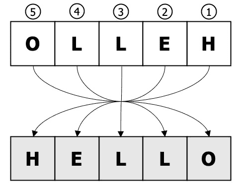
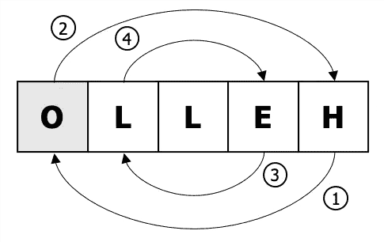
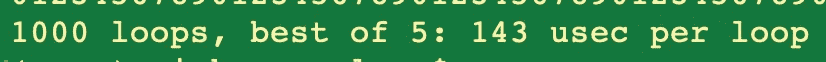
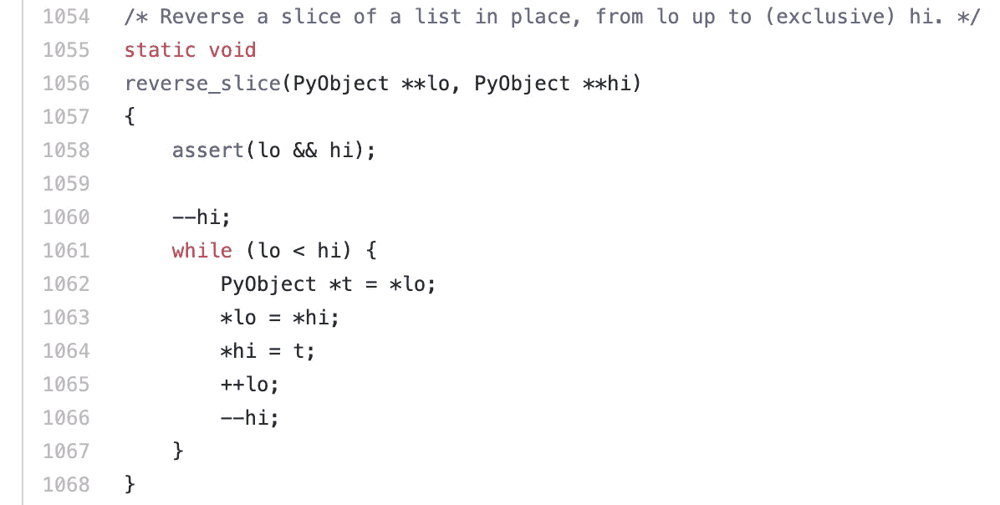
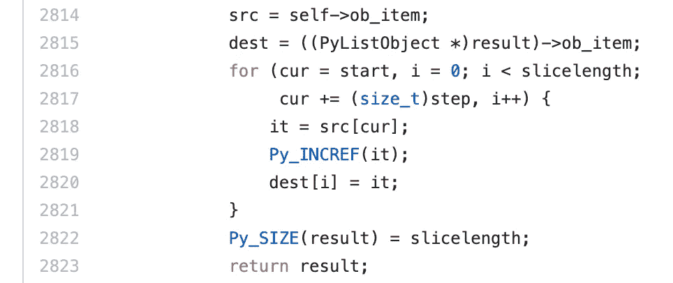

# 在 Python 中反转字符串的最佳方法

> 原文：<https://betterprogramming.pub/benchmarking-the-best-way-to-reverse-a-string-in-python-9c73d87b1b1a>

## 六种不同的实现，有一些有趣的结果

照片由[蒂姆·布特](https://unsplash.com/@toboote?utm_source=medium&utm_medium=referral)在 [Unsplash](https://unsplash.com?utm_source=medium&utm_medium=referral) 拍摄

Python 没有任何内建的方法来反转字符串，所以了解这一点很方便，也是一个有趣的练习。

# 设计

首先，我们只需要考虑在理论上有效实现算法的步骤。一个好的起点是想象我们如何通过一些小的输入来手动地、有条不紊地做到这一点。

向后读取字符串，并将每个字符写入一个新的字符串，直到我们完成。这在 O( *n* 中运行，其中 n 是字符串的长度，因为它需要 *n* 步，并且与 *n* 的大小成线性比例。

**B)** 交换开始字符和结束字符。然后是 s+1 和 e-1 等等，直到你的计数器在中间相遇，所有的字符都被交换。这也是 O( *n* )因为你需要做同样数量的移动，尽管方式不同。有一些额外的开销，因为交换需要一个临时存储，并且你需要检查计数器是否在每个周期的中间相遇，但是顺序是一样的。此外，由于交换是内联完成的，因此该算法占用的空间更少。

# 履行

## **向后移动**

计算输入字符串的长度。使用它向后循环并将每个字符追加到一个新字符串中。附加操作的复杂性取决于解释器中的底层实现。因为 Python 字符串是不可变的，很可能每个`reversed_output = reversed_output + s[i]`都获取输出字符串和新字符的当前状态，并将它们复制到一个新变量中。这不是线性的，因为它遵循模式 1 + 2 + 3 … + *n* 。t( *n* ( *n* +1)/2)，所以它的顺序是 O( *n* )。因此，预计该算法的运行速度会比其他算法慢。

## **向前移动并附加到前面**

使用这个函数，我们可以正常地遍历字符串，因为它是可迭代的。在每次迭代中，我们都会将新字符添加到输出字符串的前面。出于同样的原因，预计这将具有与第一算法相似的运行时间。

## **换入列表并加入**

这是内联交换算法的一个实现。我们需要用字符串创建一个列表对象，这样我们就可以在列表可变时进行内联交换。与前两种算法不同，连接操作有效地解决了附加问题。

## **列表、反转、加入**

这是一个内置的内联列表反转函数，所以它应该与我们新的交换函数相似，并且在运行时间上可能会更好一点。

## **反转并加入**

通过将一个字符串传递给 *reversed* ，返回一个迭代器，该迭代器被设置为反向遍历列表，其中起始点在末尾，下一个*指向列表中的前一个。这可以直接传递给连接操作。这预计会有不错的表现。*

## **切片**

据我所知， *slice* 会获取一个列表的子列表，并将其复制到一个新的空间，预计会有类似的良好性能。

# 标杆管理

对于每个函数，我都进行了如下测试:

但是我将输入字符串的长度设置为 10，000 个字符。

测试返回最佳五次运行的平均值；这给了算法最好的机会在你的机器上尽可能好地执行。这种类型的测试有助于指出显著的性能差异。跟踪的时间以微秒为单位(1/1，000，000 秒)。

## 结果

## **想法**

正如所料，第一个函数表现最差。有趣的是，向前遍历的结果差了多少，因为它们是如此的相似。也许出于某种原因，`reversed_output = reversed_output + s[i]`最终比`reversed_output = c + reversed_output`快。

有趣的是，我的内联交换函数比内置的反转函数慢六倍，因为它们应该做同样的事情。两者都应该面临设计部分描述的相同的额外开销。检查底层实现时，功能非常相似(只是在 *while* 表单中)。我想两个关键的区别是，循环似乎是传递指针，而不是进行实际的复制，而我的实现可能正在这样做。其次，整个操作都是用 C 语言，也就是说天生会更快。

[https://github . com/python/cpython/blob/master/Objects/listobject . c](https://github.com/python/cpython/blob/master/Objects/listobject.c)

最后，很明显切片是最快的，但是为什么呢？同样，可能整个操作都是在 C 中进行的，没有额外的连接步骤。底层实现似乎没有做任何特别的事情——只是循环复制到另一个列表中。

制造更多的测试来隔离原因可能是有趣的。检查不同的 python 编译器/解释器会很有用。

# **关键要点**

*   在 python 中，切片是反转字符串最有效的方式。
*   *反转*以在线交换，*反转*以复印效果良好且更清晰。
*   应该避免在较慢的算法中实现的字符串连接。
*   基准测试有助于发现我们无法具体发现的事情。
*   代码运行速度很快——最慢的实现仍然只有大约 1 毫秒。

# 本练习的代码

 [## njgibbon/nicks-python-kata

### python 中的算法。*以各种合理的方式实现各种算法-包括任何被认为是…

github.com](https://github.com/njgibbon/nicks-python-kata/tree/master/nicks_py_algs) 

## **其他资源**

https://www.python.org/dev/peps/pep-0322/

【https://waymoot.org/home/python_string/ 

[https://www.journaldev.com/23647/python-reverse-string](https://www.journaldev.com/23647/python-reverse-string)

[https://www.quora.com/How-is-slicing-implemented-in-python](https://www.quora.com/How-is-slicing-implemented-in-python)