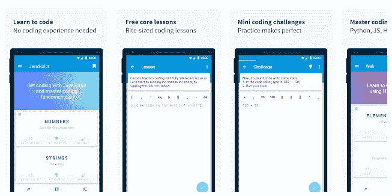
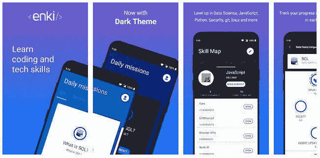
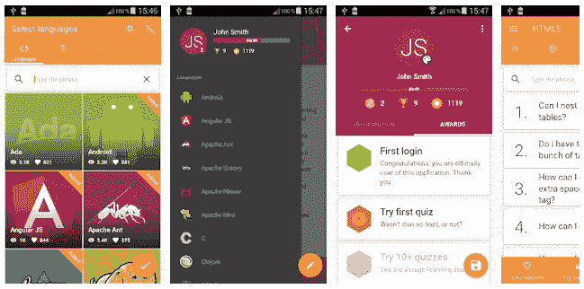
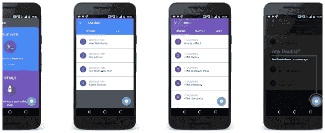
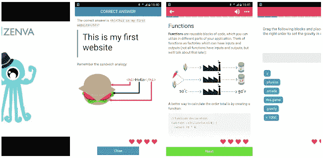

# 学习如何编码的最佳 Android 应用

> 原文：<https://betterprogramming.pub/best-android-apps-to-learn-how-to-code-73ceff6acb52>

## 在旅途中学习

作为一名高级软件开发人员，我经常被问及学习编程的建议。因为我相信技术市场总是受益于拥有更多高质量的开发人员，所以我很乐意分享帮助我成为更好的软件工程师的技巧和诀窍。

然而，只要我说:“读读这本书和那本书，看看这本参考指南。参加这些课程是必须的，别忘了一直浏览社区论坛，”我看到人们的热情逐渐消失，直到他们对我说“我没有时间做这些。”然后他们离开了。

我想郑重声明的是，学习编程不是为了腾出时间。这是一致性的问题。由于市场不断变化和发展，一个每天花 30 分钟进行教育的开发人员比一个从大学毕业后就没有学习过新程序的计算机科学毕业生更灵活，更有机会适应新的趋势。

幸运的是，有大量的资源——Reddit 线程、播客和博客——可以用来在旅途中提升你的编码技能。最近，使用 Android 应用程序已经成为我最喜欢的保持自我教育和解决实践问题的方式。

在这篇文章中，我决定分享我最喜欢的学习软件开发的 Android 应用程序。在这里，你可以找到一些简短的课程，帮助你提高通勤效率或排队等候时间的效率。

# 1. [SoloLearn](https://play.google.com/store/apps/details?id=com.sololearn)

SoloLearn 是最大的学习编码的 Android 应用之一。有 900 多个主题的课程——全部免费。根据你的技术熟练程度，该应用程序提供三种学习模式:初级、中级和高级——尽管在我看来，后者缺乏深度和新鲜的洞察力。

SoloLearn 提供大多数广泛使用的编程语言的课程:HTML、Java、CSS、Python、Kotlin、C++、C、C#、Swift、Ruby、SQL 等等。

## **优点**

*   离线学习模式。
*   所有课程免费。
*   参与式学习模式。
*   内置集成开发环境。

## **缺点**

*   它没有涵盖非主流语言——没有关于 Rust、Erlang、Elixir 或 Scheme 的课程。
*   它缺乏面向高级开发人员的相关内容。
*   免费版是拿不到课程证书的。

## **定价**

有一个免费版的 SoloLearn。您可以将平台升级到专业版，以获得更多课程和额外津贴。

以下是订阅费用:

*   4.99 美元/米—包月。
*   3.99 美元/米—年费。

# 2. [Codegym](https://play.google.com/store/apps/details?id=com.hitechrush.codegym)

Codegym 是学习 Java 开发的首选 Android 应用程序，我应该说这是实现这一目的的最佳选择。该平台提供适合普通通勤时间的短期课程。因此，开发人员不必投入大量时间来提高他们的技能。

Codegym 充分利用了游戏化。每个任务有 10 个关卡，通过这个应用学习编码感觉就像玩一个 RPG 游戏，我必须不断地“升级”我的角色。

不幸的是，CodeGym 不提供除 Java 以外的其他语言的课程。

## **优点**

*   超过 600 个讲座和 1200 个学习任务。
*   内置 IDE，适合通过智能手机编写代码。
*   500 多个小时的主动学习。
*   即时任务验证。
*   友好的 Java 社区。

## **缺点**

*   仅提供 Java 课程。
*   不迎合高级开发者。

## **定价**

这款应用是免费的。

# 3.[编程中枢](https://play.google.com/store/apps/details?id=com.freeit.java&hl=en_IN)

Programming Hub 是 Android 最大的学习平台之一。它提供超过 17 种编程语言的课程。有一种离线模式可以帮助开发人员在任何地方练习——不幸的是，它只适用于 HTML、CSS 和 Java 课程。

所有的学习内容都是结构良好的。学完一门课程后，你会对任何编程语言的工作原理有一个清晰的概念。该平台的界面直观且易于使用。

## **优点**

*   固体 UX。
*   经济实惠的专业订阅。
*   内置编译器。
*   完成一门课程后，你会得到一个虚拟证书。

## **缺点**

*   有些课程是不完整的(比如 Python 的课程)。
*   拼写错误。
*   问题的答案经常放错地方。

## **定价**

要访问中级课程和额外的学习材料，请考虑在 Programming Hub 上升级。

*   6.99 美元——包月；
*   14.59 美元—三个月订阅；
*   41.99 美元——年费。

# 4.[编码](https://play.google.com/store/apps/details?id=com.upskew.encode&hl=en)

这个 Android 应用程序为初学者开发者提供了一个掌握三种语言的学习环境——Python、Java 和 HTML。虽然课程选择范围很窄，但你将能够仅使用该应用程序从初学者变成高级开发人员。在学习项目结束时，程序员通常会处理复杂的任务，并可以从头开始编写项目。

## **优点**

*   完全可定制的界面。
*   集成了语音助手。

## **缺点**

*   课程选择有限。
*   用户群体狭窄。

## **定价**

要访问额外的内容，学习者可以以每月 4.99 美元的价格订阅专业版。

# 5.[伊奇](https://play.google.com/store/apps/details?id=com.enki.insights&hl=en)

Enki 不是为没有任何技术背景的人提供的平台。如果你是一个中级或更有经验的软件工程师，这个应用程序可能适合你。

为了确定你的技术熟练程度，该应用程序会要求你参加一个简短的问卷调查。这样，你可以确保你没有学到你力所不及的概念。

Enki 提供软件开发、网络编程、SQL 和区块链等课程。

## **优点**

*   关于开发、营销和金融科技的广泛课程。
*   直观的界面。

## **缺点**

*   没有网络应用。
*   用户群体狭窄。

## **定价**

Enki Pro 版费用 48.99 美元/年。

# 6.[编程英雄](https://play.google.com/store/apps/details?id=com.learnprogramming.codecamp&hl=en_US)

由于开发团队包含了所有游戏化元素，这个应用程序很有意思。编程英雄适合初学者和高级开发人员。除了带你通过最常见的编程语言的核心原则，该应用程序还向学生介绍了面向对象的一般概念，数据结构和算法。

## **优点**

*   易于使用的界面；
*   以引人入胜的方式呈现学习内容。

## **缺点**

*   错过了许多流行的编程语言。
*   没有内置的集成开发环境。

## **定价**

这款应用程序有内置货币，用户必须花钱才能获得课程。每门课程的价格从 1.99 美元到 13.99 美元不等。

# 7.[学习编程](https://play.google.com/store/apps/details?id=tursky.jan.nauc.sa.html5&hl=en_US)

这个平台是一个数据库，而不是结构化的课程。话虽如此，我发现它是一个可靠的数据来源，并在掌握一个新的软件开发概念时用它来消除困惑。

该应用程序针对网络使用进行了优化，具有非常直观的 Android 界面。开发人员可以使用 Learn Programming 在内置的编码沙箱中测试他们的技能。

## **优点**

*   离线学习模式。
*   30 多种编程语言的学习材料。
*   基于关键字的搜索

## **缺点**

*   缺乏互动性。
*   无法通过应用程序与其他开发人员联系。

## **定价**

学习编程是免费。

# 8.[代码中枢](https://play.google.com/store/apps/details?id=trycodehub.com&hl=en_US)

Code Hub 是另一个特定语言的 Android 学习应用程序。这一篇主要关注 HTML 和 CSS。该工具涵盖了这些语言在开发、设计和网站管理中的应用。所有讲座都有视频、截图和分步解释。

CodeHub 是一个双语平台，有英语和印地语两种版本。

## **优点**

*   HTML 和 CSS 的深度课程。
*   直观的界面。
*   轻量级。

## **缺点**

*   不包括 HTML 和 CSS 以外的语言。
*   没有集成开发环境。
*   缺乏互动性。

# 9. [Codemurai](https://play.google.com/store/apps/details?id=com.zenva.codemurai&hl=en_US)

该应用程序有广泛的课程选择——你可以找到 HTML、CSS、Java、JavaScript、C#和许多其他语言的学习材料。有很多关于移动编程的讲座，还有一个关于 Unity 3D 的课程。

Codemurai 允许开发人员通过测验和测试不断测试他们的技能，以确保他们理解所学的概念。

## **优点**

*   很多学习内容。
*   游戏化使学习过程更有吸引力。
*   简单的界面。

## **缺点**

*   仅涵盖编程的基础知识。
*   没有 IDE。
*   很少有课程是免费的。

## **定价**

你可以花 360 美元学习所有 12 门软件开发课程。

# 结论

只要你有动力，学习编程不会花太多时间。如果你有一个允许你在公交车或地铁上练习的 Android 应用程序，你可以在任何地方快速提高技能。学习平台的选择是巨大的。测试完这些工具后，你应该不难找到合适的工具来促进你的职业成长和发展。