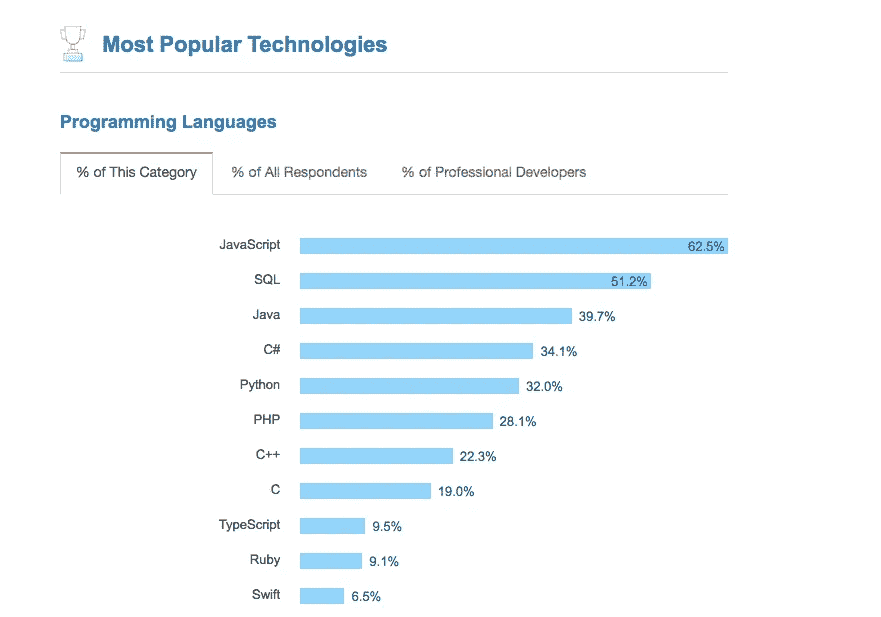
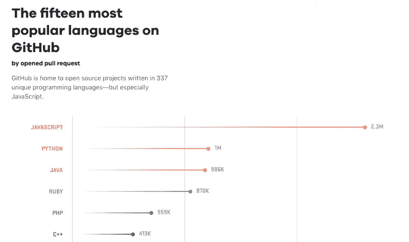

# 加速项目开发的最佳 Node.js 样板文件

> 原文：<https://betterprogramming.pub/best-node-js-boilerplate-to-speed-up-your-project-development-a9eca7b07f90>

## 哪个选项适合您的项目？

加快你的发展([https://wallpaperstudio10.com](https://wallpaperstudio10.com/static/wpdb/wallpapers/1920x1080/173316.jpg))

JavaScript 近年来发展迅速。JavaScript 的快速传播也源于其强大的社区。根据 StackOverflow 调查，JavaScript 是 2017 年最受欢迎的技术。

同样，GitHub 发现 JavaScript 是最常用的编程语言。从 2017 年底发布的一份报告中可以看出，JavaScript 在 GitHub 上有着巨大的足迹，其拉请求的数量是第二领先语言的两倍多。

如今的 JavaScript 不仅在前端使用，在后端和移动端也是如此。Node.js 是一个开源的运行时环境，允许使用 JavaScript 创建服务器端代码。许多基于 Node.js 的框架使得这项技术适用于几乎任何类型的项目，并提供了构建高度可伸缩的 web 应用程序所需的功能。但是，大多数 Node.js 框架都没有固定的目录结构，从一开始就获得它可能是一个挑战。或者，您可以使用*样板文件*来启动您的项目。

# 什么是样板文件？

样板文件是用来描述代码段的术语，这些代码段可以包含在许多地方，只需很少或不需要修改。当提到被认为冗长的语言时，即程序员必须写很多代码来做最少的工作时，它更常用。样板代码是一段可以反复使用的代码，或者我们可以说，一段可重用的代码。

**清单**
下面是您在启动 Node.js 项目时应该考虑的样板代码列表:

1.  萨哈特样板文件

第一个是 Sahat 样板。js web 应用程序的 Sahat 是最完整的样板文件，并带有一个复杂的包。Sahat 使它尽可能通用和可重用，以涵盖 hackathon web 应用程序的大多数用例，而不是太具体。在最坏的情况下，您可以将此作为项目的学习指南。GitHub 上有超过 24k 颗星星。

 [## sahat/黑客马拉松-启动

### Node.js web 应用程序的样板文件。通过在…上创建帐户，为 sahat/hackathon-starter 开发做出贡献

github.com](https://github.com/sahat/hackathon-starter) 

2.克里索夫样板文件

Kriasoft 创建 Node.js API starter 这是一个锅炉，也是一个用 Node.js、GraphQL 和 bundle with Docker 创建 API 数据后端的工具。这个样板文件最适合开发 GraphQL API 端点。它可以构建为独立的微服务，也可以用于创建 web 前端备份和移动应用程序。如果您对 GraphQL 感兴趣，推荐使用这个样板文件开始您的项目。

 [## kriasoft/nodejs-api-starter

### 使用 Node.js 和 graph QL-kriasoft/nodejs-API-starter 创作数据 API 后端的样板文件和工具

github.com](https://github.com/kriasoft/nodejs-api-starter) 

3.马杜姆的样板

Madhums 的样板是一个样板应用程序，用于使用 Express、Mongoose 和 Passport 构建 web 应用程序。Madhums 的样板文件带有 MVC 基础模式来实现这个项目。如果您熟悉 MVC 模式，从另一种语言切换到 Node.js 会更容易

 [## 疯狗/节点-快递-猫鼬

### 一个样板应用程序，用于使用 express、mongoose 和 passport 构建 web 应用程序。-madhums/node-express-mongose

github.com](https://github.com/madhums/node-express-mongoose) 

4.Icebob 样板

Icebob 样板是一个全栈的 web 应用样板项目，包含 VueJS、ExpressJS 和 MongoDB。受 Sahat 样板的启发，它专注于一个包含用户注册、登录、OAuth 和用户配置文件等常见功能的 starter 项目。因此，我们可以创建一个新的 web 应用程序，并且只需要开发业务逻辑。

 [## ice bob/vue-express-mongo-样板文件

### star: MEVN 全栈 JS web 应用样板，包含 NodeJS、Express、Mongo 和 VueJS …

github.com](https://github.com/icebob/vue-express-mongo-boilerplate) 

5.Talyssonoc 节点 API 样板文件

最后一个是 Talyssonoc 节点 API 样板。这个样板文件是为创建后端 API 而构建的。这个样板文件的文件夹结构和逻辑架构集中在基于领域驱动设计和干净架构的关注点分离上。这个样板文件没有使用 MVC 模式，而是在 src 文件夹中分层。每个文件夹层都根据它所关注的问题(如用户、错误、日志等等)的名称空间来确定范围。有关样板文件背后结构的详细信息，请阅读 [this](https://blog.codeminer42.com/nodejs-and-good-practices-354e7d763626) 。与其他的不同，Talyssonoc 的这个 API 基础样板是安装 API 项目的最简单的方法。

 [## talyssonoc/node-API-样板

### 受 DDD/Clean Architecture 启发的节点 web APIs 样板文件

github.com](https://github.com/talyssonoc/node-api-boilerplate) 

# 概述

所有样板文件都有优点和缺点，每个都取决于项目的类型。您可以选择 Sahat 或 Icebob 来创建一个具有后端和前端支持的应用程序。Talyssonoc、Kriasoft 或 Madhums 样板文件适合创建 API 后端。如果您熟悉 MVC 模式，您可以选择 Madhums 样板文件，但是如果您正在寻找干净的架构和可伸缩性，请选择 Talyssonoc。