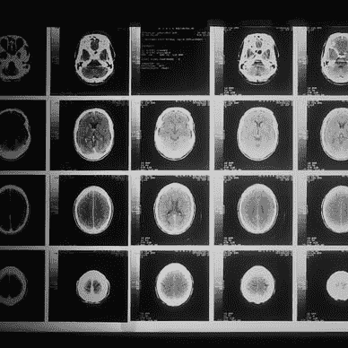
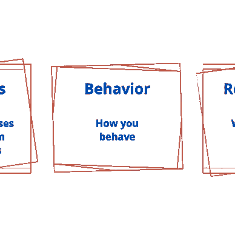

# 更好规划的最佳建议(2022)

> 原文：<https://betterprogramming.pub/best-of-advice-on-better-programming-2022-2cf7866958e>

查德·马登在 [Unsplash](https://unsplash.com?utm_source=medium&utm_medium=referral) 上的照片

*免责声明:本时事通讯包含部分由 ChatGPT 编写的内容，chat GPT 是由 OpenAI 训练的人工智能语言模型。虽然 ChatGPT 帮助了时事通讯的整体结构和组织，但其中包含的所有文章和阅读列表都是人类作者的作品。我们希望您* [*喜欢这个列表*](https://anupamchugh.medium.com/list/workrelated-advice-from-better-programming-5b11b25c1682) *，并从中找到有用的信息。*

[阿努帕姆丘格](https://anupamchugh.medium.com/?source=post_page-----2cf7866958e--------------------------------)

## 关于更好规划的工作相关建议(2022 年)

[View list](https://anupamchugh.medium.com/list/workrelated-advice-on-better-programming-2022-5b11b25c1682?source=post_page-----2cf7866958e--------------------------------)81 stories

当我们迎来新年的时候，为什么不为自己准备一份礼物来开始你的新年计划呢——丰富的知识和对你职业成长和发展的启发。

我们的[软件工程和管理文章精选](https://anupamchugh.medium.com/list/workrelated-advice-from-better-programming-5b11b25c1682)就像一盒巧克力——你永远不知道你会得到什么，但它总是很美味——无论你在职业生涯的哪个阶段，它都有适合每个人的东西！

从关于与远程团队合作和新开发人员入职的实用建议，到关于自我管理、编码面试、团队绩效和领导力的发人深省的见解，这些文章为我们所有人提供了一个知识宝库。

此外，还有一些关于面向产品的工程的重要性的文章，反对以错误的理由赞美开发人员的案例，以及[在软件职业中什么是真正的资历](https://medium.com/p/67b2e01cce81)。

此外，还有导航工程职业阶梯的指南、个人软件创业、[努力成为 CTO](/from-software-engineer-to-cto-c0da5f8d0bfd) ，以及一些提供职业发展路线图的非技术课程。所以[把这个加入你的年终阅读清单](https://anupamchugh.medium.com/list/workrelated-advice-from-better-programming-5b11b25c1682)，带着宁静和新生的感觉开始新的一年。

节日快乐，祝 2023 年成功而充实！