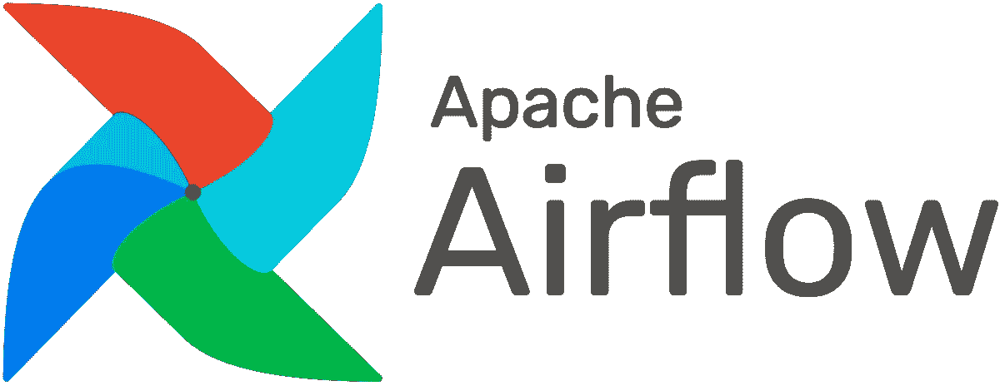
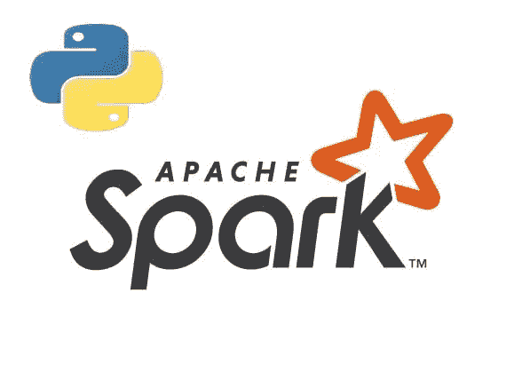
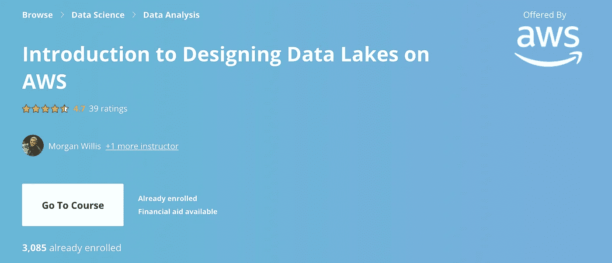

# 2021 年数据工程师最佳在线课程

> 原文：<https://betterprogramming.pub/best-online-courses-for-data-engineers-in-2021-ae73148a7d99>

## 从免费的 YouTube 频道到 Udemy 课程

由 [Unsplash](https://unsplash.com?utm_source=medium&utm_medium=referral) 上的[窗口](https://unsplash.com/@windows?utm_source=medium&utm_medium=referral)拍摄

这似乎终于要发生了。

数据工程最终得到了一点数据石灰光。

这很有道理。

被存储和分析的数据不仅变得越来越庞大，而且其速度、复杂性和多样性也在增加，这使得争论变得很困难。

所有这些新数据带来了新的工具、最佳实践和方法来管理和优化我们所依赖的数据系统。

虽然我作为[西雅图数据人](https://www.theseattledataguy.com/data-science-consultants/#page-content)已经做了多年的顾问，但我仍在不断学习和回顾最好的数据工程课程，以提高我的技能和理解力。查看以下我喜欢的高评分课程，并考虑哪些课程可能最适合你职业生涯的下一步。

# 如何选择最好的网络课程？

不要让网上众多的课程让你不知所措。如果你不知道从哪里开始，或者像我一样同时学习太多的课程，那么就去找一门提供这些功能的课程。

## 关注关键工具和技能

有一整个世界的工具和技术栈，从 Azure、AWS、Streaming、SQL、Python 和许多其他工具，你正在或将要在你的职业生涯中使用。一些优秀的在线数据工程课程提供了很好的实践经验，而其他课程则侧重于理论理解和最佳实践。

## 从免费开始

学习数据工程有很多选择。但是首先，你需要决定你是否喜欢数据工程师做的工作。所以我建议看看 YouTube 上一些讨论数据工程师使用的概念和工具的频道。我将在下面引用其中的两个，但我只是想在我们进一步讨论之前给你这个提示。

## 选择一门评价高、出勤率高的课程

大多数在线课程系统都是分级的，并公布出勤率统计数据。像 [Udemy](https://www.udemy.com/) 和 [Coursera](https://www.coursera.org/) 这样的平台可以很容易地找到引人注目的课程。仅仅因为一门课程被很好的参与或评级并不意味着它提供了你需要的技能，但它是一个有助于比较的特征。

你应该警惕购买虚假评论的课程，但这至少是一个起点。

# 最佳数据工程课程

这些年来，我参加了许多在线课程，但这六个选项是最好的数据工程课程。

## 1.WiseOwl 教程

这个免费的视频教程系列包含了有用的信息，有助于你了解微软工具的基本知识，如 SQL Server、SSIS 等。重温基础知识，或者以 [WiseOwl 教程](https://www.youtube.com/channel/UCbi5G5PjWBaQUFy7XU_O7yw)作为良好的入门指南开始您的旅程。

查看关于 SQL 和 ETL 工具的教程。这些视频可以帮助您学习如何将目的地和转换拖放到您的工作空间中。SQL 播放列表是这些技能的一个很好的起点。

每个人都喜欢免费课程，但这些播放列表中缺少一些功能。我不喜欢它没有详细说明*为什么*你需要执行特定的动作——这个高层架构是工程师难题的关键部分。

## 2.阿帕奇气流教程

另一个免费选项是[阿帕奇气流 Youtube 教程](https://www.youtube.com/watch?v=AHMm1wfGuHE)系列。这个系列有七个视频长，会给你很好的气流基础知识。

它回顾了气流的基本特性，这是用来改进 ETL 的传统观点的。许多专业人员使用此工具以更易于管理的方式创建成百上千的管道。您将了解有关 Airflow DAG 的更多信息，并准备创建您的第一个管道。

像 WiseOwl 教程一样，本系列倾向于更多地关注使用工具的具体步骤，而不是总体原因。这是一个很好的起点，但是在你作为一名工程师进入这个领域之前，一定要获得更高层次的理解。

# 3.初学者的数据仓库基础

我列表中的第一个付费课程是面向初学者的[数据仓库基础课程](https://www.udemy.com/course/data-warehouse-fundamentals-for-beginners/) Udemy，这是一个探索架构和维度设计的最佳实践和高级概念的好方法。

难怪这门课程如此畅销。它很好地解释了如何使用 ETL 和仓库。它探索了您需要的技能，比如构建临时层、事实表和维度表，但也解释了这些工具的模式和框架。

本课程的一个重要补充是关于渐变维度的信息。这不仅允许您复制数据库，还允许您添加上下文并跟踪历史记录。

## 4.亚马逊网络服务(AWS)上的大数据

了解大数据概念和 web 服务工具非常重要。通过亚马逊网络服务上的[大数据](https://www.udemy.com/course/big-data-on-amazon-web-services-aws-cloud-2018/) Udemy 课程来了解这些领域。这门课程比其他课程更贵，但 Udemy 通常会提供折扣。

本课程的重点是 AWS，因此特定于工具的步骤可能不适用于其他基于云的模型。然而，如果你使用 GCP 或者 Azure，理论上的概念将会非常相似。

您需要在本课程上投入更多的时间，因为视频的播放时间会稍长一些。有些视频的长度在 15 到 18 分钟之间，我觉得比理想的稍长。一路上做笔记以保持正确。

## 5.用 Apache Spark 和 Python 驯服大数据

弗兰克·凯恩的课程不会错的。[驯服大数据](https://www.udemy.com/course/taming-big-data-with-apache-spark-hands-on/) Udemy 课程是个人的最爱，但他的许多课程都很有帮助，评价也很高。

本培训为您提供了 Spark 和 Python 中的构建模块和实践任务。从教室到现实世界的应用总会有调整，但是 Frank Kane 做了一项伟大的工作，弥合了一些差距，并帮助您了解这些工具如何在实际问题中工作。

## 6.在 AWS 上设计数据湖简介

这个领域的设计在这个领域很受欢迎，所以把它加入你的在线课程清单。在 Coursera 上，[关于在 AWS 上设计数据湖的介绍](https://www.coursera.org/learn/introduction-to-designing-data-lakes-in-aws)为您提供了关于数据湖创建和操作的宏观概念和更具体的技能。

像大多数 Coursera 课程一样，第一周非常普通，可以跳过，但第二周以关于 AWS 和数据湖架构的信息开始课程。它比其他大数据课程更具体，所以它是一个很好的补充。

# 在哪里可以学到更多关于数据工程的知识？

这些数据工程课程会给你一个 3 到 6 个月的速成课程，如果不是更长的话，所以不要急。

慢慢来，学习基础知识。把你的基础数据工程技能降下来，然后一旦你开始工作，你会发现很多机会用新问题挑战自己。

但是，如果您现在正在寻找新的学习机会，我们的团队正在撰写一篇文章，将您的数据工程师技能应用到数据工程师项目中。

我一直在寻找新的课程，并传授给其他专业人士，所以如果有任何问题或课程建议，请随时[联系我](https://www.theseattledataguy.com/contact-data/)。从 WiseOwl 教程开始，或者以你自己的方式通过这六门顶级课程来提高你的技能和概念知识。

## 加入我们的时事通讯

在继续滚动之前，为什么不加入我们团队的时事通讯，了解数据科学、数据工程和技术的最新动态！[在这里了解更多](https://seattledataguy.substack.com/)。