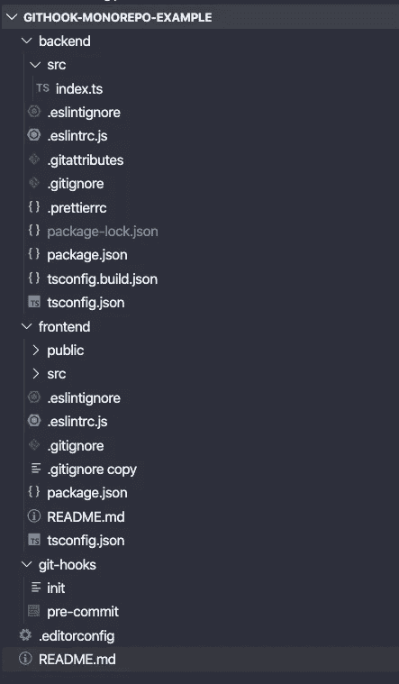
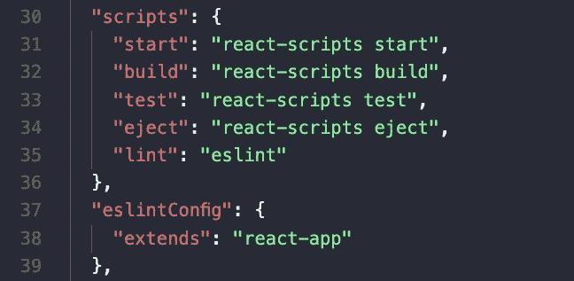
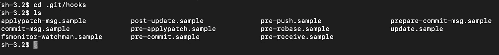
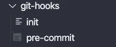

# Git 挂钩和 ESLint 的最佳实践设置

> 原文：<https://betterprogramming.pub/best-practice-setup-git-hook-and-eslint-for-teams-and-mono-repositories-8e7bf474f4a7>

## 对于拥有 JavaScript/TypeScript mono 存储库的团队


由 [Max Duzij](https://unsplash.com/@max_duz?utm_source=medium&utm_medium=referral) 在 [Unsplash](https://unsplash.com?utm_source=medium&utm_medium=referral) 上拍摄的照片。

如果您正在设置一个由 JavaScript/TypeScript 项目组成的 mono-repo，并且希望与您的团队一起工作，那么您需要正确地设置 ESLint。

已经有像 [husky](https://www.npmjs.com/package/husky) 和 [lint-staged](https://www.npmjs.com/package/lint-staged) 这样的工具可以用来在 git 挂钩上设置 ESLint，但是对于 mono 库，这些工具在子目录中无法正常工作。

这是一个快速教程，介绍如何在 mono-repo 中设置预提交 git 挂钩，以及如何确保团队中的每个人都拥有控制权，从而获得一致的 ESLint 体验。

这是我们要复习的内容:

*   在每个 TypeScript/JavaScript 项目中设置 ESLint。
*   设置 git 挂钩脚本。
*   创建一个团队中每个开发人员第一次使用的 init 脚本。
*   使脚本文件可执行。
*   把一切都推到远处。

这个 [GitHub 链接](https://github.com/sunnystatue/githook-monorepo-example)是一个示例库，在这里您可以在一个地方获得所有内容。

# 在每个 TypeScript/JavaScript 项目中设置 ESLint

下面是我们代码库的结构，它由不同的 TypeScript/JavaScript 项目组成:

*   后端
*   前端
*   共享库等。



在每个项目中，我们都创建了一个包含 ESLint 配置的`.eslintrc.js`文件。在`package.json` **，**中，我们将会有一个脚本来运行 ESLint 的那个项目或者子目录。


[https://github . com/sunny statue/git hook-monorepo-example/blob/master/frontend/. eslintrc . js](https://github.com/sunnystatue/githook-monorepo-example/blob/master/frontend/.eslintrc.js)



[https://github . com/sunny statue/git hook-monorepo-example/blob/master/frontend/package . JSON](https://github.com/sunnystatue/githook-monorepo-example/blob/master/frontend/package.json)

通过在`package.json`中添加那个`lint` 脚本，我们使我们的预提交 git 钩子脚本能够使用本地项目规格运行 ESLint，并独立使用每个项目的`node_modules` 。

# 设置提交前 Git 挂钩脚本

整个事情的目的很简单:当团队中的开发人员决定向 stage 添加一个文件，然后提交它时，我们在提交过程之前运行 ESLint，以确保每个人都提交了高质量的代码。

值得一提的是 git 存储库中钩子的概念。如果你打开`.git/hooks`文件夹，你会看到不同类型挂钩的不同样品列表。



。git/挂钩

我们创建了一个单独的文件夹，并在我们名为`git-hooks`的代码库中更改了默认的钩子文件夹，以保持钩子在团队中可共享。



然后我们创建预提交，，它将保持我们的提交逻辑。下面是后端部分代码，它与前端代码非常相似:


[https://github . com/sunny statue/git hook-monorepo-example/blob/master/git-hooks/pre-commit](https://github.com/sunnystatue/githook-monorepo-example/blob/master/git-hooks/pre-commit)

我们正在做的事情:

*   列出存放在`backend/src` 文件夹中的文件。他们是`(js|jsx|tsx|ts)`之一。
*   移除前缀`backend/src`并修复路径字符串。
*   使用`--fix` 选项对这些文件运行后端 ESLint。
*   试图为那些已经修复的人再次登台。
*   如果 ESLint 结果未能修复所有错误，我们不提交就退出提交，并打印一条消息告诉开发人员他们需要修复一些东西。
*   前端基本上是一样的。

然后，我们需要一个 init 脚本作为初始触发器来设置一切。这个脚本文件只包含一行:

```
git config core.hooksPath ./git-hooks
```

这告诉 git 为钩子寻找`./git-hooks`。

就是这样。是不是很奇妙？

# 使脚本文件可执行

现在唯一剩下的事情就是让预提交和初始化文件可执行。不然就不行了。为此，我们运行以下命令:

```
chmod +x git-hooks/pre-commitchmod +x git-hooks/initgit add .# make these files executable in gitupdate-index --chmod=+x git-hooks/pre-commitupdate-index --chmod=+x git-hooks/initgit commit -m"make init and pre-commit executable"
```

# 将一切推向远程

在这个阶段，一切都准备好了。如果你从另一个目录或机器拉，唯一要做的就是运行`./git-hooks/init`。然后，每当开发人员在`(js|jsx|tsx|ts)` 文件中做出更改并试图提交时，ESLint 就会针对该文件运行。

使用这个 [GitHub 链接](https://github.com/sunnystatue/githook-monorepo-example)来查看最初的样本库。