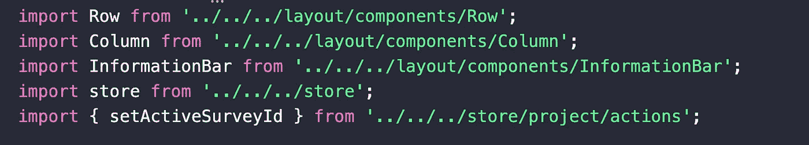
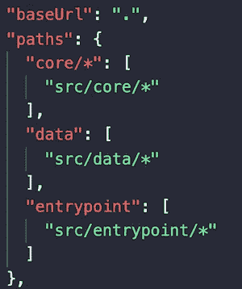
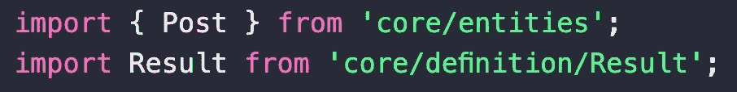
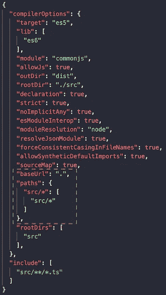
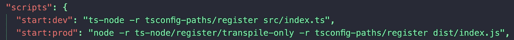

# 对于 typescript 项目，使用模块路径导入而不是相对路径导入

> 原文：<https://betterprogramming.pub/best-practice-use-module-path-import-instead-of-relative-path-import-4baaf1b3b4db>

## TypeScript 最佳实践


作者照片。

这是一个关于在 TypeScript 中使用模块路径导入而不是相对路径导入的非常简单的教程。我们还将介绍如何消除“../../../”放在文件的顶部。

# **问题**

如果您是一名 TypeScript 或 JavaScript 开发人员，您肯定见过这些点斜线(“../../../)放在您的文件上面。当您导入两个或三个以上的组件时，一眼就能看出哪些组件属于哪个模块就成了一场噩梦。



相对路径导入。

有一些解决方案，但是每一个对项目结构都有缺点和副作用。例如，使用 babel/typescript 会导致输出中的*.d.ts 文件丢失。使用 webpack，设置将花费大量时间。

# **解决方案**

默认情况下，TypeScript 支持模块导入。与那些难看的点斜线不同，您可以在`tsconfig.json`中配置模块路径，然后将它们用于导入。



tsconfig.json。



使用模块路径加载。

这样做有一个问题:将 TypeScript 代码编译成 JavaScript 会使它不能被 JavaScript 使用。JavaScript 不理解那些模块路径。同样，像 ts-node 或 ts-jest 这样的工具不理解这些模块路径导入。

有一个 npm 包( [tsconfig-path](https://www.npmjs.com/package/tsconfig-paths) )在运行时解析这些模块导入，并帮助 JavaScript 运行编译后的代码。这也有助于 ts-node 和 ts-jest 理解这些组件。

## **做什么**

*   用正确的路径配置更新`tsconfig.json`。我用 src/* 作为单项，但你可以用倍数。



tsconfig.json

*   安装[ts config-path](https://www.npmjs.com/package/tsconfig-paths)T21 模块:

```
npm install --save-dev tsconfig-paths
```

注意:使用该模块加载位置在`tsconfig.json`的`paths`部分指定的模块。支持运行时加载和通过 API 加载。

*   然后简单的给`package.json`添加两个脚本进行开发和制作:



package.json 配置。

以下命令帮助 ts 节点理解模块导入:

```
ts-node -r tsconfig-paths/register src/index.ts
```

下面的命令帮助 Node/JavaScript 理解模块导入并能够运行代码:

```
node -r ts-node/register/transpile-only -r tsconfig-paths/register dist/index.js
```

# **结论**

就是这样！你所需要做的就是用正确的配置更新你的`tsconfig.json`，包括路径，然后安装[ts config-path](https://www.npmjs.com/package/tsconfig-paths)**并用正确的脚本更新你的`package.json` 文件。**