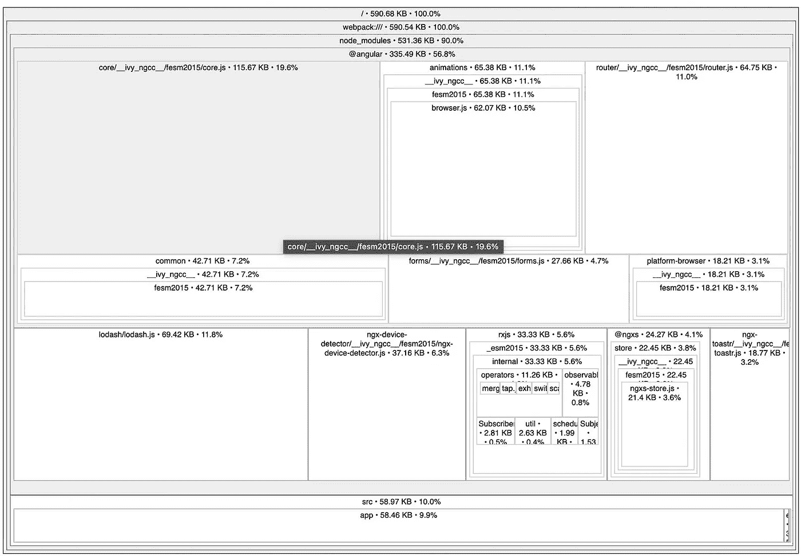

# 角度 13 的最佳实践

> 原文：<https://betterprogramming.pub/best-practices-for-angular-13-fa7fdd42ba80>

## 了解构建高质量和可伸缩角度应用的最佳实践

由 [Lina Trochez](https://unsplash.com/@lmtrochezz?utm_source=medium&utm_medium=referral) 在 [Unsplash](https://unsplash.com?utm_source=medium&utm_medium=referral) 上拍摄的照片

过去几年，我一直致力于多个大角度应用。在实现过程中，开发团队多次重构应用程序，以改进结构并降低复杂性。

本文将向您展示我们在此期间学到的最佳实践。这些最佳实践将防止在构建更重要、更复杂的应用程序时遇到清晰性、可伸缩性和性能问题。

我们将从演示如何组织你的 Angular 项目和文件夹开始。接下来，我们将研究 Angular 组件、服务和性能最佳实践。接下来，我们将看看如何处理状态管理。我们将在文章的最后看看基本的编码最佳实践。

在本文结束时，您将了解所有基本的最佳实践，帮助您构建高质量和可伸缩的 Angular 应用程序。我们使用 Angular 13，但是这些实践大部分也适用于以前的版本。

# 应用程序结构和组织

结构由 [Chor 曾](https://unsplash.com/@chortsang?utm_source=medium&utm_medium=referral)上[下](https://unsplash.com?utm_source=medium&utm_medium=referral)

有许多方法来组织你的角度应用。不可能创建一个适合所有用例的结构。应用程序的组织取决于项目的需求。话虽如此，我认为一些指导方针可以有所帮助。

[角形风格指南](https://angular.io/guide/styleguide)使用 LIFT 首字母缩写作为指南。它代表:

*   定位—你必须能够快速找到文件
*   **I**identify——给文件命名，以便您立即知道它包含什么
*   **F** lat —尽可能长时间保持扁平的文件夹结构。
*   试着保持简洁——不要重复，但要避免过于简洁，以至于牺牲了可读性。

下面是我在中到大角度应用中使用的格式。

角度应用程序的文件夹结构

## 核心文件夹和模块

核心文件夹和模块包含共享的单例服务和应用程序级组件。顶级应用程序模块使用这些应用程序级组件，例如导航组件。创建一个核心文件夹和模块可以防止你的主应用程序文件夹变得过于混乱。

## 共享文件夹和模块

共享模块包含由功能模块中的组件使用和引用的组件、管道和指令。

## 特征文件夹和模块

我喜欢创建一个主特性文件夹，在这个文件夹下，我为应用程序中的每个特性创建单独的文件夹和模块，比如身份验证。当您使用 CLI 创建新的 Angular 应用程序时，它将只包含一个模块。当您的应用程序增长时，将它组织成不同的功能模块会有所帮助。将您的特性放在单独的模块中允许 Angular 延迟加载它们，从而提高性能。

## 风格和资产

styles 文件夹包含应用程序的所有全局样式表。“资源”文件夹包含所有图像、矢量和其他类型的应用程序资源。

# 角度服务最佳实践

由[埃里克·麦克林](https://unsplash.com/@introspectivedsgn?utm_source=medium&utm_medium=referral)在 [Unsplash](https://unsplash.com?utm_source=medium&utm_medium=referral) 上发球

## 将组件从数据检索中分离出来

角度服务通常是一个只有一个目的的类。它做特定的事情，而且做得很好。服务的目标是保护您的组件免受直接的数据检索。划分这些职责将使检索逻辑可重用，并且更容易测试。另一个结果是你的组件类将是精简和高效的。

因此，避免从组件中直接检索数据或调用 API 的诱惑。请改用服务。

## 将可注入装饰器添加到所有服务中

当一个服务需要另一个服务时，您可以通过服务的构造函数注入它。然后，您必须将`@Injectable`装饰器添加到类中。您可以将`@Injectable`添加到您的所有服务中，即使他们目前不需要其他服务。我发现直接添加比在添加服务依赖项时添加更容易。我经常忘记它。

## 理解 Angular 如何注入服务

角度注入器实例化依赖关系，并将它们注入到组件或服务中。因此，有必要了解这种喷油器是如何工作的。

当 Angular 开始时，它会创建一个集中的注射器。这个注入器收集所有已定义的依赖项，并维护应用程序可以在容器中重用的所有已创建的实例。您告诉 Angular，它可以使用 DI 系统中的服务，方法是用@ Injectable 修饰它，并在模块的 Providers 部分列出该服务。

通常，Angular 将服务的同一个实例注入到组件中。延迟加载的功能模块有一个例外。这些模块获得一个服务的新实例。当您使用延迟加载并在服务中使用状态时，请记住这一点。

# 性能最佳实践

安迪·比尔斯的表演

## 惰性装载

惰性加载是一种在需要时加载角度模块的技术。例如，当用户选择应用程序的特定部分时，我们加载一个特性模块。Angular 编译引擎在编译期间为每个功能模块创建单独的包。这意味着主包的大小减小了，所以应用程序加载得更快了。

## 监控捆绑包大小

我们已经看到，减少应用程序的包大小会导致应用程序加载更快。因此，持续监控您的包的大小至关重要。

[Source-map-explorer](https://github.com/danvk/source-map-explorer) 是一个有助于可视化你的包中所有代码来源的工具。你用`npm install -g source-map-explorer`安装源地图浏览器。使用`ng build --configuration production --source-map=true`生成带有源地图的产品构建之后。然后，您可以使用 source-map-explorer 可视化生成的 js 文件。下面是一个例子。

Source-map-explorer 生成一个可视化的包，图片由作者提供。

## 提前编译和 CLI

编译 Angular 应用程序有两种方法。实时(JIT)在运行时在浏览器中编译应用程序。或者您可以使用提前编译(AOT)，它在构建时编译您的应用程序。自 Angular 9 以来，AOT 一直是默认设置。

您可以通过`angular.json`配置文件中的`aot`属性选择编译器的类型。

最好总是使用 AOT 编译，因为它在部署之前只编译一次应用程序，这样可以节省时间。

## 变化检测策略

角度重新渲染视图，以在零部件中的数据发生变化时显示更新的数据。角度确保组件和视图中的数据始终同步。

变化检测器处理这种同步。每个组件都有一个变化检测器。当组件的数据发生变化时，变化检测器将更新的数据投射到视图中。

有两种变化检测策略:`Default`策略和`OnPush`策略。使用`Default`策略，变更检测通过检查所有组件的模板表达式的值是否已经变更来工作。

第二种策略`OnPush`，通过引用比较输入。使用`OnPush`策略将提高您的角度应用程序的性能。

如果你使用`OnPush`方法，你必须确保你所有的对象都是不可变的。如果您不这样做，并继续使用可变对象，您的应用程序的复杂性就会增加。然后，它可能会引入难以复制的错误。

在组件上启用 OnPush 更改检测策略

如果你切换到`OnPush`，确保你的对象变成不可变的。变成不可变的一个好选择是使用[不可变. js](https://facebook.github.io/immutable-js/) 库。这个库为构建应用程序提供了不可变的原语，比如不可变的对象和列表。

## 纯净和不纯净管道性能

如果您使用自定义管道，那么需要考虑一些性能因素。默认情况下，自定义管道是纯管道，这意味着只有当管道所应用到的对象的引用发生变化时，它们才会被重新计算。

纯净和不纯净管道性能

解决这个问题的一个快速方法是通过将第 3 行的管道装饰器的 pure 属性设置为 false，将管道更改为不纯。这将随着数据的每次变化触发管道。

但是，最好不要这样做！不纯净的管道会牺牲性能。解决这个问题的一个更好的方法是使用不变性，通过构建一个新的引用来改变对象的引用。

# 角度分量

组件由[拉斐尔 Koh](https://unsplash.com/@dreamevile?utm_source=medium&utm_medium=referral) 放在 [Unsplash](https://unsplash.com?utm_source=medium&utm_medium=referral) 上

## 分离组件、CSS 和模板文件

组件由模板、样式和组件类型脚本代码组成。您可以将模板和样式集成到组件 typescript 文件中。最佳实践是，当您的 HTML 超过四行时，您应该将 HTML 模板分成一个单独的文件。

## 前缀组件选择器

给组件选择器加上前缀是一个最佳实践。如果将组件存储在功能模块中，请根据该功能模块设置组件前缀。如果一个公共组件驻留在一个共享模块中，使用应用程序名称作为选择器前缀。确保前缀长度在 2 到 4 个字符之间。

为组件选择器添加前缀

## 修饰输入和输出属性

有两种方法可以创建组件的输入和输出属性。推荐的方式是用`@Input`装饰你的公共财产。第二种不推荐的方法是使用元数据。

使用装饰器来指示组件的输入属性

## 将复杂的逻辑委托给服务

努力保持组件内部的逻辑尽可能简单。保持简单意味着更复杂的逻辑应该转移到一个单独的类，一个服务中。

## 组件成员序列

您应该始终对组件的元素进行排序。我使用下面的顺序。

*   公共财产
*   私有财产
*   构造器
*   公共方法
*   私有方法

## 实现生命周期挂钩接口

当 Angular 创建和销毁组件时，可以将多个生命周期事件附加到组件。您应该使用接口，而不是直接实现方法。通过用`implements [Interface]`实现接口，你可以确保你正确地实现了事件。

实现生命周期挂钩接口

# 角度状态管理

当您的 Angular 应用程序变大时，它将需要状态管理。您可以使用几种模式和库来实现状态管理。更直接的方法之一是使用组件的@Input 和@Output 绑定。您还可以使用角度服务和简单变量来存储临时数据。

一旦您的应用程序增长，您将需要一些不同的东西。我们知道我们的应用程序将增长到企业应用程序的规模，所以我们从 NGXS 开始。

NGXS 是 Angular 的状态管理模式+库。这个著名的 Redux 模式和库使它流行起来。NGXS 的工作原理与它集中应用程序的状态和逻辑是一样的。所以在你的应用程序中有一个包含所有状态的中心位置。

例如，我开发了一个角度应用程序，用于在飞机上放映电影。应用程序通过服务检索所有电影，并将其存储在应用程序启动时的状态中。每个需要播放电影的组件都通过中央状态选择它们。

NGXS 的另一个优点是使用选择器从存储中获取数据，作为改变存储的可观察值和动作。现在几乎需要一篇完整的文章来详细介绍 NGXS 的使用，所以我把它留到另一篇文章中。

# 角度编码最佳实践

## 不变

用 JavaScript 或 TypeScript 编码有几个最佳实践。我们之前提到的第一个最佳实践是不变性。不变性是对所有 JavaScript 代码的一般建议。不变性指的是编程时不改变现有的对象，而是根据需要的改变创建新的对象。一个有帮助的 JavaScript 库是 [Immutable.js](https://immutable-js.com/) 。

在上面例子的第 3 行，我们使用 Map from immutable 将键 b 设置为值 50。结果是一个包含 map1 的所有值的新映射，键 b 的值更改为 50

## 严格模式

Angular Strict 模式是指 Angular 在编译你的 app 时执行的 TypeScript 验证。严格模式提高了可维护性，并帮助您提前发现错误。严格模式也允许使用`ng update`自动升级角度。

使用 CLI 创建新的新角度项目时，默认情况下会打开严格模式。

## 小文件和函数

对于用任何语言编写的应用程序来说，保持代码文件和函数小是一个通用的最佳实践。这也适用于角度应用。保持你的函数小使得它们更容易测试、重用、阅读和维护。

对于文件或函数没有严格的限制，但是 Angular 风格指南建议将函数限制在 75 行以上。

## 单一责任原则

如果不提及单一责任原则(SRP ),你就无法创建最佳编程实践。鲍伯·马丁，又名鲍勃大叔，说一个单独的类或模块应该只有一个单独的责任。

当我构建一个新的 Angular 应用程序时，我将这个应用程序分解成单独的组件。对于每个组件，我描述了它的职责以及输入和输出。我总是这样开始描述:“这个组件负责……”—如果我需要进一步分解组件，描述责任信号所需的文本量。

# 结论

本文描述了几个最佳实践，帮助您构建高质量和可伸缩的 Angular 应用程序。我们从 Angular 项目的组织开始。然后我们看了组件、服务和性能。我们通过查看一般的编码实践结束了本文。

两次，我参考了棱角分明的风格指南。风格指南是关于语法、惯例和应用程序结构的固执己见的指南。请务必阅读该指南。

我希望这些最佳实践能在构建 Angular 应用程序时对您有所帮助。