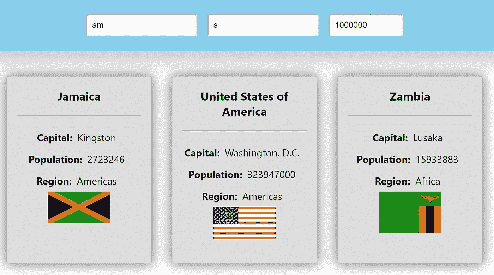

# 使用 React 钩子处理多输入表单的最佳实践

> 原文：<https://betterprogramming.pub/best-practices-for-handling-a-form-with-multiple-inputs-using-react-hooks-a0abf9207284>

## 用优雅的解决方案构建高级滤波器


由[凯利·西克玛](https://unsplash.com/@kellysikkema?utm_source=medium&utm_medium=referral)在 [Unsplash](https://unsplash.com?utm_source=medium&utm_medium=referral) 上拍摄的照片

到处都在使用表格。如果没有起码的表单知识，Web 开发人员就无法生存。它们存在于每一个与用户有某种互动的网络应用中。

问题是，是否有一个优雅的解决方案来使用 React 钩子处理带有多个输入的表单。

答案是，在 web 开发中，一切都有解决方案。但是同样重要的是如何恰当地去做。我将向您展示一个优雅的代码，包括:

*   处理受控表单(存储状态下的输入值)
*   借助`useReducer`挂钩控制多个输入
*   使用`Array.filter()`方法过滤数据

这是[用钩子构建 React 应用程序的一些最佳实践](https://medium.com/better-programming/some-best-practices-for-building-a-react-app-with-hooks-d6157494f5c1)的后续，其中我们构建了一个关于世界上所有国家特征的简单应用程序的基础。

你可以从阅读第一部分开始，或者直接从 Github 克隆 [repo。](https://github.com/Dromediansk/countries-app-blog)

# 完成的定义

在应用程序开发的每个任务(或故事)中设立一个明确的目标是很重要的。如果目标不够清晰，你和你的团队可能会因为某些条件没有得到满足而失败。在敏捷开发中，实现目标有一个恰当的术语:[完成的定义](https://www.leadingagile.com/2017/02/definition-of-done/) (DoD)。

## 建立我们的国防部

在我们的应用程序中，我们希望构建一个过滤器，只显示符合我们输入的标准的国家。它应符合以下条件:

*   按名称、首都和人口数据过滤国家
*   动态过滤器—当用户输入时，它会立即改变结果
*   使用多层过滤(例如，搜索以字母“am”开头且人口大于或等于三百万的国家/地区)

用技术术语来说，我们将过滤一个对象数组，每次输入改变时都会重新呈现。这个任务是实践中一个很常见的例子，React 在处理这种情况时非常出色。

现在，让我们做真正的事情。

# 编码时间

所以我们设定了要求。

为了创建一个合适的过滤器，我们需要实现一个有三个输入的表单:姓名、资本和人口。然而，在此之前，这些输入的值必须存储在一个状态中。

如果只有一个输入，通常使用`useState` hook 将值存储在状态中。但是，想象一下你有 15 个输入。你会创建 15 个独立的状态和 15 个函数来处理相应的值的变化，这不符合最重要的原则之一:不要重复你自己(干)。

`useReducer`来救援了。

## UseReducer 挂钩

[UseReducer 吊钩](https://reactjs.org/docs/hooks-reference.html#usereducer)就是为此而定制的。我们希望在一个状态中存储表单的多个值。让我们在`CountriesContainer.js`做吧:

以下是一些简明的注释，说明`useReducer`是如何工作的:

*   `useReducer`采用一个函数(称为 reducer ),该函数决定 React 将如何更新您的状态，给定传递给该函数的新状态
*   这个 reducer 接受一个`newState`并将定义的值( [object spreading](https://developer.mozilla.org/en-US/docs/Web/JavaScript/Reference/Operators/Spread_syntax) 在 ES9 中引入)传播到我们最初的`state`对象上，该对象返回属性被正确更新的`state`
*   我们在`filterInput`上定义的属性是`name`、`capital`和`population`，它们在`useReducer`的第二个参数中初始化

## handleFilterCountries 函数

为了改变存储在状态中的值，我们还需要编写一个函数来处理这些改变。为了遵守 DRY 原则，它应该是一个通用函数，处理所有的输入。

在`CountriesContainer.js`中，我们声明一个新函数，并将其命名为`handleFilterCountries`:

```
const handleFilterCountries = event => {
    const name = event.target.name;
    const newValue = event.target.value;
    setFilterInput({ [name]: newValue });
};
```

在这个函数中，我们声明了两个变量，`name`和`newValue`，它们被分配给到达事件的相应名称和值。那么我们相应地将它们存储在状态中。

我们甚至可以使用[对象析构](https://wesbos.com/destructuring-objects/)(在 ES6 中引入)来简化函数:

```
const handleFilterCountries = event => {
    const { name, value } = event.target;
    setFilterInput({ [name]: value });
};
```

# 反应组分

## 国家卡组件

在`CountryCard.js`中，我们需要实现一个额外的列表项，它包括关于人口的数据:

```
<li className="country-info-item">
    <h4>Population:</h4>
    <p>{country.population}</p>
</li>
```

这是国家卡组件的[样式。你可以随意调整。](https://github.com/Dromediansk/countries-app-blog/blob/part2/src/components/CountryCard.css)

## 高级过滤器组件

我们仍然缺少一个组件，在那里我们可以用期望的输入实现表单。因此，让我们在`components`文件夹中添加一个新文件，并将其命名为`AdvancedFilter.js`:

有几个亮点值得注意:

*   该组件有两个道具— `searchValue`和`handleChangeValue`(第 4 行)
*   我们期望`searchValue`是在`filterInput`状态下创建的对象
*   在这个组件中，有一个带有三个标签的`<form>`——分别代表*名字*、*大写*和*人口*值
*   在每个`<input>`中，我们必须添加属性`name`，其值与 reducer 对象中的属性相匹配(在我们之前实现的`<CountriesContainer />`中)。
*   属性`value`具有对象`searchValue`的适当属性
*   每个输入中的属性`onChange`正在调用`handleChangeValue`并将事件作为参数。
*   这是我的[版本的造型](https://github.com/Dromediansk/countries-app-blog/blob/part2/src/components/AdvancedFilter.css)

# 全能过滤器的逻辑

我们快到了。这部分提供了一个过滤对象(国家)数组的解决方案。这是一个相当容易理解的函数，尽管乍看起来很复杂。

让我们将它添加到我们的`CountriesContainer.js`:

让我一步一步地解释这里发生的事情:

*   我们使用`Array.filter()`方法，返回符合所有标准的国家
*   名称和大写数据被转换为小写(包括所有项目，无论是小写还是大写)
*   检查这些数据是否包含在滤波器的输入中。如果是，结果是`true`
*   如果人口数据等于或大于过滤器输入中的值，则检查人口数据

总之，这个函数只返回与名字、首都和人口的过滤器输入相匹配的国家(使用逻辑运算符`&&`)。该筛选器不区分大小写。

最后，我们将结果存储在变量`CountriesList`中(第 19 行)。

# **更新国家的 JSX container . js**

为了显示我们编码的结果(包括过滤器)，我们需要更新`<CountriesContainer />`的`return`语句:

*   我们用`<>`包装组件，相当于`<Fragment>`，但我认为这是一种更干净的方法
*   在这个组件中，我们需要用我们之前制作的道具通过`<AdvancedFilter>`
*   在第 8 行，我们映射了数组`countriesList`并显示了`<CountryCard />`中的每一项，当然考虑到了过滤器输入

# 诚实的目标评估

是的，我们终于到了！以下是我们的初步结果:



并且可以在 GitHub 查看[全回购。](https://github.com/Dromediansk/countries-app-blog/tree/part2)

看起来我们已经满足了国防部的要求。但是我必须指出我们的解决方案有一个缺点:

*   在输入的过程中，您可能会注意到在显示匹配的国家时有轻微的滞后。这是在您键入时不断重新渲染造成的。在我们的应用中，这不是一个大问题，因为我们没有那么多国家。
*   然而，如果您有大量的数据，您应该考虑其他的调整(使用延迟加载)或者其他的过滤解决方案(例如过滤后端请求的数据)。

然而，如果将来有人分配给你一个类似的任务，你现在已经有了一个如何完成的概览。您还学到了一些有用的原则，我相信这些原则会在您的开发团队中得到评价。

如果你有兴趣了解渐进式网络应用，我写了一个关于其实现的全面指南:

[](https://medium.com/better-programming/how-to-transform-your-website-into-a-progressive-web-app-and-grasp-its-benefits-177a076a76d6) [## 如何将你的网站转变成一个进步的网络应用程序，并抓住它的好处

### 通过几个步骤了解 PWAs

medium.com](https://medium.com/better-programming/how-to-transform-your-website-into-a-progressive-web-app-and-grasp-its-benefits-177a076a76d6) 

感谢阅读！