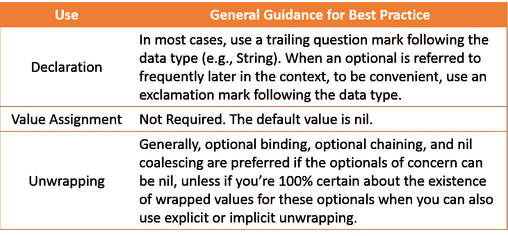

# 在 Swift 中使用选项的最佳实践

> 原文：<https://betterprogramming.pub/best-practices-for-using-optionals-in-swift-e9ac093ad50d>

## 因看到“致命错误:在展开可选值时意外发现 nil”而沮丧？


照片由 [Avrielle Suleiman](https://unsplash.com/@elleirva?utm_source=unsplash&utm_medium=referral&utm_content=creditCopyText) 在 [Unsplash](https://unsplash.com/s/photos/best-practice?utm_source=unsplash&utm_medium=referral&utm_content=creditCopyText) 上拍摄

我们在 Swift 项目中非常频繁地使用期权。如果使用不当，我们会在 Xcode 中遇到这个错误。

```
Fatal error: Unexpectedly found nil while unwrapping an Optional value
```

每当它在应用程序运行时发生，应用程序就会可靠地崩溃，导致应用程序在应用程序商店的审查过程中立即被拒绝。

因此，防止这种情况发生非常重要——理想情况下是在应用程序开发阶段。

在本文中，我将回顾在 Swift 中使用选件的最佳实践。

# 什么是可选的？

可选数据类型要么代表一个值，要么根本不代表任何值。

例如，在下面的代码中，我们声明了一个名为`name`的可选字符串。如您所见，`name`变量可以有`John`的赋值，也可以在设置为`nil`后没有值。

在对可选字符串有了初步的感受之后，让我们看看 Apple 是如何定义可选的。

> "一种表示包装值或`nil`，即没有值的类型."

这种数据类型的声明如下。

```
@frozen enum Optional<Wrapped>
```

如你所知，这是一个通用的枚举，但是它有什么情况呢？可选有两种情况。

`none`事例是没有任何值，通常表示为`nil`，而`some(Wrapped)`事例是已定义数据类型的包装值，如`Int`、`String`、`Dictionary`，以及自定义的`struct` s 和`class` es。

因此，一些人认为可选性可以被看作是一些数据类型的容器。

# 声明

有多种方法可以声明可选的。需要注意的一点是，如果我们声明一个可选的，我们必须明确包装的数据类型，因为可选的是一个泛型枚举，因此这个泛型数据类型的使用必须涉及一个具体的数据类型，比如`Int`和`String`。

例如，下面的声明有错误:`Reference to generic type ‘Optional’ requires arguments in <…>`。

```
var optionalValue: Optional?
```

## 使用尾随问号

声明可选的最常见方式是在特定数据类型后使用一个尾随问号(`?`)。

下面的代码创建了各种数据类型的选项，包括`Int`、`String`、`Array`、`Dictionary`、`struct`和`class`。

需要注意的一点是，当我们声明一个可选的通用数据类型时，比如`Array`和`Dictionary`，我们必须明确这些通用数据类型的确切数据类型。

例如，下面的声明错误地使用了没有数据特异性的通用数据类型。

```
var names: Array?
var information: Dictionary?
```

为了解决这个问题，我们可以像在上面的代码片段中一样，为`Array`和`Dictionary`指定元素的数据类型。

Swift 中一个有趣的特性是，你可以在可选数据类型后面附加一个问号，使其成为可选的可选数据类型，如果你愿意，可以重复多次。好像下面的东西。

```
var optional0: String? // an optional String
var optional1: String?? // an optional String?
var optional2: String??? // an optional String??
...and so on
```

## 使用可选的<wrapped></wrapped>

另一种不太常用的声明选项的方式是使用`Optional<Wrapped>`的形式，其中`Wrapped`是特定的数据类型。下面的代码片段向您展示了上面显示的相同变量的声明。

应该注意的是，这两种声明方式具有完全相同的效果，但是使用问号的第一种方式是首选的，因为它具有更好的可读性。

## 使用结尾感叹号

声明可选选项的另一种相对常见的方式是在数据类型(例如，`Int`)后面添加一个感叹号(`!`)，这被称为*隐式展开的可选选项*。

如果您不熟悉这个术语，也不用担心，因为我们将在本文的后面详述这个概念。下面给出了一些相关的代码。

正如您所料，`lastName`变量是`Optional<String>`数据类型。然而，如果你在一个使用`Optional<Wrapped>`方法声明的可选元素后面附加一个感叹号，事情会有所不同。

正如你看到的`firstName`变量，它的类型是可选的`String?`，而不是可选的`String`。

这个结果分享了创建可选选项的相同概念，将多个问号附加到一个数据类型，就像我们在第一部分中介绍的`String`(*使用问号*部分)。

# 赋值

当我们声明选项时，如果我们愿意，我们可以给这些变量赋值。如果我们不指定任何值，所有选项都有默认的“值”— `nil`，没有值。

下面的代码向您展示了各种赋值是如何完成的。

例如，我们可以使用可选变量的`none` case 给可选变量赋值，这使得变量有一个`nil`值。类似地，我们可以使用`some<Wrapped>`案例将包装数据类型的值赋给可选的。

或者，我们可以给可选变量赋一个可选值。在这个例子中，当我们使用`middleName`字符串访问`Dictionary<String, String>`中的键值时，返回的数据类型是`String?`类型，因为这个键很可能不在`Dictionary`中。

请注意，即使我们知道键(例如，`firstName`)存在，返回的数据类型仍然是`String?`，因为在运行时，`Dictionary`的键列表总是会发生变化。

# 展开选项

为了在大多数上下文中使用选项，我们需要解开选项以访问它们的包装值，如果不是`nil`。我们有不同的方案来展开期权，总结如下。

## 强制展开

当我们确定可选的包含一个值时，我们可以使用变量名后面的感叹号(`!`)来无条件地解开这个值。

注意，当我们声明一个可选变量时，我们在数据类型后面使用感叹号，这与变量后面的展开不同。

## 隐式展开

在*声明*部分，我们简要提到了*隐式展开选项*的概念。在这里，我们解释一下它是什么。

基本上我们是用感叹号来声明某一类型的可选变量，就说`String`，变量名叫做`jobTitle`。

每次使用这个变量时，我们可以省略强制解包操作符(即后置`!`)来解包可选的。实际上，编译器会无条件地为我们解开这个选项，这就是为什么它被称为*隐式解开*。

因此，即使我们没有明确地在变量后面使用后置的`!`,我们仍然有责任确保可选的不是`nil`,因为强制展开仍然在幕后发生。

当可选的恰好是`nil`时，解包会导致本文开头所示的致命错误。请看下面一些相关的例子。

## 可选绑定

因为如果我们使用强制解包，一些行为可能是不可预测的，所以我们可以使用*可选绑定*，它有条件地解包一个可选的。

要做到这一点，我们可以使用`if let`、`guard let`和`switch`，前两者使用得更多。相关的例子如下。

关于上面的代码有几点需要注意。当我们使用`if let` 语句时，我们可以访问直接花括号中的命名变量(第 4-6 行),但不能访问它们之外的变量。

相比之下，当我们使用`guard let`语句时，可以在它的外部访问命名变量(第 15 行)，但不能在紧接的花括号中访问(第 11-13 行)。

关于`switch`语句，这只是因为`Optional`数据类型是一个通用枚举，因此允许我们针对`none`情况检查一个可选值(即`nil`)。

## 可选链接

有时，如果一个选项是`nil`我们也没问题，我们只是不使用`nil`选项执行进一步的操作。在这种情况下，我们可以通过在可选变量后使用后缀问号(`?`)来使用可选绑定。

这里有一个例子。

如你所见，`firstInitial0`和`firstInitial1`变量都成功创建为可选的`Boolean`变量，前者为`true`，后者为`nil`。

换句话说，这种可选的链接方法允许我们安全地访问可选的属性和方法，因为如果可选的是`nil`，它会将`nil`赋给声明的变量。

## 零合并

这也是处理期权的一种常见方式。基本上，我们使用 nil-coalescing 操作符(`??`)来为一个声明的变量提供一个默认值，如果可选的是`nil`。下面给出一个简单的例子。

如前所述，使用键访问`Dictionary`的元素的数据类型是可选的。根据值是否为`nil`，零合并操作符后的默认值将被分配给声明的变量。

# 外卖食品

本文回顾了有关在 Swift 中正确使用选项的各个方面。这里有一个外卖的快速总结。



Swift 中可选的最佳实践

感谢阅读这篇文章。Swift 快乐编码。