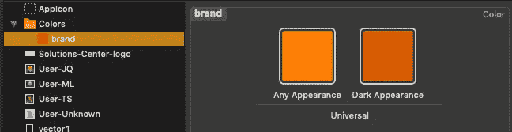
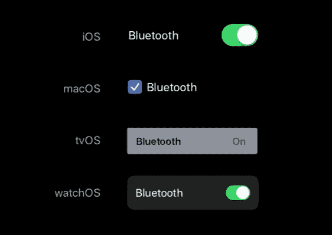

# SwiftUI 合成的最佳实践

> 原文：<https://betterprogramming.pub/best-practices-in-swiftui-composition-282b02772a24>


## 关于 SwiftUI 视图组成、代码可读性和应用程序性能的一些想法

SwiftUI 将改变我们为 iOS、iPadOS、macOS、tvOS 和 watchOS 构建未来应用的方式。

但是 SwiftUI 的全部影响不仅仅在于消除 UIKit 和用 UIViews 交换视图，或者用 UITableViews 交换列表，或者甚至完全消除对 UIConstraints 和 UIView 锚点的需求。

也不在于我们的应用程序将通过消除故事板、IBOutlets、IBActions、Segues 和所有其他长期束缚我们应用程序的相关样板文件来实现戏剧性的简化。更不用说清除那些由于意外断开插座和动作而潜伏在代码深处的错误了。

不要误解我。SwiftUI 将为我们提供所有这些好处。还有更多。但从我的角度来看，SwiftUI 的主要影响不在于我们如何构建我们的应用程序界面…

而是在于我们如何*设计*我们的应用程序。

# SwiftUI 查看最佳实践

关于视图模型和视图状态管理，我有很多要说的。事实上，对于几篇文章来说绰绰有余。

但是今天我将重点关注我认为在*编码*我们的用户*界面*以及我们的视图和视图层次中的一些最佳实践。

*   **查看构图**
*   **关注功能，而非外观**
*   **使用语义颜色**
*   **考虑其他平台的架构师**
*   **让系统做它该做的事情**
*   **绑定层级尽可能低的状态**

准备好了吗？让我们开始吧…

## 查看合成

如果说在 WWDC SwiftUI 会议期间有一件事被反复提及，那就是 swift ui 视图是极其轻量级的，创建它们几乎没有性能损失。

与 UIKit 中的 UIViews 不同，大多数 SwiftUI 视图作为 Swift 结构存在，并作为值参数被创建、传递和引用。虽然在这个时候这可能会有一些不想要的[分支](https://medium.com/better-programming/swiftui-101-how-not-to-initialize-bindable-objects-6e539d1b5344)，但是结构的使用避免了过多的内存分配和许多重子类和基于动态消息传递 UIKit 的 UIViews 的创建。

此外，与 UIView 不同的是，在布局和显示周期中，嵌套 SwiftUI 视图上的参数和修饰符被合成到一个实体中。此外，视图树中的节点会被监控状态变化，如果没有变化，通常不需要重新呈现。

另一方面，每一个 UIView 都是作为布局渲染树上某处的链接子视图来分配和存在的，并且是布局过程的活动部分。

所有这些都意味着，在 SwiftUI 中，您可以根据应用程序的需要创建尽可能多的独特和特殊用途的视图，这是您的独特优势。

```
struct FootnoteText : View {
    let text: String
    var body: some View {
        MultiLineText(text: text, alignment: .center)
            .font(.footnote)
    }
}struct MultiLineText: View {
    var text: String = ""
    var alignment: HAlignment = .leading
    var body: some View {
        Text(text)
            .lineLimit(nil)
            .multilineTextAlignment(alignment)
    }
}
```

在上面的例子中，MultiLineText 视图可能会在整个应用程序中经常使用。脚注视图只是附加了特定字体修饰符的专用多行文本。

因此，在整个应用程序中，您可以简单地引用…

```
FootnoteText(text: $model.disclamer)
```

…根据需要，而不是在代码中分散以下内容:

```
Text($model.disclamer)
    .lineLimit(nil)
    .multilineTextAlignment(.center)
    .font(.footnote)
```

像 *FootnoteText* more 这样一个恰当命名的视图正式地向任何后来阅读你的代码的人宣布你的意图。

小的、包含良好的视图也更容易推理，并且不太可能包含错误和无意的副作用。

从 Smalltalk 剧本中可以看出，在将功能委托给另一个功能之前，许多功能似乎都由一两行代码组成……而另一个功能反过来做同样的事情。

*UIKit 的核心设计理念是传承。*

*SwiftUI 的是作文。*

## 关注功能，而不是外观

突击测验，在下面的代码中，文本是什么颜色的？

```
Text($model.disclamer)
    .foregroundColor(.red)
    .foregroundColor(.green)
```

(背景播放危险音乐……)

回答？文本为. red。在这种情况下，最接近的值绑定到视图。

这意味着什么呢？嗯，您可能会尝试将第一个示例中的脚注文本指定为:

```
struct FootnoteText : View {
    let text: String
    var body: some View {
        MultiLineText(text: text, alignment: .center)
            .foregroundColor(.gray)
            .font(.footnote)
    }
}
```

你指定的颜色是灰色，因为这是你一直想要的颜色。但问题是你现在被它困住了，并试图…

```
FootnoteText(text: $model.disclamer)
    .foregroundColor(.red)
```

仍然产生灰色文本。现在我们的例子中还有很多其他问题，比如我们可能因为指定了一个特定的单一文本颜色值而搞砸了自动黑暗模式适应，我们也可能搞砸了在其他具有不同外观和配色方案的平台上使用 FootnoteText 视图的可能性。

因此，在视图组件中不要使用纯粹的视觉外观修饰符。尤其是颜色。

## 使用语义颜色

但是如果你一定要设置颜色，强烈考虑使用语义颜色。

`Color.primary`、`Color.secondary`、`Color.accentColor`都只是系统和环境提供的颜色的例子。即使是像`.orange`这样的颜色，也能够并将适当地适应明暗模式，在这个过程中略有变化。

您也可以在 Xcode 中定义自己的语义颜色。和苹果一样，你甚至可以调整它们的明暗模式。



这种方法的好处是，您可以在一个地方轻松地更改应用程序范围内的配色方案和品牌。您甚至可以修改每个平台的方案，而无需更改代码，只需在该平台的 xcassets 目录中提供不同的颜色集。

说到这个…

## 考虑其他平台的架构

有了 SwiftUI，获取相同的代码并跨平台使用变得前所未有的简单。在某种程度上，您可以在将模型、API 代码和业务逻辑从一个平台移植到另一个平台之前做到这一点，但是现在完全可以跨平台使用许多 UI 元素。

这一点在 WWDC 苹果[所有设备](https://developer.apple.com/videos/play/wwdc2019/240/)上的 SwiftUI 展示中显而易见。

由于本演示对此做了很好的介绍，所以我不会详细介绍，但请记住，iOS 应用程序和 iPadOS 应用程序以及 macOS 应用程序和 tvOS 应用程序之间的许多跨平台用户界面共享都来自于将您在一个平台上创建的相同内容视图插入到另一个平台上的不同导航结构中。

因此，再次考虑您可能想要在哪里指定诸如字体、颜色之类的东西。SwiftUI 有几种机制来提供或延迟那些规范。

我们上面讨论了语义颜色，但这里还有一个例子。

```
Group {
    MyCustomTextField($model.username)
    MyCustomTextField($model.password)
    }
    .font(.headline)
    .background(Color.white.opacity(0.5))
    .relativeWidth(1)
```

Group 是一个强大的工具，它可以让您很好地将需要一起操作的事物分组，或者在这种情况下，将具有共同属性的事物分组。

在这个示例中，组修饰符被应用到每个`MyCustomTextField` *、*中，因此每个修饰符将选择标题字体、背景颜色，并调整到父容器的全宽。

`MyCustomTextField` 处理功能性。让上下文来处理风格。

## 让系统做它的事情

还要记住，SwiftUI 会自动将视图转换成适合给定平台的可视化界面元素。例如，Toogle 视图在 iOS、macOS、tvOS 和 watchOS 上的渲染方式不同，但却是正确的。



此外，SwiftUI 将基于平台、当前屏幕和/或容器大小、控件状态适当地调整颜色、间距、填充等。它还会考虑可能启用的任何辅助功能所需的任何更改，为亮/暗模式做正确的事情，等等。

随便举一个例子，段落文本填充在 iOS 上是一种方式，但在 iPad 屏幕上往往会有更多的边框空间……除非你的内容现在被压缩，出现在滑动视图中。说实话，我们并不总是会考虑很多因素。

在 UIKit 中，我们可能只是将值 15 插入到故事板的约束字段中，然后继续前进。

这对我们此时此地的意义在于，我们需要放松，让系统发挥作用。不要纠结于试图匹配像素完美的设计布局，这种布局通常是为默认辅助功能模式的特定屏幕尺寸上的单个“最佳情况”布局而创建的。

从 web 开发人员那里得到启示，他们已经从高度僵化的设计布局转向高度响应的布局，非常适合每个平台和个人用户的需求。

这可能意味着要和你的 UI/UX 设计团队进行几次对话。

苹果费了很大的劲来确保 SwiftUI 在正确的时间做正确的事情，只要我们不挤它的胳膊肘。所以不要。

我想在这里说清楚。我也没说你不能。苹果给了我们很多展示的控制权。我们只需要知道什么时候放手，把特例留给*非常*特例。

让系统做它该做的事情，你不仅会写更少的代码，而且我敢打赌你也会有更少的错误。

## 将状态绑定到尽可能低的层次中

如前所述，我将把我关于视图模型和状态管理的大部分想法留到以后的文章中去，但是这个概念与迄今为止展示的例子相吻合，所以我将用这一篇文章来结束。

在下面的代码中观察我们可信的`FootnoteText` 视图。

```
struct MyMainView : View {
    @ObservedObject var model: MainViewModel
    @EnvironmentObject var settings: UserSettings
    var body: some View {
        VStack {
            MainContentView(model)
            MainContentButtons(model)
            FootnoteText(text: settings.fullVersionString)
        }
    }
}
```

请注意，`MyMainView` 正在自动导入一个名为*设置*的环境对象，并将`settings.fullVersionString` 传递给我们的`FootnoteText` 视图。

一切都很好……但是为什么`MyMainView` 知道`UserSettings` 呢？如果我们做以下事情会怎么样？

```
struct MyMainView : View {
    @ObservedObject var model: MainViewModel
    var body: some View {
        VStack {
            MainContentView(model)
            MainContentButtons(model)
            ApplicationVersionFootnote()
        }
    }
}
```

并在别处将`ApplicationVersionFootnote` 定义为…

```
struct ApplicationVersionFootnote : View {
    @EnvironmentObject var settings: UserSettings
    var body: some View {
        FootnoteText(text: settings.fullVersionString)
    }
}
```

这里，我们的环境变量被获取并在视图层次结构的较低位置使用。`MyMainView` 对`UserSettings`一无所知，也不应该在乎。就此而言，`MainViewModel`也没有。

后一点很关键。一段时间以来，我们试图通过采用某种形式的视图模型结构来避免大规模视图控制器综合症，无论是 MVVM、VIPER 还是其他什么。

然而，除非我们非常小心，否则我们所能做的就是用大视野*模型*替换我们的大视野*控制器*。

在一个更传统的 MVVM 实现中，我们的`UserSettings` 对象可能会被注入到我们的`MainViewModel`中，并且创建一些函数或变量或绑定来在我们的视图模型上公开`fullVersionString` 。这使我们的视图模型变得复杂，使我们的注入策略和初始化代码变得复杂，并使我们的应用程序组件更加紧密耦合和严格。

但是在我们最后的例子中，我们的`ApplicationVersionFootnote` 视图实际上是一个小型的、高度特定的、特殊用途的视图*模型*，它将我们的环境`UserSettings` 数据耦合到一个`FootnoteText` 视图。

我认为这类事情在未来有很大的潜力，这非常符合 SOLID 的单一责任原则。

更新:请参阅我关于 SwiftUI 微服务的文章。

## 完成块

你觉得怎么样？重点？不同意？我错过了什么吗？

一如既往，请在下面的评论中告诉我。