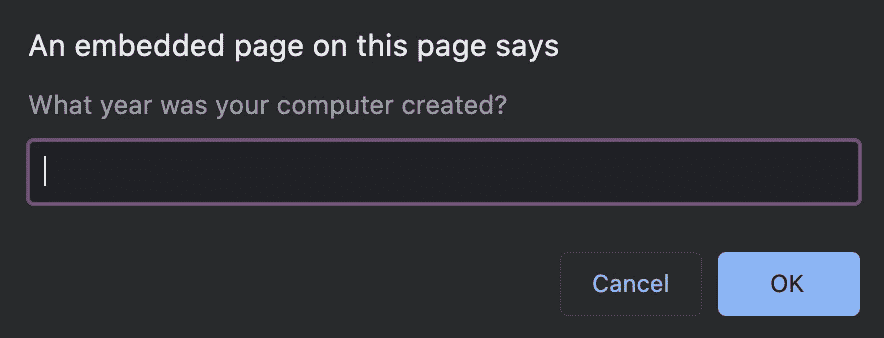
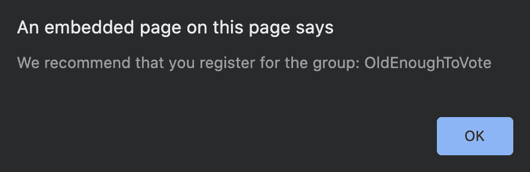
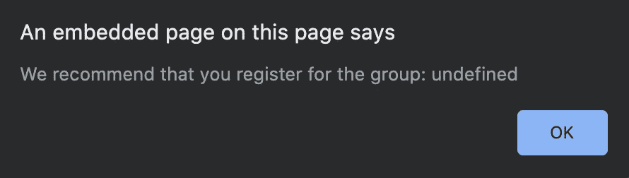
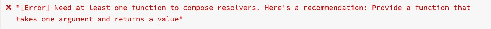

# 控制 JavaScript 错误的最佳实践

> 原文：<https://betterprogramming.pub/best-practices-to-control-your-errors-in-javascript-4cf9f3c9b923>

## 扩展错误类


照片由 [Unsplash](https://unsplash.com/s/photos/corrections-and-errors?utm_source=unsplash&utm_medium=referral&utm_content=creditCopyText) 上的[rom son preech wit](https://unsplash.com/@woodies11?utm_source=unsplash&utm_medium=referral&utm_content=creditCopyText)拍摄。

在编写代码时，考虑可能发生错误的不同情况是很重要的。它们在您的 web 应用程序中起着不可或缺的作用，因为您可以避免致命的情况(比如您的应用程序完全崩溃)，如果不处理这些情况，这些情况是无法避免的。

本文将介绍一些在 JavaScript 中控制和处理错误的最佳实践。

# 扩大误差

在错误处理程序中提供更具描述性的错误通常很有用。我的意思不仅仅是把你的错误信息写得更清楚。我指的是扩展`Error`类。

通过这样做，您可以定制对调试有用的`name`和`message`属性，以及附加需要它的定制 getters、setters 和方法:

这可以提供更流畅的调试体验——尤其是当您有多个类似抛出的代码块时。当代码中的多个场景由于相同的原因抛出并需要一些额外的上下文时，在没有实用程序的情况下返回并找出抛出的确切原因会变得有点困难(当然，这取决于错误的类型)。

让我们回顾一下这个变得有用的场景。

假设您有一个接受解析器函数列表的函数。该函数接受一个参数，当它运行时，它将遍历解析器并将参数传递给每个函数。如果函数返回一个结果，那么它停止循环并返回结果:

现在，假设我们正在构建一个页面，它会提示用户输入他们的出生年份，然后根据他们的年龄将他们分配到某个组:

这段代码提示用户，当他们点击 *OK* 时，他们的年龄被分配给`userInput`，并作为参数发送给`composeResolvers`生成的函数:



当它完成时，它运行`window.alert`向用户显示计算出的组:



这很好，但是如果用户*没有使用 Chrome 浏览器呢？这意味着这条线不会运行:*

```
resolvers.push(someResolverFn)
```

这产生了一个令人尴尬的意外结果:



我们可以通过抛出一个普通的`Error`来防止像这样的未处理的错误，或者我们可以使用更具体的`BadParametersError`:

这样，用户发现错误的机会就小得多，并且让开发人员修复错误:



例如，如果多个函数使用这种策略并附加了一个类似`recommended`的属性，调试体验会变得容易得多。

现在可以写成这样，这是一种更好的防御机制:

# 使用一个`TypeError`

我们经常通过抛出`Error`来处理错误。但是，当内置的 JavaScript 错误可用于缩小机会到来时的场景时，利用它们是有用的:

# 测试

通过利用派生的`Errors`，测试变得更加健壮，因为您能够直接使用它们来做出您的断言:

# 做过头了

知道它有多有用之后，为你能想到的每一个可能的场景创建一堆自定义错误也变得很有诱惑力——尤其是当你刚刚开始学习 JavaScript 的时候。因此，如果您有一个中小型应用程序，并最终处于这样的情况:

然后你可能会重新考虑这种方法，并决定你是否真的需要这样做。很多时候，提供更清晰的错误`message`就足够了。只有当您需要添加一些额外的上下文时，对自定义错误进行断言才能提供最大的好处(例如，对超时请求进行重试的令牌):

# 结论

控制你的错误就能控制你的应用。这也为你节省了时间和金钱。

这标志着文章的结束。希望你觉得有用。以后多多关照！