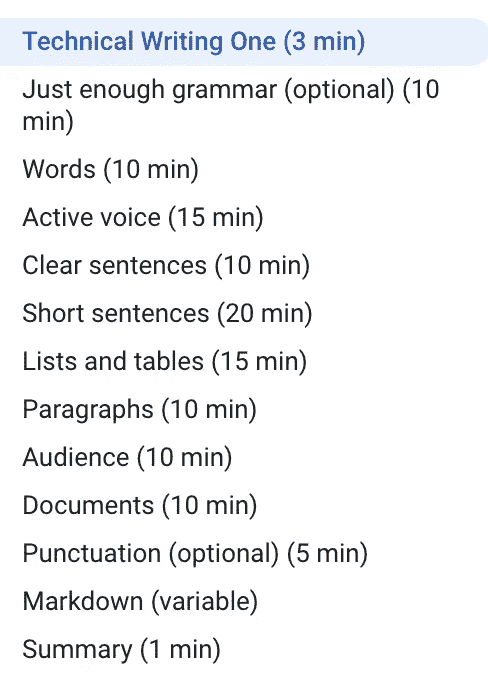
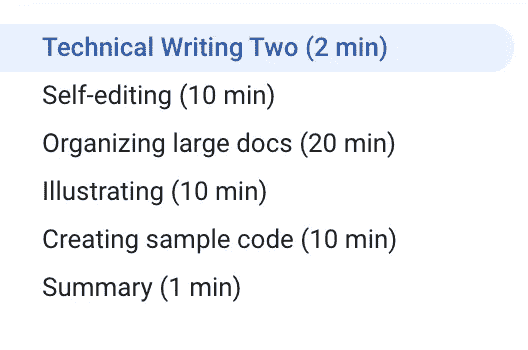
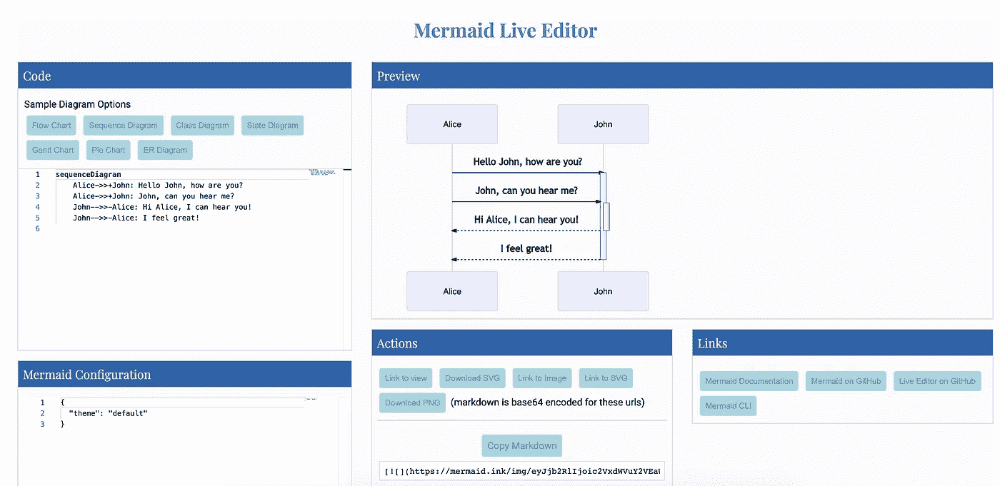
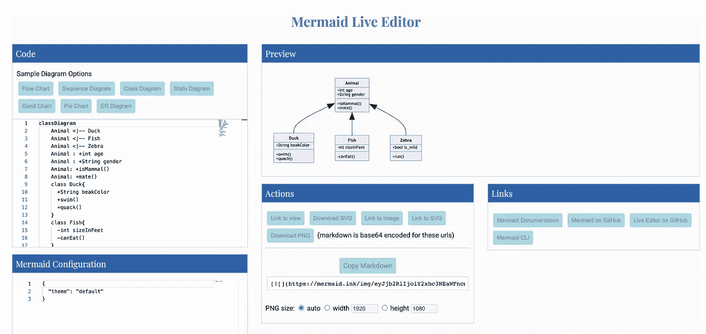

# 为软件工程师记录代码时的最佳实践

> 原文：<https://betterprogramming.pub/best-practices-when-documenting-your-code-for-software-engineers-941f0897aa0>

## 这都是关于清晰、异步的交流


照片来自[未画](https://undraw.co/)。

作为一名软件工程师，掌握编写高质量文档的技能非常重要。由于最近远程工作的增加，更好地进行异步通信变得更加重要。远程公司 GitLab 在[定义异步通信](https://about.gitlab.com/company/culture/all-remote/asynchronous/)方面做得非常出色:

> “异步沟通是一种沟通和推进项目的艺术，在发送公报的同时，不需要其他利益相关方在场。”

高质量的文档是实现有效异步通信的一种更简单的方法。在这篇文章中，我将谈论一些有趣的技巧，我发现这些技巧在我的个人经历中非常有用。

# 谷歌科技写作课程

谷歌为软件工程师提供免费的科技写作课程。它从科技写作的基础开始。共有两门课程，内容如下所示:



TOC——谷歌科技写作一



TOC——谷歌技术写作二

擅长科技写作不是一蹴而就的。这需要练习。我个人更喜欢每个月参观这个课程，以提醒自己最佳实践。

# 使用 Divio 文档框架

在所有其他文档框架中，我个人最喜欢 [Divio](https://www.divio.com/) 。文件系统建议有容易和普遍适用的。

该框架建议将文档分为以下几类:

*   教程—以学习为导向
*   操作指南—以解决问题为导向
*   解释——面向理解
*   参考—面向信息

该方案被许多著名的开源项目和企业广泛采用。

这里有一个很棒的视频解释了这个框架的细节:

# 使用基于降价的系统进行记录

在典型的企业中，有多种方法可以维护您的文档。有些人喜欢创建 MS Word/Excel 文档，然后上传到 SharePoint 或 OneDrives。这类文档的最大问题是，它们无法使用内部搜索引擎进行搜索。因此，我个人更喜欢使用基于降价的文档系统。创建和维护文档很容易，并且文档是可搜索的。

如果你不熟悉 Markdown，你可以很容易地掌握它。查看 GitHub 免费推荐的[课程](https://guides.github.com/features/mastering-markdown/)。

# 为图表使用 Mermaid JS

根据 [Mermaid](http://mermaid-js.github.io/mermaid/) 自己的说法，它“是一个基于 Javascript 的图表工具，使用受 Markdown 启发的文本定义和渲染器来创建和修改复杂的图表。”如果你用的是 GitLab 或者 Azure DevOps，原生支持美人鱼。如果你用的是 GitHub 或者 Atlassian 的产品，那么是有插件可用的。

使用 Mermaid，创建和更新图表非常容易，您不需要在每个开发人员的工作站上安装任何 UML 工具，如 Visio/draw.io。

这里有一些用 Mermaid 创建的示例图



使用 Mermaid 的示例序列图



使用 Mermaid 的示例类图

你也可以尝试使用[美人鱼编辑器](https://mermaid-js.github.io/mermaid-live-editor/)来创建图表。

# 使用模板

像 Confluence 这样的网站上有很多模板可以用于特定类型的文档。例如:

*   [软件架构评审模板](https://www.atlassian.com/software/confluence/templates/software-architecture-review)
*   [架构决策记录模板](https://github.com/deshpandetanmay/lightweight-architecture-decision-records/blob/master/doc/adr/0001-use-elasticsearch-for-search-api.md)
*   [事故事后模板](https://www.atlassian.com/software/confluence/templates/incident-postmortem)
*   [DevOps 运行手册](https://www.atlassian.com/software/confluence/templates/devops-runbook)
*   [决策模板](https://www.atlassian.com/software/confluence/templates/decision)
*   [写作指南](https://www.atlassian.com/software/confluence/templates/writing-guidelines)
*   [OKR 模板](https://www.atlassian.com/software/confluence/templates/okrs)
*   等等。

# 请参考风格指南

如果你的团队还没有风格指南，参考谷歌和微软的做法:

*   [微软风格指南](https://docs.microsoft.com/en-us/style-guide/)
*   [谷歌开发者文档风格指南](https://developers.google.com/style)

# 参考

*   [谷歌科技写作课程](https://developers.google.com/tech-writing)
*   [Divio 文档框架](https://documentation.divio.com/)
*   [美人鱼](https://mermaid-js.github.io/mermaid/#/)

```
Hey, if you enjoyed this story, check out [Medium Membership](https://deshpandetanmay.medium.com/membership)! Just $5/month!*Your membership fee directly supports me and other writers you read. You’ll also get full access to every story on Medium.*
```