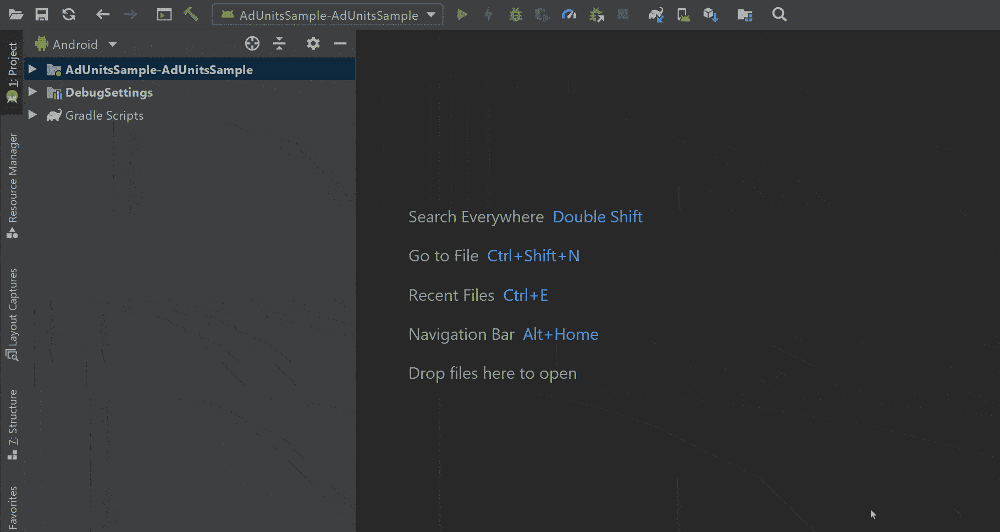

# 使用 Kotlin DSL 脚本在 Android 中捆绑依赖关系的最佳方式

> 原文：<https://betterprogramming.pub/best-way-to-bundle-dependencies-in-android-using-kotlin-dsl-scripts-dc3478cff820>

## 通过单一的事实来源在一个地方维护所有的依赖关系。多模块项目的依赖管理


照片由[哈维·加西亚·查维斯](https://unsplash.com/@javchz?utm_source=medium&utm_medium=referral)在 [Unsplash](https://unsplash.com?utm_source=medium&utm_medium=referral) 上拍摄

本文将解释我们从祖先到现在维护依赖关系所遵循的模式。主要目标是维护一个关于依赖关系的真实的单一来源，这样就很容易维护和更新它们，而不需要深入到单独的`build.gradle`文件中。

# 老办法

最初，我们用来声明依赖关系和其他属性，如下所示。

app level @build.gradle

上述声明依赖关系的方式并不是处理事情的最佳方式。

例如，如果我们有多个模块，比方说，我们有一些跨模块使用的公共依赖关系。在这种情况下，如果我们遵循上面的方法，我们需要在多个`build.gradle`文件中声明它。

在这种情况下，如果有更新，那么我们需要挖掘每一个包含这种依赖的`build.gradle`，并需要在多个点更新版本。

在维护大型项目时，这给我带来了许多问题。

# 中间道路

解决上述问题的简单方法是使用项目级的`build.gradle`来维护依赖项的版本，并在多个点上使用它们，如下所示。

项目级别@build.gradle

app level @build.gradle

这个问题在某种程度上得到了解决，但是这种方法也有其缺点。其中之一是我们需要挖掘单个的`build.gradle`文件来声明依赖关系，这不是一个好方法。

# 解决办法

这是一个解决方案，我们需要在一个文件中维护所有的依赖关系，并在多个模块中访问您想要的任何内容，遵循一个真实的来源。

这使得维护和更新依赖关系集合变得容易。

当一个新人加入你的团队时，它也很有帮助，它提供了一个概览，一眼就能看到你正在使用的所有依赖项，而不是在模块级别挖掘单个的 [Gradle](https://gradle.org/) 文件。

1.  创建一个 [Kotlin](https://kotlinlang.org/) DSL 脚本文件，如下所示。(我们把它命名为`dependencies.gradle`，因为它包含了所有的应用依赖项。你可以给它起任何名字。)



dependencies.gradle

2.将所有依赖项和版本添加到这个文件中，如下所示。

基本实现示例@dependencies.gradle

3.现在，为了让单个模块访问这个文件，我们需要在项目级`build.gradle`中指定它的地址，如下所示。

```
apply from: 'dependencies.gradle'
```

4.一切都设置好了，现在我们可以单独访问依赖项了。模块如下所示。

app level @build.gradle

# 最佳实践

假设我们有一个带有`app`、`device`、`data`和`library`模块的应用程序。为模块级依赖关系维护一个单独的数组，如下所示，以获得干净的代码。

模块级别@dependencies.gradle

现在，如果我们想将`dependencies.gradle`文件中的`deviceDependencies`访问到`device` 模块的`build.gradle` 文件中，我们只需如下调用一行代码:

```
implementation rootProject.ext.deviceDependencies.values()
```

类似地，我们在它们各自的`build.gradle`文件中用上面的一行代码访问其他模块依赖关系。

这解决了挖掘单个`build.gradle`文件来检查和更新依赖关系的模糊性问题。这将是维护依赖关系的一种更好、更干净的方式。

如果有任何疑问或建议，请随时评论。

感谢您的阅读。