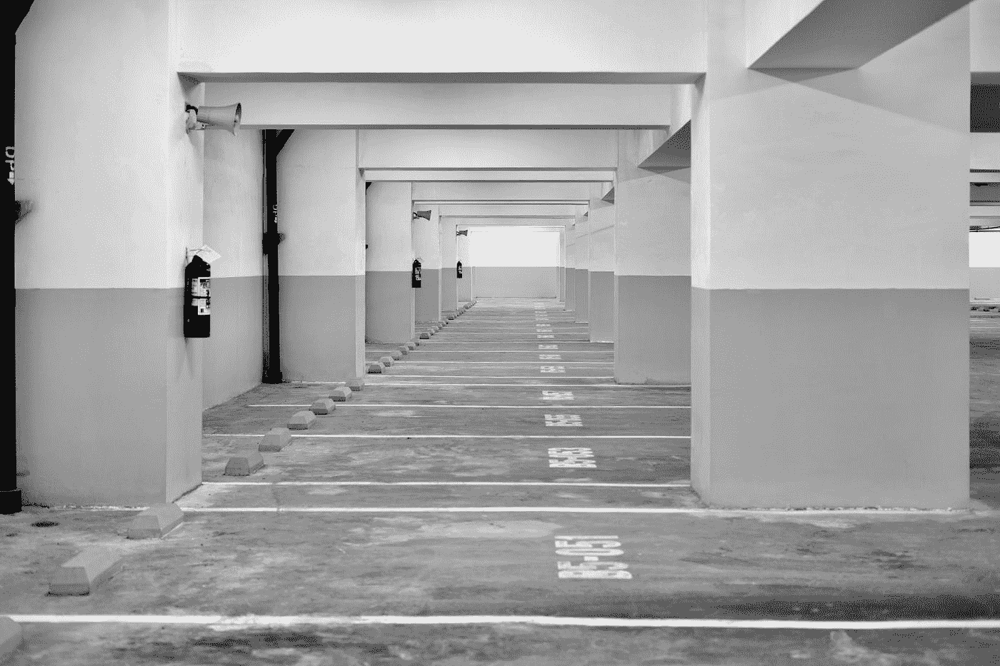
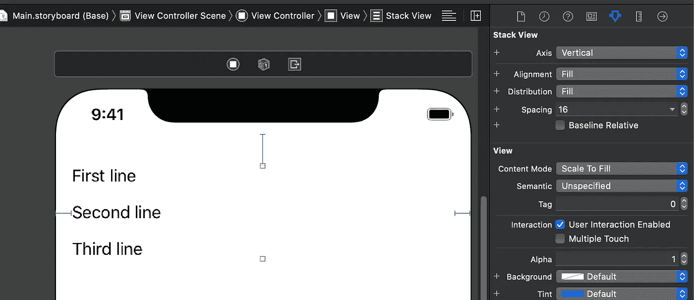
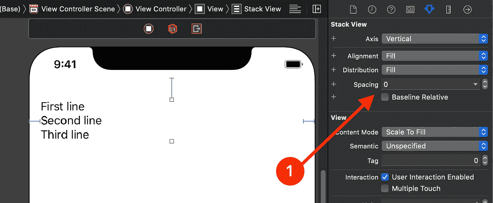
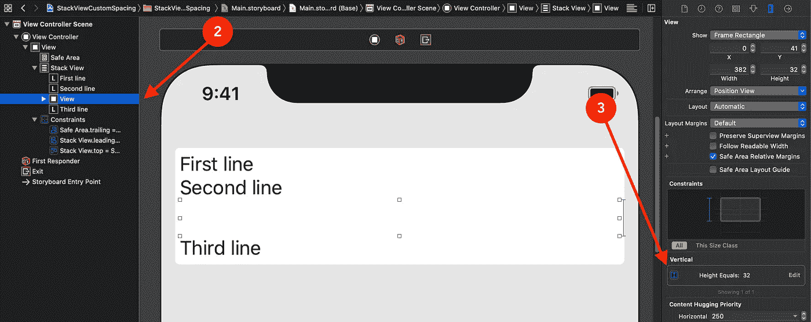
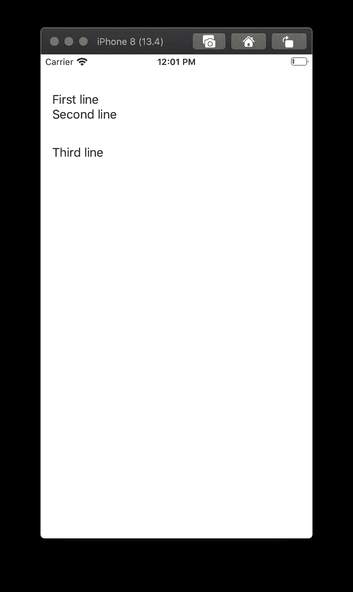

# 如何在 UIStackViews 的排列好的子视图之间添加自定义间距？

> 原文：<https://betterprogramming.pub/best-way-to-handle-dynamic-spacing-in-uistackviews-e5c14bcf083e>

## 您正在使用间隔视图吗？那么这是必读的

[Faisal Waheed](https://unsplash.com/@fwaheed17?utm_source=medium&utm_medium=referral) 在 [Unsplash](https://unsplash.com?utm_source=medium&utm_medium=referral) 上的照片。

UIStackView 是 UIKit 提供的一个优秀的组件，它可以自动处理 AutoLayout 约束。如果你还没用过，你应该开始用了。我可以保证的一件事是，它将为您节省大量时间，尤其是如果您正在以编程方式进行布局。让我们来谈谈如何在一个堆栈视图的排列好的子视图之间增加空间。

# 权力和限制

UIStackViews 的一个明显优势是`Spacing`属性的工作方式。您将其设置为 16 磅，堆栈视图的每个排列的子视图之间将有一个固定的 16 磅空间。这本身就已经很神奇了。

但是这也可以被认为是一种限制。不是所有的布局都需要视图之间这种对称的间距。在那种情况下你该怎么办？

# 解决方案 1:使用特殊的间隔视图

如果我们希望第二个和第三个标签之间的间距为 32pt，那么我们可以将 stack 视图的`Spacing`设置为 0pt，并使用具有 32pt 高度约束的 spacer 视图。间隔视图只是简单的 ui 视图，但是因为它们的目的只是保持空间，所以它们被称为间隔视图。请记住，我们还需要添加间隔视图的高度约束。

## 我们在这里做了什么？

1.  我们将堆栈视图的`Spacing`设置为 0pt。之前是 16 分。
2.  我们在第二个和第三个标签之间添加了一个简单的 UIView。
3.  我们为刚刚添加的间隔 UIView 添加了一个常数为 32 的高度约束。

现在，我们可以在故事板中看到，标签按照我们想要的方式排列。这是 iOS 9 和 10 中的唯一方式。但是从 iOS 11 开始，苹果推出了一个叫做自定义间距的特殊功能。

# 解决方案 2:自定义间距(iOS 11+)

我知道，添加间隔视图感觉很粗糙。苹果肯定也有这种感觉。也许这就是他们引入自定义间距的原因。不过，这个特性只能在代码中使用。

## 步伐

1.  创建一个栈视图的`IBOutlet`和代码中的第二个标签。这样，我们将能够在 Swift 文件中访问它们。
2.  删除我们之前添加的间隔视图。所以在故事板中，你的堆栈视图看起来像是标签之间的 0 磅间距。
3.  在`viewDidLoad`中添加下面的代码并运行项目:

## 输出

如下图所示，第一个和第二个标签之间没有任何间距，而第二个和第三个标签之间的间距正好是 32 磅。

# 下载代码

 [## akshitzaveri/StackViewCustomSpacing

### 通过在 GitHub 上创建一个帐户，为 akshitzaveri/StackViewCustomSpacing 开发做出贡献。

github.com](https://github.com/akshitzaveri/StackViewCustomSpacing) 

感谢您的阅读。如果你有任何问题，请让我知道。

# 资源

 [## setCustomSpacing(_:后:)

### 在指定视图后应用自定义间距

developer.apple.com](https://developer.apple.com/documentation/uikit/uistackview/2866023-setcustomspacing)