# 覆盖角度材料样式的 3 种正确方法

> 原文：<https://betterprogramming.pub/best-way-to-overwrite-angular-materials-styles-e38dc8b84962>

## 为您的 web 应用程序创建漂亮的组件


由 [Gabe Rebra](https://unsplash.com/@garebra?utm_source=medium&utm_medium=referral) 在 [Unsplash](https://unsplash.com?utm_source=medium&utm_medium=referral) 上拍摄的照片。

在每个项目的初始阶段，每个前端开发人员总是面临着是否使用 UI 组件库的问题。

现在，市场上有大量的 UI 库可以增强和促进我们的开发过程。其中最流行的，我们可以识别 Angular Material，Ngxbootstrap，Ngbootstrap，PrimeNG，Semantic UI 等等。

有一天，我决定直接从谷歌工厂为我的 Angular 项目使用一个库(即 [Angular Material](https://material.angular.io/) )。我不得不在项目中使用很多组件，比如输入、扩展面板、对话、标签等。

不幸的是，有一个缺点:UI 设计师在高保真实体模型中准备的组件的外观与 Angular Material 提供的有些不同。但是，对于一个有经验的前端开发者来说，这显然不是一个挑战。毕竟，这就是我们在这里的目的——创建客户想要的组件外观和行为。

但是对于 AM 库就没那么容易了。

在本文中，我们将在一个简单的 AM 标签组件中覆盖一些样式。让我们尝试更改选项卡指示器的`background-color`:

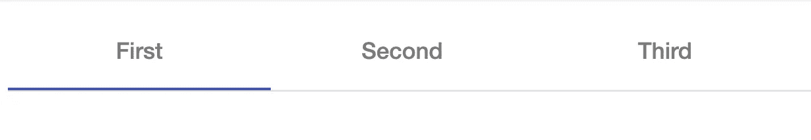

角度材料选项卡组件

首先，我们检查包含负责`background-color`的样式的 DOM 元素:

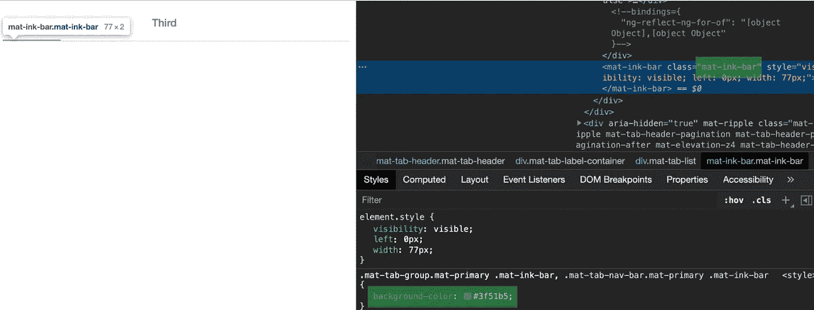

标签指示器背景颜色—检查模式

让我们像通常在组件的 SCSS 文件中那样覆盖样式:

```
//tabs.component.scss.mat-tab-group.mat-primary .mat-ink-bar {
  background-color: red;
}
```

正如你在下面看到的，`background-color`没有改变。为什么会这样呢？

[](https://stackblitz.com/edit/am-example-1-tabs?embed=1&file=src/app/app.component.ts) [## am-示例-1-tabs - StackBlitz

### 导出到 Angular CLI 的 Angular 应用程序的启动项目

stackblitz.com](https://stackblitz.com/edit/am-example-1-tabs?embed=1&file=src/app/app.component.ts) 

答案很简单:Angular 使用了[视图封装](https://angular.io/guide/view-encapsulation)模式，它将一些额外的属性(`_ng-content-***-***`)附加到每个 DOM 元素上，将整个 SCSS 代码包装到组件的唯一属性中。

为了简单起见，我们采用默认的 HTML 按钮:

```
app.component.html<button>Example button</button>
```

并对其进行造型:

```
//app.component.scssbutton {
  background-color: red;
}
```

我们在检查模式下看到的内容:

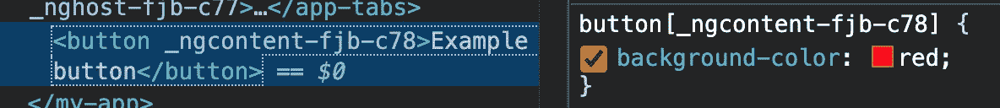

按钮背景颜色—检查模式

[](https://stackblitz.com/edit/am-example-2-button?embed=1&file=src/app/app.component.ts) [## am-示例-两个按钮的堆栈

### 导出到 Angular CLI 的 Angular 应用程序的启动项目

stackblitz.com](https://stackblitz.com/edit/am-example-2-button?embed=1&file=src/app/app.component.ts) 

视图封装模式已经自动添加了唯一属性。如果我们回到标签的例子，我们会发现 AM 并不总是为每个 DOM 元素添加一个特殊的属性:

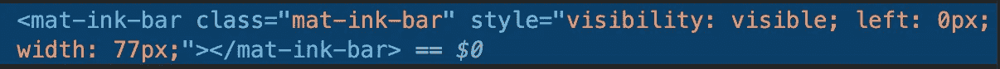

标签指示器—检查模式

当我们尝试在作用域模式下对组件进行样式化时，我们看不到任何结果，因为浏览器会像这样读取我们的样式:

```
.mat-tab-group.mat-primary[_ng-content-***-***] .mat-ink-bar {
  background-color: red;
}// -***-*** is unique numbers
```

# 那么重写 AM 样式的正确方法是什么呢？

网上有很多关于如何覆盖 AM 样式的例子，但是这些方法要么使用起来有风险，要么被弃用。

## 1.关闭视图封装模式(删除唯一属性)

我遇到的最常见的答案是关闭视图封装模式。

如何才能实现这一点？

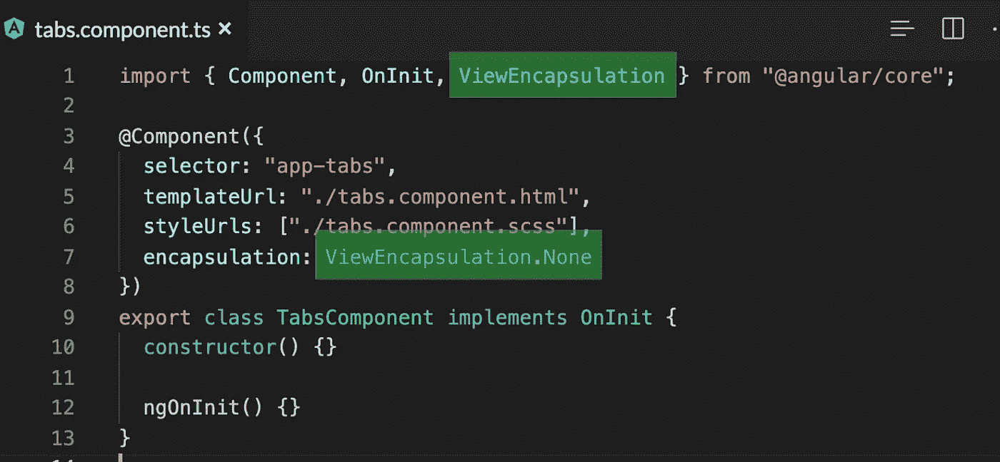

关闭视图封装模式

我们从`"@angular/core"`导入`ViewEncapsulation`，在`@Component`元数据内部，我们设置`encapsulation: ViewEncapsulation.None`。

从现在开始，组件的 DOM 元素中不再有任何唯一的属性，我们的样式将是全局的。

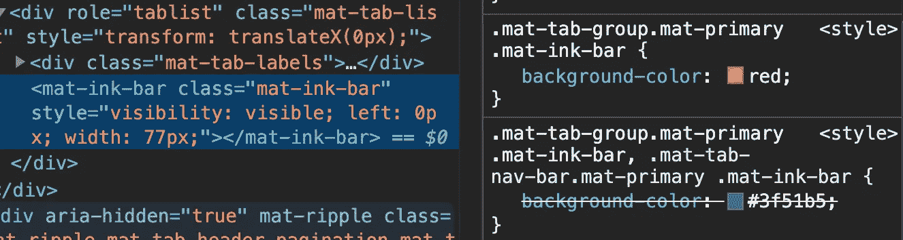

标签指示器背景颜色—检查模式

这是可行的，但是风险很大，因为现在我们影响了应用程序的其余部分。前面讨论的隔离、范围规则和唯一属性不再有效。每个选项卡组件都将应用此规则。我们不想这样做。

[](https://stackblitz.com/edit/am-example-3-view-encapsulation?file=src/app/app.component.ts) [## am-示例-3-视图-封装-堆栈

### 导出到 Angular CLI 的 Angular 应用程序的启动项目

stackblitz.com](https://stackblitz.com/edit/am-example-3-view-encapsulation?file=src/app/app.component.ts) 

## 2.:host & ::ng-deep 伪类(已弃用)

另一个经常出现的答案是实现已被弃用的伪类`::ng-deep`并覆盖特殊选择器`:host`。

让我们试一试:

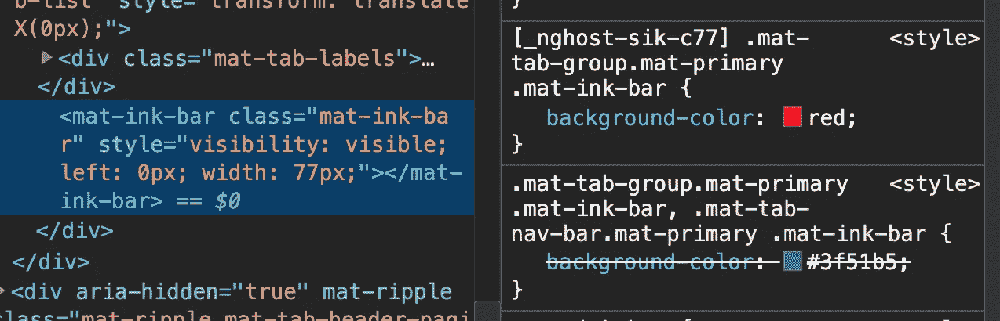

选项卡指示器背景颜色—检查模式

这里发生了什么？

*   `:host` —添加宿主组件`[_nghost-sik-c77]`的唯一属性，它覆盖了我们的样式，因此它将只影响我们的组件。太好了！
*   `:ng-deep` —从选项卡的 DOM 元素中删除唯一属性。

哦，有用！但是等等……在 Angular 网站上，有[以下信息](https://angular.io/guide/component-styles):

> 将`::ng-deep`伪类应用于任何 CSS 规则都会完全禁用该规则的视图封装。任何应用了`::ng-deep`的样式都会成为全局样式。
> 
> “…我们计划取消对 Angular 的支持(针对所有 3 个`/deep/`、`>>>`和`::ng-deep`)。”

就像上面的例子一样，这个解决方案关闭了视图封装，所以您的样式是全局的。

另一件事是，例如，你在 Angular 11 中使用`::ng-deep`，但也许未来的 Angular 版本会删除它。一段时间后，您的客户可能希望将他们的项目更新到最新的 Angular 版本，您会发现很难覆盖所有使用这个不推荐的伪选择器的样式。

[](https://stackblitz.com/edit/am-example-4-ng-deep?file=src/app/app.component.ts) [## am-example-4-ng-deep-stack blitz

### 导出到 Angular CLI 的 Angular 应用程序的启动项目

stackblitz.com](https://stackblitz.com/edit/am-example-4-ng-deep?file=src/app/app.component.ts) 

## 3.在单独的全局样式中覆盖 AM 样式—没有作用域！

经过深入的分析，我发现了一种用合适的 SCSS 结构覆盖 AM 样式的方法，没有任何风险，也没有被否决的方法。

在每个复杂的项目中，我使用[SASS 7–1 模式](https://gist.github.com/rveitch/84cea9650092119527bc)来排列我的 SCSS 文件。

```
| — scss
  | — base
  | — components
   | — **am-components** | — layout
  | — pages
  | - themes
  | — utils
  | — vendors
```

如你所见，一个名为`am-components`的新文件夹被添加到了`components`文件夹中。在这里，我将存储我所有只负责 AM 组件的`.scss`文件。

让我们来创建这个:

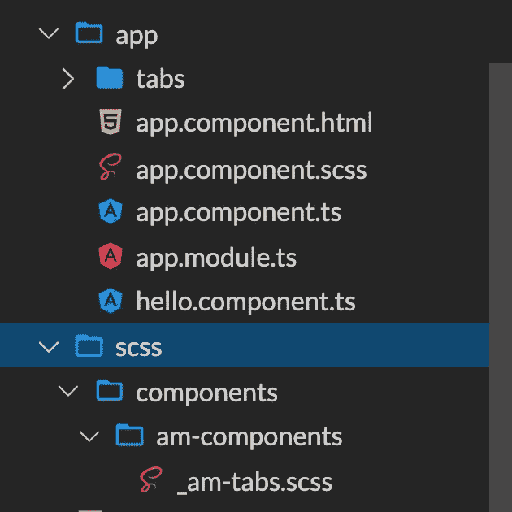

SCSS 结构

我创建了导入到主`styles.scss`文件中的`_ab-tabs.scss`文件:

```
//styles.scss@import "scss/components/am-components/am-tabs";
```

那么我们如何覆盖我们的 AM 标签组件样式呢？

角度材质尽可能对其组件使用最不特定的选择器，以便于覆盖它们。更具体的样式将优先于不太具体的样式。所以在我们的例子中，我们必须添加更多的特性来覆盖我们的 AM 样式。最好的方法是使用组件选择器的名称。

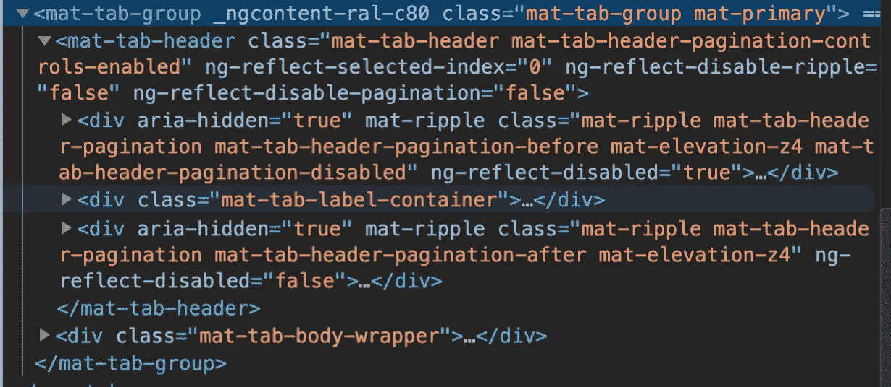

选项卡组件—检查模式

```
//_am-tabs.scssmat-tab-group {
  &.mat-tab-group.mat- primary .mat-ink-bar {
    background-color: red;
  }
}
```

目前，我们得到了与使用`::ng-deep`伪选择器相同的结果，但是它永远不会被弃用！

如果我们想给另一个标签设计不同的样式呢？

这很容易——只需向您的组件添加一个独特的类:

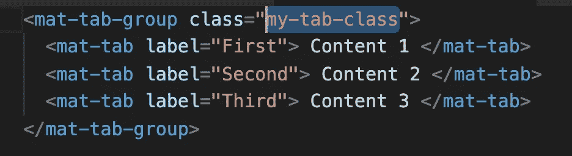

标签组件的 HTML

现在我们带有`.my-tab-class`的 AM 标签组件有一个绿色指示器。

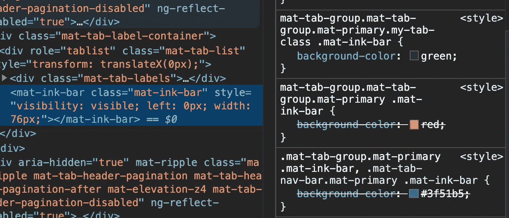

选项卡指示器背景颜色—检查模式

[](https://stackblitz.com/edit/angular-global-styles?file=src/app/app.component.ts) [## 角度-全局-样式-堆叠

### 导出到 Angular CLI 的 Angular 应用程序的启动项目

stackblitz.com](https://stackblitz.com/edit/angular-global-styles?file=src/app/app.component.ts) 

# 结论

如你所见，有很多选项可以覆盖我们的 AM 风格。不幸的是，它们中的许多会给你的项目带来一些问题(例如`::ng-deep`或者关闭视图封装模式)。让我们的组件变得漂亮的最好方法是使用经典的全局样式和一个坚实清晰的图案，比如 7–1，然后用更具体的样式覆盖它们。