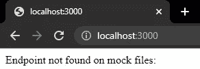
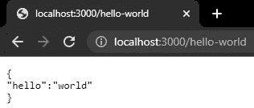

# 我为前端开发做了一个 Web API 模仿器解决方案

> 原文：<https://betterprogramming.pub/best-web-api-mocker-solution-for-front-end-development-6482b619e172>

## 在前端很容易伪造一个 API


[格伦·凯莉](https://unsplash.com/@glencarrie?utm_source=medium&utm_medium=referral)在 [Unsplash](https://unsplash.com?utm_source=medium&utm_medium=referral) 上拍摄的照片

大多数前端项目依赖后端请求来检索或更新一些信息。为了确保后端不会成为前端任务的瓶颈，定义契约是一个很好的实践，这样双方都可以继续前进。

定义了这些契约后，前端需要做的就是处理预期的有效负载响应数据。一个好的开始是模仿(尽可能少的努力)这个`web-api`，有可能开发项目的所有层(包括 HTTP 处理程序)。

在本文中，我将向您展示如何使用 docker 轻松创建一个基于目录和文件的`web-api` mocker 解决方案。

# 先决条件

您需要在计算机上安装:

*   码头工人
*   Docker 撰写

# 入门指南

在你的机器上安装了`docker` 和`docker-compose`之后，我们就可以开始了！

首先，创建一个文件夹，姑且称之为`sample`

```
mkdir sample
```

在`sample/`文件夹中，创建一个包含以下内容的`docker-compose.yaml`文件:

# 运行 docker 映像

在当前位置打开终端，并运行以下命令:

```
docker-compose up -d
```

要关闭应用程序，请运行以下命令:

```
docker-compose down -v
```

您将看到一个名为`data/`的文件夹被创建。您还将通过访问以下命令来检查您的 API 是否已经启动并正在运行:

```
[http://localhost:3000/](http://localhost:3000/)PS: It also generates an exposed URL that can be access Worldwide. Check **Learn More** section for details.
```



Web API 启动并运行

现在，让我们用一些内容填充我们的`web-api`。

# 创建 web api 内容

要创建请求 URL 路径，只需在`data/`中添加一个文件夹。
要创建有效负载响应，只需创建一个 JSON 文件，使用 HTTP 动词作为其名称。

让我们看一个基本的例子。创建以下结构:

```
sample/
  data/
    hello-world/
      GET.json
```

并将`GET.json`文件的内容填入:

```
{
"hello":"world"
}
```

这将导致以下模拟:

```
Request: GET [http://localhost:3000/hello-world](http://localhost:3000/hello-world)
Response:
 Status: 200
 Payload:
   {
    "hello":"world"
   }
```



获取[http://localhost:3000/hello-world](http://localhost:3000/hello-world)

# 高级用法

上一个示例非常简单，但是您可以通过使用:

*   其他 HTTP 动词(获取、发布、上传、修补和/或删除)
*   路径参数
*   使用 JavaScript 文件并定制响应(状态、动态内容、延迟、查询参数等)

如需更多数据样本，请查看此[链接](https://github.com/andrebnassis/web-api-mocker/tree/master/sample)。

# 了解更多信息

我向你展示的只是你能做的事情的冰山一角。

例如，该解决方案还可以通过在容器运行时生成一个域`https://<subdomain>.loca.lt`向外界公开本地主机，例如，在移动项目开发期间易于使用 web API。

因此，如果你想更多地了解这个解决方案，你可以通过 [GitHub](https://github.com/andrebnassis/web-api-mocker) 访问完整的文档

非常感谢！希望你喜欢它！任何反馈都将不胜感激！

# 参考

1.  [为您的前端(React)项目设置本地模拟 API](https://blog.harveydelaney.com/setting-up-a-mock-api-for-your-front-end-react-project/)
2.  [连接-api-mocker](https://www.npmjs.com/package/connect-api-mocker)
3.  [本地隧道](https://www.npmjs.com/package/localtunnel)