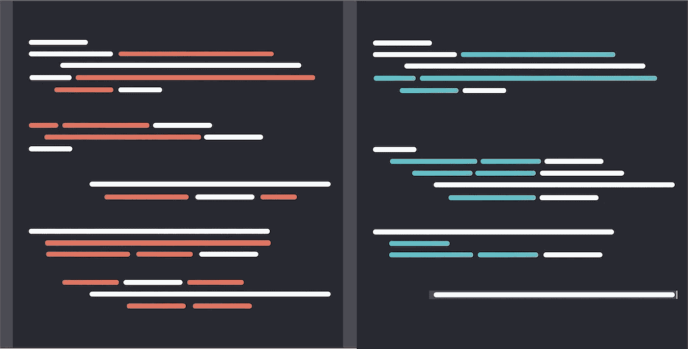
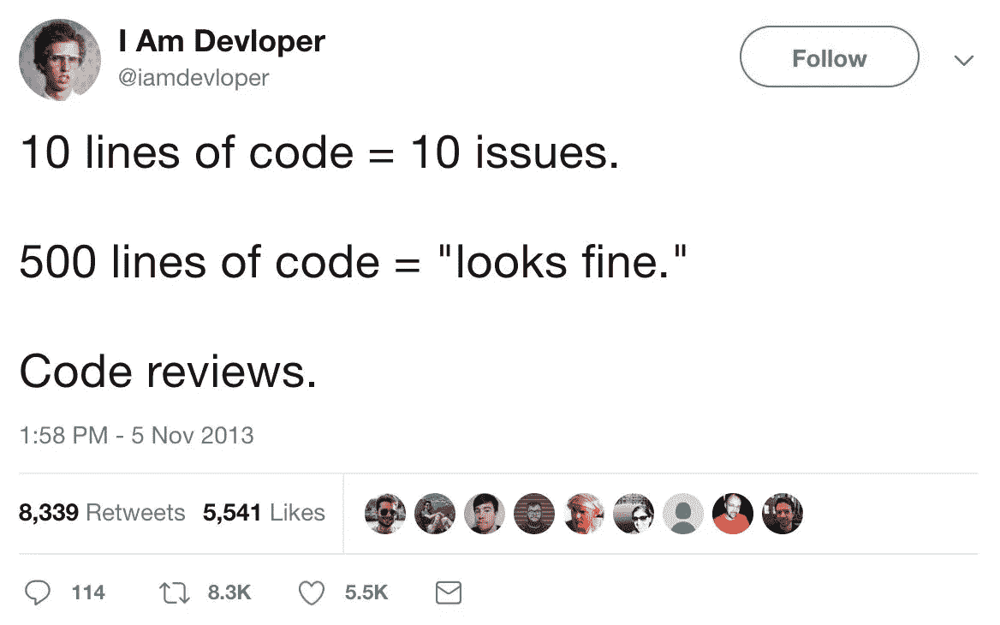
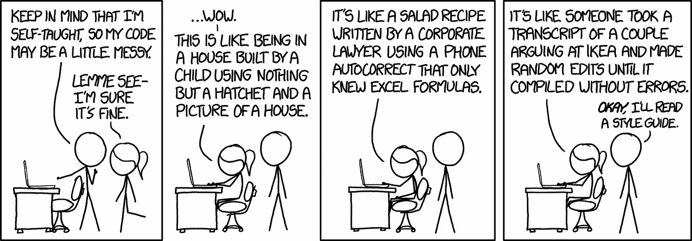

# 更好的代码审查

> 原文：<https://betterprogramming.pub/better-code-reviews-190efd53bc10>

## 成为一个更有效、更有同情心的评论者

asana[https://blog . asana . com/2016/12/7-提升你的代码评审技能的方法/](https://blog.asana.com/2016/12/7-ways-to-uplevel-your-code-review-skills/#close)

审查代码是开发人员每天都要做的事情。这可能是一个令人羞愧的学习经历，但也可能变成一个以自我为中心的过程。在过去的几年里，我通过个人经历或来自同行的优秀建议，学到了一些最佳实践，帮助我成为一个更有效、更有同情心的评审者。我想分享一些这方面的信息，希望能帮助到其他人。这篇短文分为两个主要部分:1 .获得对你工作的最佳反馈。为你的同行提供很好的评论。

# 构建你的公关，让他们的生活变得轻松

@ iam developer【https://twitter.com/iamdevloper/status/397664295875805184 T2

## 避免大量的变更日志

*   保持小规模——如果可能的话，少于 300 行修改。
*   如果一件作品需要 600 多行，试着把它分成更小的逻辑块，可以单独审阅。
*   没人想被送去一个 1000 行的公关怪物。优秀的评审者通常会拒绝这种规模的拉取请求；他们从经验中知道，他们可能无法有效地审查它。

## 理解结构

*   将类似的更改分组到提交中。改变一堆文件的位置而不修改它们？将它分组到自己的提交中，这样评审者就知道这不是他们需要关注的逻辑变更。
*   经常提交更改以缩小其范围。对于较大的作品，当提交量较小时，评审者更容易关注什么是重要的。

## 短路可能造成混乱

*   如果您修改了先前提交集合中存在的逻辑或结构，请确保您通知了评审者，这样他们就不会转移到评论现在不存在的代码上。这适用于审阅者逐个提交的情况。

## 提供足够的背景

*   确保你的公关描述清楚，无论是通过一个链接的门票或书面描述的公关，或最好两者兼而有之。提供你的工作如何影响项目的例子，视觉的或其他的。从评审者的角度看问题，尽可能让他们理解你的拉动请求的目的。

# 高效和有效地接近队友的公关

## 及时审查

*   一旦您被添加为 PR 的审核人，请尽快对其进行审核。
*   从申请到完成第一次审核的最长时间不得超过一个工作日。

## 如果缺少上下文，收集上下文

*   如果公关缺乏背景，或其变化的描述，接触到作者，并在审查前得到澄清。这可以大大减少由于对代码或目的的误解而导致的来回。

## 从高水平开始

*   从高层往下回顾。在更大的问题(如果存在的话)解决之前，不要评论像风格这样的小变化。这样作者可以首先关注最重要的修改。有时小问题会随着大变化而消失。
*   这也降低了[自行车脱落](https://en.wikipedia.org/wiki/Law_of_triviality)的可能性，自行车脱落会分散工作中更重要和更有影响力的方面。

## 处理分歧

*   如果您不同意某个代码块，请提供一个代码示例，说明您建议如何使用它。这对于其他开发人员来说比仅仅留下一个注释“这应该是不同的”要有用得多。

## 请求更改

*   除非工作有根本性的问题，否则不要阻止公关。在你的同事面前设置一个关于命名争论的路障对团队中的任何人都没有帮助。给你的队友一个机会来解决小的变化，继续他们的任务，而不需要等待新一轮的反馈。
*   小问题应该通过项目风格指南来解决——但那是完全不同的话题。

## 神入

https://imgs.xkcd.com/comics/code_quality.png xkcd

*   最重要的是，*记住还有一个人在你的评估的最后*。以有益和建设性的方式提供反馈。如果是您的拉动式请求被审核，请始终考虑您希望如何获得反馈。

这些是我多年来从同事和个人经历中获得的一些建议。每一个都直接适用于我，我希望它们也能帮助你。