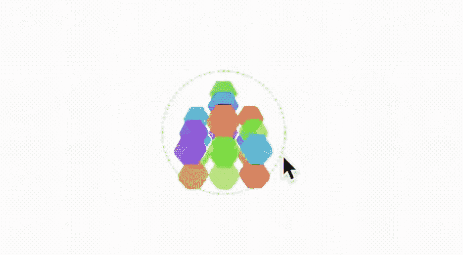

# 更好的编程周刊第 49 期

> 原文：<https://betterprogramming.pub/better-programming-weekly-issue-49-911eeb766ddf>

## 咖啡字节，由更好的编程通讯

标志由 Deon Ashleigh 设计

各位，周五快乐，

我们希望你度过了愉快的一周。我们已经为您的周末准备了一些有趣的故事，包括 PyWeb3D 的第一印象，Astro 的介绍，您可以使用它来开始使用最新的 JavaScript 框架，以及一些前端项目。

事不宜迟，以下是我本周最喜欢的七本书。

## [**PyWeb3D — Three.js 使用 Python**](/animating-3d-models-using-pyweb3d-ca5ad462235a)

首先， [Bruno Odinukweze](https://medium.com/u/9055f33b18ea?source=post_page-----911eeb766ddf--------------------------------) 让我们先来看看 [PyWeb3D](/three-js-with-python-syntax-pyweb3d-2152bed1a43d) ，这是一个使用 Three.js 而不使用 JavaScript 的开源项目。他的文章展示了你可以在浏览器中用它实现什么——比如加载、动画 3D 模型，以及在 3D 中创建文本。

## [**使用 Memo 和 useCallback 的更好方法**](/a-better-way-to-usememo-and-usecallback-58288a19f91c)

Denno Scott 带着一份详尽的指南回来了，该指南强烈反对对流行技术的过度推广使用。如果您正在寻找构建复杂的应用程序，这是值得一读的，我们中的许多人都是这样做的！

## [**Astro JS 简介**](/working-with-astro-the-super-fast-web-framework-5dadd98f8e39)

Astro 是 JavaScript 生态系统中相对较新的一员，它承诺了一种范式转变——在这种范式转变中，您可以使用任何框架(包括 Astro 本身)进行构建。詹妮弗·傅教我们如何用新的网络框架构建一个简单的应用程序。

## [**在 SwiftUI 中构建 3D 编辑器**](/build-a-3d-editor-in-swiftui-and-scenekit-7a680e95d8a)

Mark Lucking 继续他在 SceneKit 的探索。这一次，他构建了一个 3D 编辑器来放置立方体。整个开发过程中所面临的挑战使得这篇文章对 iOS 开发者来说是值得的。

## [**利用扑动火焰模拟鸟群**](/simulate-birds-flocking-using-multi-agent-system-and-flutter-flame-69e8b1aca4ef)

Julien 开始利用多代理系统构建一个 Flutter 应用程序。我从来没有使用过 Flutter 驱动的游戏引擎，所以这似乎是一个很好的资源来度过我的周末。谢谢朱利安。

## [吃 T3。睡觉。代码。复读？不了，谢谢你！](/eat-sleep-code-repeat-no-thank-you-a9dd1181cc3e)

Inna Sinicka 讲述了她如何通过工具、技术和习惯来平衡工作与生活，这些让她的生活更有效率，也没有一点压力。

## [**开源贡献让你成为更好的软件工程师的 6 个理由**](https://medium.com/p/554cc2b1279d)

开源在塑造软件业的过程中扮演着重要的角色，我们可以通过对它的贡献学到很多东西。下面 [Noah Ispas](https://iamnoah1.medium.com/?source=user_profile-------------------------------------) 来告诉我们它是如何帮助他提高软件工程和其他技能的！

这就结束了这个问题。直到你下次喝咖啡，

[Anupam](https://anupamchugh.medium.com/) 以及更好的编程团队。