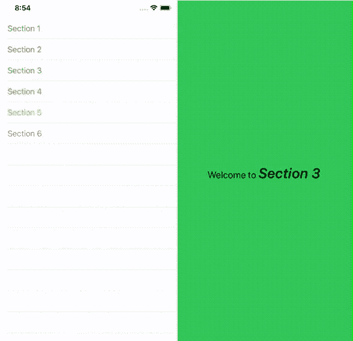
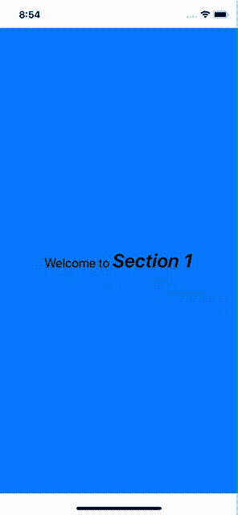
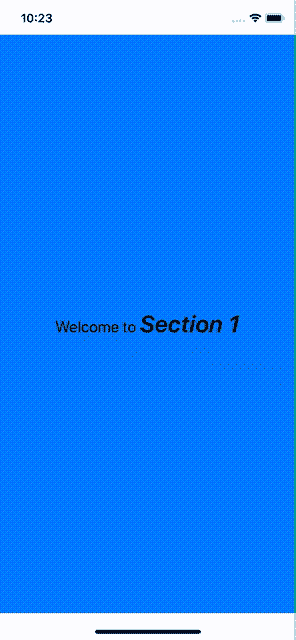
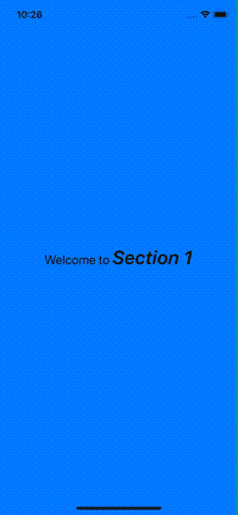
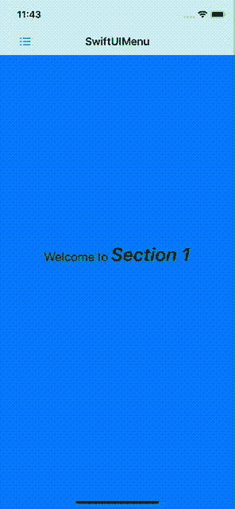

# SwiftUIMenu 带来更好的侧栏菜单

> 原文：<https://betterprogramming.pub/better-side-bar-menus-with-swiftuimenu-7daff6306217>

## 快速菜单救援



# 介绍

前段时间，我决定写一篇关于 SwiftUI 中菜单导航模式实现的文章:

[](https://medium.com/better-programming/may-i-see-the-swiftui-menu-please-b9d40246c2f5) [## 我可以看看 SwiftUI 菜单吗？

### 在 SwiftUI 中实现菜单导航

medium.com](https://medium.com/better-programming/may-i-see-the-swiftui-menu-please-b9d40246c2f5) 

菜单导航模式在许多应用程序中广泛使用。虽然有些人会认为这更像是 Android 的事情，苹果从未试图将其作为内置组件，但许多人仍然觉得它很有用，并要求在他们的应用程序中使用它。

在本文中，我将介绍 SwiftUIMenu，并让您快速浏览一下它的主要特性。最后，我们将通过一个简单的示例项目来测试这个框架。

[](https://github.com/fermoya/SwiftUIMenu) [## fermoya/SwiftUIMenu

### SwiftUIMenu 是一个组件，允许您在应用程序中实现菜单导航模式。菜单显示一个内容…

github.com](https://github.com/fermoya/SwiftUIMenu) 

# 基本实现

创建新的`Menu`相对简单。你只需要通过:

*   绑定到选定的索引
*   显示/隐藏抽屉的绑定
*   用于填充菜单的项目
*   `ViewBuilder`创建抽屉行
*   `ViewBuilder`创建章节内容

```
Menu(indexSelected: self.$index,
     isOpen: self.$isMenuOpen,
     menuItems: menuItems,
     id: \.name,
     menuItemRow: { item in MyMenuRow(item) },
     menuItemContent: { indexSelected in
         MySectionContent(index: indexSelected) 
     })
```



默认情况下，`Menu`被初始化为:

*   向左对齐，因此向右显示
*   它会占据整个屏幕
*   可拖动，这意味着您可以将抽屉拖入和拖出
*   重叠样式—也就是说，菜单抽屉与部分内容重叠

# 用户界面定制

你可以在`Menu`上使用一些视图修改器，让它看起来更有吸引力。你可以这样做:

*   将`alignment`更改为`.right`或`.left`
*   通过`revealRatio`修改抽屉将占用的可用空间比例
*   将分隔缝`style`定制为`.overlap`、`.push`或`.stretch`
*   向抽屉菜单添加一个`footer`和一个`header`
*   用`menuRowBackground`给菜单行着色
*   用`shadeContent`遮蔽章节内容
*   `disableDragging`

以下是一些例子:

```
Menu(...)
    .alignment(.right)
    .style(.push)
    .revealRatio(0.8)
```



```
Menu(...)
    .style(.stretch)
    .revealRatio(0.8)
    .header(header: { ProfileHeader() })
    .footer(footer: { MenuFooter() })
    .shadeContent()
    .edgesIgnoringSafeArea(.all)
```



# 示例项目

这是我们要做的。我们将创建一个菜单:

1.  可以通过点击导航条按钮以编程方式打开
2.  抽屉占据了 80%的可用空间
3.  通过推送内容来展示
4.  从左侧显示
5.  抽屉打开时遮蔽内容。我们还将有一个导航条按钮来以编程方式打开`Menu`。
6.  添加页脚和页眉
7.  将行染成浅灰色
8.  忽略边缘

我们将在整个示例中使用这个列表作为待办事项列表来指出这些特性的实现。

让我们把事情做好。为什么我们不从创建构建`Menu`所需的依赖项开始呢？继续定义将填充行的模型:

```
struct MenuItem: Equatable {
    var name: String
    var color: Color
}let menuItems: [MenuItem] = [
    MenuItem(name: "Section 1", color: .blue),
    MenuItem(name: "Section 2", color: .red),
    MenuItem(name: "Section 3", color: .green),
    MenuItem(name: "Section 4", color: .orange),
    MenuItem(name: "Section 5", color: .yellow),
    MenuItem(name: "Section 6", color: .purple)
]
```

继续使用两个`state`变量来管理选择的索引和抽屉可见性:

```
@State var index = 0
@State var isMenuOpen = false
```

干得好！现在，是时候根据`menuItem`和`indexSelected`创建行和内容了。我们将保持简单，因为这只是概念验证:

```
func menuRow(for item: MenuItem) -> some View {
    Text(item.name)
        .foregroundColor(item.color)
}func menuContent(at index: Int) -> some View {
    let welcomeText = Text("Welcome to ")
        .font(.system(size: 20)) let menuItem = menuItems[self.index]
    let sectionText = Text(menuItem.name)
        .font(.system(size: 30))
        .bold()
        .italic() return ZStack {
        Rectangle().fill(menuItems[self.index].color)
        (welcomeText + sectionText)
    }
}
```

至此，我们已经准备好实现我们的`Menu`。转到 SwiftUI 视图的主体，并将其定义为:

```
var body: some View {
    NavigationView {
        Menu(indexSelected: self.$index,
             isOpen: self.$isMenuOpen,
             menuItems: menuItems,
             id: \.name,
             menuItemRow: {
                 self.menuRow(for: $0)
             },
             menuItemContent: { section in
                 self.menuContent(at: section)
                     // 1\. 
                     .navigationBarItems(leading: self.menuButton)
                     .navigationBarTitle(Text("SwiftUIMenu"), 
                                         displayMode: .inline)
             })
         // 2-8\. Menu customization here
    }
}var menuButton: some View {
    let imageName = isMenuOpen ? "xmark" : "list.bullet" return Button(action: {
        withAnimation {
            self.isMenuOpen.toggle()
        }
    }) {
        Image(systemName: imageName)
            .padding()
        }
}
```

现在，我们已经完成了列表中的第一点:我们创建了一个导航栏按钮来管理菜单显示。让我们检查一下剩余的项目符号，将它们从我们的列表中划掉，并定制`Menu`:

```
Menu(...)
    // 2.
    .revealRatio(0.8) // 3.
    .style(.push) // 4.
    .alignment(.left) // 5.
    .shadeContent() // 6.
    .header(header: {
        self.menuHeader
    }
    .footer(footer: {
        self.menuFooter
    } // 7.
    .menuRowBackground(Color.gray.opacity(0.2)) // 8.
    .edgesIgnoringSafeArea(.all)
```

最后但同样重要的是，使用`onAppear`移除菜单抽屉中的分隔线:

```
NavigationView {
    // menu here
}.onAppear {
    UITableView.appearance().separatorStyle = .none
}
```

让我们试试这个。运行应用程序，并查看其外观:



漂亮！那不是超级简单吗？SwiftUIMenu 让你轻松搞定。

# 结论

SwiftUIMenu 可让您在应用程序中轻松实现菜单导航模式。你再也不用担心过渡了。你需要做的就是添加 SwiftUIMenu 作为一个依赖项，然后 chill。

SwiftUIMenu 遵循 SwiftUI 指南，具有很强的声明性和描述性。它带有一些修改器，可以根据你的需要定制`Menu`。