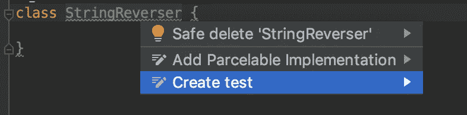
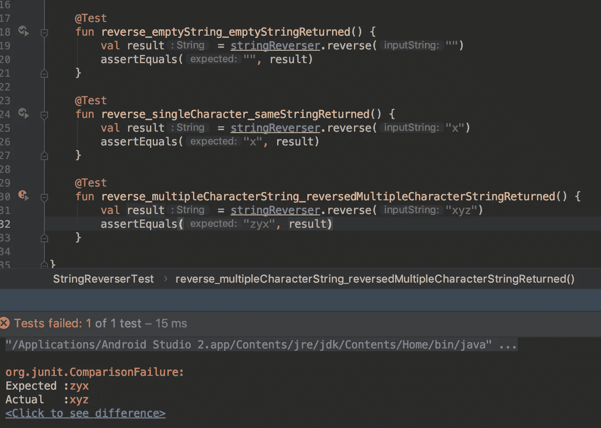

# 更好的单元测试—第 1 部分

> 原文：<https://betterprogramming.pub/better-unit-testing-part-1-aeac3c1aea77>

## 在没有任何单元测试知识的情况下阅读这篇文章？那就更好了，我们开始吧


[史丹利戴](https://unsplash.com/@stanleydai?utm_source=unsplash&utm_medium=referral&utm_content=creditCopyText)在 [Unsplash](https://unsplash.com/s/photos/project?utm_source=unsplash&utm_medium=referral&utm_content=creditCopyText) 上的照片

许多项目，尤其是 Android 项目，没有单元测试。嗯，即使是 Android 开发之初的官方文档也不鼓励/不支持单元测试。如果没有单元测试，我们开发人员不会关心是否有正确的单元测试。

许多有单元测试的项目大多是在产品代码编写完成后编写的，开发人员被要求按照一些“策略”编写单元测试。

这些都是糟糕的测试案例，没有给任何人对整个平台的完整性的信心。

没有单元测试比有糟糕的单元测试要好。

# 单元测试是什么意思？

一个单元是一个特定功能的容器，它有明确定义的边界，在 Android 中，可以被包装在一个`Class`中。

测试意味着确保某些东西完美地工作。在单元测试中，我们可以说我们确保了我们的类做了它应该做的事情。

单元测试确保被测系统按照需求运行。

JUnit 是一个流行的框架，我们用它来编写单元测试来测试我们的产品代码。

# 如何编写更好的单元测试

通常，我们会看到我们必须编写其单元测试的类，转到所需的方法。看它是怎么写的，了解一些高层逻辑，然后开始写它的单元测试。这是一个大禁忌。

我们应该看到需求，然后编写单元测试来满足这些需求。如果你遵循了批判性思维，那么你应该有一个你可以参考的文档，它包含了你需要编写的所有一致同意的边缘测试用例。

这样，您就在测试您的代码，看它是否真的很好地满足了指定的需求。

单元测试的简单结构如下:

```
import org.junit.Assert.*
import org.junit.Before
import org.junit.Testclass ProductionCodeClassTest {@Before
    fun setup() {
        // Setup the class dependencies here
        // Which are required to run a successful test
    }@Test
    fun testSomeMethod() {
        // Call the required logic
        // Assert the returned result
    }

}
```

`@Before`告诉 JVM 在每个用`@Test`标注的测试函数之前运行这个特定的方法。

# 如何更好地命名单元测试

当您在大型项目中工作时，您有数千个单元测试的报告，并且您得到一条消息:

```
Test testFunctionFinal() failed
```

或者:

```
Test test_user_click_redirects_to_home() failed
```

哪个更容易调试？

单元测试的名称不一定要短，只要你需要写一个描述性的单元测试名称就行。一个快速提示是包括这三件事:

```
UnitOfWork_StateUnderTest_ExpectdBehavior
```

因此，根据这一点，如果你想写一个反转字符串的方法的名字，它应该是:

```
reverse_emptyString_emptyStringReturned
```

# 更好的单元测试方法

一般来说，在我们写了我们满意的产品代码并且它能工作之后，我们会写单元测试。因此，只需编写一些简单的单元测试，就可以通过我们已经知道正在工作的东西。

这些测试的问题在于它们并不能真正证明什么。如果它们通过了，我们并不在乎，因为我们知道我们是随便写的，因果单元测试通过并不意味着什么。如果他们失败了，是的，他们肯定能帮上忙。

解决方案:如果我们在之前编写单元测试*，我们将编写实际的产品代码，当这些单元测试失败时(编译错误/运行时错误/断言错误),我们将编写一些产品代码使它们通过。*

这种方法被称为测试驱动开发。

这是不是没有太大意义？让我们写一个简单的测试，好吗？

# 遵循 TDD 编写单元测试用例

在测试驱动开发之后，我们将编写字符串反转的代码。

1.创建一个名为`StringReverser`的类，一旦完成，使用自动生成选项为同一个类生成一个单元测试文件。

```
package com.sample.exampleclass StringReverser {

}
```



生成的单元测试类:

```
import org.junit.Assert.*class StringReverserTest {

}
```

2.让我们开始编写我们的第一个单元测试用例。

让我们现在编写产品代码来解决这个错误。

既然我们的错误已经解决，根据 TDD 第二定律，我们不允许再编写任何产品代码。

3.完成我们的第一个单元测试用例。

既然我们的测试通过了，我们可以继续编写我们的第二个单元测试。

4.编写第二个单元测试用例。

```
@Test
fun reverse_singleCharacter_sameStringReturned() {
    val result = stringReverser.reverse("x")
    assertEquals("x", result)
}
```

所以，我们只是添加另一个单元测试用例，它也成功通过。让我们继续写另一个测试用例。

5.编写第三个单元测试用例。

```
@Test
fun reverse_multipleCharacterString_reversedMultipleCharacterStringReturned() {
    val result = stringReverser.reverse("xyz")
    assertEquals("zyx", result)
}
```

因为我们没有得到编译错误，我们只是继续运行我们的单元测试用例，我们看到它失败了。



现在，我们再次被允许编写产品代码，它只是通过了这个失败的单元测试用例。所以，我们继续修改`StringReverser`类。

现在，如果我们回到我们的单元测试并运行它们，它们都通过了。

你可以随意添加更多的测试，所有的测试都应该通过。

遵循 TDD 之后，我们对我们的`StringReverser`类很有信心，确信没有错误。它是生产就绪的，支持我们的`StringReverser`类的单元测试总是在那里证明`StringReverser`类。

如果有人想在未来做出任何改变，他们不会害怕破坏东西，因为他们只需要运行单元测试，看看这些改变是否适用于所有的测试用例，而不是他们必须手动检查。

# 代码覆盖率呢？

你的单元测试应该有多少代码覆盖率？70%?

*   一个简单的经验法则是:你只需要在你的单元测试中覆盖你想在生产中使用的代码模块，现在这意味着 100%。我们不能让 80%的模块工作，而另外 20%的模块没有在生产中进行测试。因此，总是试图获得 100%的代码覆盖率。
*   我们所说的 100%并不意味着覆盖所有代码行。在我们的系统中可以有多种逻辑，因此，在我们的系统范围内测试所有可能的逻辑组合也在 100%的代码覆盖率之下。
*   还可能有多个输入或输入组合进入您的系统，100%的代码覆盖率也涵盖了这一点。

# 结论

我们已经讲了基础知识，学到了很多东西。如果这个话题让你更感兴趣，这里还有一些关于这个话题的故事值得你花时间去读。

[](https://medium.com/softway-blog/tests-are-your-silver-bullet-for-clean-production-code-60f339183713) [## 测试是你清洁生产代码的银弹

### TDD 很酷，但是要知道如何专业地编写测试用例

medium.com](https://medium.com/softway-blog/tests-are-your-silver-bullet-for-clean-production-code-60f339183713) [](https://medium.com/better-programming/getting-started-with-test-driven-development-3621a828657e) [## 测试驱动开发入门

### 学习用 TDD 构建坚如磐石的解决方案

medium.com](https://medium.com/better-programming/getting-started-with-test-driven-development-3621a828657e) 

感谢阅读！DevDeejay

嘿嘿嘿！第二部分在这里😇
[https://medium . com/better-programming/better-unit-testing-part-2-80d 29 fc 0 F4 b 3](https://medium.com/better-programming/better-unit-testing-part-2-80d29fc0f4b3)