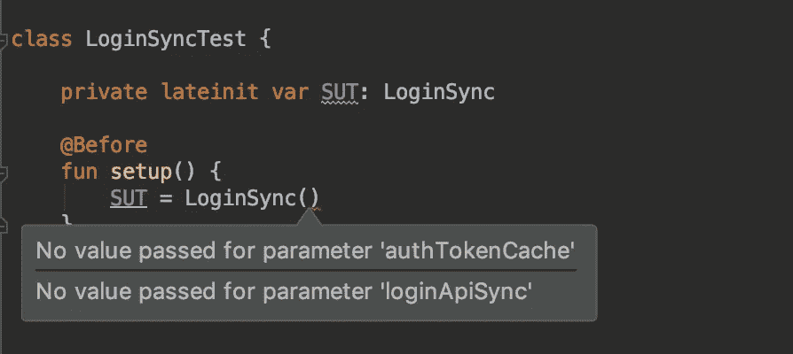
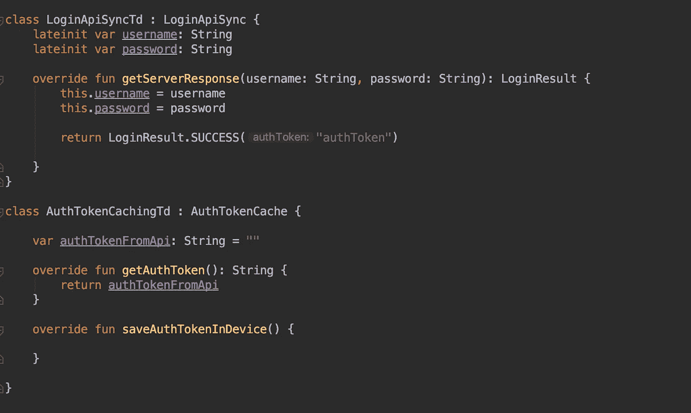
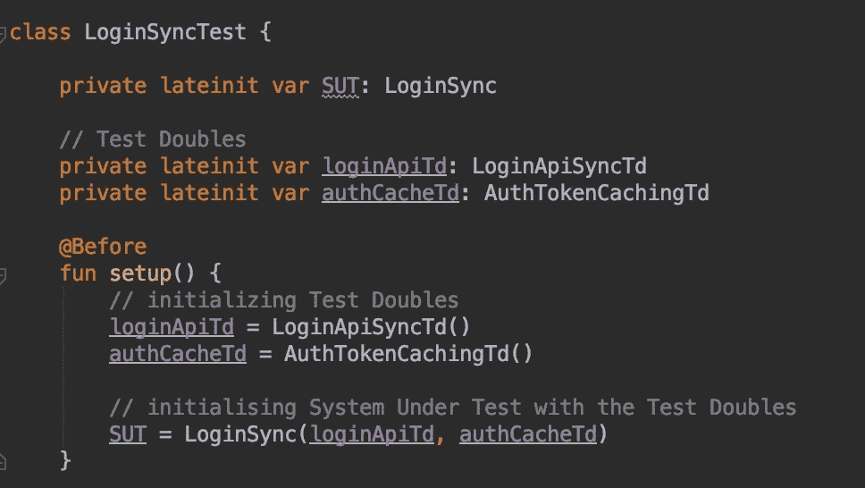

# 更好的单元测试(第 2 部分)

> 原文：<https://betterprogramming.pub/better-unit-testing-part-2-80d29fc0f4b3>

## 了解如何模拟依赖关系并在测试过程中节省时间

照片由 [Mometrix 测试准备](https://unsplash.com/@mometrixtestprep?utm_source=unsplash&utm_medium=referral&utm_content=creditCopyText)在 [Unsplash](https://unsplash.com/s/photos/test?utm_source=unsplash&utm_medium=referral&utm_content=creditCopyText) 拍摄

这个故事是*更好的单元测试*系列的延续，在这个系列中，我们已经介绍了基础知识，在你阅读这个系列之前，请检查一下。

 [## 更好的单元测试—第 1 部分

### 在没有任何单元测试知识的情况下阅读这篇文章？那就更好了，我们开始吧

medium.com](https://medium.com/better-programming/better-unit-testing-part-1-aeac3c1aea77) 

以下是你将从这篇文章中学到的东西:

1.  什么是依赖？
2.  如何测试有依赖关系的类？
3.  一个独立于领域的例子来进一步说明问题。
4.  如果你刚刚开始单元测试，你肯定应该知道的重要知识。
5.  成功完成单元测试后如何结束工作？

# 什么是依赖？

在我们的项目中，作为专业开发人员，我们通过构建不同的类来保持逻辑和责任的良好分离，这些类相互交互/通信以满足我们的需求，同时试图保持我们的系统干净和可维护。

有时候，当你测试一个依赖于其他类的类时，你应该如何测试这个类呢？

# 如何测试有依赖关系的类？

如果我们运行整个项目，所有需要的类都设置好了，我们可以测试我们通常做的事情，但这可能很耗时(首先是整个项目的构建时间，然后在运行时设置依赖类)。

因此，我们将会浪费大量的时间来设置我们现在不关心的类，只是为了测试我们现在关心的类。

嘲讽是答案。我们嘲笑我们的依赖类，就像它们已经被设置了一些虚拟数据一样，只是为了看看我们的必需类是否正常工作。

# 一个例子

让我们举一个最简单的例子，它总是在我们的大多数项目中使用——登录屏幕。让我们为我们的登录系统编写测试，但是，首先，让我们了解我们的登录系统中涉及的组件。

*   我们有`LoginSync`负责在登录后同步我们的设备，这取决于服务器的响应，这听起来像一个长时间运行的线程阻塞过程(实际上是这样，但我们现在不关心阻塞)。
*   `LoginApiSync`管理与 API 的联网并获得响应。
*   `AuthTokenCache`负责将从服务器收到的认证令牌保存在设备上。
*   只有一个名为`loginSync()`的函数，它获取用户名和密码并返回`LoginResult` ，然后根据`LoginResult`，它要么缓存`AuthToken`要么保持不变。

来源:[https://gist . github . com/devDeejay/a1fd 7 FD 702 c 5086809118d 04 CD 732854](https://gist.github.com/devDeejay/a1fd7fd702c5086809118d04cd732854)

# 让我们开始编写 LoginSync 的测试

1.  创建一个`LoginSyncTest`文件和一个`LoginSyncTest`类。容易识别被测系统的一个好的变量名是`SUT`，因此，将我们的`LoginSync`引用变量命名为`SUT`。
2.  通常，`setup()`是我们实例化我们想要测试的类的实例的地方，但是在这里，我们不能直接这样做，因为它还需要另外两个类的实例。如您所见，我们有一个红色错误，表示它需要两个参数。

3.让我们替换所需的依赖项，这些被替换的依赖项被称为*测试替身。*

有不同类型的测试替身，如假的，模拟的，和存根。稍后我们将了解其中的每一个。

为了创建`TestDoubles`，我们创建了实现`LoginApiSync`和`AuthTokenCache`相同接口的类，但是实现的逻辑将是一个虚拟的。

## **创建测试双类**

现在，我们可以通过以下操作实例化我们的 SUT:

现在，让我们编写第一个测试函数。但这是另一个挑战。

4.你如何测试`loginSync()`函数，甚至不知道它做什么？我们当然不能读取函数的实现，因为这样我们就把潜在的 bug 当成了特性。

另一种方法是思考、尝试所有可能的场景，这就是单元测试的要点，不是吗？所以，让我们开始吧。

让我们想想`LoginSync`类的所有用例。

*   用户名和密码被传递给网络 API。
*   如果登录成功，`AuthTokenId`被更新并缓存。
*   如果登录失败，`AuthToken`不应该改变。

大概就这些吧！

5.让我们编写每一个测试用例。

一个好的实践是添加所有测试场景的注释，然后为每个场景编写函数。

来源:[https://gist . github . com/devDeejay/3818 b 8df 125 a 191 F2 E0 cef 446371 f1 af](https://gist.github.com/devDeejay/3818b8df125a191f2e0cef446371f1af)

然后，您可以在编写完所有测试后继续运行您的`Test`类，并查看您自己的类的结果。

在 [Android Studio](https://developer.android.com/studio) 中，我们弹出这个按钮，有三个选项:

*   运行—运行所有测试。
*   调试——调试并观察测试类的行为。
*   带覆盖率运行——这告诉您关于您的代码覆盖率。测试中覆盖的行数和方法数。超级有帮助。我们应该始终以 100%为目标，因为我们希望 100%的组件都能工作。

# 重要的学习

## 1.使用实例方法而不是静态方法

您应该尽可能不要在类中编写静态方法，因为它们变得更加难以进行单元测试。

因此，尝试编写实例方法，并使用该类的对象来访问它们，这样，您总是可以模拟该类的对象来测试其方法。

## 2.单体是你在单元测试中的敌人

当你有多个单元测试，并且多个单元测试访问一个单元时，当你一个接一个地运行这些函数时，它们都可能通过，但是如果你一起运行它们，你将会面临冲突。

在某些情况下，这些多重测试中的任何一个都会随机失败！因此，如果你坐下来调试它们，你是在兜风。

这是因为 singleton 是共享的，如果你愿意的话，是交叉的，这违反了单元测试的原则——你的测试应该彼此独立地运行。

底线是，如果你想保持你的代码单元测试和开发者友好，不要使用单例。

## 3.了解测试框架和库

了解将使您的生活更轻松的测试框架。

例如，如果你是一名 Android 开发人员， [Mockito](https://site.mockito.org/) 是一个很棒的库，可以帮助你模仿你的测试替身，让你的开发生活变得简单而高效。

# 结束你的工作

我不能过多地谈论干净代码的重要性，这包括你的生产代码和测试代码库。如果您让您的测试代码库腐烂，您的生产代码也会腐烂！

因此，通过删除所有不必要的注释、空格来清理单元测试代码，也许可以为变量、函数和类想出更好的、更具描述性的、明确的名称。