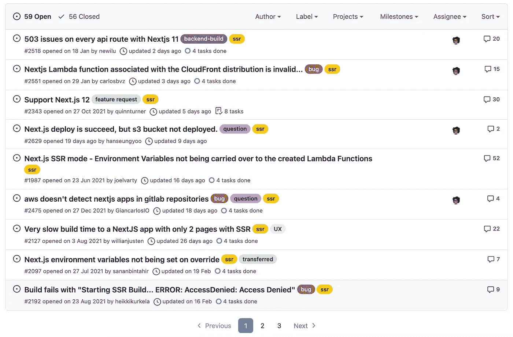
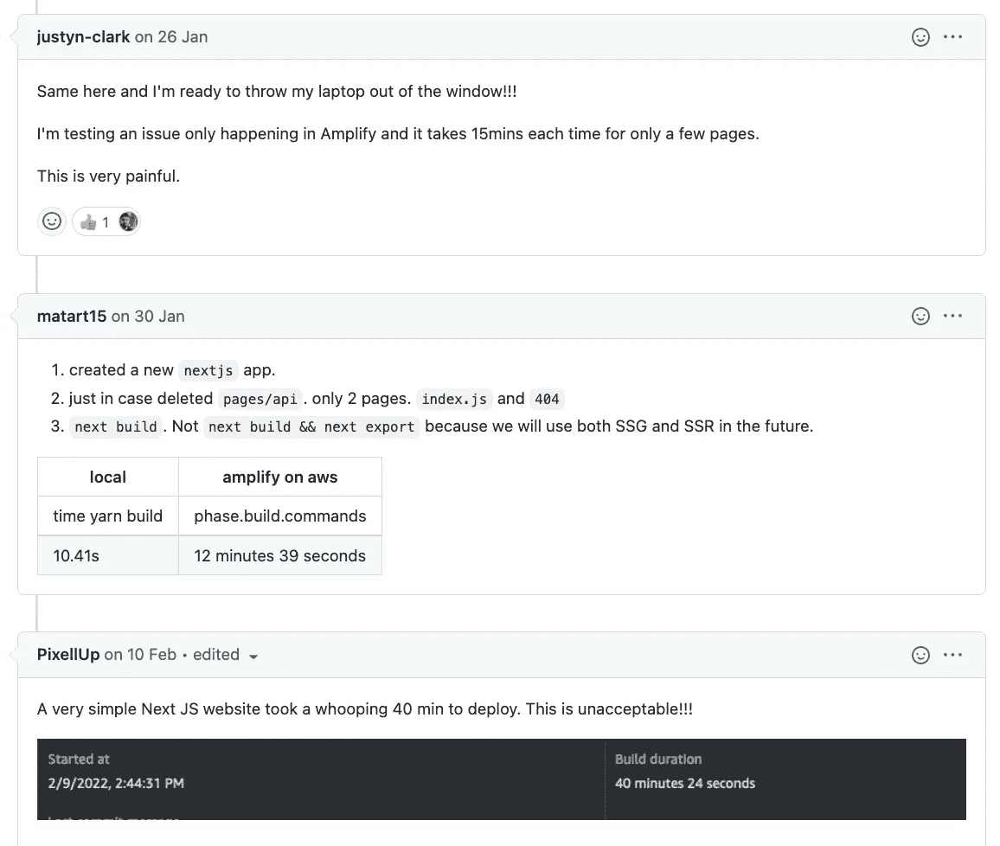

# 当心 AWS Amplify 上的 Next.js

> 原文：<https://betterprogramming.pub/beware-of-next-js-on-aws-amplify-5a1286db2a6a>

## 部署从未如此困难


几个月前，我受命在 AWS Amplify 上部署一些 Next.js 应用程序。我知道这不会像使用 Vercel 那么容易，但我有兴趣尝试一些不同的东西。但事实证明挑战太大了，几天后我回到了 Vercel，再也不想使用 Amplify。

我面临的大多数挑战是因为我的应用程序使用了[服务器端渲染(SSR)](https://nextjs.org/docs/basic-features/pages#server-side-rendering)——这在 Next.js 中非常常见。SSR 导致 Amplify 非常困难，因为它需要额外的 AWS 资源，如 Lambda@Edge 函数和 CloudFrontend 发行版。

用“SSR”标签过滤 [amplify-hosting](https://github.com/aws-amplify/amplify-hosting/issues?q=is%3Aissue+is%3Aopen+sort%3Aupdated-desc+label%3Assr) 回购问题凸显了这场斗争:



当我几个月前与 Amplify 合作时，这些问题中的大多数都是公开的，看起来它们不会很快得到解决。他们中的许多人是工作部署的主要障碍。我处理过的最令人疲惫的三个问题仍然存在:

1.  拒绝访问错误( [#2192 以上](https://github.com/aws-amplify/amplify-hosting/issues/2192))
2.  部署极其缓慢( [#2127 above](https://github.com/aws-amplify/amplify-hosting/issues/2127) )
3.  Next.js 版本支持( [#2343 以上](https://github.com/aws-amplify/amplify-hosting/issues/2343))

# 拒绝访问

如果您尝试在 Amplify 上部署 Next.js，很有可能会遇到臭名昭著的错误消息:

```
Starting SSR Build… ERROR: AccessDenied
```

对于每个遇到这个问题的人来说，解决方法似乎是不同的，对于一些人来说，解决方法从来没有被发现过。在我的例子中，首先是因为推荐的 Amplify 服务角色实际上没有足够的权限来部署所有需要的资源。虽然在 AWS 上提供完全的访问权并不是一个好主意，但是给管理员完全的访问权让我更进了一步。

问题的下一部分更令人沮丧:我使用的 AWS 账户没有启用 [S3 铲斗转移加速](https://docs.aws.amazon.com/AmazonS3/latest/userguide/transfer-acceleration.html)。弄清楚这一点并不容易 Amplify 部署没有告诉我哪些资源部署失败了，但是通过一个排除过程，我发现这是 S3 桶。从那以后，我花了更多的时间来发现，尤其是传输加速失败了。我自己无法启用/禁用传输加速，这意味着我必须依靠 AWS 支持团队来帮我完成。

# 部署缓慢

如果你用过 Vercel，那么当你使用 Amplify 时，你会大吃一惊。忘掉 2-3 分钟的部署，习惯等待 10-20 分钟。显然，由于云锋传播，它是[，这是不会改变的。这里似乎没什么希望。](https://github.com/aws-amplify/amplify-hosting/issues/2272#issuecomment-926029349)

滚动浏览 [GitHub 问题](https://github.com/aws-amplify/amplify-hosting/issues/2127)揭示了一些可怕的部署时间:



# Next.js 版本

Next.js 进展很快，因此 Amplify 可能无法跟上每个新版本。但 Amplify 需要更加努力。升级到最新的 Next.js 版本总是容易的，总是令人兴奋的；AWS 不能指望人们留在 Amplify 上，如果这意味着剥夺他们的这些升级。

我用的是 Amplify 支持的 Next.js 版本 11，但是这种支持感觉很脆弱。Next.js 现在是 12 版本，但似乎[放大支持](https://github.com/aws-amplify/amplify-hosting/issues/2343#issuecomment-1004337631)还差得远。

# 还有更多

我挑选了三个我经历过的最难忘的问题，但是我有很多可以选择的。例如，很难跟踪为部署而创建的所有 AWS 资源，特别是因为当分支被合并时，它们不会像您预期的那样被自动删除。Lambda@Edge 函数仅部署在美国东部(N. Virginia)地区，而不是部署您的应用的地区。这种行为现在被记录为 T8，但以前从来没有，我花了一段时间才自己弄明白。

以一个大胆的结论结束:在 Amplify 上部署 Next.js 应用程序不可能以大多数开发团队可以接受的方式进行。您可能会让您的应用程序运行起来，但是您的部署将会花费很长时间，有时甚至无法工作，您将会使用过时版本的 Next.js，并且您将会浪费时间在 AWS 控制台中进行搜索。给自己省点时间，用 Vercel 代替。