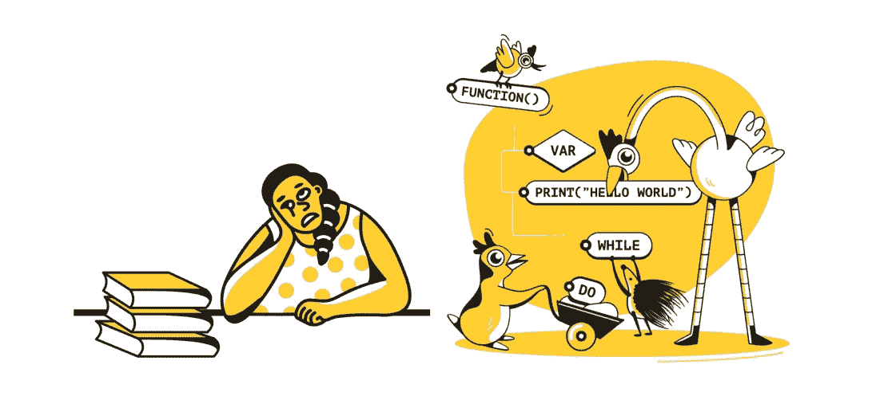
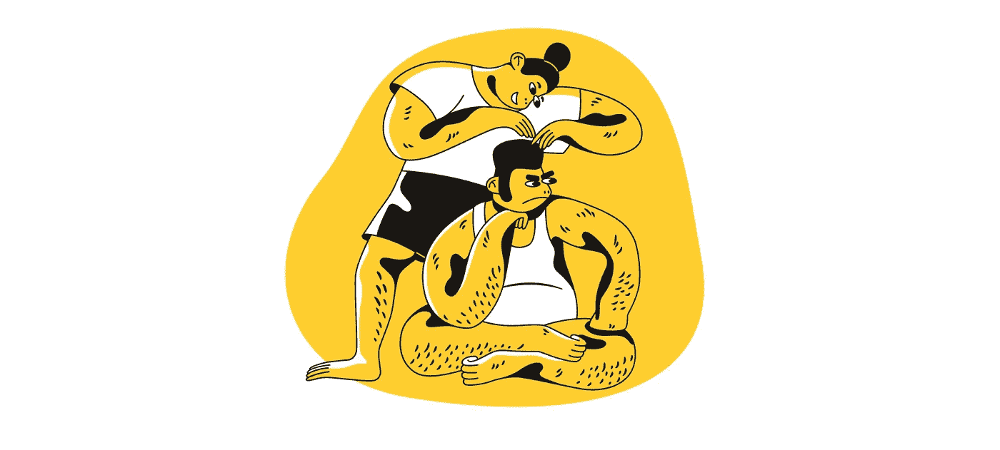
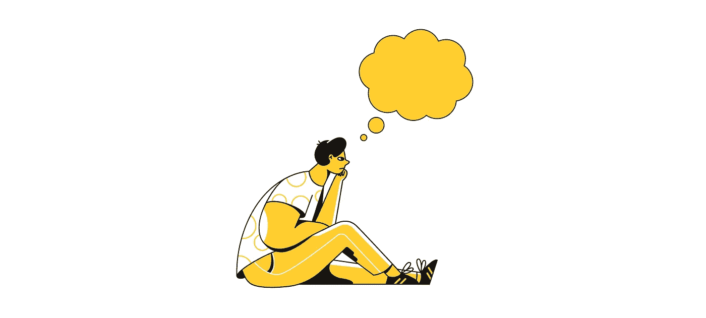
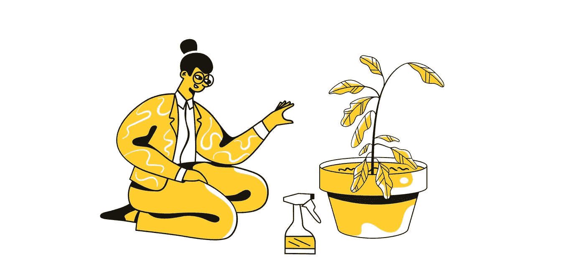
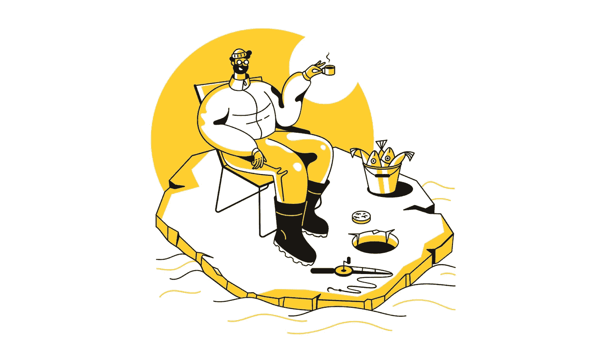
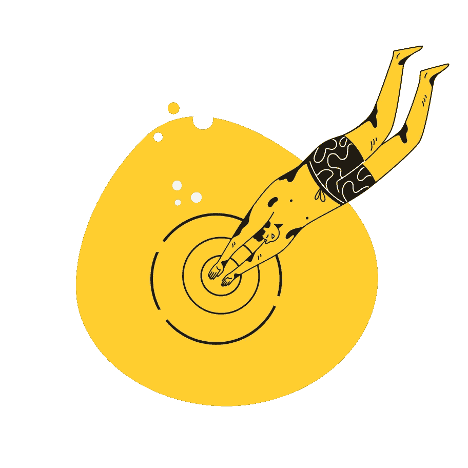

# 银幕之外

> 原文：<https://betterprogramming.pub/beyond-the-screen-d5740def3b56>

## 闲暇时磨练 UX 感官的活动

所有来自[出租车](https://icons8.com/illustrations/style--taxi)的作品[娜塔莎·雷马克](https://icons8.com/illustrations/author/5e7e24ce01d0360013bb7479)

在一个夏天的晚上，我有幸见到了在 UX 设计领域有着 20 多年经验的设计总监 J。我原以为这是一次非正式的社交聚会，但我们最终聊了很多关于我们的业余活动，我们喜欢在下班后做的事情。起初这听起来可能无关紧要。

但它是相关的！如果我们坚持不懈地做一些活动，随着时间的推移，这些活动可以帮助增强我们的思维、观察和同理心——这些活动可以是像画画或写短篇小说这样的爱好。

在这篇文章中，我将分享一些有助于提高我的思维和观察能力的活动。此外，他们根本不喜欢工作，而是喜欢我在空闲时间喜欢的爱好。

希望这些方法也能对你有所帮助。

# 学习心理学

在某个时候，你会读完所有经典的 UX 书籍，并意识到所有的内容在某种程度上都是相似的。当然，在现实生活中了解和运用它们是两回事。但是极客们觉得无聊，想找一些新的、令人兴奋的、可破解的东西。好吧，那就用心理学教材给你的主菜调味吧。

心理学也许是一把巨大的伞，但它基本上是所有现有人类行为理论的根源。心理学也可以看作是哲学和生理学之间的桥梁。生理学关注大脑的物理构成，而哲学关注思想和观念。心理学是关于心理过程，它们是如何产生的，以及它们告诉我们什么。听起来很迷人，对吧？这是三个可扩展的研究来消磨你的空闲时间。

我研究这个主要是因为我对人类行为感兴趣——我对大脑如何工作和自由意志的概念感兴趣。学习这些科目会让你成为一个更加敏锐的观察者，并显著提高你解读行为的能力。这也会增强你的移情能力。最终，你也会成为一个专注的倾听者。

> "对人的深切同情使我们的观察成为灵感的强大来源."
> 
> —大卫·凯利

# 写作

写作就是设计。设计过程中的一个关键步骤是为最终提案展示你的想法、观点和意图。一篇优秀的文章可以有效地传达和推销你的设计。

我总是难以清楚地解释我的想法。感觉很多事情都在脑子里进行——有时候是一片混乱。我努力用简洁的语言描述那些想法。如果这听起来像你，写作可能会有帮助。除了设计文档，它可以是任何东西:短篇小说、博客、梦想日记。等等。你写下的自我对话越多，你就越能更快更容易地表达你的想法。记住，开始写作并不需要成为一个优秀的作家。

> "写作，对我来说，只是通过我的手指思考。"
> 
> —伊萨克·阿西莫夫

# 园艺

园艺是一种疗法。生活空间中的植物可以振奋你的精神和幸福感。园艺也给我们上了惊人的一课。植物可以适应、改变和生长在不同的环境中。

当你在室内或室外种植植物时，没有固定的公式来种植健康的树木。这有点像一个带有参数的过程，您需要根据可获得的资源和不可预测的危机进行相应的调整。例如，一些植物喜欢每天大量的水和水分，如龟背竹(也称为瑞士奶酪植物)。

然而，当我把它们放在我的房间里，那里不太容易接触到阳光，植物生病了，在陶罐上出现一层白色的粉末涂层。因为室温可以在更长的时间内包含水分和水，所以我需要将水量减少一半。

也就是说，我们不想重新发明轮子，但没有一个公式适用于所有产品。因此，作为 UX 的设计师，我们需要注意背景，以及如何将特定的趋势、流程和行为应用到我们的数字工艺品中。它可能对其他人有用，但在我们的环境中却行不通。做小实验，迭代公式，观察。随着时间的推移，你可以为你的小植物找到一个完美的食谱。

那么城市园艺教会了我什么呢？

**S = POI**

**可持续性=耐心—观察—迭代**

# 迭代你的空间

等等——这不是在重复一个数字界面，而是你的物理空间、你的房子和你的工作场所。

我有洁癖。我希望东西干净、整洁，并放在特定的位置。此外，我倾向于观察人们如何与物理空间周围的某些事物进行交互。因此，这两种习惯结合在一起。在设计时，我有一种冲动，要不断迭代某些项目的位置，看看它是否能让任务变得更容易或改变行为——例如，我可能想让项目更容易返回到正确的位置。我把我的空间看做一张由物理组件构成的设计画布。

这个习惯有时可能会惹恼你的室友，但它偶尔会给你带来兴奋感，让你焕然一新。当我们在旧设计的基础上发布新设计时，它会让你想起我们的用户吗？

我相信这增加了你观察的本能，鼓励你在屏幕之外看到你的用户，以及点击的数量。在繁忙的环境中，当他们有更多的事情要做，没有时间阅读你的分步指南时，他们如何与你的设计互动？

迭代是每个创造过程的一部分。

# 最后，冲一杯咖啡

咖啡是创造力和夜班的燃料。我喝咖啡和做设计一样多。

一杯好的卡布奇诺或者一杯冰镇咖啡要 5-7 美元——太贵了！所以我决定学着用 V60 和 Wood Neck 这样的倒杯来做我的咖啡，别称**第三波咖啡。**

**那么是什么让它独一无二呢？**

**专业咖啡让你完全控制一种精致的味道——只需改变水温 2-3 度，咖啡豆研磨尺寸和水流。特色咖啡的咖啡豆总有*海拔 1600–2000m 之类的规格/工艺:水洗/浅-深烤/实地笔记:烤核桃，酸度明亮，回味甘甜。*每一个属性都让咖啡师了解咖啡豆，以及它们能在多大程度上影响你独特的一杯咖啡。**

**与咖啡类似，你遇到的任何设计都是几个参数的结果，你可以选择并影响这些参数来提供解决方案。一个好的设计取决于你能多好地控制和反复使用所提供的配料，为你的顾客创造出美味的“咖啡”。**

****

# **简单地**

**你不需要花 24 小时吃饭、睡觉、研究 UX 来策划它。经验就是我们周围发生的一切。**

**我们在物理环境中和忙碌的头脑中与数字产品互动。将自己从工作中解脱出来可以给你更多思考和创造的空间——顿悟时刻往往发生在洗澡的时候。所以洗个澡，给自己冲杯咖啡，也许还可以开始种植一些室内植物。**

**快乐的科技排毒！**

****