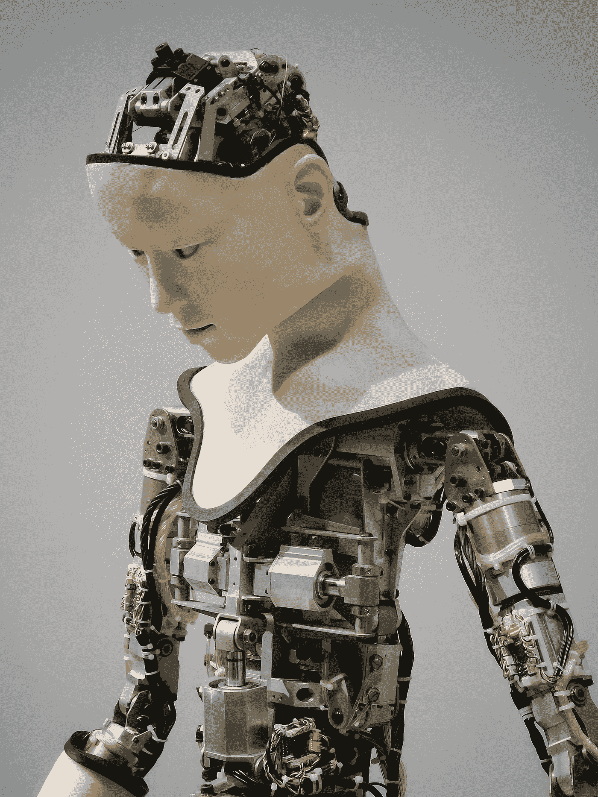

# 偏见、种族主义机器人和人工智能

> 原文：<https://betterprogramming.pub/bias-racist-robots-and-ai-the-problems-in-the-coding-that-coders-fail-to-see-305f6f324793>

## 编码者没有看到的问题

弗兰克——在 unsplash

> 眼睛看不见、头脑不知道的东西是不存在的。—D. H .劳伦斯

如果从事人工智能(AI)工作的编码人员没有意识到他们自己的偏见，或者他们的代码可能会误入偏见的领域，那该怎么办？编码人员沉浸在主流文化中，认为他们的算法中不存在偏见。

编写数千行代码可能会让人头脑麻木，并且容易产生一种初期的倦怠。我们看到的是人工智能的缺陷。要记住的是 [AI 是哑巴](https://towardsdatascience.com/@drpatfarrell)。我们赋予它某种“智能”。然而，这些程序也可以在没有我们管理的情况下自学。

如果编码人员从未停下来考虑他们正在教机器做什么、识别什么以及在哪里做决定的微妙含义，会发生什么？人类的易错性正面临强大的机器，它们可能比我们更聪明。

我们已经设法创造了我们自己的现代[弗兰肯斯坦的怪物](https://www.smithsonianmag.com/arts-culture/reading-original-frankenstein-200-years-180968473/)。玛丽·雪莱提供了一个关于无限制技术的警示故事。野兽、小女孩和池塘都是警告。

# 偏见的四大挑战

> “ [*机器学习模型中的偏差*](https://vitalflux.com/ai-machine-learning-bias-explained-examples/) *是关于模型做出预测，倾向于将某些特权群体置于系统优势，而将某些非特权群体置于系统劣势。”*

人工智能及其固有的隐藏数据偏见已经影响了职业生涯、面试可能性、获得住房贷款的能力和刑事案件。它扰乱了人们的生活。目前为止发现的隐藏偏见有哪些？

## 数据中固有的偏差

如果逮捕数量被用来决定量刑建议，种族就会发挥作用，并严重影响这些数据集。

就业历史是用来确定信誉。种族在这方面也可能有重大影响。在就业领域，性别歧视在公司薪酬中的作用显而易见。要求提供薪资历史记录，不幸的是，性别在薪资决定中扮演着重要角色。历史记录是有偏差的，但算法会像对待任何其他数据一样对待它。

## 人工智能引起的偏差

算法学会改变。初始数据中的偏差被进一步放大到这些程序做出的其他决策中。结果变得庞大而复杂，可能比最初预想的任何事情都要复杂。这些程序决定自己修改自己。没有人工输入。

## 教授人工智能社会规则

在一个环境中用一个数据集训练的算法可以被转移并与不同的数据集合并。如果人工智能对可接受的决策类型的“理解”没有变化，问题就可能出现。

性别、年龄和工作经历等因素都可以用在新的上下文中。未能分析集合整合的结果可能不会揭示第一数据集的问题。

## *疑似 AI 偏倚病例*

偏见是不容易解析出来，以检测哪些潜在的数据集可能有缺陷。显然需要额外的程序来进行这样的客观分析。

> " [*在构建模型*](http://bit.ly/2NGIUaN) *时，产品经理(业务分析师)和数据科学家确实采取措施来确保正确的/通用的数据……已经用于构建(训练/测试)模型，无意中排除一些重要的功能或数据集可能会导致偏差*。"

也许人工智能领域的每个人都需要记住那条古老的计算机信条:垃圾进，垃圾出。

# 一个“人造”伦理的问题？

一个新的术语， [*机器人伦理*](https://en.wikipedia.org/wiki/Ethics_of_artificial_intelligence) 或*机器人伦理* s，处理这些人工智能机器可能带来的好处和危害。一旦我们为人工智能制定了道德规范，我们还需要考虑它们存在和执行任务的“权利”吗？未来研究所卷入了这些曾经不可思议的事情。他们的任务之一是设计一个合乎道德的操作系统。

该研究所游戏研发总监简·麦克戈尼格尔博士曾说过，“硅谷有陷入长期‘创伤后创新’的风险，在这种情况下，我们的想象力仅限于解决过去的问题，而不是预防未来的问题。”

又一个栗子浮现在脑海:“欲速则不达。”

# 人工智能的未来

被确定为受人工智能偏见影响最大的行业包括银行、保险、就业、住房、欺诈检测、政府、教育和金融。科学本身不也应该包括在内吗？研究方案的选择以及临床试验分析可能不会没有偏见。允许人工智能选择主题和分析研究结果可能会出现问题。

上述所有领域都是个人可能因数据偏差而遭受个人、财务或职业损失的领域。不正确的识别可能是一个结果。一个人的名字与恐怖分子相似；他被拒绝登机。人工智能认定他是恐怖分子。

由于有偏见的人工智能的行为，个人被剥夺了工作、抵押贷款、支付更高的保险费，并被拒绝政府福利。甚至学校的录取也会因为模型的偏见而有所偏差。损失无法估计。

埃隆·马斯克认为，人工智能需要仔细考虑，以避免意想不到的情况。在视频[Lo and look:互联世界的遐想](https://www.amazon.com/Lo-Behold-Reveries-Connected-World/dp/B01KH1C37O/ref=sr_1_1?hvadid=78408967214902&hvbmt=be&hvdev=c&hvqmt=e&keywords=lo+and+behold&qid=1567208886&s=movies-tv&sr=1-1)中，Musk 提供了一个例子。如果一位对冲基金经理表示，他希望人工智能优化投资组合的回报，人工智能可以做空特定的基金，“[做多国防股票，然后发动一场战争。没有我们的警惕，就没有任何道德约束。](https://www.youtube.com/watch?v=_ChGhnbCy6g)

未来就在眼前，还不是一清二楚。概述的任务是我们必须完成的。