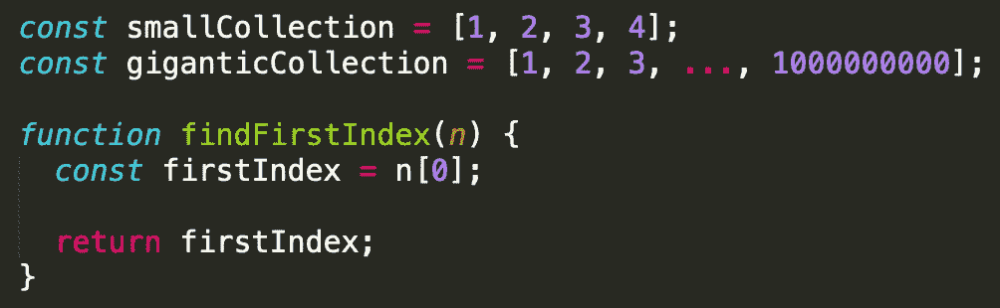
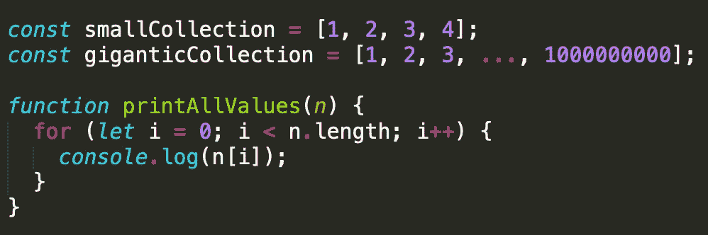
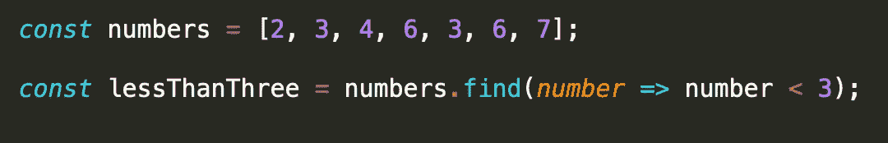
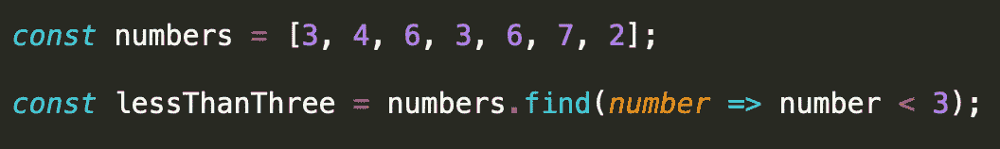
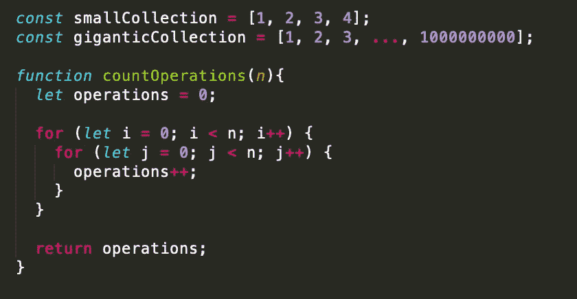
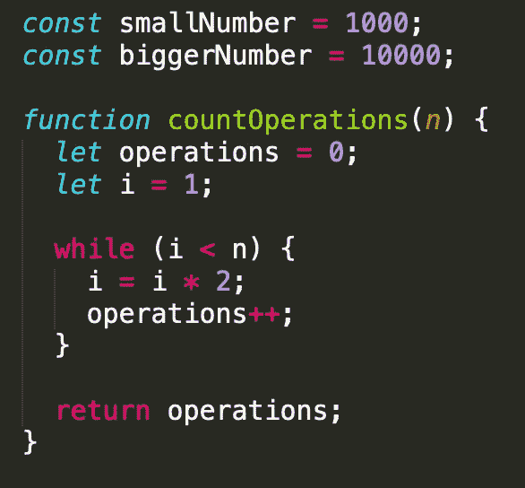
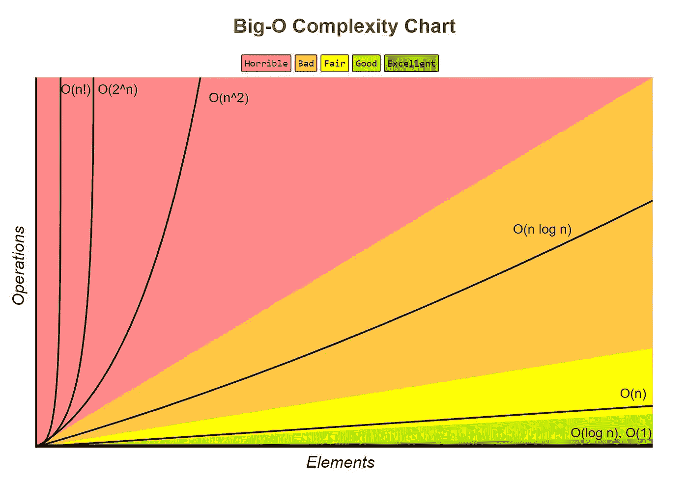
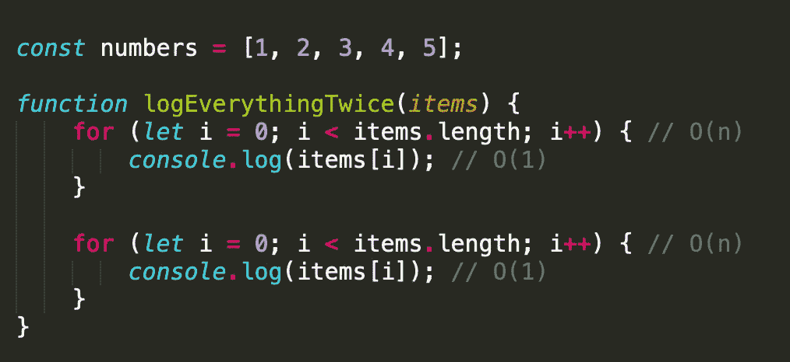
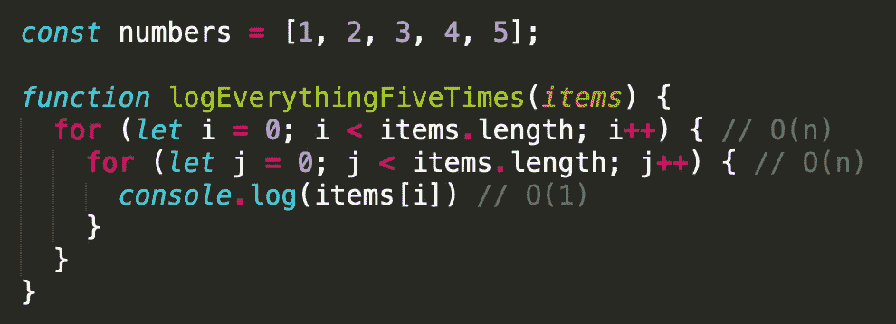
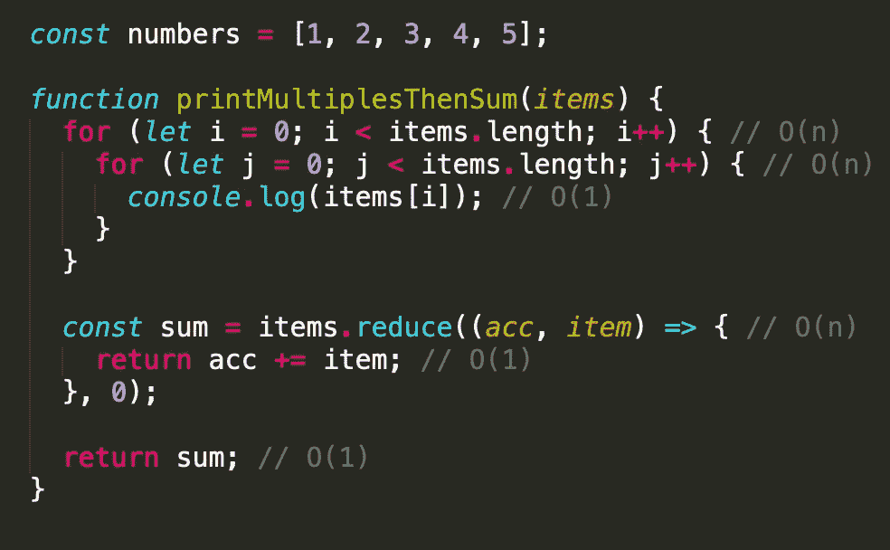

# Big-O 符号:简单的解释和例子

> 原文：<https://betterprogramming.pub/big-o-notation-a-simple-explanation-with-examples-a56347d1daca>

## 它可能会令人生畏，但不需要如此


柴坦尼亚电视台在 [Unsplash](https://unsplash.com/s/photos/circle?utm_source=unsplash&utm_medium=referral&utm_content=creditCopyText) 拍摄的照片

作为前端工程的讲师，当谈到大 O 符号时，我经常会遇到初级开发人员提出的一个问题:

> “不知道这些事，做工程师就混不下去吗？尤其是一个前端工程师？”

当然——没有什么能阻止任何人强行找到解决方案。

> “但让它发挥作用难道不是最重要的事情吗？”

很公平。工作是第一步(有时也是唯一的一步)，这取决于数据集的大小或你发货的最后期限。

但是当你从处理 10 万个元素到处理 1 亿个元素时会发生什么呢？还是 100 亿？谈到可伸缩性，这些事情很重要。

事实上，你可以在不知道大 O 符号的来龙去脉的情况下编写代码。但是如果你不知道大 O 是什么，你就很难判断它是否是你在创建算法时应该考虑的东西。在我看来，忽视可以帮助你做出决策和编写更好代码的计算机科学基础知识，往好里说是愚蠢的，往坏里说是灾难性的。

# 那么，什么是大 O 呢？

大 O 符号是我们用来谈论一个算法运行多长时间(时间复杂度)或者一个算法使用多少内存(空间复杂度)的语言。大 O 符号可以表示算法的最佳、最差和平均运行时间。出于我们的目的，我们将主要关注 Big-O，因为它与时间复杂性有关。

作为一名软件工程师，你会发现大多数关于 big O 的讨论都集中在算法的上限运行时间上，这通常被称为最坏情况。需要注意的重要一点是，使用大 O 符号时的运行时间并不直接等同于我们所知道的时间(例如秒、毫秒、微秒等)。)运行时间的分析没有考虑某些因素，例如处理器、语言或运行时环境。相反，我们可以认为时间是完成一个大小为 *n* 的问题所需要的操作或步骤的数量。换句话说，大 O 符号是一种跟踪运行时相对于输入大小增长速度的方法。

当我们考虑最坏的情况时，问题变成了:对于大小为 *n* 的输入，*可能发生的*最多*个操作/步骤是什么？*

# O(1) →常数时间

`O(1)`表示运行一个算法需要恒定的时间，与输入的大小无关。

书签是一个很好的例子，说明恒定时间在现实世界中是如何进行的。书签允许读者以快速有效的方式找到您阅读的最后一页。不管你读的是 30 页的书还是 1000 页的书。只要你使用书签，一步就能找到最后一页。

在编程中，很多操作都是常量。以下是一些例子:

*   数学运算
*   通过索引访问数组
*   通过密钥访问散列
*   在堆栈上推动和弹出
*   从队列中插入和删除
*   从函数中返回值

看看下面列出的`findFirstIndex`、**、**。当访问`0`索引时，传递`smallCollection`或`giganticCollection` 将产生与`O(1)`相同的运行时间。`firstIndex`的返回也是恒时操作。不管 *n 的大小如何，*这两个操作都将花费恒定的时间。



# O(n) →线性时间

`O(n)`表示运行时间与输入同步增长。

阅读一本书的行为是线性时间如何在现实世界中发挥作用的一个例子。让我们假设我只需要一分钟就可以读完一本大型印刷书籍的一页。有鉴于此，一本 30 页的书会花我 30 分钟去阅读。同样，一本 1000 页的书相当于 1000 分钟的阅读时间。现在，我不会强迫自己读完不太好的书，所以总有可能读不完那本 1000 页的书。但是，在我开始阅读之前，我可以知道，对于一本 1000 页的书，我最差的阅读时间是 1000 分钟。

在编程中，最常见的线性时间操作之一是遍历数组。在 JavaScript 中，像`forEach`、`map`和`reduce` 这样的方法贯穿整个数据集合，从开始到结束。

看看下面我们的`printAllValues`函数。循环通过 *n* 所需的运算次数与 *n* 的大小直接相关。一般来说(但不总是)，看到一个循环是一个很好的指示，表明您正在检查的特定代码块的运行时间为`O(n)`。



但是方法呢`find`？既然不是一直贯穿整个系列，那么实际上是线性的吗？在下面的示例中，第一个小于 3 的值位于集合的索引`0`处。为什么这不是恒定时间？



请记住，由于我们在寻找最坏的情况，我们必须假设输入不是理想的，我们寻找的元素或值可能是数组中的最后一个值。在第二个场景中(如下)，您将会看到这一点。在最不理想的情况下，查找小于 3 的数字需要遍历整个数组。



# O(n ) →二次时间

`O(n²)`表示计算以二次时间运行，即输入数据大小的平方。

在编程中，许多更基本的排序算法的最坏情况运行时间为`O(n²)`:

*   冒泡排序
*   插入排序
*   选择排序

下面我们来看看`countOperations`。这里我们有两个嵌套循环，在每次迭代后递增变量`operations`。如果`*n*`是我们的`smallCollection`，我们将以 16 次操作的计数结束。不可怕。但是如果 *n* 是我们的`gigantic collection`呢？十亿乘以十亿是一个万亿分之一，即 10 亿亿。呀。那可是一大堆操作。即使只有 1000 个元素的数组最终也会产生一百万次操作。



一般来说(但不总是)，看到两个嵌套循环通常是一个很好的指标，表明您正在查看的这段代码的运行时间为`O(n²)`。同样——三个嵌套循环表示运行时间为`O(n³)`！

# O(log n) →对数时间

`O(log n)`表示运行时间与输入大小的对数成比例增长。这意味着当您以指数方式增加输入时，运行时间几乎不会增加。

通过将我的样本大小减半，在物理词典中找到一个单词，这是对数时间在现实世界中如何工作的一个很好的例子。例如，当查找单词“senior”时，我可以准确地在中间打开词典，此时我可以确定以“s”开头的单词是在我当前查看的单词之前还是之后。一旦我确定“s”在书的后半部分，我就可以忽略前半部分的所有页面。然后我重复同样的过程。通过将这个算法进行到底，我可以将每次必须搜索的页数减少一半，直到找到单词。

在编程中，这种在物理字典中搜索的行为是二分搜索法运算的一个例子，是讨论对数运行时间时最典型的例子。

让我们来看看我们的`countOperations`函数的修改版本。注意 *n* 现在是一个数字: *n* 可以是一个输入(数字)或者输入的大小(数组的长度)。



在上面的例子中，如果 *n* = 2000，我们最终得到 11 个操作。如果*n*= 4000，我们最终得到 12 个操作。我们每增加一倍 *n* 的量，运算量只增加一。当涉及到更大的输入时，以对数时间运行的算法有很大的意义。使用我们下面的例子，`O(log(7))`将返回三个操作。一个`O(log(1000000))`只会返回 20 个操作！

*注:* `*O(n log n)*` *，常与* `*O(log n)*` *混淆，表示算法的运行时间是线性的，是线性和对数复杂度的结合。利用分治策略的排序算法是线性算法，如下:*

*   `*merge sort*`
*   `*timsort*`
*   `*heapsort*`

*看时间复杂度的时候，* `*O(n log n)*` *落在* `*O(n2)*` *和* `*O(n)*` *之间。*

# Big-O 备忘单



我最喜欢参考的大 O 网站之一是[大 O 小抄](https://www.bigocheatsheet.com/)。正如您从图表中看到的，其他运行时间具有非常可怕的时间复杂性，比如`O(2^n)`和`O(n!)`。

运行在`O(2^n)`和`O(n!)`中的算法除了微小的数据集之外，什么都做不好。`O(2^n)`或指数时间，每增加一次输入，时间加倍。`O(n!)`，或者阶乘时间，就更惨了。任何时候 *n* 增加 1，运行时间增加 n 倍。

需要注意的是，没有固定的运行时间列表。然而，我们在这篇文章中提到的是一些最常见的。

# 计算大 O

到目前为止，我们只是通过一次隔离几行代码来集中讨论 big O。如果我们正在处理一个有几个部分的算法，我们如何计算大 O？

## 放下常数

先说`logEverythingTwice`。



因为大 O 关心的是我们的运行时间增长有多快，所以你要记住的第一条规则是当你分析一个算法的时候，去掉任何常量。

在上面的例子中，我们有两个独立的循环，它们遍历一个数组的长度(线性的)。每个循环记录集合中的一个项目(常量)。由于我们不关心在恒定时间内运行的操作(它们在整体近似中几乎没有区别)，我们只考虑两个循环并将它们加在一起，这给了我们`O(2n)`。由于数字 2 在这种情况下也是一个常数，我们把它扔掉，称之为`O(n)`。

但是如果这些循环是嵌套的呢？



通过嵌套这些循环，我们不再记录`items[i]`两次，而是五次！在这种情况下，我们乘以`O(n) * O(n)`，而不是将运行时间相加。我们这样做是因为我们的日志的执行依赖于在我们能够递增`*i*`并通过我们的第一个循环移动到下一个索引之前迭代通过整个第二个循环(记录`*i*`五次)。下面是我们的日志最终返回的内容:

```
1
1
1
1
1
2
2
2
2
2
3
3
....
```

就像第一个例子一样，我们仍然希望从日志中删除常量。最后，`O(n * n)`给了我们`O(n²)`。

你不应该因为性能影响而总是避免嵌套循环。毫无疑问，您会遇到需要这种解决方案的情况(微型数据集、操作多维数组等)。).但是，您应该知道这可能会影响性能，具体取决于您正在做什么。

## 去掉非主导术语

让我们看另一个例子。



放下`printMultiplesThenSum`、**、**中的常数后，我们可以看到这个函数的大 O 符号将是`O(n² + n)`。由于大 O 也不关心非支配项，我们放弃了`*n*`(二次型获胜，因为它比线性时间差)。在分析算法的运行时间时，要遵循的第二条规则是抛弃非主导项。最后，`O(n² + n)`给了我们`O(n²)`。

# **结论**

如前所述，您可以在不了解 big O 的来龙去脉的情况下编写代码。您还应该知道这是一个近似值，因为当性能受到环境、处理器和语言等因素的影响时，您手动计算的运行时间可能不会在生产中运行。

然而，这不应该阻止你学习 big O。对 big O 符号有一个很好的理解会给你更多的关于设计算法时什么是重要的，什么是不重要的上下文。谁不想这样呢？