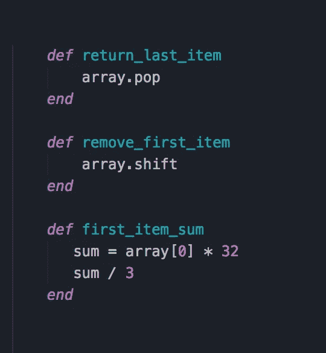
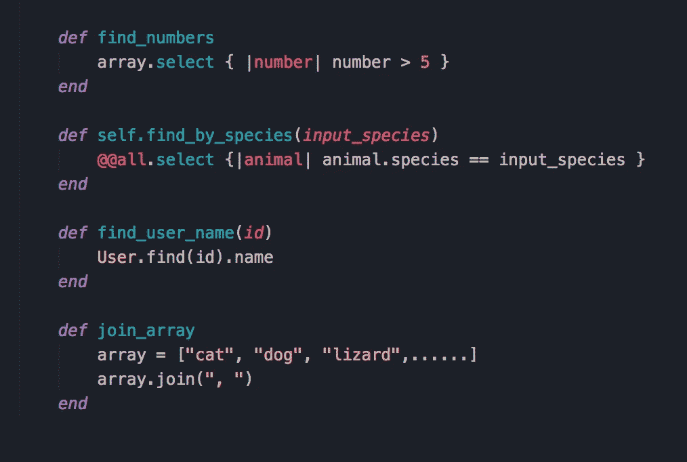
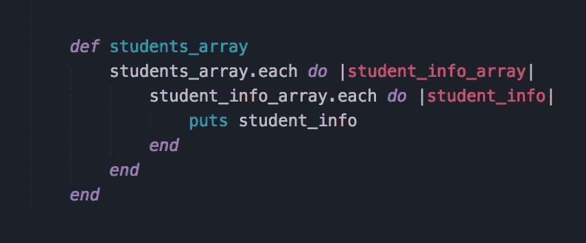
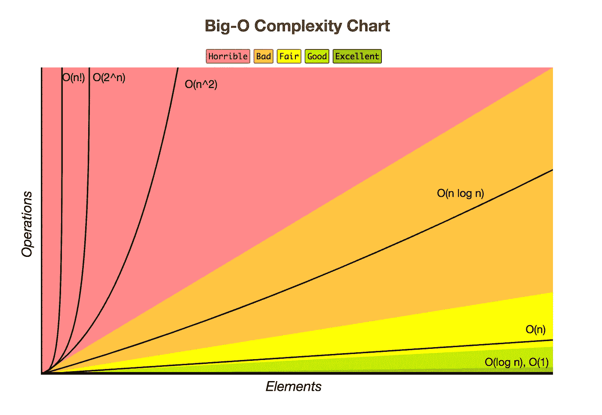

# 假人的大 O 符号

> 原文：<https://betterprogramming.pub/big-o-notation-for-dummies-like-me-98ac2d141f9f>

## 别担心，不是每个人都知道(但我们不会说)

当我第一次听到 *Big O Notation* 这个术语的时候，我完全不知道它是什么意思，甚至猜不出它和代码有什么关系。甚至阅读维基百科文章的前几个句子也没有让我明白这个概念**。没有计算机科学学位，这些行话似乎太专业、太复杂，难以理解。我也害怕这么多年后，我不得不再次思考数学。**

****

**约翰·莫塞斯·鲍恩在 [Unsplash](https://unsplash.com?utm_source=medium&utm_medium=referral) 拍摄的照片**

**幸运的是，这里涉及的数学大多是理论性的，这是我最喜欢的一种，因为我实际上不必“求解 x”或其他什么。在编程世界中，理解算法显然非常重要，而且它们在面试中很常见，所以我想我会再试一次，从最基本的步骤开始:理解什么是*大 O* 。**

**在最基本的层面上，大 O 符号定义了算法运行需要多长时间，也称为*时间复杂度*。它表示当数据变大时，给定算法的运行时间有多长。你可能想知道为什么除了炫耀之外，还有人关心计算算法的速度，但是随着程序规模的增长，这些微小的毫秒会越积越多！突然，一个过去根本不需要时间的算法开始让一切陷入困境，因此程序员需要知道“最坏的情况”是什么，或者更确切地说，在数据列表不断增长的情况下，一个算法运行的最慢速度是多少。**

**中的*基本代表*阶*，与*数量级*相同。[维基](https://en.wikipedia.org/wiki/Big_O_notation)补充道，*函数的增长率也被称为函数的**阶。****所以，对于我这样的初学者来说，把这里的字母 *O* 想成类似于*增长率*可能会有帮助。人们将大 O 符号称为“大 o of”或“order of”，然后是括号内的内容，通常是 *n* 。******

*****大 O 记法的最佳时间复杂度是 O(1)。这包括无论列表是长是短，运行时间都差不多的算法。下面的例子非常简单，但是你可以明白为什么它们不会花很长时间:*****

**********

*****这也包括算法中不依赖于常数的数学运算，例如:“5 * 250 / 2”。这些方法不是真正的排序或搜索来比较数据，直到一个匹配条件；它们只是访问数组中的固定点或返回值，不管列表中有 10 个还是 100 个数字，运行时间都差不多。这被称为*常数时间*，它是理想的，尽管很难让一个复杂的算法运行得那么快。*****

*****O(n)变得有点复杂，变量“n”是您正在处理的数据的大小。这通常表示一种算法，该算法必须对列表中的每一项进行排序，以找到它要寻找的项，或者该算法使用每一项，并以某种方式改变或组合它们。有人称这些*蛮力*算法，因为它们无论如何都要遍历每一项。O(n)也叫*线性时间。******

**********

*****因为一组数据可能会增长到无法管理的大小，所以还有一个比 O(n)更好的时间复杂度，称为 O(log n)。这里的 *log* 代表对数，你可以认为它是指数的反义词。例如，我们知道 2⁴是 16，数字 4 是指数。所以 2 的 4 次方等于 16。对数处理试图找到指数是什么，如果你已经有了值。对数回答了这样一个问题，“为了得到 16，我们要把 2 乘以多少次？”O(log n)也叫*对数时间*。*****

*****O(log n)的工作方式是在一个排序数组中使用二分搜索法。二分搜索法将列表分成两半，只搜索一半。如果你要找的数据在那一半里，它会再把它分成两半，然后重复搜索，直到没有剩余的部分。当您处理大型数据集时，这种搜索方式会变得更加高效，因为它每次搜索都会丢弃一半。*****

*****我将在这里介绍的最后一个时间复杂度是 O(n)，也称为*二次时间*。这个很糟糕，因为它开始还不错，然后很快就变得很慢。这种时间复杂度通常处理嵌套数据，其运行时间不好的原因是，不仅要对列表中的每一项进行排序，还要对列表中的每一项进行排序。*****

**********

*****在上面的例子中，假设你有一个数组，里面有五个学生，每个学生实际上是另一个数组，包含关于这个学生的五个细节。这个算法总共要迭代 25 次，也就是 5 次。更深的嵌套将导致 O(n)，O(n⁴)等。*****

*****(在大 O 表示法中，常数被忽略并替换为 n，因为大小可以是任何值，但数量级更容易量化。)*****

*****下面是一个方便的图表，为您提供了不同类型的运行时复杂性的可视化参考。*****

**********

*****[http://bigocheatsheet.com/](http://bigocheatsheet.com/)*****

*****大 O 可以变得非常复杂，很难概念化。到目前为止，我能学到的很少的东西实际上只是冰山一角。然而，一旦你理解了为什么和如何工作，理解一些更复杂的想法就更容易了。希望如果你像我一样从零开始，这有助于以一种简单明了的方式解释它。我真的能学会计算大 O 吗？敬请期待一探究竟！*****