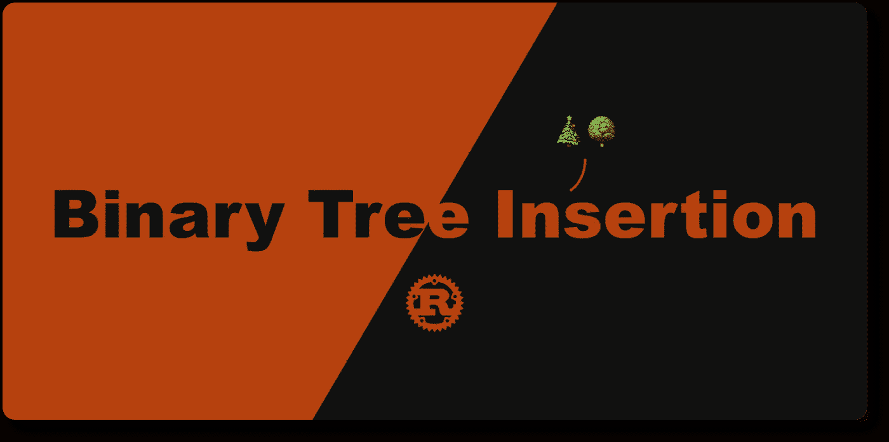
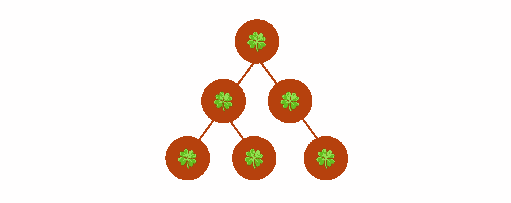
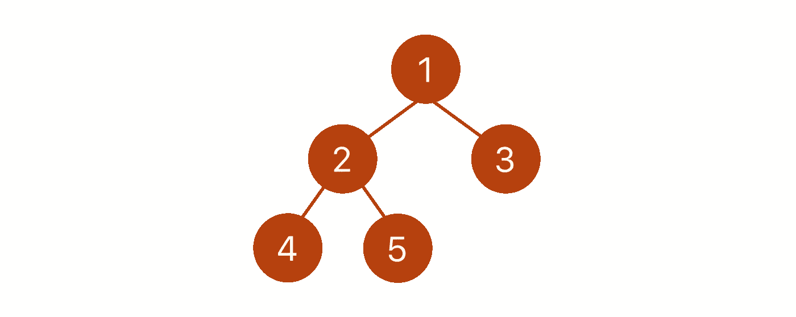
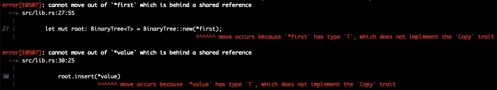

# Rust 中的二叉树插入

> 原文：<https://betterprogramming.pub/binary-tree-insertion-in-rust-a2d969c3d33d>

## 使用经典数据结构在 Rust 中学习所有权



# TL；速度三角形定位法(dead reckoning)

*   🌳我们将一起实现一个二叉树。
*   🧑‍🌾我们将讨论在二叉树中插入一个节点的几种方法。
*   🧑‍🔬我们将讨论 Rust 的所有权。
*   ✨:我们将在 Rust 中接触更多的特性和语法。

在实现二叉树时，我一直在努力解决 Rust 的所有权问题，所以我转向并重新阅读了它。在花时间理解它并重构我的代码之后，我终于取得了突破😎我非常兴奋地与大家分享我在 Rust 中遇到的令人敬畏的功能。你会看到一些有趣的概念，比如智能指针和所有权。

让我们得到它！

# 数据结构

一个[二叉树](https://en.wikipedia.org/wiki/Binary_tree)数据结构看起来像这样:



每个节点不超过两个子节点。我们称他们为`left`孩子和`right`孩子。我们可以将描述翻译成 Rust 代码，如下所示:

`BinaryTree`结构保存一个泛型类型`T`的值。我们用`[Option](https://doc.rust-lang.org/std/option/)` [枚举](https://doc.rust-lang.org/std/option/)来表示`left`和`right`子节点都是可选的。

一个`Option<T>`要么是一个包含类型`T`的值的`Some`，要么是一个表示它不包含类型`T`的值的`None`。因为我们使用`Option`来表示一个值是有还是无，Rust 编译器可以检查我们是否处理了所有的情况[以防止 bug](https://doc.rust-lang.org/book/ch06-01-defining-an-enum.html?highlight=option#the-option-enum-and-its-advantages-over-null-values)。

与使用`[null](https://developer.mozilla.org/en-US/docs/Web/JavaScript/Reference/Global_Objects/null)`值来表达相同概念的 JavaScript 相比，`Option`鼓励我提前处理用例，这让我在运行时省去了很多麻烦。

`[Box](https://doc.rust-lang.org/book/ch15-01-box.html)`是智能指针之一。它在内存中保存一个指向数据的地址。`Box`帮助我们创建一个大小未知的`BinaryTree`结构，这样我们就可以通过插入节点来增长二叉树，而不用在创建二叉树时预先考虑有多少节点。

[内存管理](http://web.mit.edu/rust-lang_v1.25/arch/amd64_ubuntu1404/share/doc/rust/html/book/first-edition/the-stack-and-the-heap.html)是 Rust 如此出色且有趣的原因之一。

# 插入

在插入一个新的二叉树节点之前，我们需要创建一个根。让我们来实现它:

`new` [关联函数](https://doc.rust-lang.org/book/ch05-03-method-syntax.html#associated-functions)获取`T`的值，并返回一个保存该值且没有子节点的`BinaryTree`。

既然我们可以使用`BinaryTree::new`创建一个根节点，我们可以考虑如何插入子节点。直观地说，如果我们可以通过调用根节点实例上的方法来插入左或右子节点，那就太好了。像这样:

```
BinaryTree::new(1)
  .left(BinaryTree::new(2))
  .right(BinaryTree::new(3))
```

幸运的是，我从我的朋友 [Matthias](https://twitter.com/matthiasendler) 那里找到了一篇[很棒的文章](https://endler.dev/2017/boxes-and-trees/)，详细解释了如何实现它。

现在让我们编写一些测试来确保相关的功能正常工作:

# 广度优先插入

插入方法非常灵活，我们可以轻松地用几行代码创建一个树:

代码创建了一个二叉树，如下所示:



这让我开始思考。

> *如果我只想创建一棵* [*平衡二叉树*](https://en.wikipedia.org/wiki/Binary_tree#Types_of_binary_trees) *没有任何其他要求，我可以插入一个节点，树为我找到下一个可用点吗？*

大概是这样的:

```
let mut root = BinaryTree::new(1);
root.insert(2);
root.insert(3);
root.insert(4);
root.insert(5);
```

它创建了和我们上面看到的一样的树结构。

我们可以通过以[广度优先](https://en.wikipedia.org/wiki/Breadth-first_search)的方式遍历树，并在发现缺少子节点时插入一个节点来实现。

实现先呼吸遍历最简单的方法是使用一个[队列](https://en.wikipedia.org/wiki/Queue_(abstract_data_type))。Rust 标准库中有一个`[VecDequeue](https://doc.rust-lang.org/std/collections/struct.VecDeque.html)`，我们可以使用。

算法是强制循环在访问下一层子节点之前，首先从左到右访问兄弟节点。在每次迭代中，我们将检查是否有`left`或`right`孩子缺席。如果我们找到一个，那就是新节点的下一个可用位置。

这是一个相当简单的算法，但是我很难把它做对。问题是我不明白 Rust 中的所有权。

下面我们一起来过一遍`insert`的方法。

我们首先要决定的是我们要如何使用第一个论点`self`。`self`指的是调用该方法的`BinaryTree`实例。我们从`self`中需要的是能够变异`left`和`right`子节点，以便我们可以插入一个新节点。简单地传入一个可变引用`&mut self`就可以完成这项工作，因为该方法不需要获得`self`的所有权。

对于`VecDeque`项的数据类型，我们可以使用与`self`相同的数据类型来存储`BinaryTree`的可变引用。

当在循环中弹出队列时，我们希望使用对`left`和`right`的可变引用，因为我们希望插入新的节点。

当插入新节点时，我们[解引用](https://doc.rust-lang.org/book/ch15-02-deref.html)中的`left`和`right`来允许新节点赋值，就像这样:`*left = Some(Box::new(BinaryTree::new(new_value)))`。

我花了一些时间才弄明白如何借用或移动方法中的数据。一旦我明白了，这就很有意义了！

让我们为它编写一些测试:

如果我们运行测试，您会看到如下错误消息:


这是因为树木不能互相比较。我们可以通过向`BinaryTree`结构添加`[PartialEq](https://doc.rust-lang.org/std/cmp/trait.PartialEq.html)`特征来修复它。

```
+ #[derive(PartialEq)]
pub struct BinaryTree<T> {
    pub value: T,
    pub left: Option<Box<BinaryTree<T>>>,
    pub right: Option<Box<BinaryTree<T>>>,
}
```

# 将数组转换成二叉树

现在我们已经用`insert`方法实现了自动插入，我们可以考虑用一种更方便的方式创建一个平衡树。例如，我想要类似于`[Vec::from](https://doc.rust-lang.org/std/vec/struct.Vec.html#examples)`的东西:一个关联函数`BinaryTree::from`，它接受一个数组并返回一个平衡的`BinaryTree`。

让我们编写一个测试来更好地可视化用例:

为了实现`BinaryTree::from`，我们可以简单地遍历数组，并使用`insert`方法来创建树结构。

在函数中，我们从第一个数组元素创建了一个根节点，然后将其余元素逐个插入树中。

如果您尝试测试它，您将会看到如下错误消息:



我们可以通过指定类型`T`实现`[Copy](https://doc.rust-lang.org/std/marker/trait.Copy.html)`特征来解决这个问题。

```
- impl<T> BinaryTree<T> {
+ impl<T> BinaryTree<T>
+ where
+     T: Copy,
+ {
```

原因是`insert`方法实际上接管了`new_value`的所有权。为了节省程序内存，编译器不允许我们将数组元素“移动”到`insert`方法中，因为该数组可能在程序的其他部分被引用。所以我们能做的就是传入一个数组元素的副本。

现在它应该工作了！

# 最后的想法

就是这样！我们二叉树断言的完整实现在这里:

# 参考

*   [二叉树](https://en.wikipedia.org/wiki/Binary_tree)
*   [平衡二叉树](https://en.wikipedia.org/wiki/Binary_tree#Types_of_binary_trees)
*   [广度优先搜索](https://en.wikipedia.org/wiki/Breadth-first_search)
*   [队列](https://en.wikipedia.org/wiki/Queue_(abstract_data_type))
*   [锈](https://doc.rust-lang.org/std/option/) `[Option](https://doc.rust-lang.org/std/option/)` [型](https://doc.rust-lang.org/std/option/)
*   [锈](https://doc.rust-lang.org/book/ch15-01-box.html) `[Box](https://doc.rust-lang.org/book/ch15-01-box.html)` [指针](https://doc.rust-lang.org/book/ch15-01-box.html)
*   [铁锈](https://doc.rust-lang.org/std/collections/struct.VecDeque.html)
*   [锈](https://doc.rust-lang.org/std/cmp/trait.PartialEq.html) `[PartialEq](https://doc.rust-lang.org/std/cmp/trait.PartialEq.html)` [性状](https://doc.rust-lang.org/std/cmp/trait.PartialEq.html)
*   [铁锈](https://doc.rust-lang.org/std/marker/trait.Copy.html)T4[特质](https://doc.rust-lang.org/std/marker/trait.Copy.html)
*   [铁锈](https://doc.rust-lang.org/std/vec/struct.Vec.html#examples)
*   [生锈关联功能](https://doc.rust-lang.org/book/ch05-03-method-syntax.html#associated-functions)
*   [铁锈归属](https://doc.rust-lang.org/book/ch04-01-what-is-ownership.html)
*   [JavaSCript](https://developer.mozilla.org/en-US/docs/Web/JavaScript/Reference/Global_Objects/null)
*   [栈和堆](http://web.mit.edu/rust-lang_v1.25/arch/amd64_ubuntu1404/share/doc/rust/html/book/first-edition/the-stack-and-the-heap.html)
*   盒子和树的[——生锈的智能指针](https://endler.dev/2017/boxes-and-trees/)
*   [实现二叉树插入的问题](https://www.reddit.com/r/rust/comments/ry34vr/problem_with_implementing_binary_tree_insertion/)
*   [枚举选项及其优于空值的优势](https://doc.rust-lang.org/book/ch06-01-defining-an-enum.html?highlight=option#the-option-enum-and-its-advantages-over-null-values)
*   [将智能指针视为具有 Deref 特征的常规引用](https://doc.rust-lang.org/book/ch15-02-deref.html)

```
**Want to Connect?**This article is originally posted on [Daw-Chih’s website](https://dawchihliou.github.io/articles/binary-tree-insertion-in-rust).
```