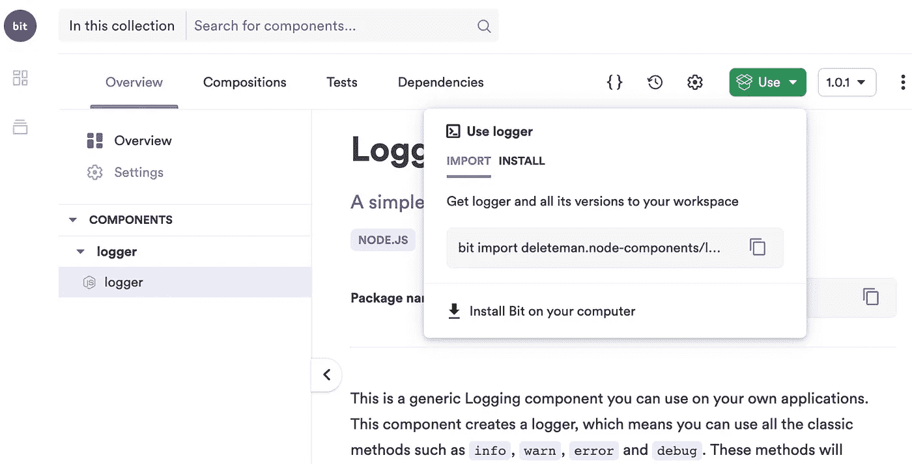
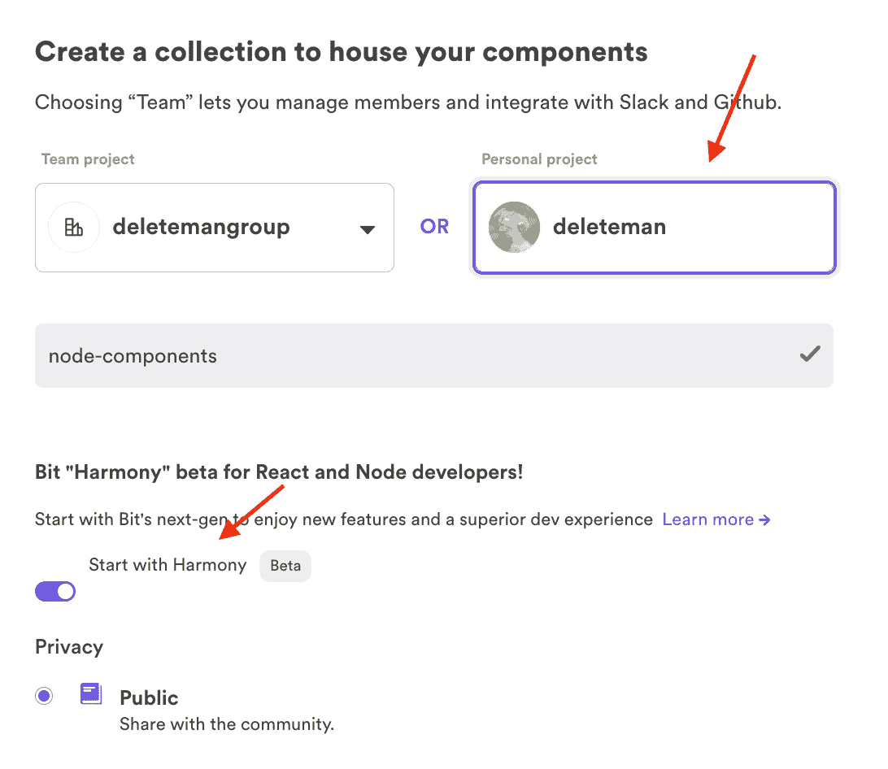
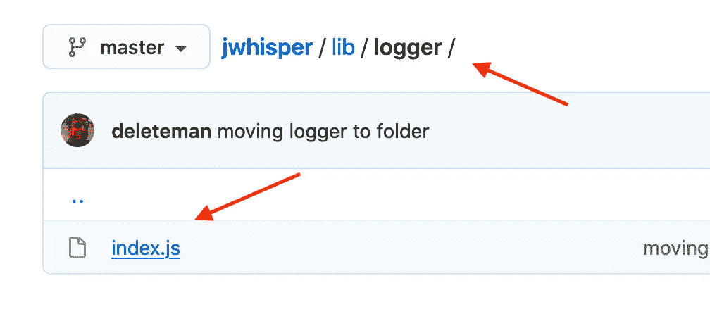
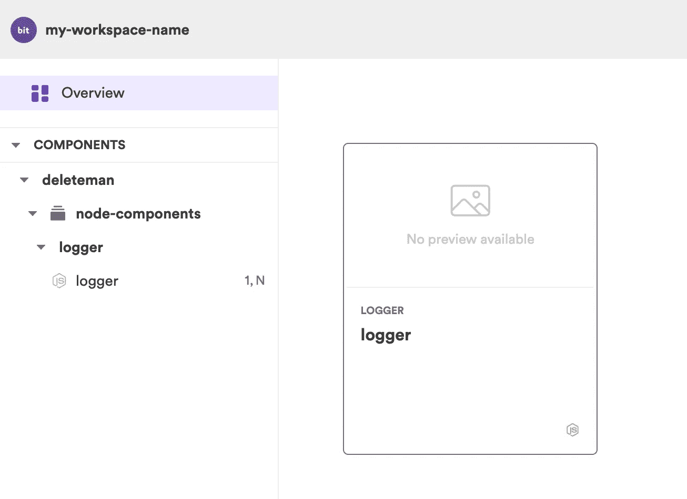
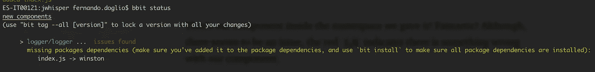
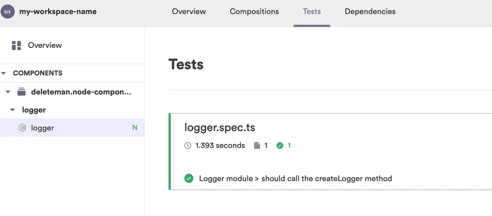

# Bit Harmony:在独立 Node.js 组件上创建和协作的新工具

> 原文：<https://betterprogramming.pub/bit-harmony-a-new-tool-to-create-and-collaborate-on-independent-node-js-components-f871658edcb6>

## 您开发工作流程所需的最新开源工具


照片由 [Pexels](https://www.pexels.com/photo/six-woman-standing-and-siting-inside-the-room-1181622/?utm_content=attributionCopyText&utm_medium=referral&utm_source=pexels) 的 [Christina Morillo](https://www.pexels.com/@divinetechygirl?utm_content=attributionCopyText&utm_medium=referral&utm_source=pexels) 拍摄。

每个人都知道，如果你想将一段 [Node.js](https://nodejs.org/en/) 代码作为一个单独的组件与其他人共享，你需要创建一个包并将其发布到某个地方——最好是在 NPM，人们可以在那里找到、安装并使用它。

这个工作流程没有任何问题。到目前为止，它一直在工作，当你只关心人们使用它时，它是完美的。但是如果你想要更多呢？如果您的意图是让其他人使用您的代码，在他们认为合适的时候更新它，然后再发布回来，该怎么办？如果您考虑到公司试图在多个项目中使用标准模块，这并不是一个不常见的用例。

唯一的问题？使用当前可用的工具，你需要 NPM 和 Git 的混合体来完成它。或者复杂的工作流程。你选吧。

如果你正在处理一个单一回购出错的教科书案例呢？一个单一的存储库，其中包含您的企业平台的代码库以及围绕它的每一个内部扩展。每个开发人员和他们的叔叔都在从事回购工作，所以你要么建立一个非常复杂的分支模型并祈祷你的开发人员遵循它，要么解决合并冲突并向开发人员解释 Git 如何工作。这不是你想要的情景(相信我，我经历过)。

幸运的是，Bit 的最新版本，代号为 [Harmony](https://harmony-docs.bit.dev/) ，来帮忙了。

[](https://bit.dev/deleteman/node-components/logger/logger)

[我的节点组件导出到 Bit.dev 上的远程作用域](https://bit.dev/deleteman/node-components/logger/logger)

# 什么是比特？

如果你还没听说过，Bit 是一个开源工具(原生集成到 [Bit.dev](https://bit.dev) 的远程托管平台)，它可以帮助你创建和共享原子组件。这是什么意思？您可以从头开始构建独立的组件，或者提取您的代码部分，并在 Bit 服务器上将它们作为独立的组件共享(例如 [Bit.dev](https://bit.dev) )。

虽然这听起来很像 NPM，但还是有一些主要的区别:

*   你不必提取代码来分享它。您可以直接从存储库中导出组件。Bit 允许您将代码的一部分标识为一个组件，并将其与项目的其余部分分开处理。这反过来有助于简化共享过程，因为您不必设置单独的 repo，也不必重新设计将这些文件导入项目的方式。
*   导入您的组件的人(而不仅仅是安装它们)也可以对它们进行协作、修改，并将它们导出回注册中心。如果您在同一个组织内作为一组团队工作，这是非常强大的，因为您可以跨团队使用相同的工具进行协作，而不必从事单独的项目。导入一个 Bit 组件会将代码下载下来，并将其复制到您的工作目录中(而不是一个讨厌的`npm_modules`文件夹，在那里您不能对它做任何事情)。

现在有了 Bit 的最新版本，团队协作变得更加容易和快速，这要归功于诸如[开发环境](https://harmony-docs.bit.dev/environments/overview)之类的附加功能，你可以预先配置这些开发环境并与每个人分享，这样你就可以使用相同的配置进行工作。

# 创作节点组件

注意我说的是“组件”而不是“包”Bit 的组件概念不同于包的概念，因为它包含的不仅仅是你共享的代码。

如果您要构建一个标准的节点包，您需要使用以下工具:

*   NPM 安装依赖项，当然，与社区共享最终结果。
*   Mocha，Just，或者其他一些测试框架。这不是一个硬性要求，但是如果您希望其他人信任您的代码，您肯定希望测试您的代码。
*   饭桶。同样，这不是一个特别难的要求，但它和大的要求一样高。通常，如果你共享你的包给其他人使用，你也会希望他们让你知道它是否有问题，甚至贡献他们的想法和改进。Git 通过在 GitHub 或 Bitbucket 等地方发布代码来实现这一点。
*   棉绒。通常这是你想要的——尤其是当你希望人们为你的工作做出贡献的时候。这将有助于确保他们添加的每一段代码都写得正确。

我可能会继续下去，但我认为这些小组有助于表明构建一个包——至少是以正确的方式——对于您的 IDE 来说不是微不足道或不可行的。

然而，感谢 Harmony 的环境，我们可以开始少担心那些工具，更多地关注于实际构建我们的组件。

让我们快速地看一下当您将一段代码提取到一个组件中时所经历的过程，以及您如何使用 Bit Harmony 与其他团队共享它。

## 入门指南

关于如何安装和创建你的第一个组件的详细步骤指南，你可以查看他们的官方文档[。](https://harmony-docs.bit.dev/tutorial/install-bit)

否则，我将假设您已经在系统上安装了 Bit，并准备开始使用。

我在这里要向你展示的是如何提取一段代码，并把它变成一个组件，而不影响你当前的项目。为此，我将使用我较早的开源项目之一， [jWhisper](https://github.com/deleteman/jwhisper) (我不久前构建的 JSON-WSP 兼容库)。这是为了向您展示，您不需要以任何特殊的方式构建您的项目。

在您的系统上安装 Bit，使用 CLI 工具登录，并在 Bit.dev 上设置您的帐户(同样，查看他们的教程了解这些步骤)之后，您需要做的第一件事是创建一个作用域(也称为集合)，这是您的组件将驻留的地方。



您可以在这里看到，我已经创建了自己的组件，并将其命名为“节点组件”我还选中了“从和谐开始”复选框。我是在我自己的用户下而不是在我的组织下创建的，但那只是我。

现在我们已经解决了这个问题，让我们回到我们的代码并创建我们的工作空间，这是您想要做的第一件事。这是通过项目文件夹中的一个非常基本的命令完成的:

```
$ bit init --harmony
```

旗非常重要。否则，您将使用旧版本创建工作区。你现在需要关心的是刚刚为你创建的两个文件:

1.  `.bitmap`文件。不要被名字弄糊涂了。虽然这听起来像一个图像，但它只是一个 JSON 文件，其中 Bit 跟踪所有组件并将它们的名称映射到它们的物理位置。你不需要手动更新这个文件，所以现在忽略它。
2.  `workspace.jsonc`。这是你要打开的。在这里，您将配置项目所需的一切。一会儿我们会看到更多。现在，你需要编辑`yourusername.your-scope`的`defaultScope`键。对我来说，那就是`"deleteman/node-components"`。

现在，让我们仔细看看什么是环境，以及我们能从环境中得到什么。

## 使用环境

环境本质上是一组预先配置好的工具，供您在开发过程中使用。如果你过去用过 Bit，这是一个新概念。

由于有了环境，您可以配置您正在构建的项目的类型和您正在使用的工具(即所需的包管理器、linter、测试库等等)。这是因为从现在开始，你唯一需要担心的工具就是钻头。

通过环境，Bit 抽象出对单个工具的需求，给你一个单一的入口点:它的 CLI。

*   你需要构建你的代码吗？没问题。您可以配置构建管道或使用默认管道。
*   您需要安装您的依赖项吗？没问题。通过环境，您可以为您的项目配置默认的包管理器(无论是 npm、pnpm、yarn 还是其他什么), Bit 会在需要时负责调用它。
*   您需要在构建项目之前运行 linter 吗？太好了，你可以配置你最喜欢的 linter 并把它添加到环境提供的构建管道中。

您的组件的整个生命周期都是由 Bit 处理的，并且这样做的工具是在环境中配置的。

配置环境的方法是编辑`teambit.workspace/variants`部分下的`workspace.jsonc`文件。让它看起来像这样:

```
"teambit.workspace/variants": {
    "*": {
      "teambit.harmony/node": { }
    }
  }
```

这里，我们告诉 Bit，我们对所有的*组件都使用了“节点”环境。但是我们可以对不同的文件夹使用不同的环境，这允许您在同一个项目中导出和处理不同的默认设置(你好，灵活性！).*

通过选择“node”环境，我们选择了 Bit 理解的最适合 Node.js 项目的默认行为。本质上，它选择 [Jest](https://jestjs.io/) 作为默认测试库，理解所有以`*.spec.*`和`*.test.*`结尾的文件都是单元测试。它将使用 TypeScript 作为默认编译器和其他一些默认编译器。您可以查看整个列表。

如果你对这些默认值不满意，或者它们对你没有意义，你可以自己[覆盖它们](https://harmony-docs.bit.dev/nodejs/extending-node)。由于这是一篇基本的介绍文章，我将把高级的东西留到将来。我们将暂时使用默认设置。

在继续之前，您必须启动 dev 服务器，它将负责多项工作，包括为我们新配置的环境安装所需的文件:

```
$ bit start
```

这个命令需要一段时间，但是完成后，您可以导航到`localhost:3000/`来查看本地工作区 UI。它现在是空的，但是当我们开始添加组件时，您将会看到它们。

## 将我们的代码设置为组件

要将我们的代码作为一个组件共享，我们需要使用 Bit 的 CLI 将其作为一个组件添加。重要的是要记住，一个组件不仅仅是一个包含代码的文件，而是包含代码、文档、单元测试以及它们之间的一切。这就是为什么我们的代码需要放在单独的文件夹中。

在我的例子中，我将把我的日志模块作为目标，它只是 Winston 日志器的一个实现。



我将使用以下命令将文件夹添加为组件:

```
$ bit add lib/logger --namespace logger
```

`namespace`标志用于在我的工作空间中对我的组件进行分组，然后在它们的远程作用域中进行分组。

您现在可以返回到您的本地用户界面，您将看到更新:



这是我们给它命名空间中的组件。太棒了。然而，似乎有一个问题。红色的`1,N`表示我们的组件有问题。

如果你跑步:

```
$ bit status
```

你会注意到 Bit 已经拿起它需要 Winston 来工作:



我们需要手动将这种依赖性添加到组件中，我们可以通过 Bit:

```
$ bit install winston
```

这将使用预先配置的包管理器安装依赖项(你可以在`workspace.jsonc`上看到——默认为`pnmp`)。这也将更新`workspace.jsonc`文件，向`teambit.dependencies/dependency-resolver`键添加新的依赖项。如果您重新启动 dev 服务器，您会在本地 UI 上看到红色消失了。

## 添加测试

此时，组件已经完成，可以导出了。但在此之前，我想向您展示向它添加测试是多么容易。

注意:为了让下面的测试工作，您还需要使用下面的命令安装软件包`@babel/runtime`:

```
$ bit install  [@babel/runtime](http://twitter.com/babel/runtime)
```

这将把它作为一个依赖项包含在您的项目中。现在，您可以在 components 文件夹中创建一个简单的测试文件。我称之为`logger.spec.ts`:

我实际上是在模仿 Winston，检查我的模块是否调用了基本的`createLogger`函数。这不是理想的测试，但足以向您展示 Bit 如何处理它。

添加这个文件后，您可以运行`$ bit test`，它会负责调用 Jest(或者您决定配置的测试框架)。最棒的是，您还可以在本地 UI 上获得图形更新:



注意“测试”选项卡。它显示您的文件的结果。

## 添加文档

如果你希望有一天有人会用到你的组件，记录它们是必不可少的。Bit 的伟大之处在于它有一些缺省值可以用来创建文档，并且它会将这些缺省值添加到它的 UI 中(本地和远程)。

我们将在组件的文件夹中创建一个快速的`logger.docs.mdx`文件(注意,`*.docs.mdx`扩展名告诉 Bit 这个文件只是文档),如下所示:

```
---
displayName: Logger Component
description: A simple logger component using Winston
labels: ['node.js', 'winston', 'logger']
---
This is the actual documentation of my module, you can add all the markdown you want.
```

这转化为(减去最后一行，截屏显示了我花一些时间记录组件后的最终结果):


注意添加的标题、副标题和标签，以及可以扩展解释并添加示例和代码片段的最后一行。“Package name”字段是由 Bit 生成的，它向您展示了如何在代码中导入新的组件。这是因为它在`node_modules`文件夹中创建了一个符号链接，指向组件的实际文件夹。这有助于您从代码的实际物理位置提取代码。

事实上，您可以将 JS 代码更改为 TypeScript，通过 Bit 导出组件，然后更改 require 语句以使用该包名(在本例中为`@deleteman/node-components.logger.logger`)提取文件。使用 TS 组件，您的 JS 代码仍然可以没有任何缺陷地工作(这是因为 Bit 编译了代码，并将 JS 输出保存在`node_modules`的适当文件夹中)。

## 导出模块

最后但肯定不是最不重要的，你现在准备好与世界分享你的模块。您已经提取了代码，添加了测试，设法创建了一些基本的文档，现在您可以简单地使用以下代码行来标记(即添加一个版本)您的组件并导出它:

```
$ bit tag --all 1.0.0 --message "first version"
$ bit export 
```

当运行第一个命令时，您实际上是在设置组件的版本号，并提交所有更改(就像使用 Git 一样)。在此过程中，测试将被触发，如果测试失败，整个过程将被取消。这是为了确保所有被标记的东西都能正常工作。

第二个命令将负责将所有内容导出到 [Bit.dev](https://bit.dev) 服务器中(注意，您可以创建自己的[自托管 Bit 服务器](https://docs.bit.dev/docs/bit-server)并在内部使用它，而无需将您的组件放在公共云上)。您应该会看到与您在本地看到的相同的文档和组件列表，但是是在您的帐户上。[见矿，例如](https://bit.dev/deleteman/node-components)。

# 结论

恭喜，您已经成功地从 Node.js 项目中创建了一个可重用的组件。您从单个文件开始，将它转换成 TypeScript(可能)，添加文档、测试文件，并在不影响项目安全的情况下与全世界共享它。

本教程涵盖了 Bit Harmony 添加的所有新功能的基础知识。我将在接下来的文章中涉及更深入的主题，但是请随意留下问题或建议场景，我将尝试在下一篇文章中涉及它们。