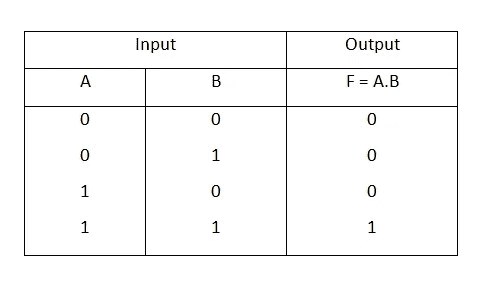
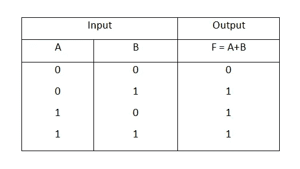

# 比特操纵——玩弄真相(第一部分)

> 原文：<https://betterprogramming.pub/bit-manipulation-playing-with-the-truth-part-1-e4740466d3b1>

## 理解和实现与或真值表


由[杰佛森·桑多斯](https://unsplash.com/@jefflssantos?utm_source=unsplash&utm_medium=referral&utm_content=creditCopyText)在 [Unsplash](https://unsplash.com/search/photos/programming?utm_source=unsplash&utm_medium=referral&utm_content=creditCopyText) 上拍摄的照片

理解位操作的第一步是了解真相…就像在真值表中一样。

哦，太好了，就一张桌子？不…不是一个，但是为了这篇文章，我们将讨论两个— `AND`和`OR`。如果你想了解更多，请查看[这篇](https://www.csetutor.com/logic-gates-and-truth-table/) [文章](https://www.csetutor.com/logic-gates-and-truth-table/)。也就是说，让我们开始吧！

# **和**

这用 *&* 表示。本质上，这意味着当且仅当 A 和 B 都是 1 时，组合两个比特 A 和 B 将仅给出 1 **的结果。**



还有真值表([http://bit.ly/32GjG1m](http://bit.ly/32GjG1m))

借助上表，很容易确定两个整数之间按位 AND 运算的结果。例如，为了得到 12 & 4 的结果，将两个整数都转换成二进制表示。

12=1100

4=100

嗯。12 有四位，4 有三位。让它们等长总是很酷的。为此，我们用零填充较小的位数，使它们相等。所以:

4=0100.

既然它们的长度相等，我们现在可以找到按位 AND:

1100&0100
—
0100

从每个整数的最右位开始，查看上表以查看相应的值。所以 0&0=0，0&0=0，1&1=1，1&0=0。
所以，最后的结果是 0100，也就是 4。即 12 & 4=4。

# **或**

这由 **|** 表示。这表示如果 A 或 B 中至少有一个为 1，则组合两个位 A 和 B 将仅给出 1 **的结果。**



还是真值表([http://bit.ly/32GjG1m](http://bit.ly/32GjG1m))

在上表的帮助下，很容易确定两个整数之间的按位 OR 运算的结果。

例如，要计算 13|3 的结果，请将两个整数都转换为二进制表示。

13=1101

3=11

填充后:

3=0011.

让我们找到按位 OR:

1101|0011
——
1111

从每个整数的最右位开始，查看上表以查看相应的值。所以 1|1=1，0|1=1，1|0=1，1|0=1。
所以，最后的结果是 1111，也就是 15。即 13|3=15。

# 你可能会问，这有什么用…

假设您被要求编写一个`function`,它接收一个字符串并返回由以下标签包围的修饰字符串:`<i>`、`<b>`和`<u>`

## 选项一

我们可以决定写一个函数，考虑它的签名中的所有标签。所以，我们有这样的东西:

以上功能运行良好。但是它的挑战是，当传递参数给函数时，你必须记住每个标签的位置。

另外，假设您只想给文本加下划线。你将不得不这样做:`decorateString("Hello", false, false, true)`。任何阅读这段代码的人(除了你)都必须查找这个函数才能知道什么是假，什么是真。

## 选择二

嗯……算法部长，你知道你不必用 Javascript 那样写你的函数。您可以将第二个参数设为`Object` 并将*析构为*以获得可用的值并相应地使用它。所以你有:

这要好得多，因为我不必记住顺序，只需指定我想要的。但是我没有使用 Javascript。还有其他选择吗？

## 选项三

是啊！使用 bits 作为配置(BaC)！让我们同意一位代表一面旗帜。当该位为 1 时，标志向上，当该位为 0 时，标志向下。现在，每个标签将在某个位置用一个标志来表示。我们可以将每个标签定义如下(二进制):

```
*includeITag =  001* 
*includeBTag = 010* 
*includeUTag = 100*// 001 = 1, 010 = 2, 100 = 4
```

调用该函数将如下所示:

仅包含 I 标签:`decorateString("Hello", 1)`

仅包含 B 标签:`decorateString("Hello", 2)`

仅包含 U 标签:`decorateString("Hello", 4)`

不错，但是我必须记住这些数字，对吗？

不会。这些值将被定义为包含这个函数的类/文件中的常量，所以你不必记住它们。

但是，没有办法一起使用两个标签。为了使字符串包含 I 和 B 标签，我们需要设置两个标志…即`011`。为了让这三个标签出现，我们需要`111`。

我们要为所有可能的标签组合定义值吗？不。你只创建你需要的并生成组合。这就是使用|操作符的地方。

include tag = 001
|
include tag = 010
———011

这意味着我们现在可以像这样调用函数:

仅包括 I 和 B 标签:`decorateString("Hello", includeITag | includeBTag)`

包含三个标签:`decorateString("Hello", includeITag | includeBTag | includeUTag)`

这可以是任何顺序。

那么，在实现函数时，如何从输入中提取这些值呢？通过检查是否设置了标志！这就是&运算符的用武之地。

如果索引 I 处的某个位被置位，则检查该整数，`bitwise AND`用它来检查索引的 2^i 值。如果结果不为 0，则设置该位，否则不设置该位。

例如给定`1101`，检查索引 1 处的位是否置位，2 = 2。

因此:

1101
&
0010
—
0000

由于该值为 0，因此索引 1 处的位不会置位。因此，索引 1 处的标志没有被设置。

然而，给定 1011，检查索引 1 处的位是否被设置，2 = 2。

因此:

1011
&
0010
—
0010

由于结果不为 0，这意味着设置了索引 1 处的位。

了解了这一点，让我们来实现我们的功能:

这可以在任何编程语言中实现，而无需使用析构或传递一长串参数。

一个简单的用例是在 Android 中启动新活动时设置标志:

```
myIntent.setFlags(Intent.FLAG_ACTIVITY_NO_ANIMATION|Intent.FLAG_ACTIVITY_CLEAR_TOP);
```

如果你有什么要补充的，请写在评论里。

在第二部分中，我们将讨论移位以及如何使用它。在那之前，一点一点地享受你的生活。