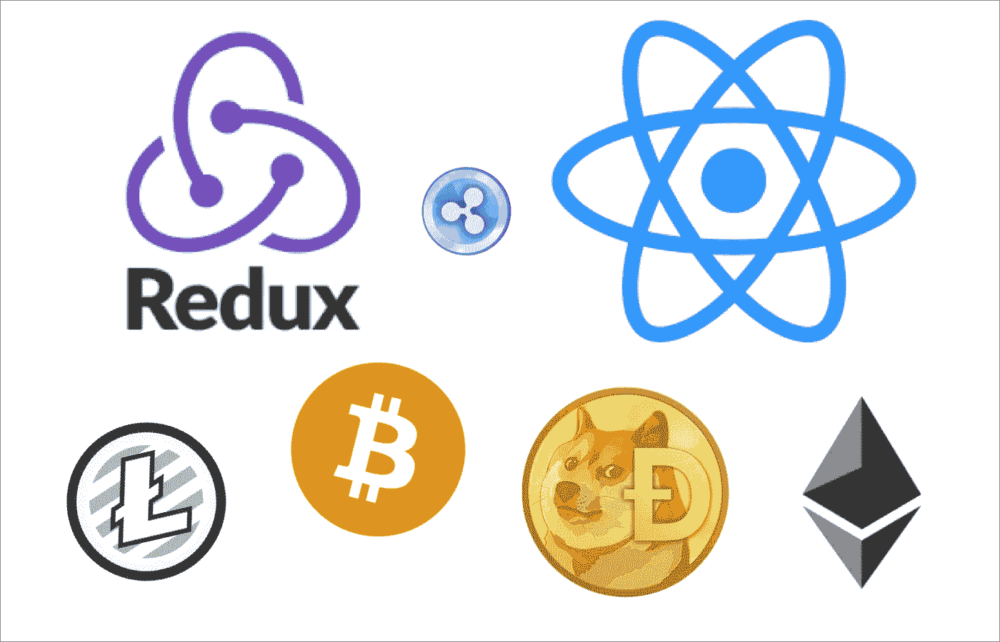
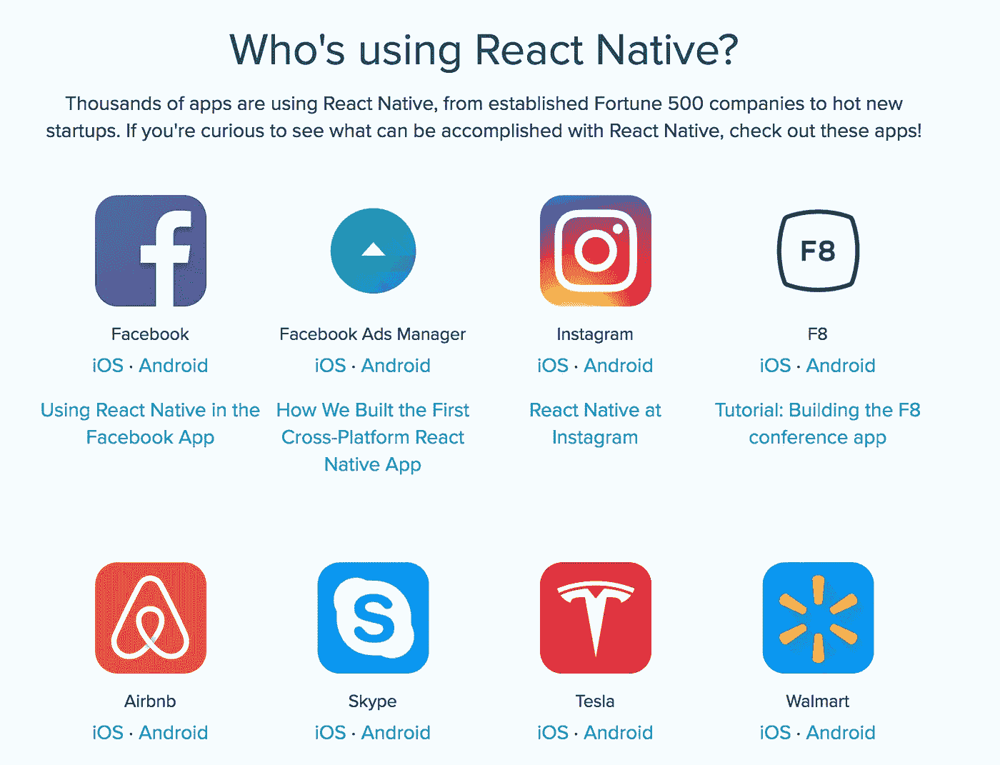
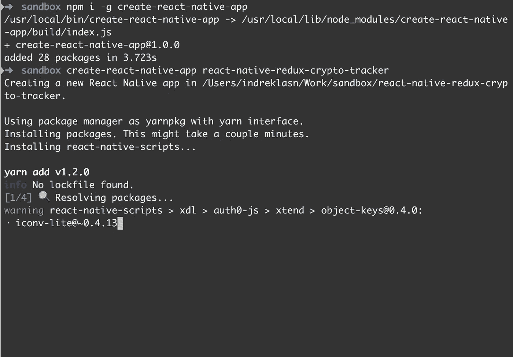
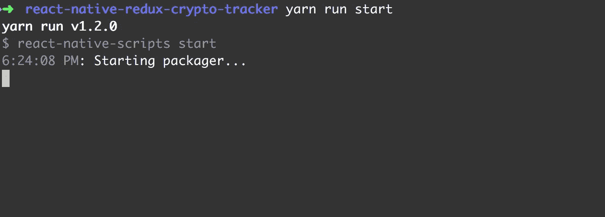
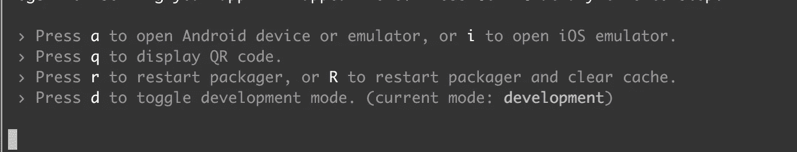
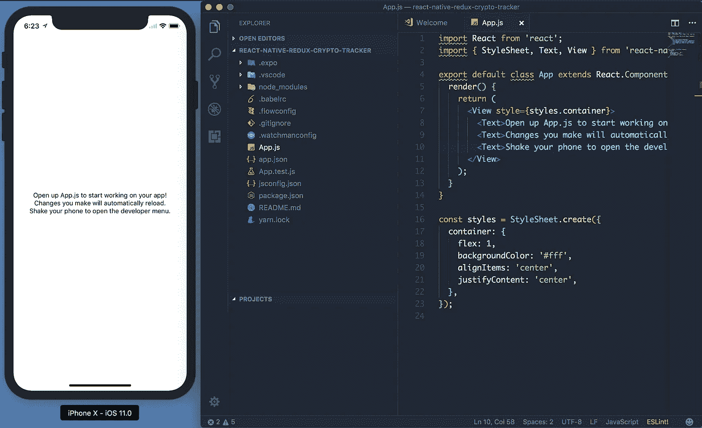
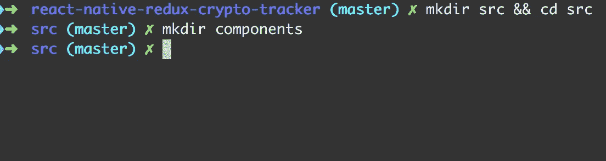
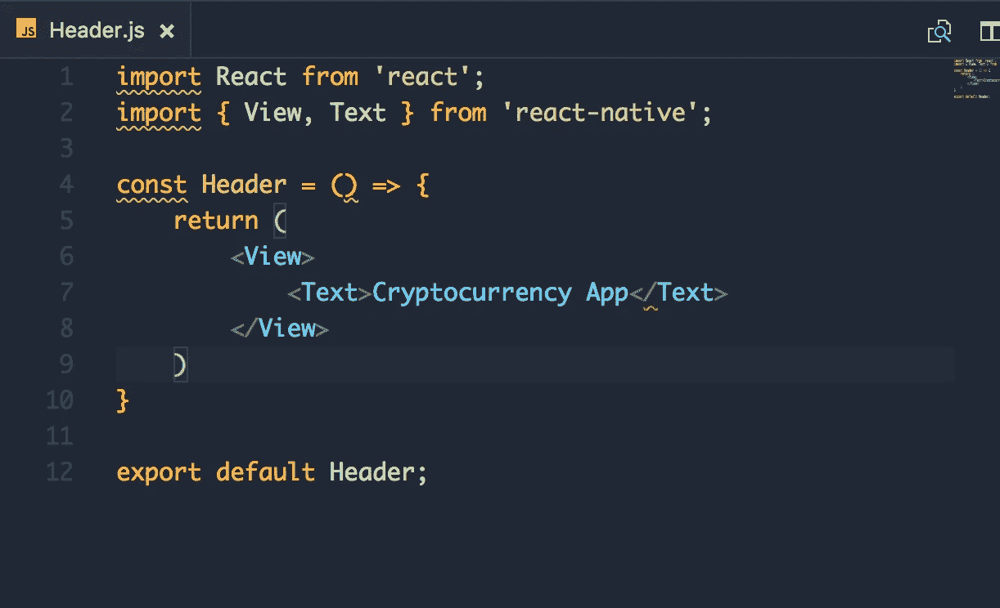
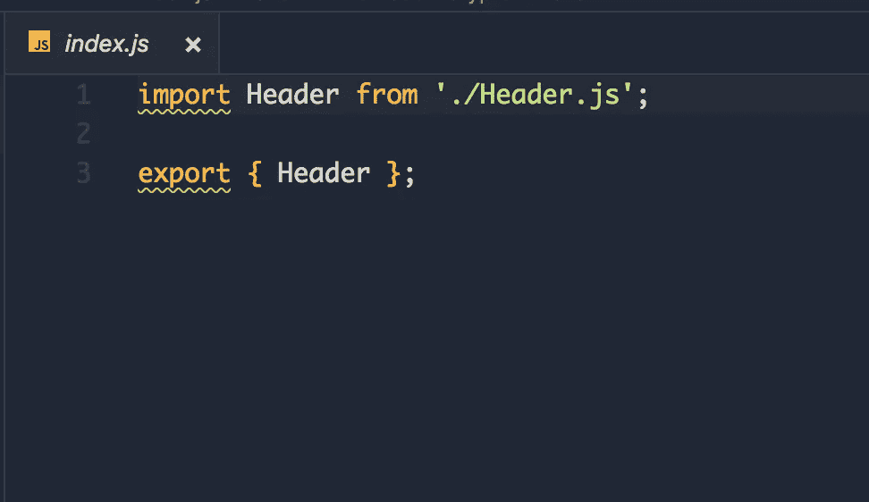
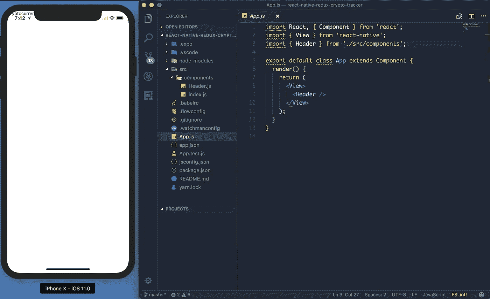

# 我们来构建:加密货币原生手机 App，带 React Native + Redux

> 原文：<https://betterprogramming.pub/bitcoin-ripple-ethereum-price-checker-with-react-native-redux-e9d076037092>

# 演示—我们将构建什么

最终产品

我来教大家如何用[React Native](https://facebook.github.io/react-native/docs/getting-started.html) 和 [Redux](http://redux.js.org/) 编写一个原生手机 app。让我们开始吧！

[成为媒介会员直接支持我的工作](https://trevorlasn.medium.com/membership)。你也可以在媒体上看到所有的故事。提前感谢！

# [什么是 React Native？](https://vuejs.org/v2/guide/#What-is-Vue-js)

React Native 允许您仅使用 JavaScript 构建移动应用程序。它使用与 React 相同的设计，允许您从声明性组件构建丰富的移动 UI。

# 为什么我们使用 React Native 而不是 Swift、Kotlin、Java 或 Objective-C？

这完全取决于个人喜好。以下是主要场景:

*   也许你已经知道一些反应。在这种情况下，构建 React 原生应用将是一种绝对的乐趣。RN 工装很棒。
*   跨平台。学一次，随处写。不用用 [Kotlin](https://kotlinlang.org/) 编写你的 Android 应用，用 [Swift](https://developer.apple.com/swift/) 编写你的 iOS 应用，你可以用 React Native 编写这两个应用，这样可以节省大量的时间和预算。
*   更容易从 web 背景过渡到移动开发。
*   JavaScript——统治一切的语言。
*   能够快速将更新直接推送到已发布的应用程序，绕过应用程序商店审核流程和时间表。

请记住，最终，只有一件事是重要的——无论什么对你最有效，让你快乐。

公平地说，React Native 现在已经成熟了。许多公司已经适应了注册护士(包括脸书本地应用)——就业市场的需求非常高。

[RN 展示区](https://facebook.github.io/react-native/showcase.html)

# Redux 是什么？

Redux 是一个 JavaScript 应用的可预测状态容器。

如果你不太熟悉 Redux，下面这篇文章是一个很好的教程，介绍如何将 Redux 应用到 React 应用程序中。

# 我们为什么要用 Redux？

*   Redux 使得复杂的部分(状态管理)更容易预测，也更容易推理。
*   从视图中分离状态。我的意思是，让 React 处理视图，Redux 处理应用程序的状态。
*   干净的代码和最佳实践。
*   优秀的工具和中间件让开发变得更加愉快。

开始吧！

# **先决条件:**

*   [Node.js](https://nodejs.org/)
*   [npm](https://www.npmjs.com/) 或[纱线](https://yarnpkg.com/)
*   Bash 命令行/终端*。* Mac 和 Linux 默认安装。如果你使用的是 Windows 系统，请遵循这个指南，学习如何在 Windows 系统上安装 bash。
*   文本编辑器/IDE
*   [Xcode](https://developer.apple.com/xcode/)(iOS)——这就是你初始设置需要的全部！ *—* [视频设置](https://www.youtube.com/watch?v=K0y2tc38l2s)
*   [Android Studio](https://developer.android.com/studio/install.html)(Android)——[观看本教程，正确设置 Android 模拟器！](https://www.youtube.com/watch?v=Q0dERWCzoi0)
*   可选:[博览会](https://expo.io/)——我强烈推荐这个。
*   我还推荐购买 Expo CLI 工具。

继续之前，请确保您已准备好所需的一切。

# 安装和设置我们的本地应用程序开发环境

打开您的终端，运行几个命令来安装 React Native 并启动您喜欢的模拟器。

`$ npm install -g create-react-native-app`

`$ create-react-native-app react-native-redux-crypto-tracker && cd react-native-redux-crypto-tracker`

您应该会得到与此类似的结果:

**安装 react-native 并创建 react-native 项目**

我们快到了。

接下来，我们只需要为我们的项目服务。在终端中键入下一条命令。你可以选择 iOS 或者 Android 模拟器。iOS 按`I`，安卓按`a`。

本指南我选择了 iOS，但是它可以在两种操作系统上运行！我个人喜欢 iPhone 和 Android 手机，你可以根据自己的喜好选择。

*   (模拟器) *—* `$ npm run ios` — iOS
*   (模拟器)*—*—`$ npm run android`—安卓
*   (物理设备)— `$ npm run start` —二维码和选项。打开手机摄像头，对准二维码。此外，你还将需要 [expo](http://expo.io) 应用程序。[安卓博览会](https://play.google.com/store/apps/details?id=host.exp.exponent&hl=en)——[iOS 博览会](https://apps.apple.com/us/app/expo-client/id982107779)

iPhone X 模拟器与 RN 配合得非常好。感谢脸书团队出色的实施和执行！👍

正如我们所看到的，有相当多的事情正在进行。从顶部，我们可以看到

`import { StyleSheet, Text, View } from ‘react-native’;`

这到底是什么？

`Text`是[JSX](https://reactjs.org/docs/introducing-jsx.html)——一种在 JavaScript 中嵌入 XML 的语法。

许多框架使用一种特殊的模板语言，这种语言允许你在标记语言中嵌入代码。在 React 中，情况正好相反。JSX 让你在代码中编写你的标记语言。

它看起来像 web 上的 HTML，除了你使用 React 组件而不是像`
`或``这样的 web 东西。在本例中，`<Text>`是一个内置组件，只显示一些文本。

TL；DR:显示文本的 React 组件。

构建 UI 最基本的组件。`View`是一个支持布局的容器，带有 [flexbox](https://facebook.github.io/react-native/docs/flexbox.html) 、 [style](https://facebook.github.io/react-native/docs/style.html) 、 [some touch handling](https://facebook.github.io/react-native/docs/handling-touches.html) 和 [accessibility](https://facebook.github.io/react-native/docs/accessibility.html) 控件。

`View`直接映射到本机视图，相当于 React Native 正在其上运行的任何平台——无论是`UIView`、`
`、`android.view`还是其他。

`View`被设计成嵌套在其他视图中，并且可以有零到多个任何类型的子视图。

这个例子创建了一个`View`,它用填充将两个彩色框和一个文本组件包装在一行中。

# 样式表

样式表是一种类似于 CSS 样式表的抽象。

它创建一个新的样式表。RN 的样式基于 flexbox。它使用 Yoga 布局引擎。我们通过`style`属性将样式传递给元素。

# 构建应用程序

首先创建一个`src`目录，我们把所有的代码放在那里。

`$ mkdir src && cd src`

在`src`里面，创建一个`components`目录。在`components`中，我们将放置我们的视图。

# 实现标题

在`src/components`里面做两个文件——`Header.js` 和`index.js`。

`Header.js`是 app 的表头，`index.js`是做一个进出口清洁器。

在`Header.js`内部，实现一个无状态组件。试着自己去做——最有效的学习方法实际上是做。

接下来—将`Header.js`导入`App.js`并显示！

有用！但是等等...为什么标题几乎被 iPhone 默认文字隐藏了？我们将在下一章[中解决这个问题！](https://medium.com/react-native-training/tutorial-react-native-redux-native-mobile-app-for-tracking-cryptocurrency-bitcoin-litecoin-810850cf8acc)

 [## 让我们来构建:使用 React Native + Redux 的加密货币原生移动应用程序—第二章

### 欢迎回来！这是第一章。

medium.com](https://medium.com/react-native-training/tutorial-react-native-redux-native-mobile-app-for-tracking-cryptocurrency-bitcoin-litecoin-810850cf8acc) 

# 源代码

 [## indreklasn/react-native-redux-crypto-tracker

### 💎了解如何构建 Redux + React 原生加密货币 app-indreklasn/React-Native-Redux-crypto-tracker

github.com](https://github.com/indreklasn/react-native-redux-crypto-tracker) 

如果你想让你的 JavaScript 更上一层楼，就从 [*这本书*](https://amzn.to/2k7AZHj) 开始吧。在这里 找到 kindle 版本 [*。*](https://amzn.to/2XJ0KQY)

感谢阅读！