# 炽热的刀锋:用 Rails 构建简单的 API

> 原文：<https://betterprogramming.pub/blazing-blade-building-a-simple-api-with-rails-1acd3e947a16>

*使用 Rails 创建第一个 API 的程序指南*


由[马库斯·斯皮斯克](https://unsplash.com/@markusspiske?utm_source=medium&utm_medium=referral)在 [Unsplash](https://unsplash.com?utm_source=medium&utm_medium=referral) 上拍摄的照片

我首先要说的是，这是一篇非常全面的文章，正因为如此，这篇文章相当长。然而，我写这篇文章的意图是，任何有 Rails 经验的人都可以用它来构建一个简单的、纯粹的后端公共 API。虽然它的信息量很大，但还是一步一步来。当你读完它的时候，你应该能像我一样做一些东西。

在这篇文章中，我将解释我的整个过程:从头开始创建 API，从最初的计划阶段(以及关于我的 API 包含的信息类型的简要背景)到实现序列化和 CORS 特性，最后到发布，因此它可能会被其他人使用。主要部分被分成“章节”，向*火徽*系列致敬，你会在继续这篇文章时了解更多。

在这篇序言的最后，我想说的是，虽然这里有很多内容要介绍，但是如果我可以构建这样的东西，那么你也可以！毕竟，这就是这篇文章的全部目的。你需要多少时间就花多少时间——我希望这是一个易于阅读的指导性指南，所以请在评论中留下任何反馈或问题。这段代码也会推送到我的 [GitHub](https://github.com/TimeSmash/fire-emblem-7-chars-api) 。

# 序言:API、计划阶段和火徽


火徽首次进军美国。这个游戏中的人物是我们 API 的重点。

最近，我在 Flatiron School 上学期间，一直在学习和参与关于使用 Rails 作为 API 的讨论。在许多练习中，我们会利用一些 API 或粗略的指导方针来创建一个可以作为自定义 API 的后端。然而，我们从来没有涉及到制作一个每个人都可以访问和使用的 API。因为我没有这方面的经验，所以我决定自己尝试这个过程。

我是一个狂热的视频游戏迷，实际上已经有几个视频游戏 API，比如奇妙的 PokeAPI 和 IDGB。无论是口袋妖怪还是特定的视频游戏，这两者都提供了关于某个主题的大量信息。这些信息是以 JSON 的形式出现的——当我们向 API 发出 GET 请求时，我们会收到一些以这种格式返回的信息。还有许多具有类似行为的 APIs 您主要将它们用于信息，然后就看您如何处理这些信息了。

他们说什么都有一个 API——事实上，有多个 API 做类似的事情，尽管它们的执行可能非常不同。

但是，你知道为什么没有 API 吗？2003 年发布的一款视频游戏中可玩角色的基本信息，就是这些。

*火之徽章:炽热之刃*(在西方以*火之徽章*发布)是火之徽章系列中第一个进入北美的游戏，这得益于通过非常受欢迎的 Gamecube 游戏 *Super Smash Bros .混战*引入该系列的角色。这个游戏让我接触到了策略 RPG——我几乎觉得我欠它什么。那么，为什么不为游戏中的一些数据做一个 API 呢？

火徽系列的每个游戏都涉及一个王国。它着重于这些国家的居民和王权，他们之间的关系，以及国家之间战争的原因和影响。这个系列的每一次迭代都是一个精心制作的故事，独特、有趣的角色都有自己的背景故事、动机和个性。更不用说其他的特征了，比如他们所属的战斗类别，或者他们的元素亲和力。每个角色都有如此多的含义——对于一个简单的 API 来说，它们是一个很好的焦点。

当我寻找任何与火徽有关的 API 时，我只找到了那些致力于令人难以置信的成功的手机游戏*火徽英雄*的 API，其中有许多角色，包括一些来自炽热之刃的角色。然而，并不是所有来自那个游戏的可玩角色都包含在英雄中，而且大多数 API 很大程度上是基于角色的属性而不是角色本身。我选择了一条不同的路线，一条包括所有来自炽热之刃的可玩角色的路线，用更少的数字统计支持更多的个人统计。这种类型的数据已经够多了。


看看这些角色！这么多信息要覆盖！

在看了各种参数后，我决定我的 API 将提供这个游戏中人物的姓名、性别、起始职业、国籍、游戏内描述和亲和力。该信息成为为该角色创建的对象中的键，而值成为与这些键相关的信息。

我创建的第一个角色对象是以我个人最喜欢的 Lyn 为模型的。我决定先找到她所有的信息，作为我必须制作的其他 43 件物品的模板。

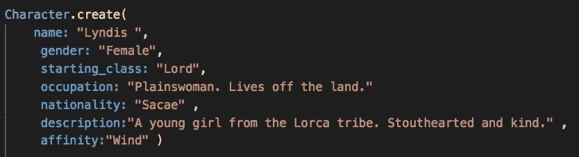

所有字符将基于的原型(带有 create 语法)。注意:Lyn 的全名其实是 Lyndis。

你会注意到这里所有的值都是字符串。因为这是我创建的第一个 API，所以我不想过多地使用不同的数据类型。字符串很容易使用，也足够简单，通常不会引起问题——即使引起问题，也很容易解决。

我建立了我想要展示的角色细节，知道我最终会得到一系列的对象。这样一个数组的命运是成为一个 JSON，所以我知道我的最终目标是什么:创建一个 API，向用户呈现关于所有字符或特定字符的 JSON。

后来，在基础工作完成之后，我考虑了我希望这个 API 具有的未来功能，比如一些基本的定制选项，比如返回所有女性字符或男性字符，或者让字符可以通过名称访问。在这篇文章中，我并没有明确地讲述如何做到这一点，但是在创建应用程序的过程中考虑挑战目标是明智的。通过在开始时建立其中的一些，您可以更好地了解您的产品的优化版本可以做什么，并且当您实际开始编码时，您可以决定什么是可行的。

有了基本的游戏计划，我开始在 Rails 中设置一切。

# 第 1 章:设置 Rails 的基础知识

**重要提示:** Rails 使用 SQLite 作为默认的数据库语言。我发布这个 API 的平台 Heroku 不允许在上传到它的 API 中使用 SQLite，内存原因在这里[进一步解释](https://devcenter.heroku.com/articles/sqlite3)。我不知道会发生这种情况，所以我不得不稍后将我的数据库改为 Postgres，如第五章的可选部分所示。如果使用命令`rails new project_name — api -d -postgresql`打开一个以 Postgres 作为默认数据库语言的 Rails 应用程序，这本来是可以避免的。

Rails 实际上有一个有用的命令，当想要创建一个 API 时可以调用这个命令。该命令是:

`rails new project_name --api`

很简单，对吧？通过使用`--api`，我们从常规的 Rails 设置中去掉了很多脂肪。根据[文档](https://guides.rubyonrails.org/api_app.html)的说法，当我们以这种方式启动 Rails 时，它不会产生太多处理浏览器使用的中间件，这意味着大多数前端代码要么是基本的，要么不存在。这听起来很不利，但实际上对我们来说很好——这个 API 和其他许多 API 一样，并不特别关注前端的使用。这个命令使我们的代码更简洁，更容易导航。

这个命令在启动 Rails 时做的另一个重要改变是将`ApplicationController`的继承从`ActionController::Base`改为`ActionController::API`。这意味着失去更多面向前端的方法，这实际上也是一件好事，因为我们无论如何都不会使用这些方法。

我利用`--api`创建了我的 rails 应用程序:


使用— api 命令可以减少 Rails 中的大量前端脂肪

接下来，我确保将目录更改到这个新创建的文件夹，这样我就可以从终端快速访问它。永远记得把 Rails 放入为你制作的新文件夹，否则你在运行像`rails c`或`rails s`这样的命令时会遇到问题。


我刚刚创建了这个目录，所以为了使用 Rails，我必须进入这个目录。

现在我已经建立了项目的基本框架，并且在正确的目录中，我可以开始工作了。是时候开放 VSCode 并创建一些迁移和路由来使用了。

# 第 2 章:迁移和数据播种

我要做的第一件事是创建一个要使用的表，对于我想要包含的每条数据都有一列。记住这个 API 有名字、性别、起始职业、国籍、游戏中的描述以及每个可玩角色的亲和力，所有这些特征都是字符串。因为它们都是字符串，我甚至不需要指定它们的数据类型，因为 Rails 假定列值是字符串数据类型，除非另有说明。

这是我为我的表编写的代码:

`rails g resource character name gender starting_class occupation nationality description affinity`

然后，我查看了我的迁移，以确保一切正常:

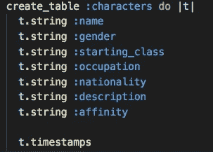

从原型迁移所有数据列。

最后跑了`rails db:migrate`推过去。

在这一点上，我开始寻找我需要的所有球员的数据。我很快意识到,“职业”一栏并不适用于所有角色——它要么显得多余，要么缺乏对我来说足够“官方”的数据，所以我决定去掉它。为了实践的目的，我决定采取创建另一个迁移来修复我的错误的更费力的方法，而不是懒惰地回滚或完全删除迁移。下面的图表显示了我是如何创建这个迁移的，以及当用特定的语法编写时(在这里的文档[中有更多的解释](https://edgeguides.rubyonrails.org/active_record_migrations.html))里面的代码是如何为我生成的，以删除这个列。


在更复杂的应用程序中，您可能需要以比回滚更具体的方式来修改表。

我再次跑`rails db:migrate`继续我的寻找。几个小时后，我得到了我需要的东西。(如果我知道如何使用[刮刀](https://www.scrapehero.com/a-beginners-guide-to-web-scraping-part-1-the-basics/)，可能会更快！)我进入我的`seeds.db`文件，创建了几个新角色，总共 44 个。

幸运的是，除了“职业”键之外，我之前为自己制作的原型与我必须编码的内容相匹配。我为正式创建这个 JSON 中的第一个对象而写的代码可以在下面看到:

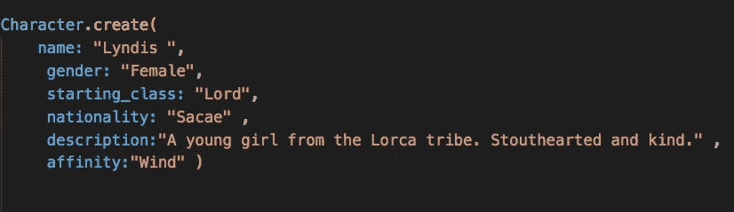

如何将每个字符构造成类字符的实例。

一旦这些都建立起来，我运行`rails db:seed`将这些数据放入我的角色表中。使用`rails c` (rails 控制台)的快速检查显示我已经成功地转移了数据。


在 rails 控制台中，我们运行 Character.all 来查看所有已创建对象的简短列表，然后运行 Character.all.length 来确保存在 44 个字符对象。

解决了这个问题，下一步就是建立路由，这样客户端就可以实际访问这些数据。

# 第 3 章:路由和序列化

我打开我的`characters_controller.rb`文件，为索引(将显示所有角色)和 show(将基于他们的 id 显示某个特定角色的数据)编写了路径。

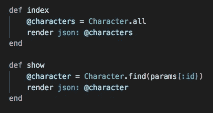

建立索引并显示路线

幸运的是，在运行 rails 时，一个新的`routes.rb`文件已经建立。在内部，它默认允许所有的`resources`用于创建的模型。因为我有资源`:characters`，这意味着所有的路线对我都是可用的。目前，当用户发出 HTTP 请求时，所有的数据都会被发送过来。我希望发出请求的客户端能够看到大部分内容，但我不认为他们真的有必要看到对象的时间属性`created_at`或`updated_at`。这就是序列化程序的用武之地。

当您只想发送部分数据时，可以使用序列化程序。因为默认情况下会发送所有数据，所以我们使用序列化来确保只发送我们*想要*发送的数据。虽然我不想发送的项目相对来说是无害的，但是您也可以理解为什么在大规模应用程序中这可能是一个大问题。例如，客户不应该一直发送他们的账号或出生日期等私人信息。

为了防止`created_at`和`updated_at`被发送过来，我将在应用程序中创建一个名为 services 的新文件夹。在其中，我将创建一个名为`character_serializer.rb`的序列化程序。

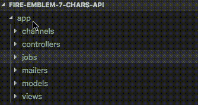

创建一个服务文件夹来存储我们的序列化程序，然后创建所述序列化程序。

序列化器的组成很简单——您正在创建一个具有自己的实例变量和方法的类，与 Rails 中的其他一些类不同，序列化器可以在不继承类的情况下创建。(这并不是说它们*不能*——像其他类一样，它们可以从更高级别的类继承，但是对于这个例子，我们保持简单)。

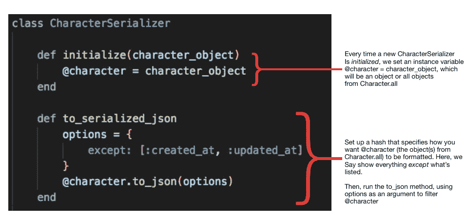

此图像分解了序列化程序是如何制作的。首先，我们创建一个实例变量`@character`，它是一个包含角色所有键和值的对象。接下来，我们创建一个可以在对象上运行的实例方法。为了保持代码整洁，我创建了一个变量`options`，它被设置为一个带有特定关键字的对象，这个关键字`.to_json`方法可以理解。单词`except`表示对象中的所有数据都应该被转换成 JSON，只有两个属性除外，这两个属性在数组中由它们的键名列出。还有其他这样的关键字来告诉`to_json`如何选择使用什么数据来创建 JSON，比如`include`或`only`。同样，为了简单起见，我只使用了`except`关键字，但是给出我们想要的输出也是有意义的。我在说“返回这个对象的所有属性，*除了*这些。”，所以那个关键词是最贴切的。

现在，当我们发出一个 HTTP 请求时，它们只有其他属性可以使用。但是就目前情况来看，我们实际上还没有在任何地方整合序列化程序——它只是一个位于服务中的文件，没有在任何地方被使用或引用。为了实现我们的 CharacterSerializer 的使用，我们需要将它放在呈现 JSONs 的地方。没有比我们的`characters_controller`更好的地方了！

以前，我们只有一些代码，当一个特定的 HTTP 请求被调用时，它会显示一个 JSON。最初编写时，JSON 中的所有内容都是默认呈现的。现在我们有了一个序列化器来呈现我们想要的东西，我们可以稍微美化一下这段代码。我们调用我们的序列化器和它包含的一个方法，根据实例方法中编写的代码呈现一个过滤的 JSON。

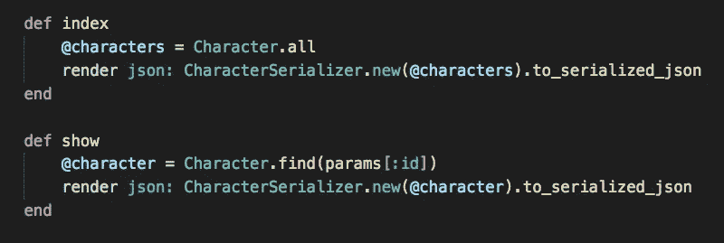

在我们的控制器方法中利用序列化器只发送我们想要的数据

这段代码的工作方式是创建一个新的`CharacterSerializer`实例，将一个字符对象作为它的参数。角色对象在初始化时被设置为`@character`，然后通过`to_serialized_json`方法转换为 JSON，该方法又以 options hash 作为参数，最终生成一个没有`created_at`和`updated_at`的 JSON。

现在，是时候呈现我们刚刚制作的定制 JSON 了。要做到这一点就像调用`render`一样简单！这是代码中没有改变的一部分，因为最终，我们仍然呈现一个 JSON——我们只是必须首先序列化那个 JSON。

我们现在已经创建了所有的对象，它们存储在数组`Character.all`中。我们创建了访问所有对象或单个对象的路径，并序列化了每个方法中呈现的 JSON。

目前，客户端可以对我拥有的字符集合执行所有 HTTP 请求，但是这些数据更像是一个库。就像图书馆一样，我应该能够借阅书籍，但我不应该能够添加任何我想要的书，或者编辑该书的内容，或者从图书馆中删除它。换句话说，我只希望客户端能够*读取*这些数据。我不希望人们未经我的允许添加、编辑或删除这些信息。事实上，就目前而言，我不需要除我之外的任何人来做这些事情。

我们如何限制来自客户端的某些 HTTP 请求，以确保它们只能做我们希望它们做的事情？进入 CORS！

# 第 4 章:使用 CORS

CORS(跨源资源共享)是 web 应用程序允许请求的一种方式。例如，当查看维基百科的文章时，如果需要的话，任何网站都应该能够从中提取一些内容。但是对于某人的个人银行账户来说，情况就不一样了——毕竟，你不想让街上的雅虎看到你赚了多少钱！

对于这个 API，我将允许所有用户向它发出 GET 请求。所有其他请求都将被拒绝。为此，我必须做几件事。

首先，我进入 gem 文件并取消对 gem 'rack-cors '的注释，然后运行 bundle install。之后，我需要进入 cors.rb 文件，其文件路径是 config/initializer/CORS . Rb。

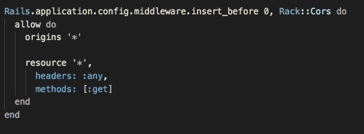

使用 CORS 允许所有用户访问这个 API，但是不允许除 GET 之外的任何 HTTP 请求

来源是指发出请求的网站。我想允许任何网站发出请求，所以我用*来表示。资源字也带一个*。当向主机服务器发出请求时，会读取标头。它们可能写得像“Content-Type: 'application/json '”，但是对于这个 API，我会宽容一些，允许任何类型的头。这些方法是一个网站可以发出的 HTTP 请求的*种*,所以我将其限制为只获取请求。现在，如果另一个网站尝试 GET 之外的任何其他方法，CORS 不会允许的！

我们终于完成了这个应用程序的基本功能！做了这么多工作，直到现在我都忘了做一个 GitHub 库。这是一个危险的遗漏，也是我们要解决的问题——在下一章，我们将学习如何在 GitHub 中创建新的回购协议和本地计算机上已建立的回购协议。

# 第 5 章:将一切推给 GitHub

没有尽快把我的代码发布到 Github 是多么愚蠢的事情！

每个优秀的程序员都应该从创建一个 GitHub 库*开始第一件事*——这使得你的工作比我们将要做的要容易得多。

我应该提到的另一件事是，一旦你的代码达到了一个基准，最好的做法就是 git commit 换句话说，当你做了一个以前不能运行的东西，不管它有多小。这样，你就有了一个越来越有效的产品的许多版本。不要重蹈我的覆辙——想象一下，如果发生了意外，我的笔记本电脑停止了工作。我甚至无法证明我迄今为止所做的工作是存在的，更不用说恢复它了。

版本控制——保存产品成功版本的过程——不仅对 API 重要，对任何编码项目都是如此。做好，经常做！

谢天谢地，到目前为止我已经避免吃任何乌鸦了。尽管我已经开始编码了，但我们现在要做一个 GitHub repo，把它从菜单上完全去掉。*如果你很好地掌握了 GitHub 以及在这种情况下该怎么做，请随意跳到第 6 章。*

GitHub 为你开始写代码但没有想到要事先创建一个库的情况做了准备。事实上，当您在 GitHub 上创建一个新的存储库时，它会自动跳转到一个页面，该页面显示了我将要运行的命令。请将此作为快速指南，此处显示的流程只是其更清晰的版本。这不需要很长时间，所以你可以上传你的回购，然后马上回到编码。

1.  首先，我们需要创建一个新的存储库。转到您的个人资料，然后存储库，然后创建一个新的存储库。这将打开一个页面，询问您的回购名称、描述、私人/公共首选项，以及初始化自述文件的选项，该文件将作为您的回购的文档。我将把我的 repo 命名为 fire-徽-7-chars-api，这是我很久以前运行 rails new 时使用的名字，然后我将对它做一个简短的描述。显然，我希望这是一个公共回购，所以我将把它标记出来，我不需要 README，因为 rails new 为我创建了一个 README。(我确实在这一点上稍微编辑了自述文件 GitHub 上的这一步是一个很好的提醒，至少要开始你的自述文件，这样你就不会忘记了。)

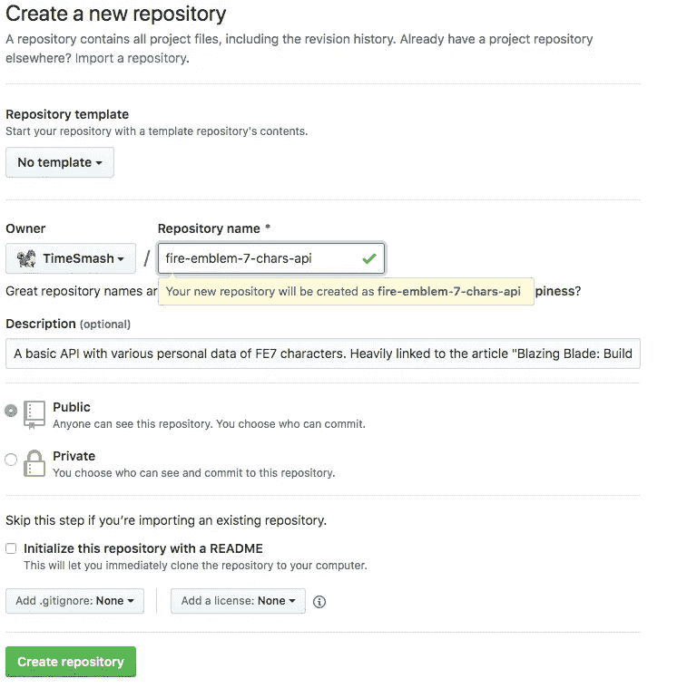

创建一个新的 GitHub 库来保存我们已经写好的代码。

2.接下来，您将进入快速设置页面。我们将遵循“在命令行上创建一个新的存储库”的步骤，尽管有些不同。观察下面的图片，看看我们从本地目录链接文件的过程

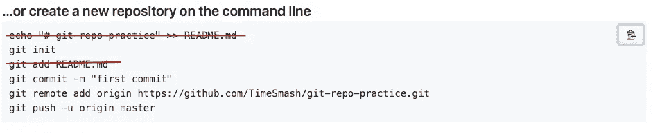

我们将要经历的步骤是将我的本地目录与远程 repo 链接起来。不需要自述文件，因为它已经由 rails 构建了。

3.我们做的第一件事是打开终端，`git init`创建一个本地存储库，它的内容将填充我们刚刚创建的 GitHub repo。

4.然后，我们将运行`git add .`来存放我们所有的更改。

之后，我们将使用 a -m 进行 git commit，它保存了我要为这个回购的第一次更新放置的消息。到目前为止，我想要的一切都在工作，所以我会发一个简短的消息来反映这一点。

现在是时候把这个和我刚刚创建的回购联系起来了。一旦我这样做了，这个本地存储库和 Github 上的存储库之间的关系就建立了；这允许在我的计算机和 GitHub 之间进行推或拉请求。

```
git remote add origin https://github.com/TimeSmash/fire-emblem-7-chars-api.git
```

然后，我想推进到我的主分支，因为到目前为止我只提交了我的更改。我`git push -u origin master`，然后检查我在 GitHub 上的回购，以确保推送发生。当我重新加载我的页面，瞧！一切都在那里，因为它应该是。

有了它，我们就可以上路了！最后就是把这个 API 公开。为此，我们要去赫罗库，把这个东西从地面上弄下来！

…直到我了解到 Heroku 不允许在上传到它的 API 中使用 SQLite。如果你早在第一章就读过**重要的**备忘录，我应该做的是使用 Postgres 作为默认数据库来运行我的命令。现在，我必须将 Rails 默认的数据库语言 SQLite 改为 Postgres，这将在下面的可选部分中描述。

*可选:以下内容是关于将数据库从 SQLite 改为 Postgres。如果你开始使用 Postgres 作为你的默认数据库，或者知道如何改变数据库语言，请随意跳到第 6 章。*

在这个简短的部分中，我们将讨论如何从 SQLite 转换到 Postgres。直接从 Heroku 获得的深入指导也很有帮助——在这篇文章中，我们将做一个非常快速的概述。

1.  首先，我们进入 gem 文件，将所需的 gem 从`sqlite3`更改为`pg`

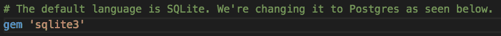

2.然后，我们跑`bundle install`。这只是安装了 Postgres gem 用于此应用程序。

3.之后，我不得不使用 Finder 启动 Postgres 应用程序，但您可能不必这样做。(如果您在后续步骤中没有问题，此步骤可视为可选步骤)。

4.现在，我们进入`database.yml`，将`sqlite3`的任何实例更改为`postgres`。我们还必须想出定制的数据库名称。在开发数据库中，我将名称改为`characters`以保持一致。

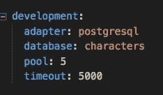

不要介意池和超时，那些是这样来的。

5.然后，我所要做的就是`rake db:create`、`rake db:migrate`和`rake db:seed`，它们运行我已经创建的迁移和种子数据，以创建一个表来引用。最后，我通过使用`rails s`来见证我的 HTTP 请求在`localhost3000`和`rails c`上工作以检查我的数据库的状态，来测试是否一切正常。

就是这样！我们现在去赫罗库。

# 第 6 章:使用 Heroku 宣传一个 API

因为这里的主要焦点是宣传我们的 API，所以我不打算进入 Heroku 的后勤或在其上创建一个帐户。只需知道 Heroku 是一个平台，开发者可以轻松地在线存储他们创建的应用程序。如果你对 Heroku 和随之而来的小事情感兴趣，这里有一篇 Lauren Orsini 的精彩文章。

创建我的帐户后，我选择通过 GitHub 选项部署 API，这很容易，就像复制粘贴我的 repo 的链接一样。然后是部署选项。

Heroku 提供了*自动部署选项，*这意味着每当你对相关分支进行 git 推送时，该应用/API 的新版本就会更新。这是可选的，可以禁用。如果选择自动部署，Heroku 将要求分支机构从 GitHub repo 进行部署。在更复杂的应用程序中，由于各种原因，人们可能会选择不使用主分支作为要部署的分支，这就是 Heroku 的原因。然而，由于这个应用程序相对简单，而且我目前没有什么特别需要更新的，所以我决定启用自动部署，使用 master 作为讨论中的分支。

选择自动部署的规范后，系统会询问您从哪个分支手动部署，因此您可以实际上传您的应用程序。理想情况下，您应该从那里完成。我有一个关于这个设置的问题，所以我不得不使用终端来解决它。我将回顾一下我是如何通过一个过程化的格式通过终端命令上传我的 API 的，如下所示。

1.  创建一个新的应用程序，命名为“fire-embryo-7-char-details”(这是我的一个错误，也许用我在 GitHub 上的名字会更容易，但是唉)
2.  从终端运行命令`heroku login`。这可确保您登录到 Heroku 的 CLI，这对于后续命令的正常运行至关重要。
3.  运行 heroku `git:remote fire-emblem-7-char-details`。这在我的本地计算机和我刚刚创建的名为 fire-embryo-7-char-details 的 heroku 存储库之间建立了一个关系。
4.  带着你选择的消息运行`git add .` 和`git commit`，准备好要推送的一切。
5.  运行`git push heroku master`将你的代码推送到新创建的 heroku 库。
6.  运行`rake db:migrate`来执行您的迁移
7.  运行`rake db:seed`来填充你的数据库。

# 最后一章:光(在隧道的尽头)


恭喜你，你一路过关斩将！

您已经完成了创建一个具有 CORS 功能和序列化的纯后端 API 的分步指南。把这篇文章作为参考，你应该也能做一个简单的 API！

以这篇文章为基础，你可以做很多事情——一切尽在掌握。像*炽焰之刃*里那么多角色一样，去开拓自己的道路，去探索，看看你能做什么！