# 用 Wallaby.js 进行惊人的快速测试

> 原文：<https://betterprogramming.pub/blazingly-fast-testing-with-wallaby-js-61383d60d7f9>

## 提高您的开发和测试生产力


Marc Sendra Martorell 在 [Unsplash](https://unsplash.com/s/photos/speed?utm_source=unsplash&utm_medium=referral&utm_content=creditCopyText) 上拍摄的照片

[Wallaby.js](https://wallabyjs.com/) 是一个测试工具，它可以在您更改时立即运行您的 JavaScript 或 TypeScript 测试，并在您的代码编辑器中以惊人的速度显示结果。在这篇文章中，我将向你展示 Wallaby.js 如何在你的编辑器中工作。

# 回购示例

下面是 GitHub 中完整的代码库链接，供参考:[manakuro/wallabyjs-app-example](https://github.com/manakuro/wallabyjs-app-example)。

# 设置创建 React 应用程序

为了快速开始，我们将使用`[create-react-app](https://github.com/facebook/create-react-app)`创建一个 React 应用程序:

```
npx create-react-app wallaby-app --template typescript
```

安装后，您可以运行服务器:

```
yarn dev
```

您将看到欢迎页面:


接下来，我们将添加一些需要测试的`util`函数。

添加`src/util.ts`:

```
// src/util.tsexport const getAnimal = (code: number) => {
  if (code === 1) return 'CATS'
  if (code === 2) return 'DOGS'
  if (code === 3) return 'RABBITS'

  return null
}
```

假设我们有一个函数，它接受数字参数并返回动物名称，如果不匹配，则返回`null`。

在`src/util.test.ts`写一个测试:

这是非常简单和干净的测试代码。

运行测试并查看结果:

```
yarn test
```

您将看到通行证:

# 设置 Wallaby.js

接下来我们将设置 Wallaby.js，Wallaby.js 提供了两个选项来配置:自动和手动。对于自动配置，VS 代码提供了`Select Configuration`命令。当你选择它时，它会自动启动 Wallaby。

## VS 代码中的自动配置

安装 Wallaby.js:

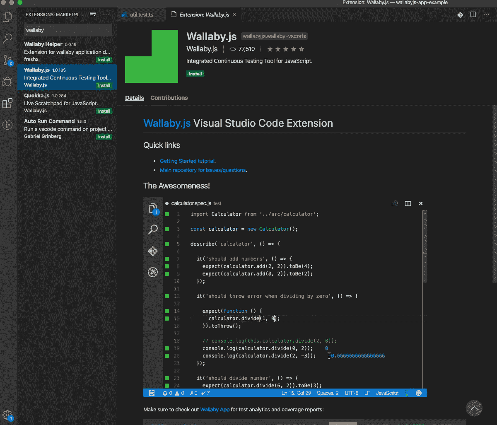

选择`Select Configuration`:

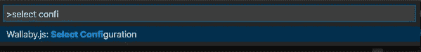

选择`Automatic Configuration <project directory>`:

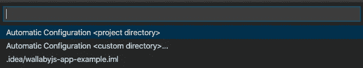

## IntelliJ 中的自动配置

按照[安装](https://wallabyjs.com/docs/intro/install.html?jb#jetbrains-ides)中的说明下载并安装 Wallaby.js。

转到运行>编辑配置:

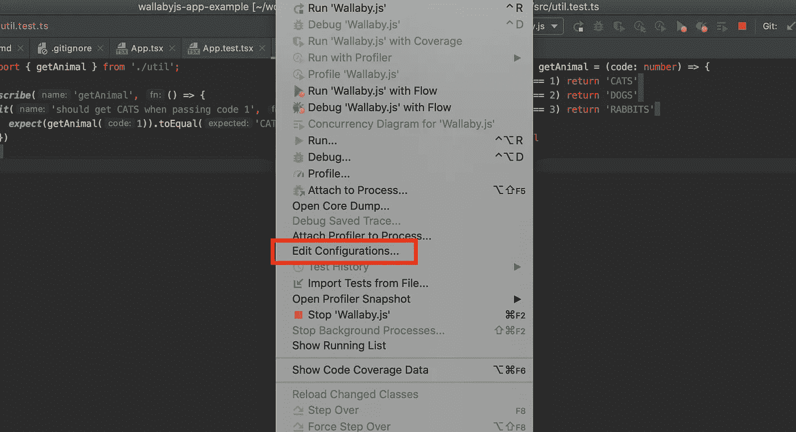

点击左上方的+按钮:

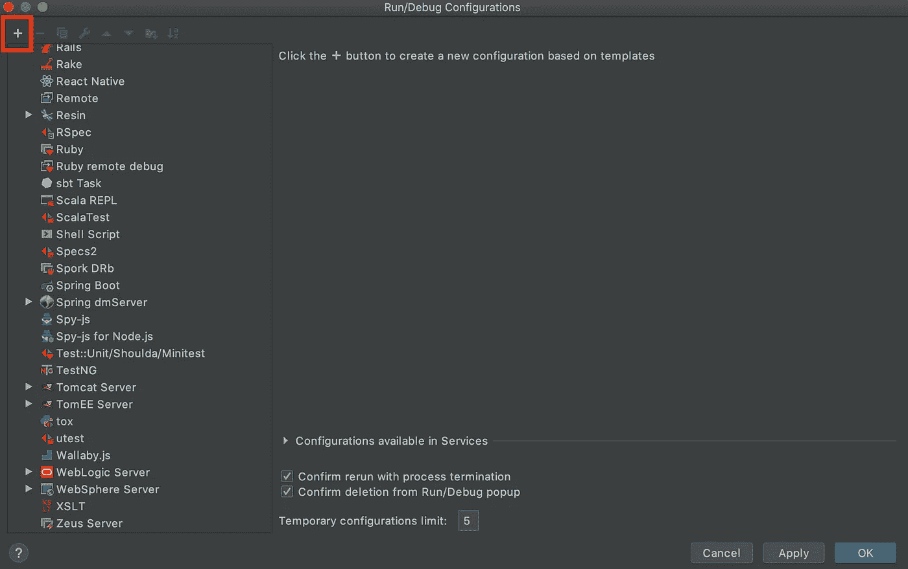

选择 Wallaby.js，然后在配置类型中选择自动:


应用后，您可以在此选择并运行配置:

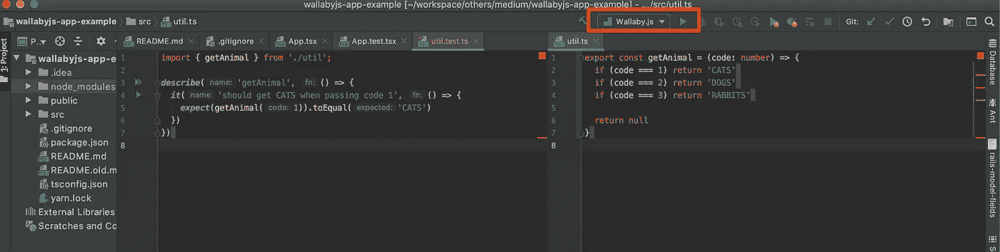

注意:Wallaby 会要求你申请试用许可才能使用，如果你不发送请求，它将很快自动禁用。

安装后，您将在代码的空白处看到绿色方块。这是显示每次测试结果的指示器。

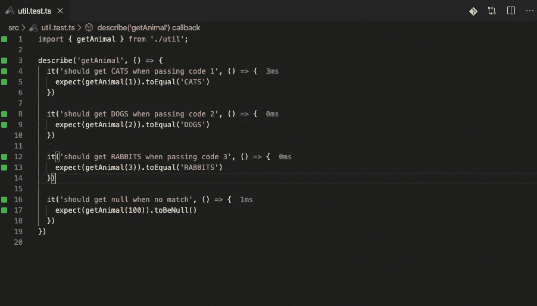

根据[文档](https://wallabyjs.com/docs/tutorial/react.html)，每种颜色都有一个含义:

*   灰色方块意味着该行包含没有被您的任何测试运行的代码。
*   绿色方块意味着该行包含至少一个测试运行的代码。
*   黄色的方块意味着这一行包含的代码只是测试的一部分。
*   红色方块表示该行是错误、失败断言的来源，或者是错误堆栈跟踪的一部分。
*   粉色方块意味着源代码行位于失败测试的执行路径上。

就目前而言，测试全部通过，所以让我们打破它，看看会发生什么。

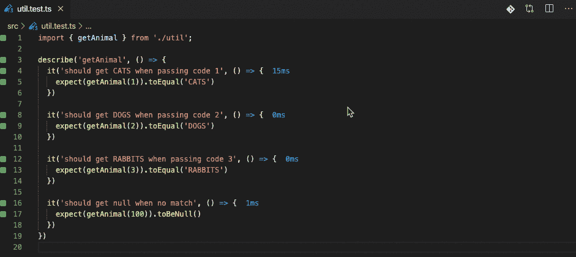

当您更改测试代码时，Wallaby 会自动检测错误并显示预期结果。这太快了！

接下来，让我们编辑`src/util.ts`，看看会发生什么:

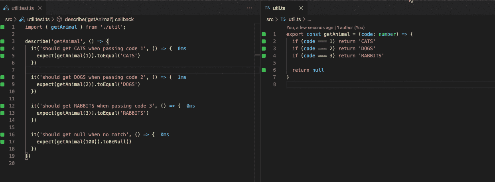

当您更改实现时，您会在沟槽中看到红色方块，这意味着测试失败。这非常有用，因为您可以在编辑代码时避免不必要的错误。

# Wallaby.js 功能

我们已经介绍了即时测试功能，但除此之外，Wallaby.js 还提供了其他一些开箱即用的出色功能，如下所示:

*   时间旅行调试
*   运行时值
*   错误报告
*   代码覆盖率
*   测试和覆盖浏览器

让我们看看这些。

## 时间旅行调试

时间旅行调试允许您在代码中前后移动，以检测导致特定错误的变量和条件。基本上，当您遇到失败的测试时，您将不得不打开文件并编写一个`console.log`来调试特定的代码并运行测试。但是使用 Wallaby，您可以实时查看运行时值，并单步执行、遍历和跳出您的代码。

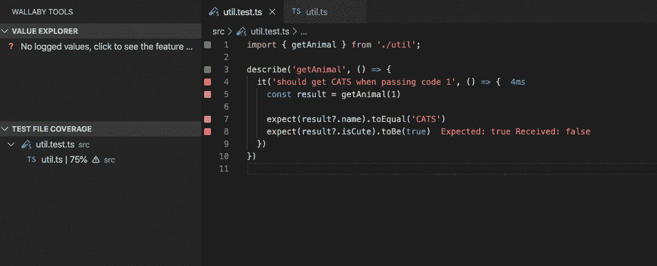

## 运行时值

这真的很有用，因为你可以在你的编辑器中实时看到`console.log`和运行时变量的结果，就在代码旁边。有三种方法记录变量:使用 console.log、键入变量和添加注释。

让我们看看它是如何工作的。

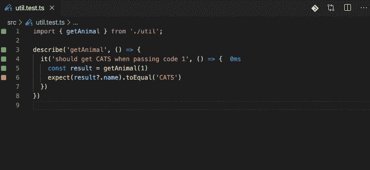

这实际上是我以前在 JavaScript 生态系统中遇到的最好的特性。这无疑提高了生产率，节省了时间。

更多细节可以查看[文档](https://wallabyjs.com/docs/intro/advanced-logging.html)。

## 错误报告

错误信息显示在代码旁边。

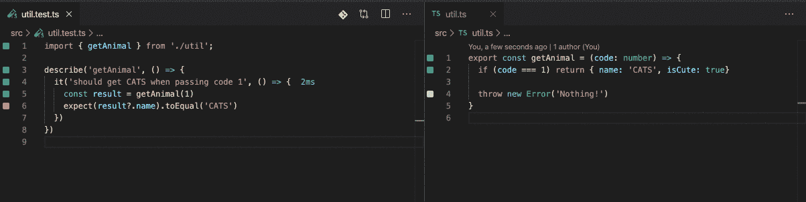

## 代码覆盖率

方形指示器会实时更新以显示测试覆盖率，这样您就可以快速地看到被覆盖和未被覆盖的测试。

当你没有为 DOGS，兔子和没有匹配写一个测试，灰色方块出现，这意味着没有覆盖。

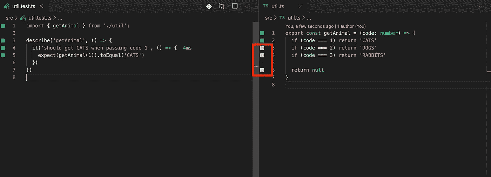

## 测试和覆盖浏览器

Wallaby.js 有自己的本地服务器来报告测试覆盖率和细节。

安装完成后，进入`[http://localhost:51245/](http://localhost:51245/)`，您将看到页面:

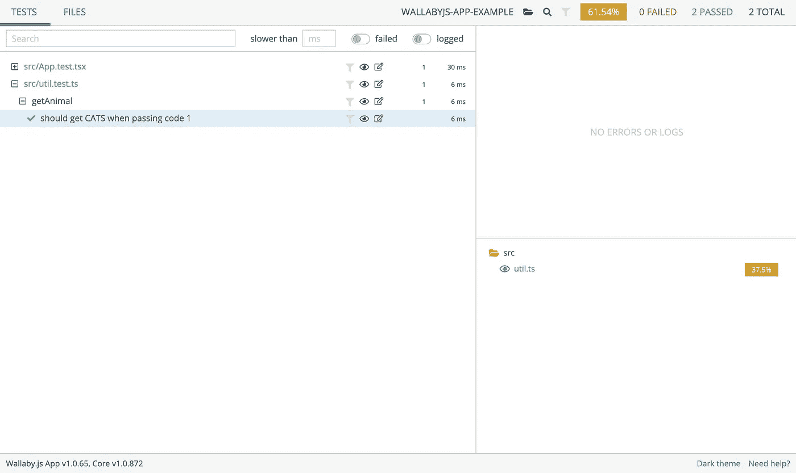

您可以详细地看到测试覆盖，以及覆盖和未覆盖的内容。

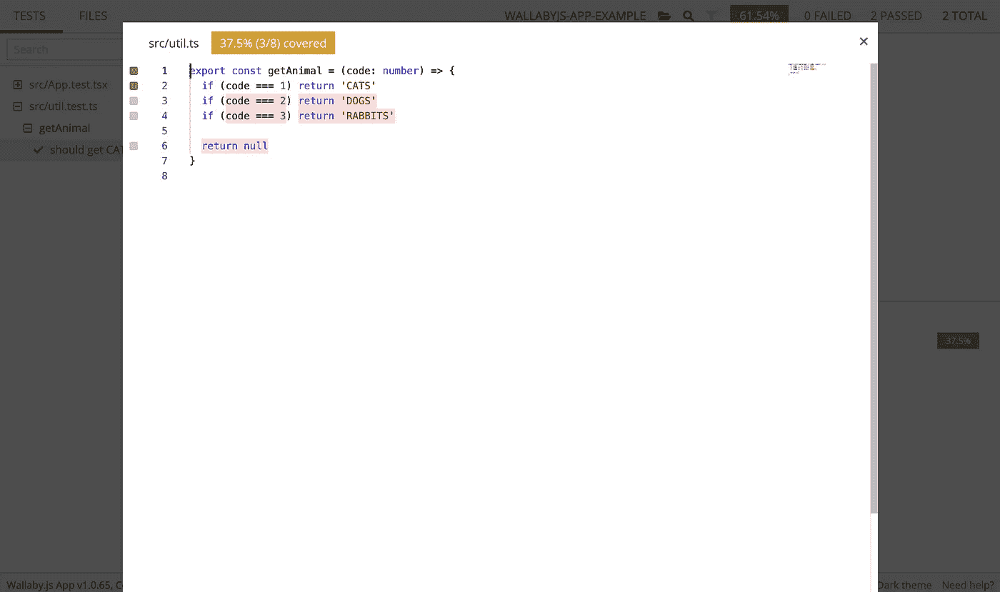

# 结论

就是这样！Wallaby.js 变得越来越有用，并以一种强大的方式提高了您的开发效率。

希望这篇文章能让你感兴趣。

# 资源

[Wallaby——在你的 IDE 中输入的即时 JavaScript 测试反馈](https://wallabyjs.com/)