# Blazor 生命周期事件:过于简化

> 原文：<https://betterprogramming.pub/blazor-life-cycle-events-oversimplified-4b8e1bd5fa4b>

## 帮助您了解不同类型的指南

[活动创建者](https://unsplash.com/@campaign_creators?utm_source=medium&utm_medium=referral)在 [Unsplash](https://unsplash.com?utm_source=medium&utm_medium=referral) 上的照片

从 razor 组件激活的那一刻起，就有一系列基于组件不同状态的方法被调用。我们应该清楚地了解控制的流程。

今天，我将教你剃须刀组件的不同生命周期方法，以及何时调用什么。在这个组件生命周期中有八种方法。

让我们从头开始，先了解 Blazor 页面的架构，然后学习各种同步和异步方法。

下图显示了 razor 页面的不同部分:

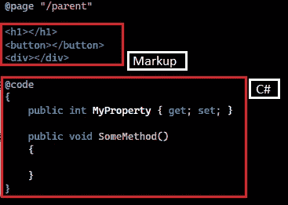

图 Blazor 组件示例

在某些场景中，我们希望先运行 C#代码，然后再呈现 UI。所以我们在 UI 中绑定的对象会有数据。例如，`List`将首先被四个条目填满，然后 UI 将知道`DataGrid`中有四行。另一方面，有时我们希望先渲染 UI，然后运行 C#代码。

如何实现这一切？这就是我们今天要学的内容。让我们从第一个状态开始。

# 1.OnInitialized 和 OnInitializedAsync

这两个方法在组件呈现之前被调用，首先，我们进行服务调用来填充所有的对象，然后这些对象被绑定到屏幕上。

让我们来看看实际情况。

创建一个`Parent`和一个`Child`组件，并在`Parent`中添加`Child` 组件的实例。请参考下图:

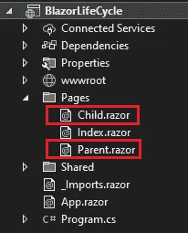

图 2:创建父组件和子组件

`Parent`看起来像这样:

清单 1: Parent.razor

`Child`组件:我们将使用`List<string>`来跟踪添加的事件数量。

清单 2: Child.razor

如果你运行这个程序，你会注意到这一点。当应用程序启动时，首先调用这两个方法，顺序如下:

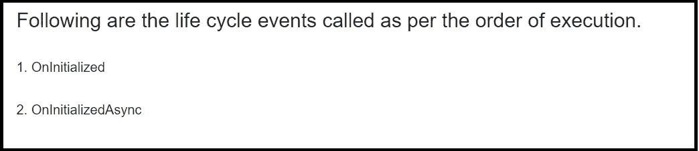

图 3:清单 1 和 2 的输出

# 2.OnParametersSet 和 OnParametersSetAsync

这些方法由以下两个触发器调用:

1.  每次从父节点收到新参数时，这些方法都会被调用。
2.  同样，当组件第一次被加载时，这些方法在`OnInitialized()`和`OnInitializedAsync()`之后被调用。

要看到这一点，我们需要对组件进行一些更改。

`Parent`组件现在将发送一个名为“counter”的参数给`child`组件，并负责更新这个计数器的值。我们可以通过点击按钮来实现这一点。

清单 3: Parent.razor

现在谈谈`child`的成分。它将从`Parent`接收参数，并在 UI 中显示该参数的值。这里我们将展示我们的两个方法， `OnParametersSet()`和`OnParametersSetAsync()`。

清单 4: Child.razor

现在，观察下面的一系列图像，注意流动。

场景一:应用首次运行，执行顺序如下:`OnInitialized()`=>`OnInitializedAsync()`=>`OnParametersSet()`=>`OnParametersSetAsync()`。

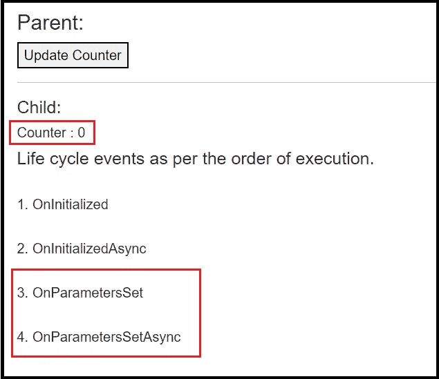

图 4:组件初始化

场景 2:点击一次`Parent`组件上的按钮，向`child`组件发送一个更新的`counter-parameter`，你可以看到`OnParametersSet()`和`OnParametersSetAsync()`是如何被再次调用的。

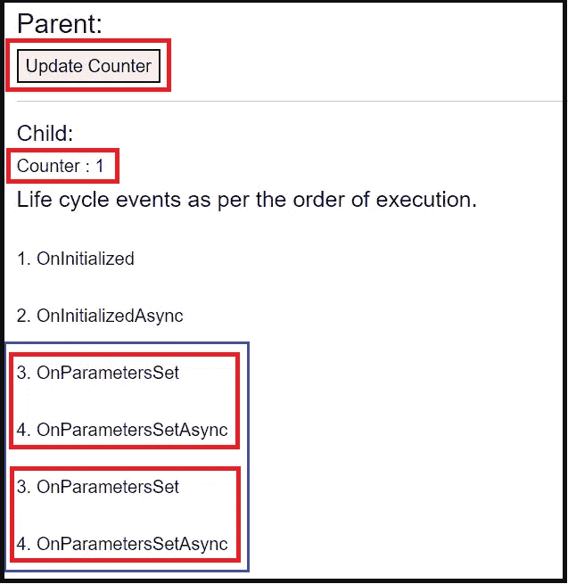

图 5:新参数从父组件发送到子组件

场景 3:再次单击按钮，在`child`组件中观察到相同的模式。

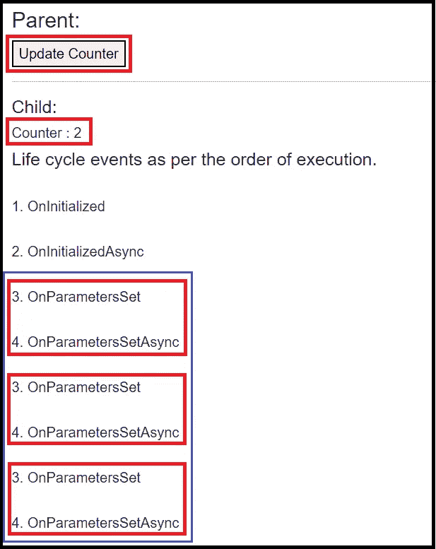

图 6:新参数从父组件发送到子组件

# 3.OnAfterRender 和 OnAfterRenderAsync

这些方法在组件呈现后调用。稍后将详细介绍这一点！

如果您查看以下代码片段中显示的语法，您会看到这些方法有一个布尔参数`firstRender`，如果组件是第一次呈现，则`firstRender`的值为真。如果不是，那就是假的。

清单 5: OnAfterRender 和 OnAfterRenderAsync

在下面的两张图片中，让我向您展示这两种方法的执行流程。图 7 显示了组件第一次呈现时的流程。它调用方法`OnAfterRender()`和`OnAfterRenderAsync()`两次。

第一次，`firstRender`的布尔值为真，然后这些方法被再次调用。这一次，`firstRender`的值是假的。

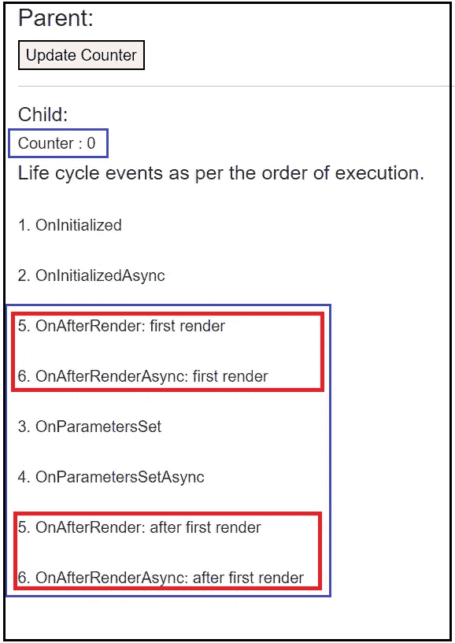

图 7:首次渲染的组件

如果`child`组件从`parent`收到新的更新并再次呈现自己，会发生什么？除了在`OnInitialized()`和`OnInitializedAsync()`方法上有变化外，遵循图 7 中的相同模式。

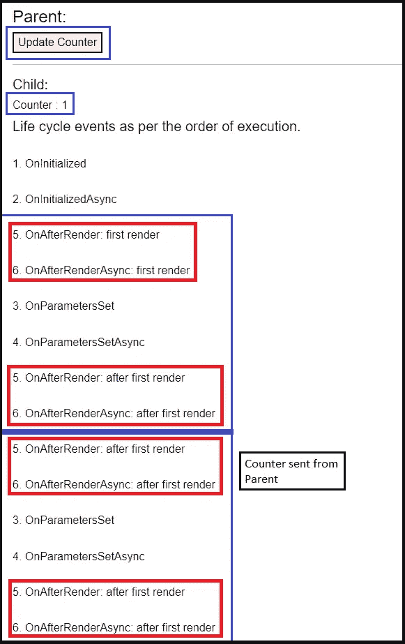

图 8:组件用新值重新呈现

现在，让我们深入了解我们实际上需要这些方法做什么。

为了回答这个问题，我必须对我们的代码做一些修改。我将把“`counter-button`移动到带有`OnclickHandler()`的`child`组件中，然后是`override OnAfterRender()`。此外，我将“计数器的值”记录到`console-tab`中，以交叉验证`counter`的当前值。下面是这些变化之后`child`组件的样子:

清单 6: Child.razor

让我们来看看代码清理后的`parent`组件。

清单 7: Parent.razor

运行应用程序，你会看到`OnAfterRender`实际上是如何工作的。

在下图中，我第一次运行这个应用程序。正如您在 Console 选项卡中看到的，计数器的值已经通过`OnAfterRender()`方法增加了，但是 UI 没有显示更新后的值。简单地说，`OnAfterRender()`在用户界面呈现后执行代码。

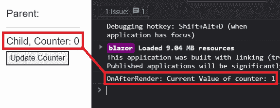

图 9:控制台中的值被更新，而 UI 上的值没有被更新

现在，如果我点击按钮会发生什么？它将再次呈现组件。

首先，`IncreaseCounter()`会被调用。这将计数器的值增加到`2`，然后用值`2`呈现 UI，然后调用`OnAfterRender`，但是 UI 不会再次呈现。

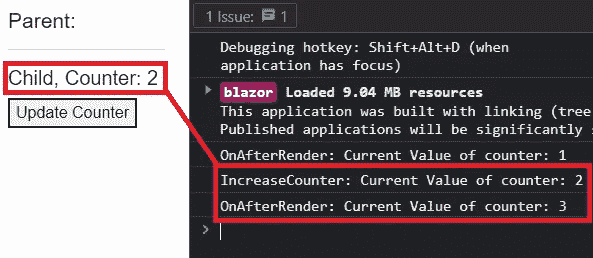

图 10: OnAfterRender()方法增加了值，但是 UI 忽略了该更新

为了继续操作，我将再次单击该按钮。

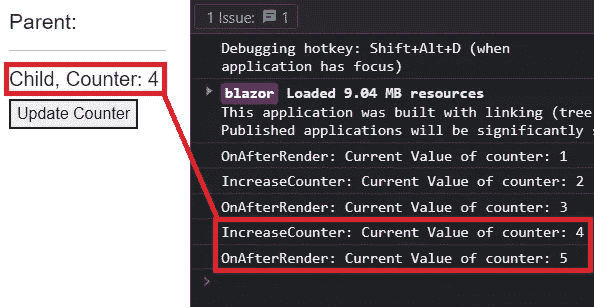

图 11: OnAfterRender()方法增加了值，但是 UI 忽略了该更新

# 4.状态已经改变

这个生命周期方法通知 UI 新值，并触发组件的重新呈现。

*   使用:如果您正在调用异步服务，并希望 UI 基于新值再次呈现，您可以使用此方法。简单地说，它通知组件`State`已经改变，所以它将使用新值再次加载组件。

我们先来了解一下为什么需要`StateHasChanged()`。

为了证明这一点，我们需要一个可以自我触发的东西。为此，我们可以简单地使用`timer`。我们将运行`timer`，直到计数器的值达到`5`。每过一秒钟，我们就会将计数器的值增加`1`。

场景 1:当我们不使用`StateHasChanged()`时

*   观察 UI 线程如何对计时器对计数器变量所做的任何更改保持不响应。

**注意**:对`child`组件进行如下修改。

清单 8: Child.razor

让我们启动应用程序，观察控制台中“计数器”的值与 UI 上“`counter`”的值。UI 没有重新呈现。

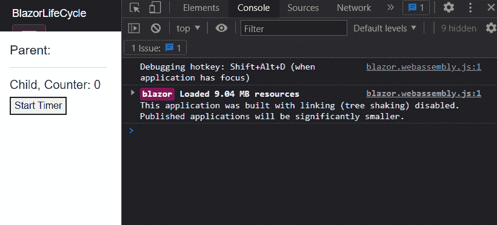

Gif 1: UI 独立于 StateHasChanged

场景 2:当我们使用`StateHasChanged()`时

现在只需在`TimeCallBack()`中调用`StateHasChanged()`。参考下面代码片段中的第 6 行:

清单 8: Child.razor

现在看到区别了吧！UI 正在重新呈现并显示计数器的增量。

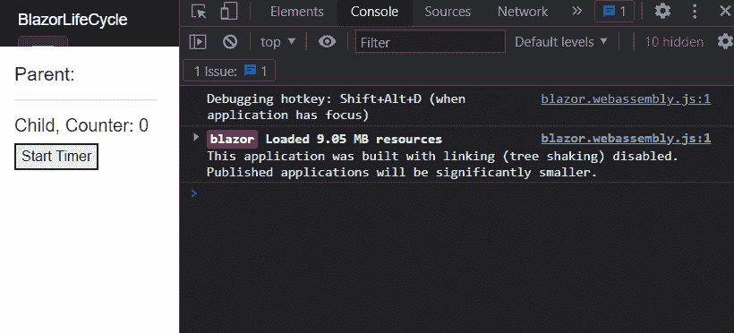

Gif 2:由于 StateHasChanged，UI 正在重新呈现

# 5.应该呈现

如果返回 true，将强制刷新 UI。如果没有，对象的更新状态将留在内存中，但是 UI 线程不知道新值是什么。

场景 1:当我们从 `ShouldRender()`返回 false 时

*   让我们用同样的例子。这一次，覆盖`child`组件中的`ShouldRender()`，如下所示。您将看到它从该方法返回了`false`。

清单 9: Child.razor

如果我运行这个应用程序，那么`ShouldRender`方法将被调用，但是它将阻止 UI 被呈现，因为我们从该方法返回`false`。观察控制台中的值是如何变化的，但是 UI 不受这些变化的影响。

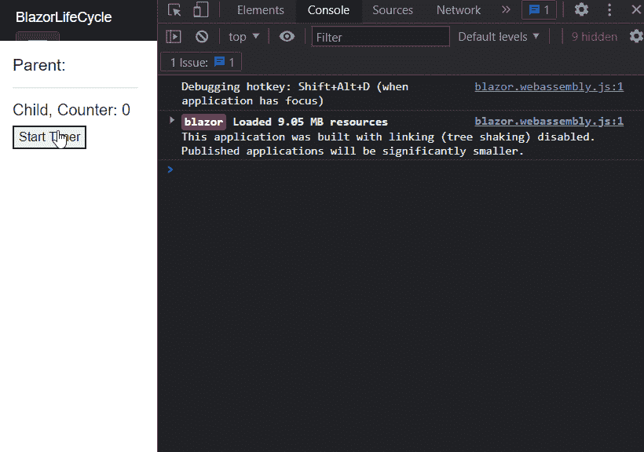

Gif 3: ShouldRender 返回 false

场景 2:当我们从`ShouldRender()`返回 true 时

清单 10: Child.razor

同样的执行流程将会遵循，但是这一次 UI 将呈现更新的值。

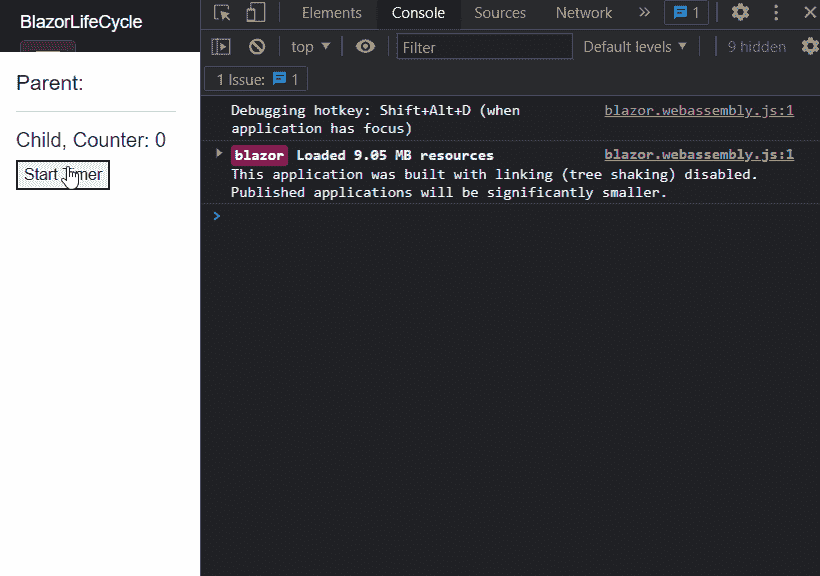

Gif 4: ShouldRender 返回 true

# 结论

好吧，这是一篇很长的文章，但我相信它是有帮助的。现在我们知道 Blazor 中有哪些不同的生命周期方法，以及它们如何定义组件的状态。一旦你开始设计组件，你会对使用哪种生命周期方法以及何时使用有一个更清晰的理解。

这里有几个我讨论过的话题。你可以合并到[炽焰 Blazor](https://github.com/RikamPalkar/Blazing-Blazor) 的仓库，学习以下主题。

1.  [事件回调](https://github.com/RikamPalkar/Blazing-Blazor/tree/main/1.%20Event%20Callback)
2.  [渲染片段](https://github.com/RikamPalkar/Blazing-Blazor/tree/main/2.%20RenderFragment)
3.  [CSS 自定义属性](https://github.com/RikamPalkar/Blazing-Blazor/tree/main/3.%20CSS%20Custom%20Properties)
4.  [属性设置](https://github.com/RikamPalkar/Blazing-Blazor/tree/main/4.%20AttributeSplatting)
5.  [级联参数](https://github.com/RikamPalkar/Blazing-Blazor/tree/main/5.%20CascadingParameter)
6.  [名为](https://github.com/RikamPalkar/Blazing-Blazor/tree/main/6.%20CascadingParameter%20with%20Name)的级联参数

感谢阅读！