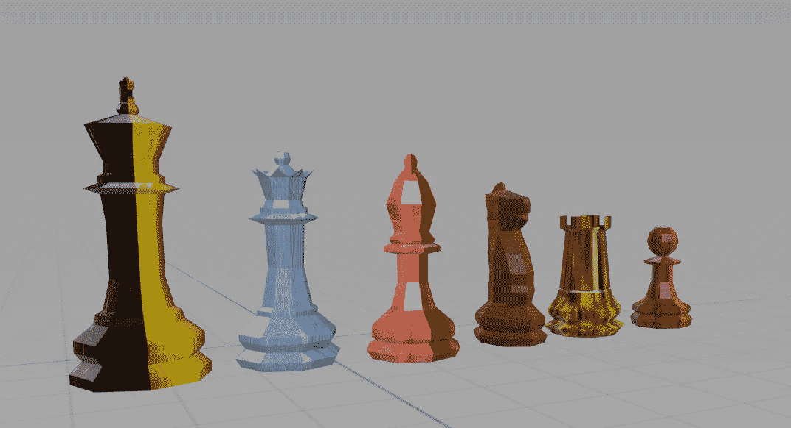
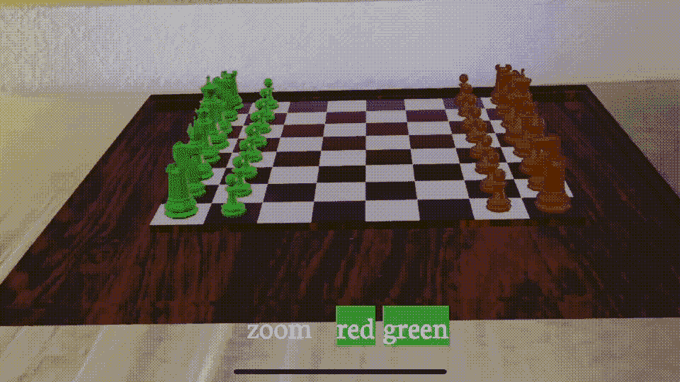
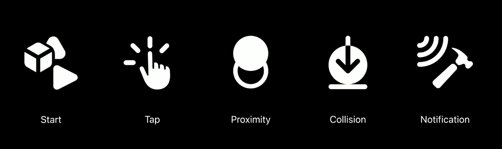
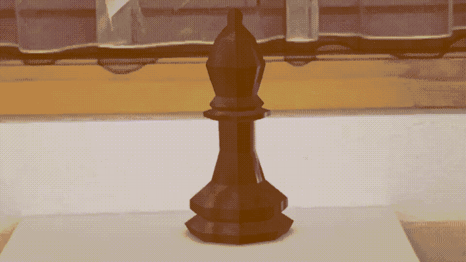
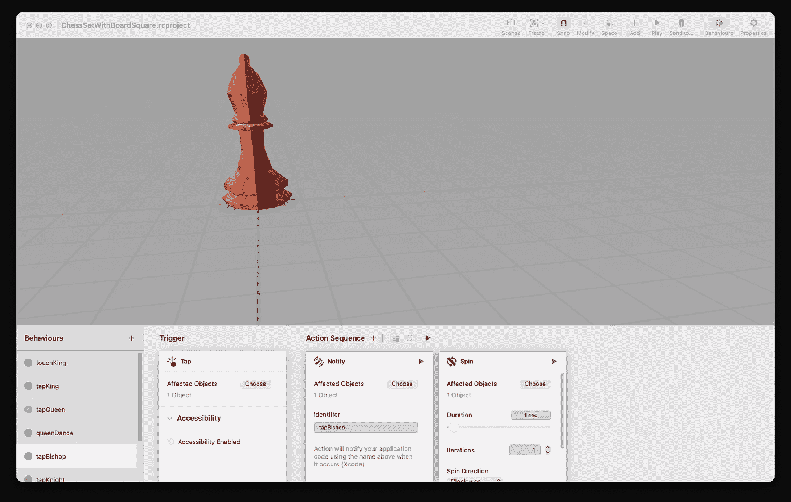
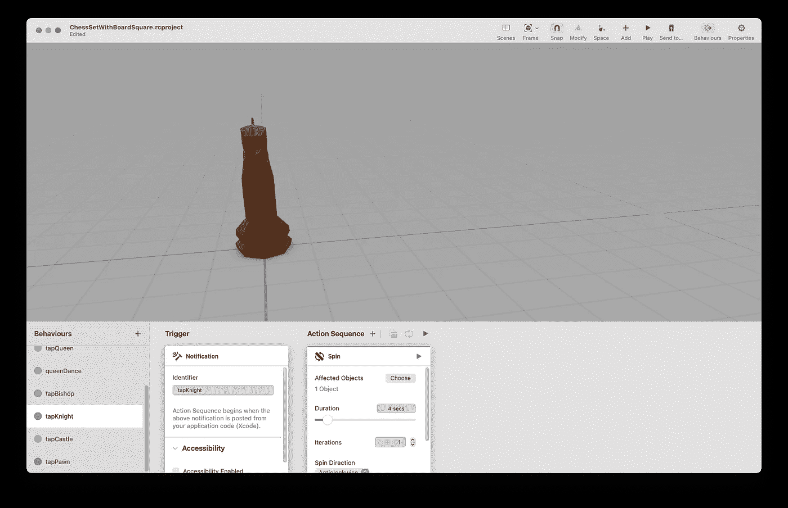
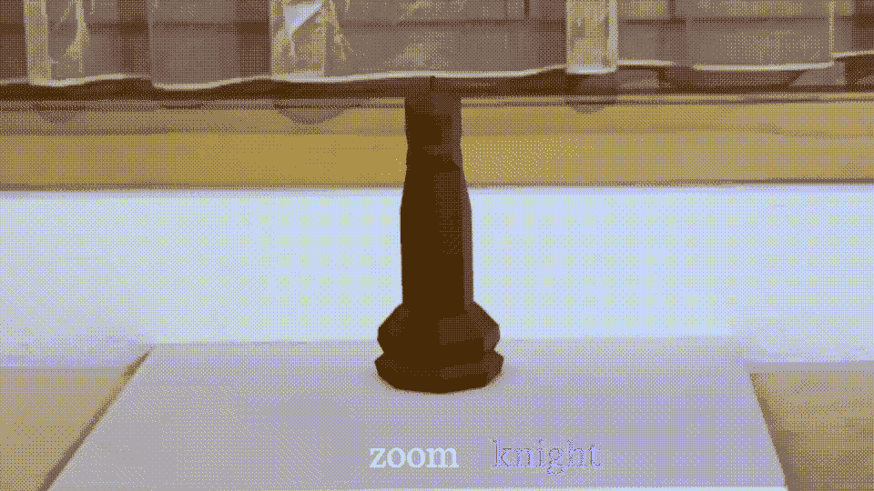

# Blender vs. Reality Composer:原型 AR 体验

> 原文：<https://betterprogramming.pub/blender-vs-reality-composer-86f29ff2d0bc>

## 两种工具的比较



钢筋混凝土渲染低聚棋子

当我开始这篇文章时，我打算谈谈我花了几个星期记录的国际象棋应用程序的动画。

但当我深入研究这个问题时，我意识到苹果在这个问题上与他们之前的 SceneKit 和 SpriteKit 框架有着非常不同的想法。你没有`SCNTransactions`或`CAAnimations`，有相当多不同的选项，我的同事安迪·爵士在这个 [SO 帖子](https://stackoverflow.com/questions/59335075/how-to-animate-a-models-rotation-in-realitykit)中简要介绍了这些选项。

这是一个远比我在这里有时间触及的更全面的列表；本文的重点是“*。USDZ”基于动画与 RC 触发器、通知和动作。前者没有代码的动画，后者既“罐头”和增强的动画，如果你愿意。

## 简短的

挑战就在这里——在国际象棋中，你有 64 个方格，32 个棋子和 6 个模型，有些模型被对折了两次，它们是自成一类的棋子。每个模型都有自己的一套在棋盘上移动的规则。规则说有些可以移动一格，有些可以移动多格。不同的棋子可以向不同的方向移动，有些是斜向的，有些是直线的。你不能穿过其他玩家，除了可以跳过他们的骑士或马。你有几个例外，比如阉割和提升——但它们都是例外。

## 力学

当然，除了移动之外，我还需要设计一种方法来指示您想要将哪个部分移动到哪里。选择棋子很容易，但是决定接下来的动作就比较复杂了。我需要让白板更具互动性吗？我能有一个平视显示器吗？我应该实现自定义手势吗？我需要考虑一下。

# 搅拌机

RealityKit 允许您通过在 Blender 中创建和导出实体来播放动画。



为此，我最初使用*导出了。usdc]没有动画的 blender 场景，随后导出另外两个只有动画的副本。然后，我将所有三个导出转换为“*”。“usdz”格式，将它们加载到应用程序中，将第一个添加到场景中，并使用第二个和第三个作为“罐装”移动；通过 SwiftUI 界面触发，使正在发生的事情一目了然。

```
let model = try! Entity.load(named: "ChessSceneA")
anchor.addChild(model)

let model2 = try! Entity.load(named: "ChessSceneB")

whiting = white
  .throttle(for: 0.01, scheduler: RunLoop.main, latest: true)
  .sink(receiveValue: { [self] _ in

  let animation = model2.availableAnimations
  if animation.count > 0 {
     model.playAnimation(animation[0], transitionDuration: 4, startsPaused: false)
  } else {
     print("no....")
  }
```

## 可行性

但是我在骗谁呢——我不可能为一场国际象棋比赛创建并管理一个“罐装”动画池。想象一下，女王可以从任何地方向任何方向移动任何数量的方格——也许通过大量的艰苦工作和一些开箱即用的逻辑，你可以让它工作，但不，它根本不是一个可扩展的解决方案。

# 现实作曲家

在对自己做出决定/证明 Blender 不能解决问题后，我需要别的东西，一个能让我与代码交互并管理游戏的工具，这就是 RC 的用武之地。

Reality Composer 是苹果一直致力于帮助你我开发 AR 应用的少数专用工具之一，还有它的堂兄 Reality Converter。你可以找到许多关于前者的文章，尽管很少触及我在这里想要关注的主题——我称之为增强编码。

## 扩充编码

苹果的配套工具 Reality Composer 是一个应用程序构建器，让没有编码技能的人能够在他们的 AR 应用程序中创建交互式场景。它有固定的动画(大部分都很糟糕，抱歉，是苹果的)和增强代码的机会，我会这么称呼它们。随着动画的出现，还有一些预设的触发器，这是 2019 年 WWDC 的最终名单。



来自 wwdc 2019 Reality Composer 简介的快照

前四个是给非程序员的，剩下的一个是给我们其他人的。您有一个类似的行动列表，同样在最后有一个通知。这里的概念和他们在 Combine 框架中使用的概念是一样的，所以如果你熟悉的话，这将是小菜一碟。

这是一个动画 GIF，展示了一个固定的动画和一些正在运行的增强代码。



这个动作是“固定的”RC 动作之一——一个旋转——我将通知消息传递回 SwiftUI 接口，以切换控制`GameOver`消息的布尔值。下面是对话的代码部分，后面是 RC 配置:

```
@State var gameOver = false

CustomARView(view: arview)
      .scaleEffect(zoomScale)
      .onReceive(game) { _ in
          gameOver.toggle()
      }
  if gameOver {
      Text("GameOver") { $0.kern = CGFloat(2)}
          .font(Fonts.neutonRegular(size: 64))
          .foregroundColor(Color.white)
  }
```



带通知和“预设”操作的 RC 配置

因此，在游戏版本中，我会点击模型的图像，以一个动作开始，以记住我点击了哪个部分。为了继续玩，我在棋盘上的每个方格中添加一个触发器，以请求我刚才点击的棋子。

但是等等，因为第二个触发器需要从第一个触发器中获取信息；因此，第二个触发器不可能是一个“固定”的动作；如果你愿意，这必须是一个有坐标的“合格”移动。

所以我需要一个通知触发器；这将是我添加到方块中的触发器:它们将运行一些自定义代码来检查方块是否为空，如果所述方块上已经有一个棋子，则执行销毁操作，然后请求从先前指示的棋子移动。



带通知触发器动作的 RC 配置

第二种情况在代码中是什么样的——请看这里；我添加了一个带有手势的标签，以[通过 Combine]向我的 ARKit 生成的场景发送消息，要求它向该场景发布消息。

```
Text("knight")
  .font(Fonts.neutonRegular(size: 32))
  .foregroundColor(whiteBack ? .white : .blue)
  .onTapGesture {
      move.send()
  }
```

该操作的后半部分在这段代码中概述。在这个代码片段中，我设置了一个消息订阅，它向场景中的模型发送第二条消息。

```
moving = move
    .throttle(for: 0.01, scheduler: RunLoop.main, latest: true)
    .sink(receiveValue: { [self] _ in
        model.notifications.tapKnight.post()
    })
```

这是一个演示，我的骑士展示了这一切走到一起。我按下按钮，骑士做了一个 360 度的旋转。



RC 配置场景，SwiftUI 链接到场景

## RC 到底值不值得？

动画当然有它们的位置，给每一个作品添加一个或者仅仅一个令人敬畏的动画可能是好的。但很明显，我需要更多。

RC 是否胜任工作？我不确定。触发器、动作和通知的组织是一个长长的层次列表，所有人都可以自由使用。如果没有结构，管理起来不会比用代码块做几乎相同的事情更容易。在我看来，苹果应该复制 Blender Materials 菜单，让你建立一个动作的动画网络。这将使事情进入下一个阶段。

# 最后的想法

如果有人正在阅读苹果的这篇文章，那么与场景相关联的 API 可能是一个令人兴奋的选择。事实上，在我考虑的时候，也许我可以使用新的 [DSL](https://developer.apple.com/videos/play/wwdc2021/10253/) 功能以及这些触发器、动作和通知来构建一个。精神食粮。这样做，我可以建立自己的工具来管理动画。